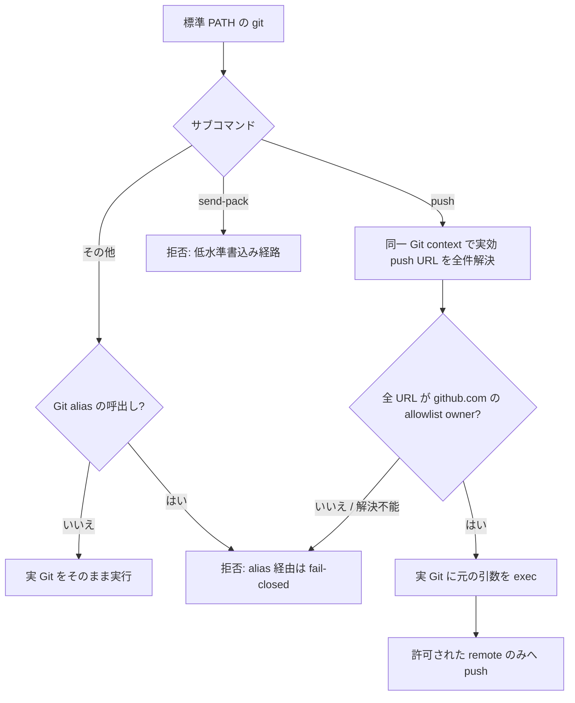

# Issue #3 — git push の宛先所有者ガード設計

## 結論

`~/.agents/bin/git` に置く**グローバルな `git` shim**を採用候補とする。
shim は `git push` が実行される前に、Git 自身と同じ設定コンテキストで実効 push URL をすべて解決し、`github.com` 上の owner がコード内リテラルの `kappaseijin` または `kappaseijinjp` である場合だけ実 Git を起動する。低水準の同等書込みコマンド `git send-pack` は、通常のエージェント運用で不要なため、宛先によらず fail-closed で拒否する。

allowlist は次のように shim の判定コードだけに置く。環境変数、設定ファイル、リポジトリ設定、`~/.agents/config/pr-account-policy.conf` は読まない。

```bash
readonly -a ALLOWED_OWNERS=(kappaseijin kappaseijinjp)
```

未知の remote、URL の構文解析失敗、owner の抽出失敗、許可外 owner、許可外ホスト、複数 push URL のうち一つでも不許可のものは、ネットワーク接続の前に失敗させる（fail-closed）。

この決定の直接の対象は **gh を通らない `git push`** に限定する。ただし Issue #3 全体は git shim だけでは完了しない。実際に起きた書込みは `gh issue create` による Issue 作成であり、gh write は agmsg 所有の [Issue #10](https://github.com/kappaseijin/agmsg/issues/10) として未完了を追跡する。Issue #91 は参考・突合せ対象であって、agmsg の責任や完了判断を移す先ではない。

| 経路 | 完了責任 | 本書との関係 |
| --- | --- | --- |
| `git push` | agmsg Issue #3 | 本書が設計する。GPG-01〜15 で検証する |
| `gh issue create` / `issue comment` / `pr create` / `pr comment` / `pr review` | agmsg [Issue #10](https://github.com/kappaseijin/agmsg/issues/10) | 本書は実装を重複させないが、owner allowlist と fail-closed の同じ不変条件を満たす追跡先を agmsg に残す。Issue #91 と設計が重複する場合だけ、agmsg PM が統合または取り下げを判断する |

すなわち `git push` 経路が通っても、Issue #10 を未完了のまま Issue #3 を完了扱いにしない。git と gh の各 owner が自分の受け入れ試験を完了まで追跡する。

## 要求と非交渉条件

| 要求 | 設計上の扱い |
| --- | --- |
| 許可 owner | コード内の固定値 `kappaseijin` / `kappaseijinjp` のみ |
| 上書き禁止 | allowlist を読む env・設定ファイル・リポジトリ設定の入口を作らない。狭める上書きも作らない |
| policy ファイル独立 | `~/.agents/config/pr-account-policy.conf` と `PR_ACCOUNT_POLICY` を参照しない |
| 再クローン耐性 | remote ごとの設定ではなく、全クローンより外側の `~/.agents/bin/git` を PATH の先頭に置く |
| 実効宛先で判定 | `remote.*.pushurl`、`url.*.insteadOf`、`url.*.pushInsteadOf` 反映後の URL を判定する |
| 第三者本番への無アクセス | すべての負の試験は使い捨て clone と使い捨て bare remote、ローカル fake SSH transport だけで実施する |

## 設計

### 全体の流れ



### shim の責務

1. executable は `/bin/sh` の固定 shebang を持つ小さな launcher とする。launcher は Bash を起動する前に `BASH_ENV`、`ENV`、exported `BASH_FUNC_*`、`SHELLOPTS`、`BASHOPTS`、`CDPATH`、`GLOBIGNORE` を除去し、固定絶対 path の Bash へ引き渡す。Bash は非対話 script の実行前に `BASH_ENV` を source するため、Bash script の先頭で unset するだけでは遅い。inner script 側でも allowlist の readonly 代入が成功しなければ即座に非 0 で終了する。
2. `git` の global option（`-C`、`-c`、`--git-dir`、`--work-tree`、`--config-env` など）を保持して、元の呼出しと同じ repository / config context を再現する。判定用の Git 呼出しだけ別 context になる実装は不可とする。
3. サブコマンドが `push` なら、push の宛先指定を安全に解析する。
   - `git push <remote-or-url>`、`git push --repo <remote-or-url>`、`git push --repo=<remote-or-url>` を扱う。
   - 宛先省略時は実 Git と同じ優先順（`remote.pushDefault`、現在 branch の remote、`origin`）で remote 名を決める。決められなければ拒否する。
   - remote 名の場合は `git remote get-url --push --all <remote>` を同じ context で実行し、**返された全 URL**を判定する。複数 `pushurl` の一部だけを検査する実装は禁止する。
4. 直接 URL 指定も最終宛先として扱わない。`insteadOf` / `pushInsteadOf` が command-line URL にも適用されるため、現在の config context を include する使い捨て `GIT_DIR` に一意な synthetic remote を組み、そこへ URL を設定してから、**実 Git の絶対 path**で `remote get-url --push --all` を呼ぶ。temporary repository には現在の worktree を書き換えない。この出力の全 URL を判定する。
5. URL は HTTPS、SSH URI、SCP 形式 SSH を正規化して host と先頭 path segment（GitHub owner）を抽出する。host と owner は ASCII lowercase 化後に**完全一致**で比較する。`github.com.`、userinfo を含む URL、`file:`、ローカル path、未知 protocol、空値、owner を持たない URL は拒否する。
6. `git <alias>` は alias の展開中に内部 `push` を実行し、shim を再通過しない可能性がある。`push` 以外のサブコマンドでも、同じ context でその名前が Git alias と定義されていれば拒否する。shell alias が展開して `git push` になる場合は通常どおり 3 に入る。これは任意の Git alias の利用を制限する安全上のトレードオフである。
7. `git send-pack` は `push` と同じ Git executable を通る書込み経路だが、通常のエージェント運用で必要としない。宛先解決や refspec を解釈せず、常に非 0 で拒否する。`git subtree push` のように内部で `git push` を起動する高水準 helper は PATH の shim を再通過する。
8. 判定が成功した場合だけ、インストール時に確定した実 Git の絶対 path を元の引数で `exec` する。判定用の `rev-parse`、`config`、`remote get-url` も同じ絶対 path を使う。shim の再帰や PATH 上の decoy `git` に任せない。失敗時は判定した URL または失敗理由を stderr に出し、非 0 で終える。

`git remote get-url --push --all` は、2026-08-11 に使い捨て repository で確認した Git 2.54.0 の挙動では、複数 `remote.<name>.pushurl` を全件返し、`url.*.insteadOf` と `url.*.pushInsteadOf` の書換え後の URL を返した。さらに `git push --dry-run <URL>` では、command-line の URL にも `pushInsteadOf` が適用されることを確認した。このため remote 名だけでなく synthetic remote を通す直接 URL でも、書換え設定そのものを信頼せず、書換え後の実効 URL を owner 判定する。

### 判定対象と非対象

| 対象 | 扱い |
| --- | --- |
| `git push origin main`、`git push --repo=origin` | 実効 URL を全件検査 |
| `git push https://github.com/<owner>/<repo>.git` | synthetic remote を通じて書換え後の全 URL を検査 |
| `remote.*.pushurl` | `--all` の全 URL を検査。1 件でも不許可なら push 自体を起動しない |
| `insteadOf` / `pushInsteadOf` | 解決済み URL を検査 |
| `git <alias>` | alias 経由の push を取り逃さないため fail-closed |
| `git send-pack` | 宛先にかかわらず fail-closed で拒否 |
| `git clone` | shim は妨げない。新 clone でも次の `git push` は同じグローバル shim を通る |
| `gh` の write 操作 | agmsg Issue #10 の担当。対象外 |
| `/usr/bin/git push`、shim を外した PATH、別ユーザー / root | 同一ユーザーの user-space shim だけでは強制不能。下記「保証境界」の対象外 |

### 配置と利用導線

- 実体は `~/.agents/bin/git` に配置する。repository clone 内の hook や `remote.*.pushurl` に依存しないため、clone を削除・作り直しても保護が残る。
- 全エージェントの標準起動経路で `~/.agents/bin` を PATH の先頭に置く。導入後は対話 shell の `command -v git` だけで済ませず、Codex、Claude Code、launchd / LaunchAgent、IDE / editor 拡張を含む実際の agent launcher ごとに `command -v git` が `~/.agents/bin/git` を返すことを実測する。
- shim のソース、installer、Bats 試験は `kappaseijin/agmsg` で version 管理し、installer がグローバル配置を更新する。実装時には README に導入、PATH の確認、アンインストール、保証境界を自己完結で記載する。
- `pr-account-policy.conf` は読みも source もせず、存在・内容・権限に関係なく同じ owner 判定を行う。

## 選択肢の比較

| 選択肢 | 再クローン後 | 上書き口 | 採否 | 理由 |
| --- | --- | --- | --- | --- |
| `pre-push` hook | clone の `.git/hooks` から消える | `core.hooksPath`、`--no-verify`、環境 / local config | 不採用 | clone ごとの配布漏れと意図的 / 偶発的 bypass を防げない |
| Git 設定（`remote.*.pushurl`、`url.*.insteadOf`、`pushInsteadOf`、global config） | remote 設定は消える。global 設定は残るが clone / URL を一般的に owner 判定できない | env、global / local / command-line config が設定内容を変えられる | 不採用 | 設定は書換えの仕組みであって固定 allowlist による認可器にならない。特定 remote の `no_push` は暫定策にとどまる |
| `git` shim（`~/.agents/bin/git`） | 残る | allowlist はコード内リテラルで、env / config を読まない | **採用候補** | clone より外側で各 push 前に実効 URL を全件検査できる |
| clone wrapper | wrapper を使った clone だけ効く | wrapper を使わない `git clone`、既存 clone、clone 後 config | 不採用 | 新規・既存どちらの clone にも一貫した保証を与えられない |
| 何もしない / `upstream` の push URL を `no_push` にする | 消える | clone ごとの local config | 不採用 | 現状の暫定策であり、Issue #3 の核心である再クローン耐性を満たさない |

## 検証設計

検証者は Claude 系 reviewer とし、起草者はこの検証を実行・自己承認しない。試験は production の `~/.agents/skills/agmsg/` と第三者 repository を一切使用しない。

### 共通 fixture

1. `mktemp -d` 配下に、使い捨て bare remote、作業 clone、fake SSH command を作る。
2. fake SSH command はネットワークを開かず、指定された host / command を試験ログへ記録したうえで、使い捨て bare remote の `git-receive-pack` だけを起動する。
3. bare remote の `pre-receive` hook は到達 marker を作る。各試験は marker の有無で「実 Git push が到達したか」を判定する。
4. wrapper は試験専用 PATH で先頭に置き、実 Git は絶対 path で指定する。実装に allowlist 用の test env や policy file は設けない。

### 受け入れ試験

| ID | 操作 | 期待結果 | 負の対照として検出する壊れ方 |
| --- | --- | --- | --- |
| GPG-01 | scratch clone から `git@github.com:thirdparty/fixture.git` へ push | 非 0、fake SSH 未起動、到達 marker なし | shim が無い / 判定が push 後なら fake SSH と hook が起動する |
| GPG-02 | `git@github.com:kappaseijin/fixture.git` へ push | 0、fake SSH と marker が 1 回起動 | allowlist の正当経路を誤って全遮断していないこと |
| GPG-03 | 許可 URL と `thirdparty` URL の複数 `pushurl` を設定して push | 非 0、どの marker もなし | 先頭 URL だけ検査する不具合なら許可 URL へ先に push される |
| GPG-04 | remote に許可外 URL を設定してから `git clone` を使い捨てで作り直し push | 非 0、marker なし | clone 固有設定へ依存する実装なら再 clone 側で到達する |
| GPG-05a | remote URL を `url.*.insteadOf` と `url.*.pushInsteadOf` で許可外の fake SSH URL へ書換え | 非 0、marker なし | 元 URL だけを見る実装なら書換え先へ到達する |
| GPG-05b | `git push https://github.com/kappaseijin/fixture.git` を `pushInsteadOf` で `thirdparty` の fake SSH URL へ書換え | 非 0、marker なし | command-line URL を書換え前に直接許可する fail-open |
| GPG-06 | `git -c remote.origin.pushurl=... push origin` と `--repo` 指定 | 不許可なら非 0、marker なし | command-line config / 別の宛先指定を見落とす不具合 |
| GPG-07 | `git config alias.ship 'push origin main'` 後に `git ship` | 非 0、marker なし | Git alias が内部で push して shim を迂回する不具合 |
| GPG-08 | `PR_ACCOUNT_POLICY` を scratch ファイルへ向け、scratch policy の内容も変える | GPG-01 と同じく非 0、marker なし | policy file を allowlist に使う不具合 |
| GPG-09 | `file:` / 相対 path / owner 抽出不能 URL | 非 0、marker なし | URL 構文解析失敗を pass 扱いする fail-open |
| GPG-10 | `git send-pack git@github.com:thirdparty/fixture.git <ref>` | 非 0、fake SSH 未起動、marker なし | shim が `push` だけを検査して plumbing 経路を通す不具合 |
| GPG-11 | scratch `BASH_ENV` が allowlist / helper を readonly 定義し、exported `BASH_FUNC_*` も注入した状態で GPG-01 を実行 | 非 0、fake SSH 未起動、marker なし | Bash startup file / exported function が判定を汚染する不具合 |
| GPG-12 | userinfo、末尾 dot host、SCP host、owner 前方一致、大小混在の URL を入力 | userinfo / 末尾 dot / 異 host / 前方一致は非 0、`https://GitHub.com/KappaSeijin/x.git` は許可 | host / owner 抽出が曖昧または前方一致になる不具合 |
| GPG-13 | `-C`、`--git-dir` / `--work-tree`、`-c`、`--config-env` の各 context から許可外宛先を指定 | すべて非 0、marker なし | 判定用 Git が呼出し元と別 context を見てしまう不具合 |
| GPG-14 | shim 後段の PATH に marker を作る decoy `git` を置いて GPG-02 を実行 | 許可 push は成功し、decoy marker なし | 判定用または最終 exec が PATH を再探索する不具合 |
| GPG-15 | 各標準 agent launcher で `command -v git` を実行 | すべて `~/.agents/bin/git` | 対話 shell だけが shim を解決し、実 agent が素通りする配布不具合 |

GPG-01 は本件の必須負のコントロールである。`thirdparty` という GitHub 形式の非許可 owner を与えながら transport 自体はローカル fake SSH に固定するため、guard が壊れても GitHub や第三者 repository へ接続しない。一方で fake SSH / receive hook が起動すれば、guard が実際の push 起動前に止められなかったことを検出できる。GPG-05b と GPG-10 も同じ fixture を使い、直接 URL の書換えと plumbing 経路を実ネットワークなしで検出する。

## 保証境界と残余リスク

この shim が保証するのは、`~/.agents/bin` を先頭に含む**標準エージェント起動環境で名前解決された `git`**である。同一 OS ユーザーは `/usr/bin/git` の直接実行、PATH の変更、shim の差替え、別ユーザー / root を使って user-space の guard を回避できる。これは allowlist の上書き口ではなく、guard executable 自体を通さない別の実行経路である。

この境界まで強制することが必要なら、PATH shim の範囲を超える。OS のアプリケーション制御、別ユーザーへの権限分離、ネットワーク egress 制御、Git hosting 側の権限という運用基盤の決定が別途必要になる。本 Issue ではまず、実際のエージェント作業で使う通常の `git push` を再クローン後も fail-closed にする。

## 実装開始の前提

- gh write の agmsg 所有 [Issue #10](https://github.com/kappaseijin/agmsg/issues/10) を追跡し、Issue #91 と重複する場合は agmsg PM 同士が統合または取り下げを判断する。外部チームの完了は、本 Issue の未完了を移す根拠にしない。
- 本書の提案は他チームの実装を待たずに固定できる。git shim の allowlist、判定対象、負のコントロールはいずれも gh shim の内部実装に依存しない。
- 実装 PR では、本書の GPG-01〜15 を Bats 試験（GPG-15 は agent launcher ごとの配備 smoke test）として追加し、README の利用者向け導入手順まで含める。

## 参照

- [Issue #3](https://github.com/kappaseijin/agmsg/issues/3)
- [Issue #10](https://github.com/kappaseijin/agmsg/issues/10)
- Issue #3 の追加制約コメント（2026-08-09）
- Issue #3 の宛先 owner 判定に関する実測コメント（2026-08-10）
- [Git `remote get-url` の URL 書換え仕様](https://git-scm.com/docs/git-remote/2.23.0)
- [Git `pushInsteadOf` の最長一致仕様](https://git-scm.com/docs/git-config/2.46.2)
- [Bash の非対話起動時 `BASH_ENV` 仕様](https://www.gnu.org/software/bash/manual/html_node/Bash-Startup-Files)
