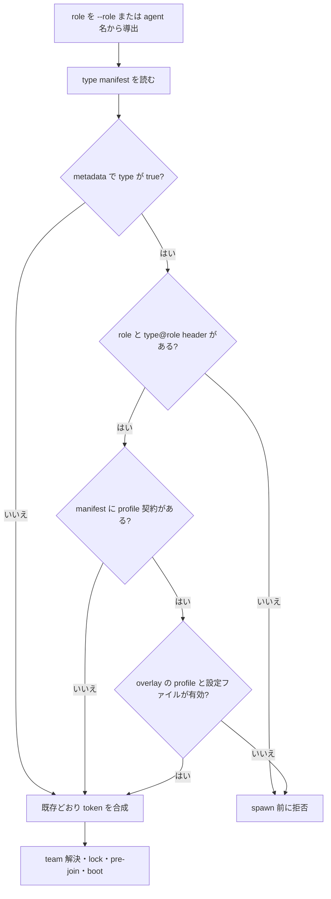

# Issue #8: 必須 role overlay と Codex profile の事前検証

## 決定

`spawn` の role 別設定は従来どおり任意のままとする。
ただし、spawn options ファイルに明示した type だけは、role overlay の欠落を起動前に拒否する。

設定メタデータは CLI 引数の YAML section と分離する。
Codex でこの検査を有効にしたときは、overlay section の存在だけで成功とせず、role overlay が指定する profile ファイルの存在と可読性まで確認する。
実装は Issue #4 の `spawn-options.sh` BSD awk 修正を含む `main`（`e9447f6`）を基点に行う。

## 現状と問題

現行の `agmsg_spawn_options_tokens(type, role)` は、`<type>` の値に `<type>@<role>` の値を重ねる実装である。
role は `--role` または agent 名の末尾から導出され、overlay が無ければ base section だけで spawn する。
この既定は既存利用者に必要であり、変更しない。

一方、役割別の安全設定を運用ポリシーにしているチームでは、overlay のタイポや欠落により base の既定で起動しても気付けない。
特に Codex の `-p <profile>` は `$CODEX_HOME/<profile>.config.toml`（既定は `~/.codex/<profile>.config.toml`）を重ねる指定であり、指定先が無いと役割固有の設定を得られない。
Codex の公式 CLI 仕様も `--profile, -p` をその profile ファイルを重ねる指定としている。

Issue 本文の「role overlay は未実装」という前提は誤りだったため、overlay 機能そのものは追加しない。
対象は opt-in の必須化、metadata の argv 分離、Codex profile の存在検査である。

## 設定契約

`agmsg.require-role-overlay` は予約済みの metadata section とする。
既存の type section や overlay section と同じ namespace に置かず、CLI 引数を生成する関数はこの section を一切読まない。

```yaml
# metadata: type ごとの fail-closed opt-in
agmsg.require-role-overlay:
  claude-code: true
  codex: true

# 既存の CLI 引数 section
claude-code@reviewer:
  --model: claude-opus-5

codex@architect:
  -p: architect
  -c: model_reasoning_effort=xhigh
```

| 設定の状態 | 動作 |
| --- | --- |
| spawn options ファイルが無い | 従来どおり no-op |
| metadata section または type key が無い | 従来どおり no-op |
| type key が `false` | 従来どおり no-op |
| type key が `true` | role と `<type>@<role>` の存在を必須化 |
| type key が `true` 以外の非 boolean | 設定誤りとして spawn 前に拒否 |

`true` を書いた利用者の typo を静かに fail-open させないため、metadata の値は `true` / `false` のみ受け入れる。
metadata section は type 名でも overlay 名でもないので、既存の `agmsg_spawn_options_tokens "$type" "$role"` から argv に混ざらない。
将来の type 名にこの予約名を使わせない。

## 実装設計

`scripts/lib/spawn-options.sh` に以下を追加する。

1. `agmsg_spawn_options_section_exists(section)`
   - 既存 parser と同じ header の空白・末尾コメント規則で、section の有無だけを返す。
   - 空の section と section 不在を区別する。
2. metadata の一つの scalar を読む非 argv 用 helper。
   - `agmsg.require-role-overlay` の type key だけを読む。
   - 既存の token emitter を流用しない。metadata を token に変換する経路を持たない。
3. `agmsg_spawn_options_validate_required_role_overlay(type, role)`。
   - policy が無効なら直ちに成功する。
   - policy が有効なら、空の role と `<type>@<role>` header 不在を、type と role を含む診断で非 0 にする。
   - 追加の profile 契約を manifest が宣言する type には、次節の検証も行う。

`scripts/spawn.sh` は既存の role 導出と type manifest 解決の後、`SPAWN_OPT_TOKENS` の作成より前にこの validator を呼ぶ。
この位置なら `resolve_team`、role lock、`join.sh`、boot script、terminal のいずれよりも前である。
失敗時に agent 登録・session 記録・端末プロセスを残さない。



### Codex profile 契約

`--model` の pass-through 方針は維持する。
agmsg はモデル ID の一覧・有効性を持たず、引き続き CLI に任せる。
ここで検証するのはモデルではなく、明示的に有効化した role overlay が参照するローカル設定ファイルである。

この vendor 固有の解決規則は `scripts/drivers/types/codex/type.conf` のデータとして宣言し、`spawn.sh` に `case "$AGENT_TYPE"` を追加しない。
導入する manifest key は次のとおりとする。

```ini
# A required role overlay must choose one Codex profile in its own section.
role_overlay_profile_args=-p --profile
role_overlay_profile_home_env=CODEX_HOME
role_overlay_profile_default_dir=.codex
role_overlay_profile_suffix=.config.toml
```

generic validator は key が全て揃う type だけ、この契約を有効にする。
profile 契約の検査は token 合成後の argv ではなく、base と overlay の raw YAML key / value を別々に走査する。
これにより `-p: profile` と `-p=profile: true` のどちらも一つの profile 指定として扱い、base に隠れた `--profile=base: true` を token 順序に依存せず拒否できる。
`CODEX_HOME` が非空ならそれを設定ディレクトリとし、そうでなければ `$HOME/.codex` を使う。
これは Codex の documented profile 解決規則を manifest の data として表すだけで、モデルカタログを agmsg に導入しない。

validator は解決した config directory を、boot script で `CODEX_HOME` として export する。
そのため検証した profile と、tmux / herdr / terminal 経由で起動する Codex が読む profile directory は同一になる。
この export は policy 有効かつ profile 契約を持つ type にだけ行う。

Codex で policy が有効なときの追加条件は以下とする。

1. `<type>@<role>` section 自身に、`role_overlay_profile_args` のいずれかをちょうど一つ置く。
   許可する表記は `<flag>: <profile>`、または `<flag>=<profile>: true`（`true` の代わりに空も可）だけである。
2. base `<type>` section の profile flag は許可しない。
   `<flag>` と `<flag>=<value>` の両形を検出し、短い flag の連結形（例: `-parchitect`）や長い flag の未知の前方一致も fail-closed で拒否する。
   role 固有でない profile を再利用して role の検査を通す曖昧さを防ぐ。
3. profile 値は空・boolean・重複を許さず、ファイル名として安全な alias（先頭英数字、以降は英数字・`.`・`_`・`-`）だけを受け入れる。
   `/`、`\\`、`..` 単独、絶対パスは拒否する。
4. 解決先 `<config-dir>/<profile><suffix>` が通常ファイルかつ読み取り可能であることを確認する。
   存在しない・読めない場合は profile 名と期待した設定ファイルを診断して拒否する。

同じ type section に `-p`、`--profile`、それらの `=` 形を併記したり、overlay と base の両方に profile flag を置いたりする構成は、policy 有効時には拒否する。
CLI の「後勝ち」など未文書の優先順へ安全性を委ねないためである。
policy が無効な従来の設定は一切拒否しない。

policy 有効時に role を導出できなければ、validator は `--role <role>` を明示するか、`<project>_<role>_<vendor>` の名前にするよう診断する。
短い agent 名を既定の no-op 設定で使う既存利用者を壊さないため、この要件は policy 有効時に限定する。

Claude Code は現時点で profile-file manifest key を持たないため、policy 有効時の要件は role と overlay section の存在だけである。
将来同様のローカル role 設定を検証したい type は、同じ manifest 契約を追加すればよい。

## 変更対象

| 対象 | 変更 |
| --- | --- |
| `scripts/lib/spawn-options.sh` | metadata reader、section existence、required-overlay validator、profile token reader |
| `scripts/spawn.sh` | pre-join より前の validator 呼出し |
| `scripts/drivers/types/codex/type.conf` | Codex profile 解決契約の manifest data |
| `tests/test_spawn_options.bats` | parser / metadata / profile validator の unit tests |
| `tests/test_spawn.bats` | pre-join 前拒否と boot argv の integration tests |
| `README.md` | opt-in schema、profile 要件、既定値、失敗時の対処を自己完結で記載 |

## 受け入れ試験

すべて temporary directory、stub CLI、test 用 `HOME` / 必要時の test 用 `CODEX_HOME` を使い、実 agent の登録・実 terminal・外部 repository への書込みを行わない。

| ID | 条件 | 期待結果 |
| --- | --- | --- |
| ROR-01 | options file 不在、role overlay 不在 | 既存どおり spawn 成功 |
| ROR-02 | metadata section 不在、role overlay 不在 | 既存どおり spawn 成功 |
| ROR-03 | metadata が `false`、role overlay 不在 | 既存どおり spawn 成功 |
| ROR-04 | metadata 値が typo / 非 boolean | join 前に診断付きで拒否 |
| ROR-05 | `true` だが role を導出できない | join 前に診断付きで拒否 |
| ROR-06 | `true` だが `<type>@<role>` header 不在 | join 前に診断付きで拒否 |
| ROR-07 | `true`、Claude Code の空 overlay | spawn 成功。header 存在だけを要件とすることを確認 |
| ROR-08 | metadata section が存在 | 生成 boot argv に `agmsg.require-role-overlay` もその値も現れない |
| ROR-09 | `codex: true`、overlay に有効な `-p` と test profile | spawn 成功、期待した argv |
| ROR-10 | `codex: true`、overlay はあるが profile flag が無い / 空 / boolean / 重複、または未知の連結短縮形 | join 前に拒否 |
| ROR-11 | `codex: true`、base section に `-p` / `--profile` または `-p=<value>` / `--profile=<value>` がある | join 前に拒否 |
| ROR-12 | Codex profile が存在する対照と、存在しない対照 | 前者のみ成功、後者は join 前に拒否 |
| ROR-13 | `CODEX_HOME` を設定した test fixture | override 側を検証し、生成 boot script と CLI spy が同じ `CODEX_HOME` を受け取る |
| ROR-14 | `--profile` alias と `=` 形 | `-p: profile` と `--profile=profile: true` は各々単独で成功、相互の混在は拒否 |
| ROR-15 | 全失敗系 | CAPTURE / team registration / pane / window / terminal process が作られず、既存 agent を変更しない |
| ROR-16 | 既存 spawn-options / BSD awk regression suite | byte-identical token 出力と既存の全 test が通る |

実装完了時は Bats 全体、README の設定例に対する argv assertion、さらに Claude 系 reviewer による cross review を必須とする。

## 互換性と運用

- configuration file の不在、metadata key の不在、`false` はすべて現行互換の no-op である。
- 既存の `<type>@<role>` 合成規則、key 上書き、`false` による base flag 抑止は変更しない。
- fail-closed は管理者が `true` を明示した type だけに限る。
- profile 不在を修復するには、該当 role overlay の `-p` / `--profile`（`=` 形を含む）と、対応する `$CODEX_HOME/<profile>.config.toml`（既定 `~/.codex/`）を揃える。
- policy を `true` にした type は role を必須にする。`--role <role>` を渡すか、agent 名を `<project>_<role>_<vendor>` にする。
- README は実装と同じ PR で上記を利用者向けに記載する。設計判断・Issue の訂正経緯はこの decision record に残し、README に持ち込まない。

## 却下した案

| 案 | 却下理由 |
| --- | --- |
| type section 内の `agmsg.require-role-overlay: true` | data と metadata が argv token parser を共有し、混入防止の特例が必要になる |
| `claude-code` だけ fail-closed | Codex の profile 空振りを残し、共有 spawn 機能の type 間一貫性を失う |
| policy 有効時も base の `-p` を許す | role 固有 profile が選ばれた保証にならず、CLI 優先順に依存する |
| model ID の allowlist を agmsg に実装 | CLI の model pass-through 方針を壊し、ベンダーの可変カタログを追跡することになる |
| profile file を無条件に全 Codex spawn で必須化 | 既存利用者を破壊する。明示 opt-in の範囲を超える |
