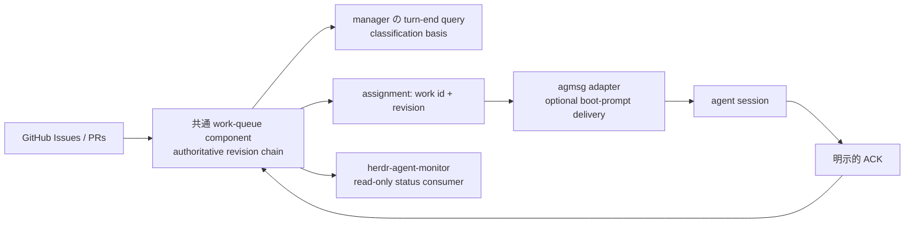

# Issue #9: scale_exporter live work queue の共通 tooling 境界

## 結論

scale_exporter の live work queue が求める正本（work item の状態、GitHub Issue / PR の双方向照合、append-only revision chain、classification basis、writeback_required）は、agmsg に実装しない。
pilot を scale_exporter に限定した新しい共通 work-queue component が正本を持ち、agmsg は必要になった場合だけ、agent へ work reference を配信する薄い adapter を担う。

agmsg の message SQLite を work queue に転用しない。
これは性能の問題ではなく、message transport の event と、GitHub の work item / assignment / reconciliation の lifecycle が異なるためである。

## 調査結果

Issue #9 で指定された「team-work 相当の既存機構」の不在を、文字列検索だけで結論しなかった。

| 検査 | 結果 | 負の対照 |
| --- | --- | --- |
| code graph で `work queue assignment` を検索 | 0 件 | `role assignment team` は role session / actas / spawn を検出 |
| `team-work`、`work-queue`、`classification basis`、`writeback_required`、`fully_allocated`、`quiescent` を scripts / docs / tests / app で検索 | 0 件 | `actas`、`check-inbox`、`session-end`、`delivery` は既存実装を検出 |
| README の責務記述 | agmsg は shared SQLite に行を追記して届ける thin transport。daemon、broker、作業キューは持たない | `actas` の排他 lock と `spawn --boot-prompt` の存在を確認 |

現行 agmsg の永続状態は identity、message、delivery、session / role lock を主に扱う。
role lock は「二つの session が同一 role を保持しない」ためのものだが、「どの Issue を誰がいつ処理するか」の予約・再配分・完了判定ではない。

## 要件ごとの担当境界

Issue 本文は G1 / G2 / G3 の番号と詳細要件との正式な対応表を含まない。
番号に依存しない結論は「agmsg は work queue の正本を持たない」である。
以下の行単位の担当は本文に明記された能力からの暫定対応であり、scale_exporter manager が PR #134 の該当 matrix を manager 間で転送した時点で照合して見直す。
たとえば G が message の到達保証・順序保証・再配信を含むなら、agmsg adapter の担当は追加され得るが、queue の正本にはならない。

| 能力群 | 正本の担当 | agmsg の担当 | 根拠 |
| --- | --- | --- | --- |
| `ready=0` の `fully_allocated` / `quiescent` / `unknown` 分離、workKind、classification basis | 新しい work-queue component | なし | Issue / PR / assignment を集約した時点の分類であり、message 配送からは導出できない |
| append-only marker revision、Issue / PR の closing 参照を全 page 取得、writeback_required | 新しい work-queue component | なし | GitHub 読取り・照合・改訂履歴の domain。agmsg は GitHub の正本・pagination・PR close 状態を持たない |
| manager の turn-end での inventory / reconciliation / closeout 確認 | manager の運用規範 + work-queue component の query | 状態の表示 / message delivery のみ | 人間または agent の判断を transport が代行して「作業なし」と断定してはならない |
| Codex seat の boot_required と ACK gate | work-queue component が contract / ACK の正本、agmsg は将来の任意 adapter | 既存 `spawn --boot-prompt` で work reference を渡せる | Codex は Monitor を持たず、起動時 prompt で `actas` と task を渡す既存経路がある。ただし agmsg message の到達は queue の ACK ではない |

## 推奨構成

### 新しい共通 component

work-queue component は、少なくとも以下を所有する。

- GitHub Issue / PR の全 page を取得して closing reference を双方向照合する reader
- work item、状態分類、assignment、根拠、revision の append-only record
- `ready=0` を unknown と区別する query
- PR merge 後の Issue writeback_required を出す reconciliation
- work ID と assignment revision を含む、Codex を含む全 agent 共通の ACK contract

これは agmsg、herdr-agent-monitor、個別 team skill のいずれにも既存の正本がない。
名前は `team-work` に決め打ちしない。Issue #9 の実測どおり、その command はまだ存在しないため、新規 component として interface・保存先・認証境界を別途設計する。

### agmsg の狭い adapter 境界

agmsg に今ある `spawn --boot-prompt` は、Codex が起動時に `actas` と一回限りの task を同時に受け取る経路である。
work-queue component が work ID / revision を生成した後なら、agmsg はその不透明な reference を prompt として渡せる。

しかし agmsg は以下をしない。

- Issue label、open / closed、PR merge、closing keyword の真実性を判定しない
- assignment の lease、再試行、reconciliation、append-only revision を保存しない
- spawn 成功、message delivered、role lock 取得を「work が読まれた」「作業を開始した」「完了した」の ACK とみなさない
- manager に代わって `quiescent` を断定しない

将来 adapter が必要になっても、work-queue の `ack <work-id> <revision>` が正本へ明示的に書く設計とする。
agmsg はその command を boot prompt に含めるか、同じ reference を delivery message に載せるだけに留める。
queue の writer を agmsg の SQLite message row に隠さない。

### herdr-agent-monitor と team skill の位置

herdr-agent-monitor は pane / process の可視化に適し、work-queue の read-only consumer になれる。
しかし GitHub の未処理 work と reviewer / manager の判断根拠を正規化する authority にはならない。

team skill や AGENT.md は manager の turn-end invariant を規範化する場所である。
ただし規範だけでは work item の網羅性・Issue writeback の古さ・ACK の有無を機械判定できない。
したがって運用規範と work-queue query は補完関係であり、片方で他方を置換しない。

## pilot と受け入れ条件

global rollout の前に、ユーザー決定どおり scale_exporter だけで pilot する。

| ID | 条件 | 合格基準 |
| --- | --- | --- |
| WQ-01 | open Issue が 0 / 不完全な label | `quiescent` とせず `unknown`、classification basis を残す |
| WQ-02 | open Issue、PR、closing reference が複数 page | page をまたいで全て取得し、issue と PR の両側を照合する |
| WQ-03 | PR merge 後に Issue が未更新 | `writeback_required` と根拠 revision を出す |
| WQ-04 | 同じ work の再分類 / 再割当 | 過去を上書きせず、append-only revision chain で新 revision を追加する |
| WQ-05 | Codex spawn が起動しただけ | ACK にならない。work ID と revision を伴う明示 ACK だけを受理する |
| WQ-06 | manager が turn を終了する時点 | work-queue query の結果または classification basis が残り、根拠なしの「作業なし」を検出できる |
| WQ-07 | agmsg adapter を有効化しない team | 既存の actas / spawn / message delivery の振る舞いは変化しない |

pilot の GitHub fixture と queue state は test 用の temporary store を使う。
本番 Issue / PR への write、実 agent の spawn、実 team への message は automated test から行わない。

## 次の判断

1. scale_exporter manager から PR #134 の G1 / G2 / G3 対応表を manager 間で受け取り、この record の暫定 matrix と照合する。
2. work-queue component の owner、保存先、GitHub 認証、append-only schema を独立 Issue として起票する。
3. scale_exporter pilot では assignment ごとに、agent type、開始時に新規 spawn か既存 session か、work reference の配送経路、ACK の有無・時刻、再配信回数と理由を記録する。
   全 assignment が既存の `spawn --boot-prompt` または work-queue client だけで明示 ACK に達し、既存 Codex session への再配信要求が無ければ adapter は不要と判断する。
   adapter を提案できるのは、既存経路で満たせない delivery / re-delivery 要件を pilot record で再現し、その原因が queue の状態不備・agent の未 ACK・設定ミスではないと切り分けた場合だけとする。
4. adapter が必要と判明した時だけ、agmsg 側に opaque work reference の受渡しを設計する。queue の正本を agmsg へ移さない。
   その agmsg integration test には、message delivered・spawn 成功・role lock 取得のどれも work-queue ACK writer を呼ばず、明示 `ack <work-id> <revision>` だけが queue state を進める負の対照を一件置く。

この評価は担当切り分けであり、G1 / G2 / G3 の実装開始を承認するものではない。
