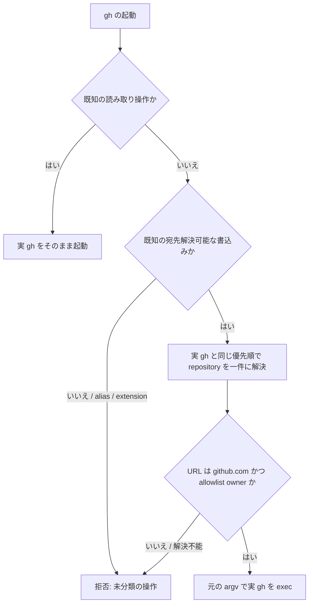

# Issue #10 — gh 書込みの宛先所有者ガード設計

## 結論

`~/.agents/bin/gh` に、全作業ディレクトリで有効な owner guard を配置する。
guard は実行者の GitHub account、クローンの登録状態、`pr-account-policy.conf` の内容で許可を決めない。
実際に `gh` が書き込む repository を先に解決し、解決済み URL の host が `github.com`、owner がコード内リテラルの `kappaseijin` または `kappaseijinjp` のときだけ実 `gh` を起動する。

保護対象は、ユーザー決定で明示された `issue create`、`issue comment`、`pr create`、`pr comment`、`pr review` を含む。
既知の読み取り操作だけを pass-through し、それ以外の操作、任意の `gh` alias / extension 呼出し、非 GET の `gh api` は宛先を静かに推測して通さず fail-closed とする。
この形なら新しい `gh` の書込みサブコマンドが追加されても、分類を更新するまで素通りしない。



## 要求と固定制約

| 要求 | 設計上の扱い |
| --- | --- |
| 判定軸 | account ではなく、書込み先 repository の host / owner で判定する。 |
| 許可 owner | 判定コード中の `kappaseijin` / `kappaseijinjp` 完全一致だけ。 |
| 許可 host | `github.com` 完全一致だけ。GitHub Enterprise、末尾 dot、userinfo、URL 構文不正は拒否する。 |
| 書込みだけを遮断 | 静的に読み取りと確認できる `gh` 操作は通す。`fetch`、Issue / PR の閲覧を妨げない。 |
| 登録漏れ | 作業ディレクトリ、guard root、policy の map 行を許可条件に使わない。範囲外・未登録の概念を無くす。 |
| allowlist の不変性 | env、Git config、gh config、project 設定、`PR_ACCOUNT_POLICY` を allowlist として読まない。狭める上書きも作らない。 |
| 再クローン耐性 | clone の hook / remote 設定でなく、インストール済みの `~/.agents/bin/gh` を標準 PATH の先頭に置く。 |
| 第三者本番への無アクセス | 試験は fake `gh` と使い捨て fixture だけで行い、第三者 repository へ接続しない。 |

`GH_REPO`、`GH_HOST`、`GH_CONFIG_DIR` は allowlist を変える設定ではない。
これらは実際の書込み先を変え得るため、同じ呼出しの宛先解決入力として読む。
解決した結果が allowlist 外なら拒否する。

## 現状の問題と実測

| 観測 | 結果 | 設計への反映 |
| --- | --- | --- |
| 既存 `~/.agents/bin/gh` | `GUARD_ROOT` 外で `outside-guard-root` を警告し、`pr create` / `pr review` / `pr comment` 以外を unchecked pass-through する。 | guard root 分岐と `warn_unchecked` を owner guard から除去する。 |
| 既存 account guard | policy が unreadable、または cwd の map 行が無いと `exec` する。 | policy は owner 判定から完全に切り離す。account policy を残す場合も、owner guard の許可後にだけ追加拒否でき、通過へは使えない。 |
| `gh` 2.97.0 | 隔離 `GH_CONFIG_DIR` で `gh alias set issue ...` と `gh alias set 'issue create' ...` はともに「既存 command」として拒否された。 | 組込みの必須五操作は alias に置換されない前提を CI の version 前提として記録する。ただし独自 alias は shell 展開を持てるため、その実行を拒否する。 |
| `GH_REPO` | 非 repository cwd の `gh issue list` では `GH_REPO` が対象になる。作業 tree 内でも `GH_REPO` は cwd より優先する。 | 明示 `--repo` が無いとき、`GH_REPO` を default / cwd より先に解決する。 |
| `--repo` | `gh issue list --repo kappaseijin/agmsg` は、同時に `GH_REPO=kappaseijin/not-a-repository` を与えても `kappaseijin/agmsg` を読む。`--repo=<value>` も CLI が受理する。 | 明示指定を最優先とし、分離形と `--repo=<value>` の両方を完全に解析する。複数指定は拒否する。 |
| `gh repo view` | `--repo` flag は受けず、repository は位置引数で与える。 | 明示 repository の read-only resolver は `gh repo view <repository>` を使い、存在しない `--repo` flag を渡さない。 |

上記の測定は 2026-08-11 にローカルの実 `gh` 2.97.0 と、自所有 repository / 存在しない自所有 namespace だけで実施した。
書込み API は実行していない。

## 操作の分類

### 読み取り・ローカル設定として通す操作

読み取り allowlist は version 管理する静的表に置く。
少なくとも `help`、`version`、`completion`、`status`、`search`、`issue list/view/status`、`pr list/view/status/diff/checks`、`repo list/view/clone/set-default`、`run list/view/watch`、`workflow list/view`、`release list/view/download`、`gist list/view`、`label list`、`project list/view`、`gh api --method GET` を含める。

`auth`、`config`、`alias` の管理操作は、認証情報またはローカル設定を変えても外部 repository へ書き込まないため pass-through してよい。
ただし alias / extension が展開・実行する任意 command はこの分類に含めない。

`gh api` は method 省略かつ field / input が無い場合だけ GET として扱う。
`--method` / `-X` の別綴り、`--method=<value>`、`-X<value>` を正規化し、明示 GET は query field を含んでも通す。
POST、PUT、PATCH、DELETE、method 不明、method 省略で request body を組み立てる `--field` / `--raw-field` / `--input` を含むものは pass-through しない。

`gh alias list/set/delete` はローカル設定だけを変えるので通してよいが、定義済み alias の実行は読取りと証明できないため拒否する。
同様に extension の実行は拒否する。

### 書込みとして宛先検査する操作

必須の五操作を次のように固定する。

| 操作 | 対象解決 | 許可後の動作 |
| --- | --- | --- |
| `gh issue create` | 下記の一件解決 | 元の argv で実 `gh` を exec |
| `gh issue comment` | 同上 | 同上 |
| `gh pr create` | 同上 | 同上 |
| `gh pr comment` | 同上 | 同上 |
| `gh pr review` | 同上 | 同上 |

これ以外の組込み書込み操作（`issue edit`、`pr merge`、`release create`、`repo` の変更操作など）を素通りさせない。
実装時の静的表で「読み取り」または「宛先検査可能な書込み」のどちらにも分類されていない操作は拒否する。
これにより `gh api`、将来追加される subcommand、alias / extension を使った別経路を「五操作に含まれない」ことだけで通す穴を作らない。

未分類 command は remote write か local-only かを preflight で安全に判別できないため、実行前に拒否する。
新たな読み取りまたはローカル設定操作が必要になった場合は、その非書込み性を実測し、静的表と対応する Bats 試験を同じ PR で追加する。

## 実宛先の解決

認可器が候補を寄せ集めて判定してはならない。
実 `gh` が選ぶ一件を、次の優先順で解決する。

1. argv 中の `-R <repo>`、`--repo <repo>`、`--repo=<repo>` のいずれか一件。
2. `GH_REPO`。
3. `gh repo set-default --view` が返す default repository。
4. cwd に対する実 `gh repo view` の repository 解決。

argv parser は `--` 以降を flag と見なさない。
五操作ごとの flag grammar を持ち、他の value-taking flag の値を `--repo` と誤認しない。
`--repo` の欠値、空値、二件以上、未対応の短縮結合表記、解析不能な host / repository は、実 `gh` を起動せず拒否する。
許可のために「最後の `--repo` を採る」や「全候補が許可なら通す」をしてはならない。

明示 repository は、固定絶対 path の実 `gh` で次を読む。

```bash
"$REAL_GH" repo view "$repo" --json nameWithOwner,url \
  --template '{{.nameWithOwner}}{{"\t"}}{{.url}}'
```

`GH_REPO` は `[HOST/]OWNER/REPO` の完全な grammar で解析する。
これは実 `gh` の `repo view` が worktree 内では `GH_REPO` を目的の resolver として使わない実測に基づく。
default repository は `repo set-default --view` の出力を同じ grammar で解析する。
default が無いときだけ、引数なしの `repo view --json nameWithOwner,url` で cwd 解決を取得する。

いずれの経路も、最終的に `url` の host と `nameWithOwner` の先頭 segment を ASCII lowercase の完全一致で照合する。
`GH_HOST` が指定されている場合も、解決後の URL が `github.com` でなければ拒否する。
resolver のネットワーク / 認証失敗、JSON / template 出力不正、空出力、複数行は拒否であり、元の書込みを試行しない。

## 実装境界

- リポジトリで version 管理する source は `scripts/guards/gh-write-owner-guard.sh`、`scripts/guards/gh-write-owner-guard-launcher.sh`、試験は `tests/test_gh_write_owner_guard.bats` とする。
- installer は launcher を `~/.agents/bin/gh` に配置し、inner script と実 `gh` の絶対 path をインストール時に固定する。PATH 再探索で後段の decoy `gh` を起動しない。
- launcher は `/bin/sh` 固定 shebang とし、Bash を起動する前に `BASH_ENV`、`ENV`、exported `BASH_FUNC_*`、`SHELLOPTS`、`BASHOPTS`、`CDPATH`、`GLOBIGNORE` を除去する。inner script でも allowlist は readonly 代入し、代入不能なら拒否する。
- allowlist は source の `readonly` リテラルだけに置く。`PR_ACCOUNT_POLICY` を source / read しない。
- current wrapper の `GUARD_ROOT`、audit 上の `unchecked`、および policy 未登録時の `exec` 経路を owner guard から削除する。audit を残すなら allow / reject だけを記録し、記録失敗は認可判断を緩めない。
- README と README.ja には、導入、実 agent launcher での `command -v gh` 確認、アンインストール、直接実行や PATH 差替えが保証境界外であることを自己完結で記載する。本検討書 PR 自体は実装を含まないため、現時点で README は変更しない。

## 受け入れ試験

試験は一時ディレクトリ内へ launcher / inner script を配置し、固定実 `gh` の位置だけを test fixture の fake executable に置換する。
fake `gh` は resolver 用の read-only 応答を返し、元の書込み argv を受けた時だけ marker を作る。
外部ネットワークを使用しない。

| ID | 操作 | 期待結果 | 殺す不具合 |
| --- | --- | --- | --- |
| GHG-01 | `issue create --repo thirdparty/fixture` | 非 0、writer marker なし | allowlist 外の必須操作を実行してしまう。 |
| GHG-02 | `pr review --repo kappaseijin/fixture` | 0、marker は一回、元 argv を保持 | 正当な owner を全遮断する。 |
| GHG-03 | guard root 外の scratch cwd で GHG-01 | 非 0、marker なし | `outside-guard-root` の warning pass-through。 |
| GHG-04 | policy file 無し、map 行無し、`PR_ACCOUNT_POLICY` を任意 path にして GHG-01 | 非 0、marker なし | 登録漏れ・policy の unreadable を許可へ使う。 |
| GHG-05 | `GH_REPO=thirdparty/fixture` で `issue comment` | 非 0、marker なし | env 経由の宛先を見落とす。 |
| GHG-06 | `GH_REPO=thirdparty/fixture` と `--repo kappaseijin/fixture` を同時指定 | 0、marker 一回 | 実 `gh` の優先順と異なる候補集合で拒否する。 |
| GHG-07 | default repository が `thirdparty/fixture` | 非 0、marker なし | `repo set-default` を見落とす。 |
| GHG-08 | default 無しで cwd resolver が `thirdparty/fixture` を返す | 非 0、marker なし | cwd remote 解決を見落とす。 |
| GHG-09 | `--repo=thirdparty/fixture` | 非 0、marker なし | `--key=<value>` 形式の取り逃し。 |
| GHG-10 | 二つの `--repo`、欠値、`--` 後の見せかけ flag | すべて非 0、marker なし | 曖昧な argv を最後の値や本文として誤処理する。 |
| GHG-11 | `GH_HOST=evil.example` または host / owner 構文不正 | 非 0、marker なし | host / owner の曖昧な正規化。 |
| GHG-12 | `ALLOWED_OWNERS=thirdparty`、policy 内容変更、Git / gh config 変更下の GHG-01 | 非 0、marker なし | allowlist が runtime 設定で上書きされる。 |
| GHG-13 | custom alias と multiword alias を実行 | 非 0、marker なし | alias 展開後に異なる書込み先へ到達する。 |
| GHG-14 | `gh api --method POST repos/thirdparty/fixture/issues` | 非 0、marker なし | 必須五操作外の API 書込みを素通りする。 |
| GHG-15 | `issue view`、`pr view`、`gh api --method GET` | 0、read fake が一回、writer marker なし | 読み取りまで遮断する。 |
| GHG-16 | `BASH_ENV` と exported function で allowlist helper を上書きして GHG-01 | 非 0、marker なし | shell startup による認可器の改変。 |
| GHG-17 | PATH 後段に decoy `gh` を置いて GHG-02 | 正当な fake 実 `gh` だけが一回起動 | PATH 再探索で判定 / 実行先がすり替わる。 |
| GHG-18 | 新規 clone 相当の scratch cwd で GHG-01 / 02 | それぞれ拒否 / 許可 | clone 固有の設定に依存する。 |

GHG-01、03、04、09、10、14 は「不許可なのに real writer が起動しない」ことを marker で示す必須の負のコントロールである。
GHG-02 と GHG-15 は正しい状態を通し、常時拒否を成功扱いしない対照である。

CLI grammar の実測は Bats fixture と別に、対応 `gh` version を更新する PR で再実行する。
少なくとも built-in `issue` / `issue create` の alias 衝突拒否、`--repo=<value>`、`GH_REPO` と明示 `--repo` の優先順を read-only command で確認し、結果を実装 PR の検証記録へ残す。

## 選択肢

| 選択肢 | 採否 | 理由 |
| --- | --- | --- |
| 現行 wrapper の guard root を拡張する | 不採用 | root 外、policy 未登録、対象外 subcommand が静かに pass-through する構造を残す。 |
| clone ごとの `gh repo set-default` / remote 設定だけを配る | 不採用 | 再 clone、`GH_REPO`、明示 `--repo`、設定漏れを防げない。 |
| 必須五操作だけを解析し、未知の `gh` 操作を通す | 不採用 | `gh api`、custom alias、将来の writer が同じ宛先制約を迂回できる。 |
| 読み取り静的 allowlist + 未分類拒否 + 実宛先 resolver | 採用候補 | 読み取りを維持しつつ、登録漏れ・新経路を fail-closed にできる。 |

## 保証境界

この設計が保証するのは、`~/.agents/bin` を先頭に含む標準エージェント起動環境で名前解決された `gh` である。
同一 OS ユーザーが実 `gh` を絶対 path で直接起動する、PATH から shim を外す、shim 自体を改変する、別ユーザー / root を使う経路は user-space shim の外である。
この境界を越える強制には、OS のアプリケーション制御、権限分離、egress 制御、Git hosting 側の権限設計が別途必要となる。

## 実装開始の前提

- 本書は設計だけであり、production の `~/.agents/skills/agmsg/`、既存 `~/.agents/bin/gh` を変更しない。
- 実装者は本書の source / test path と GHG-01〜18 を満たす PR を作成する。
- Claude 系 reviewer は、owner allowlist が policy / env で緩まないこと、alias / API / argv key 形式、guard root 外、読み取り pass-through、図の実装一致をクロスレビューする。
- README 変更は実装 PR で利用者向け導線と同時に検証する。

## 参照

- [Issue #10](https://github.com/kappaseijin/agmsg/issues/10)
- [Issue #3 の git push owner guard 設計](2026-08-11T121328_git-push-owner-guard.md)
- [GitHub CLI: environment](https://cli.github.com/manual/gh_help_environment)
- [GitHub CLI: repo set-default](https://cli.github.com/manual/gh_repo_set-default)
- [GitHub CLI: alias set](https://cli.github.com/manual/gh_alias_set)
