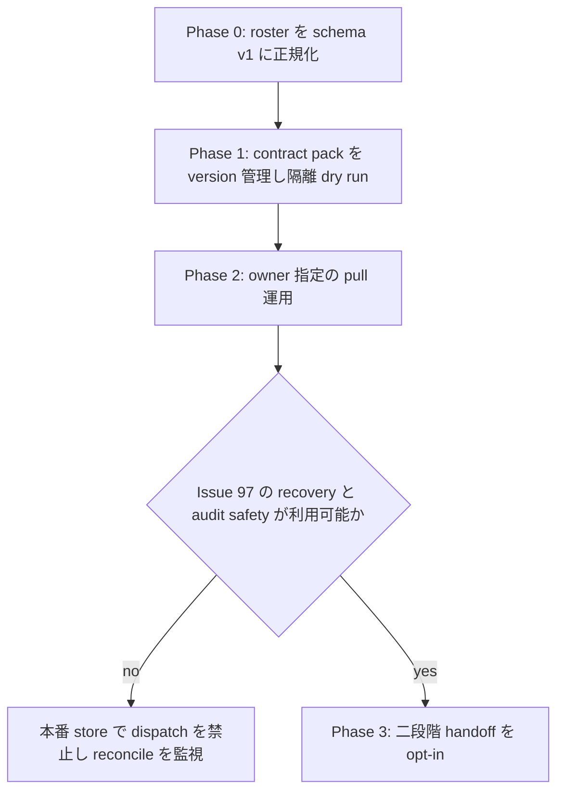
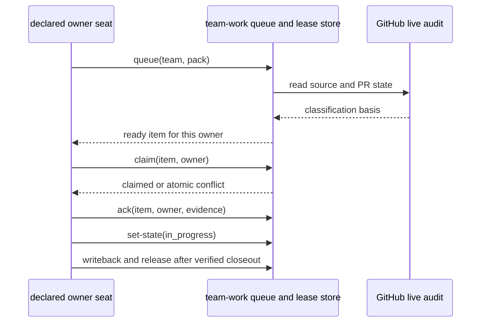
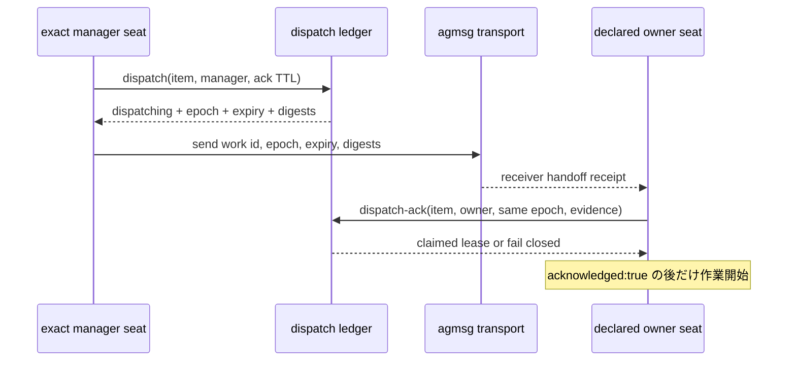

# Issue #92: team-work の複数チーム展開と二段階 handoff

## 決定

`team-work.sh` を agmsg の共通 engine とし、各プロジェクトは versioned roster と versioned contract pack だけを持つ。
project ごとの queue engine、GitHub assignee を claim とみなす運用、または project-local adapter を増やさない。

各 team はまず pull 型を導入し、`dispatch` / `dispatch-ack` は [Issue #97](https://github.com/kappaseijin/agmsg/issues/97) の recovery transition が提供されるまで本番で有効化しない。
これは dispatch を不要とする判断ではない。
二段階 handoff の契約と導入条件を先に固定し、期限切れ dispatch を安全に再実行できる状態遷移を別 Issue で追加してから有効化する。
Issue #97 が未完了の間は、Phase 0〜2 を含めて本番 store で `dispatch` を一度も実行しない。試験実行も隔離 store だけで行う。

この記録は、`team-work` の不在を前提にした [2026-08-11 の scale_exporter 境界記録](2026-08-11T124720_scale-exporter-work-queue-boundary.md)を、現行実装の確認結果で置き換える。

## 確認済みの前提

`team-work.sh` は pack、roster、共有 SQLite state、GitHub live audit を使う。
`queue` は open source Issue のうち live lease 又は live dispatch が無い item だけを `ready` として返し、競合する live lease は SQLite transaction で拒否する。
GitHub Issue assignee は複数人を追加できるため、claim の正本にしない。

ただし pull は unrestricted な work stealing ではない。
`claim` を実行できるのは pack の `ownerSeat` 又は exact `role: manager` の roster member だけである。
各 work item の owner は pack を作る時点で決める。
owner が不在又は到達不能なら reconciler は `orphan_ready` を返して停止し、他の seat が暗黙に引き取らない。

shared state は同一 team の全 seat が同じ SQLite store を参照しなければならない。
seat ごとに異なる `AGMSG_STORAGE_PATH` を設定すると、lease の atomicity は team 全体に及ばない。

## 調査の証跡と限界

| 主張 | 一次資料・確認方法 | 限界 |
| --- | --- | --- |
| 既存 engine で pull、lease、audit、watchdog、dispatch が利用できる | `scripts/team-work.sh`、`scripts/lib/team-work.js`、`scripts/lib/team-work-audit.js`、`scripts/lib/team-work-reconciler.js`、README の command contract。source と installed skill の `team-work.sh` / reconciler の SHA-256 が一致することを確認 | target team での実運用はまだ行っていない |
| GitHub assignee は atomic claim ではない | [herdr-agent-monitor #185](https://github.com/kappaseijinjp/herdr-agent-monitor/issues/185) の closed test Issue 実測 | GitHub UI 又は assignee を補助表示に使うことは妨げない |
| roster gate が未充足 | `team.sh <team> --format json` を各 target に実行。scale2sheet / scale_exporter は schema v1 error、herdr-agent-monitor は manager role 不在 | delivery runtime の継続監視はしていない |
| dispatch timeout は pull audit も汚染する | 隔離 fixture probe で `dispatch(ttl=1)@101` → `queue@200=ready` → `claim@200=success` → `audit@201=unknown/local_state_stale` を再現。dispatch を使わない同一 claim/audit は unknown にならない負の対照 | live GitHub / live 共有 store での実証はしていない |
| dispatch timeout の再実行を public CLI が提供しない | `runDispatch` の INSERT-only transaction、dispatch ledger の `(team, work_item_id)` primary key、期限切れ ACK を拒否する `runDispatchAck` を照合 | expired row を回復する新 command の要件・実装は [Issue #97](https://github.com/kappaseijin/agmsg/issues/97) で追跡する |

Issue #92 の [引継ぎ記録](https://github.com/kappaseijin/agmsg/issues/92)は、既存 engine の isolated-storage 実地検証を本設計の前提としている。
本記録ではそれを再実行せず、現在の source、installed parity、live roster、Issue state を再確認した。

## 対象チームの導入前状態

| 対象 | live roster の確認 | 導入判定 | 必要な Phase 0 |
| --- | --- | --- | --- |
| herdr-agent-monitor | `team.sh --format json` は成功するが、8 member 中 7 席が `unassigned`、1 席が `owner` で `manager` はいない。`agmsg_pm_claude` と `etc_workspace_pm_claude` も混在する | 不可 | 他 team seat を除去し、正式な `manager` role を 1 席だけ設定して dispatch target の registration を検証する |
| scale2sheet | `schemaVersion must be integer 1` で roster validation が失敗する | 不可 | schema v1、member `kind`、`role`、registration を正規化する |
| scale_exporter | `schemaVersion must be integer 1` で roster validation が失敗する。既存 `Scripts/team-work-pilot.sh` は別 CLI の `self-check --policy --contract-pack --format json` を呼ぶ | 不可 | roster 正規化後に pilot adapter を移行又は廃止し、agmsg の positional CLI だけを使う |

この確認は設定だけを読み取ったものである。
対象リポジトリの未追跡又は未コミットの変更には触れない。
agmsg 自身の roster も現時点では schema v1 validation に失敗するが、本設計の rollout target ではない。

## 共通の段階展開

### Phase 0 — roster gate

各 target manager は次を満たす roster change を、対象 project の独立 Issue として用意する。

- `team.sh <team> --format json` が成功する。
- 全 member が schema v1 の `kind`、空でない `role`、少なくとも一つの registration を持つ。
- 他 team に属する seat を roster から除去し、team をまたぐ兼任を残さない。
- `dispatch` を使う team には exact `kind: "seat"`, `role: "manager"` が一席だけある。
- dispatch target は、registration の `delivery.sh status … --format json` で一意に `deliverable: true` かつ `liveness: "alive"` となる。
- roster の候補は一時 HOME / CODEX_HOME で validate してから atomic に切り替える。live team config を直接編集して検証しない。

role、seat 起動、又は delivery の未知状態を `team-work` が修復することはない。
`boot_required`、`unknown`、複数 live registration は dispatch を拒否する正常な安全側の結果である。

### Phase 1 — pack と隔離検証

各 project は tracked path `.team-work/contract-pack.json` に pack を置く。
pack には source Issue、declared `ownerSeat`、work kind、PR relation、classification basis、writeback requirement を記録する。
pack を含む PR は対象 Issue と owner を明示し、source Issue を pack 外から探索しない。

最初の検証は本番 state を使わず、team 共通の隔離 `AGMSG_STORAGE_PATH` と fixture 又は read-only GitHub source で行う。
少なくとも次を確認する。

1. `validate` と `self-check` が同じ roster と pack で成功する。
2. `observe` / `queue` / `audit` が `ready`、`fully_allocated`、`quiescent`、`unknown` を混同しない。
3. 同一 item への二重 `claim` は一方だけが成功し、競合側は exit 2 で state を変えない。
4. `release` 後に item が `ready` へ戻る。
5. `reconcile` と別 process の `watchdog` が、新鮮な heartbeat と stale heartbeat を区別する。

成功してもこの段階では GitHub mutation、agent spawn、herdr 操作、message send を自動化しない。
`dispatch` の成功・失敗を試す必要がある場合も、隔離 `AGMSG_STORAGE_PATH` だけを使い、本番 store には dispatch row を残さない。

### Phase 2 — owner 指定の pull 運用

各 active seat は session start / resume、lease release 後、及び手元に active work が無いときに `queue` を読む。
利用できるのは `ownerSeat` が自席に一致する `ready` item だけである。

`unknown`、`orphan_ready`、expired lease、又は incomplete relation は work を始める根拠ではない。
seat は remediation と evidence reference を manager に送る。
team 間連絡は各 team の manager 間に限定し、他 team の seat を直接 owner にしない。

## dispatch / dispatch-ack の設計

dispatch は push delivery の成功を claim と混同しないための opt-in protocol である。
manager が作業を提案しても、owner の same-epoch ACK までは lease も作業開始権も発生しない。

### 有効化条件

manager は次のすべてを再確認してから `dispatch` する。

- caller は exact roster manager である。
- item は fresh audit で `ready`、owner は pack の exact `kind: "seat"` である。
- `TEAM_WORK_DISPATCH_ALLOWLIST` は JSON array として設定され、その owner を一度だけ含む。
- owner の delivery evidence は一意に available である。
- dispatch output の `leaseEpoch`、`leaseExpiresAt`、`sourceDigest`、`auditDigest` を送信 message にそのまま含める。

`send.sh` の queued 又は `handedOff` は dispatch ACK ではない。
manager は message ID を delivery evidence として別途記録し、owner は受信後に新しい audit を伴う `dispatch-ack` を実行する。
`acknowledged: true` で `state: "claimed"` を確認するまで実装・レビュー・GitHub write を始めない。

### 現在の有効化 blocker

現行 `dispatch` は `(team, work_item_id)` primary key の dispatch row を INSERT する。
期限切れ row が残っていても public command に expire / release / replace transition はなく、再度の `dispatch` は row の重複として `duplicate_dispatch` になる。
`dispatch-ack` も期限切れ epoch を claim にしない。

期限切れ dispatch は再 dispatch を止めるだけではない。
隔離 probe では `dispatch(ttl=1)@101` の期限切れ後、`queue@200` が item を `ready` と返し、owner の `claim@200` は成功した。
その直後の `audit@201` は dispatch row が `dispatching` のまま残っているため `local_state_stale` を理由に `classificationBasis.status: "unknown"` になった。
dispatch を使わない claim/audit の負の対照では unknown にならない。

したがって、Issue #97 が未完了の間の封じ込め条件は「Phase 3 を本番無効にする」だけでは足りない。
本番 store では Phase 0〜2、manual probe、又は trial を含めて `dispatch` を一度も実行しない。
`queue` は audit が unknown になる前に ready を返すため、owner が Phase 2 の pull を行ってもこの汚染は防げない。

reconciler が `expired_lease` を示したら、owner は作業を開始せず、manager は source、dispatch ledger、message delivery を証跡として [Issue #97](https://github.com/kappaseijin/agmsg/issues/97) へ記録する。
Issue #97 は次の三条件を隔離 test で満たさなければならない。

1. append-only history を保った期限切れ dispatch の abandon / replace 後、同一 item を新 epoch で再 dispatch できる。
2. 古い epoch の dispatch-ack は lease を作らず拒否される。
3. 期限切れ dispatch row が残った状態で owner が claim した後も、audit が `local_state_stale` により `unknown` にならない。

この recovery と cross-vendor review が完了するまで Phase 3 は本番無効とする。

## ロールアウト順と受入れ

1. [Issue #98](https://github.com/kappaseijin/agmsg/issues/98) の roster migration を独立 PR で完了し、target manager が live roster と delivery を確認する。
2. `herdr-agent-monitor` を最初の pull-only pilot とする。監視 pane は observer のままで、queue writer にならない。
3. `scale2sheet` を二番目に導入する。既存の未追跡 `AGENTS.md` には触れない。
4. `scale_exporter` は old pilot adapter の移行又は廃止を先に完了してから導入する。二つの CLI / state authority を並行運用しない。
5. 各 pilot は isolated concurrency test、fresh/stale watchdog の負の対照、source audit の `unknown` 拒否、writeback closeout を記録する。
6. 全 pilot が pull-only で安定し、[Issue #97](https://github.com/kappaseijin/agmsg/issues/97) が三条件と cross-vendor review を完了した後にだけ Phase 3 を opt-in する。

各 phase の合格は command の発行ではなく、JSON result、SQLite revision chain、GitHub read evidence、必要な負の対照で確認する。
message receipt、spawn、又は pane の存在を作業完了の証拠に置き換えない。

## 非対象と次の Issue

本決定は target project の roster、pack、hook、又は runtime state を変更しない。
また GitHub の未列挙 Issue を発見して自動配分する scheduler も導入しない。

次の作業は以下に分割する。

1. [Issue #98](https://github.com/kappaseijin/agmsg/issues/98): 各 target team の roster schema v1 migration と delivery verification。
2. 各 target project の contract pack と pull-only pilot。
3. [Issue #97](https://github.com/kappaseijin/agmsg/issues/97): dispatch timeout recovery transition、回帰 test、cross-vendor review。
4. その後に限る harness hook の共通 trigger 設計。hook は queue/reconcile を起動するだけで、dispatch、GitHub mutation、seat spawn を自動実行しない。
