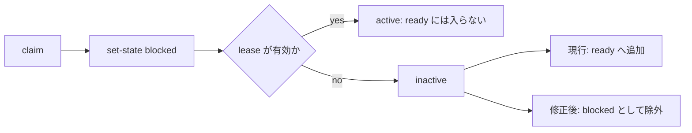

# Issue #101: expired blocked work item の ready 再出現

## 判定

Issue #101 の報告は事実である。

`set-state blocked` を記録した work item は、lease が失効すると `queue` の ready 候補へ再び入る。

これは GitHub の source 状態ではなく、local work-state の読み取りと ready 選別の不整合で起きる。

修正は Issue #101 で先行して行う。

ただし blocker の理由と解除 predicate は Issue #102 の G4 state/coverage layer で扱い、#101 には持ち込まない。

## 実測

| 主張 | value | cutoff | source | command |
| --- | --- | --- | --- | --- |
| 期限切れ blocked row は ready になる | `classificationBasis.status=ready`、`readyCount=1`、`localState.status=inactive` | blocked item が `ready` に入らないこと | `scripts/lib/team-work.js`、`scripts/lib/team-work-audit.js`、fake GitHub fixture | isolated Bats probe: `claim ttl=0` → manager `set-state blocked` → `TEAM_WORK_NOW=4102444800 queue` |
| 有効 lease は ready にならない負の対照 | `classificationBasis.status=fully_allocated`、`readyCount=0`、`localState.status=active` | active lease が誤って ready にならないこと | 同上 | isolated Bats probe: `claim ttl=3600` → manager `set-state blocked` → `queue` |

probe は temporary SQLite store、fake `gh`、fixture の open Issue だけを用いた。

live GitHub、live team roster、shared store への mutation は行っていない。

## 原因

`team-work.js` は `blocked` を mutable state として受理し、row の `state` 列だけを更新する。

`set-state` は lease owner を消さず、manager は失効後でも state を変更できる。

`team-work-audit.js` は local row の `state` を ready 判定へ渡さない。

同ファイルは open source かつ local state が `active` でなければ item を ready 配列へ追加する。

そのため expired lease の row は `inactive` となり、state が `blocked` でも ready になる。

`team-work-reconciler.js` の `readyItemsFromAudit` も `active` 以外を ready とみなす。

この関数は reconcile の `orphan_ready` 検出と dispatch の対象選択の両方で使われる。

## 修正案

Issue #101 は output status の enum を増やさない暫定の fail-closed 修正とする。

これは schema v1 の consumer を `blocked` という新しい classification status で壊さず、誤った claim と dispatch を直ちに止めるためである。

1. audit の item local state に row の workflow state を additive field として出力する。
2. workflow state が `blocked` の open item を ready 配列と `readyItemsFromAudit` から除外する。
3. ready item が 0 件で blocked item が 1 件以上なら、既存の `unknown` status と `blocked_work_item` reason を返す。
4. ready item が他にあれば status は `ready` のままとし、ready 配列には blocked item を含めない。
5. manager が `set-state acknowledged` 又は `set-state in_progress` を記録すれば、blocked mark は解除される。

`unknown` は source の取得失敗だけを意味する値ではなくなるが、reason code により既知の blocker と区別できる。

これは恒久の状態モデルではない。

Issue #102 は `blocked` classification、reasonCode、解除 predicate、coverage を versioned state entry として定義し、この暫定 reason を置き換える。

## 受入条件

1. TDD の RED として、期限切れ blocked row の `queue.ready` が空で、`blocked_work_item` を返す test を先に失敗させる。
2. 同 row を manager が `acknowledged` に戻す対照では、queue が item を ready として返す。
3. blocked item と unleased item が混在する対照では、queue は unleased item だけを ready として返す。
4. reconcile は blocked item に `orphan_ready` を出さない。
5. dispatch は blocked item を dispatch ledger に書かず、隔離 store の負の対照で確認する。
6. workflow state の blocked 除外を外す変異は、混在 case の queue と dispatch test で失敗する。

## 影響範囲と制約

変更対象は `scripts/lib/team-work-audit.js`、`scripts/lib/team-work-reconciler.js`、対応する Bats fixture test、README の command-output 説明である。

contract pack の schema、roster schema、GitHub mutation、message delivery、dispatch の production 有効化は変更しない。

Issue #98 が未完了のため、target team への rollout は開始しない。

Issue #97 が未完了のため、本番 store での dispatch 実行は禁止を維持する。

## 未確認と限界

この調査は current main の source と isolated fixture に限る。

live shared store に既存 blocked row があるか、外部 consumer が `classificationBasis.status=unknown` を source failure だけとして扱っているかは未確認である。

programmer は実装前に current main の consumer を再検索し、`unknown` の reason code を読まない consumer を負の対照に含める。
