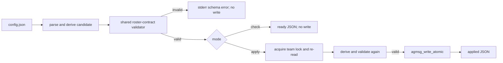

# Issue #103: roster schema v1 正規化コマンド

## 目的

`agmsg` チームの roster は root `schemaVersion` を欠き、`team.sh agmsg --format json` が `schema error: schemaVersion must be integer 1` で停止する。
この失敗は work-item roster gate を閉じるため、PR 作成と formal review の preflight を fail-closed に止める。

人手による `teams/<team>/config.json` の直接編集は採用しない。
同じ欠落を安全に解消できる恒久 CLI を追加し、候補を隔離環境で検証した場合だけ本体 config を atomic に更新する。

## 現在の根拠

- [Issue #103](https://github.com/kappaseijin/agmsg/issues/103) は本件を agmsg 自身の blocker として追跡している。
- installed `team.sh agmsg --format json` は本設計の着手時点で root schema error を返した。
- `scripts/lib/roster-contract.sh` の `agmsg_roster_contract_validate` は root `schemaVersion` が JSON integer の `1` であることを要求し、`team.sh --format json` と `team-work` consumer が同じ roster contract を使う。
- `join.sh` などの既存 writer は team lock を保持し、`agmsg_write_atomic` により候補全体を置換する。

## 決定

公開 CLI として `scripts/roster-normalize.sh` を追加する。

```text
scripts/roster-normalize.sh <team> --check
scripts/roster-normalize.sh <team> --apply
```

`--check` は config を変更せず、正規化候補が roster v1 contract を満たすか検査する。
成功時は一行の JSON を stdout に出す。

```json
{"schemaVersion":1,"team":"agmsg","status":"ready","changed":true}
```

`--apply` は `--check` と同じ検査を lock 内で再実行し、成功時だけ config を atomic に置換する。
成功時は `status` を `applied` にする。
既に integer `1` の config は正常終了し、`changed:false` と `status:"already_current"` を返す。



## 正規化の境界

この CLI が変更してよい意味上の field は root `schemaVersion` だけである。

- field が無い場合は JSON integer `1` を追加する。文字列の `"1"` は作らない。
- field が integer `1` の場合は no-op とする。
- field が string、null、boolean、整数 1 以外、又は JSON 全体が不正の場合は失敗する。推測的な coercion はしない。
- `name`、`agents`、member `kind`、member `role`、registration、team identity、journal、remote binding、unknown top-level field を変更しない。

従って、schemaVersion 追加後も role / kind / registration の契約違反が残る config は更新しない。
operator は `join.sh <team> <agent> <type> <project> --role <role> --kind <kind> --force` の明示入力で metadata を補完してから再実行する。
agent 名、runtime 名、project path から role / kind を導出する fallback は禁止する。

## 実装境界

`roster-normalize.sh` は `validate.sh`、`storage.sh`、`registry-lock.sh`、`roster-contract.sh` を source する。
team 名を既存 validator で検査して config path traversal を拒否し、対象 team directory の `agmsg_lock_acquire` を取得する。

候補生成は SQLite JSON1 の `json_set` を使う。
`--apply` は lock 取得後に config を再読込して候補を作り直すため、lock 前の `--check` 結果を publish 根拠に使わない。
shared `agmsg_roster_contract_team_json <candidate> <team>` による validation 成功を publish 前提とし、失敗時は stdout を空にして exit 2 と stable な `schema error:` を stderr に返す。

publish は既存 `agmsg_write_atomic` のみを使う。
lock は全ての成功・失敗経路で解放する。
`rm`、in-place redirect、設定ファイルの直接編集、remote journal mutation は使わない。

## 隔離から live へ進む運用

operator は本番 skill の config を候補検証に使わない。
installed skill の使い捨てコピーへ同じ command を適用し、そのコピーの `team.sh <team> --format json` が成功してから live install に `--apply` を一度だけ実行する。

```text
scratch/agmsg/scripts/roster-normalize.sh agmsg --apply
scratch/agmsg/scripts/team.sh agmsg --format json
~/.agents/skills/agmsg/scripts/roster-normalize.sh agmsg --apply
~/.agents/skills/agmsg/scripts/team.sh agmsg --format json
```

最初の二行は scratch だけを書き換える。
live `--apply` が非ゼロなら、operator は config を手編集せず、stdout/stderr と command exit を Issue へ記録する。

## エラー契約

| 状態 | exit | stdout | stderr | config |
| --- | --- | --- | --- | --- |
| candidate が完全な roster v1 | 0 | `ready` JSON | 空 | 不変 |
| apply 成功 | 0 | `applied` JSON | 空 | atomic 置換 |
| 既に v1 | 0 | `already_current` JSON | 空 | 不変 |
| schemaVersion 以外を含む contract 不全 | 2 | 空 | `schema error:` | 不変 |
| 不正な team / mode | 2 | 空 | usage / validation error | 不変 |
| lock、read、SQLite、atomic publish の失敗 | 1 | 空 | 原因を示す error | 不変、又は publish 成功後の cleanup warning のみ |

## 検証契約

既存の roster contract test と同じ `tests/test_team.bats` へ、`# --- roster-normalize.sh ---` 節を追加する。

1. root schemaVersion だけが欠ける完全な fixture は `--check` で `ready`、`--apply` で `applied`、続く `team.sh --format json` で成功する。
2. 同じ fixture で `--check` の前後は byte-identical、`--apply` 後は schemaVersion 以外の JSON projection が一致する。
3. `schemaVersion: "1"`、`2`、`null`、malformed JSON、missing role、invalid kind、empty registration は exit 2・空 stdout・config 不変となる。
4. valid v1 fixture の `--apply` は `already_current` となり、config を変更しない。
5. known-present negative control として schemaVersion を削除した fixture は `team.sh --format json` が失敗することを先に確認し、normalizer 後だけ成功することを確認する。
6. test 用の独立 team directory でのみ `--apply` を実行し、実 HOME と installed skill の config へ書き込まない。

対象 Bats、`bash -n scripts/roster-normalize.sh`、`git diff --check`、全 Bats、PR CI は programmer と独立 Claude reviewer が確認する。

## README の利用者導線

README の command list と Machine-readable team roster 節へ `roster-normalize.sh` を追加する。
利用者が README だけで、用途、`--check` / `--apply`、scratch 検証、成功出力、失敗時に直接編集しないことを理解できる状態にする。
設計経緯、Issue の優先順位、agent 運用は README へ載せない。

## 非対象

- member の role / kind を推測して補うこと
- registration の追加・削除、team / member rename、journal / remote sync の mutation
- #98 の他 team roster 作業、#101 の ready 計算修正、#97 / #102 の work-state 設計
- `dispatch` の有効化又は live delivery の判定
