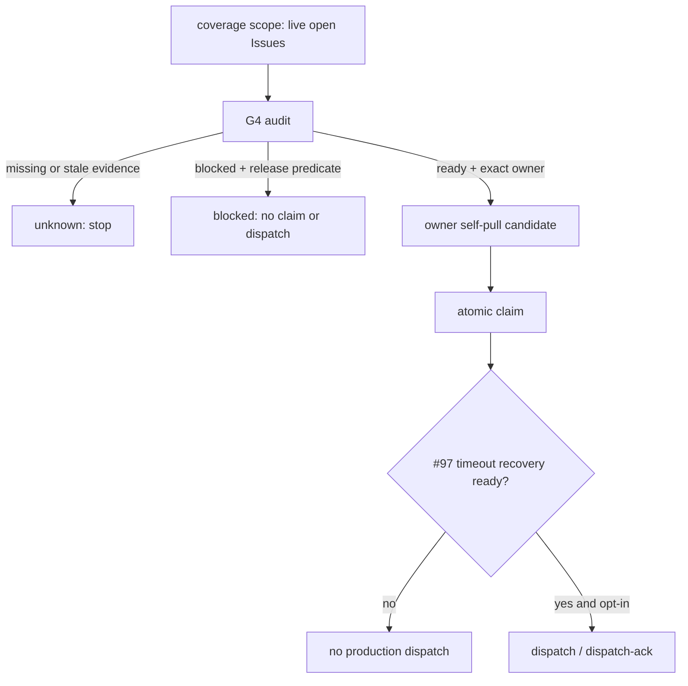

# Issue #97 / #102: dispatch timeout recovery と G4 state/coverage layer の統合設計

## 結論

Issue #97 は、G4 を待たずに先行する dispatch ledger の安全修正である。

期限切れ ledger は削除せず、exact manager が exact epoch を `dispatch-abandon` へ遷移させる。

この終端遷移は append-only revision に残し、同じ item の次の `dispatch` は `abandoned` row を新 epoch の `dispatching` へ置き換えられるようにする。

期限切れ ledger が残るだけでは live claim と矛盾しないため、audit は期限切れ ledger と active claim の組み合わせを `local_state_stale` にしてはならない。

Issue #102 は別の versioned state/coverage layer を導入する architectural decision である。

scale_exporter から報告された A2/B1/C1 は提案であり、agmsg 側では未決定とする。

したがって本書は #97 の実装契約を提案し、#102 は user decision が必要な選択肢と共通安全境界だけを定義する。

## 現在の根拠

| 主張 | value | cutoff | source | command |
| --- | --- | --- | --- | --- |
| #101 のコード修正は main にある | main `588f282bff066284e0a8ba1fda830c0eb00fd6b5` に PR #108 の squash merge | #101 が未マージでないこと | GitHub PR #108 | `gh pr view 108 --json state,mergeCommit,headRefOid,baseRefOid`、`git ls-remote origin refs/heads/main` |
| #97 / #102 / #98 は未完了 | 各 Issue が `OPEN` | rollout / dispatch を有効化できないこと | GitHub Issues #97, #102, #98 | `gh issue view <number> --json state,body` |
| timeout が audit を汚染する経路が残る | expired `dispatching` row と current active claim の組み合わせで `local_state_stale` | expiry 後に live claim を audit が active と読めること | `team-work-audit.js`, `team-work-reconciler.js`, #92 decision | remote main の raw source と #92 の隔離 probe 記録 |
| dispatch history は append-only | current/revisions table と immutable trigger がある | timeout recovery で既存 revision を失わないこと | `scripts/internal/init-db.sh` | remote main の raw source |

この確認は remote main と GitHub artifact の read-only 検査である。

live shared store、target roster、dispatch、GitHub mutation は実行していない。

scale_exporter の原本は team boundary のため直接取得していない。

Issue #102 に転記された内容だけを proposal として扱う。

## #97: dispatch timeout recovery

### 現行の失敗経路

`team_work_dispatch_current` は `(team, work_item_id)` を primary key とし、state は `dispatching` 又は `claimed` だけである。

`dispatch` は INSERT-only なので、期限切れ row も新 epoch を妨げる。

また audit は current active claim と dispatch row の整合を検査するが、現行は dispatch の期限を確認する前に競合とみなす。

```mermaid
sequenceDiagram
  participant M as manager
  participant D as dispatch ledger
  participant O as owner
  participant A as audit
  M->>D: dispatch epoch E ttl=1
  Note over D: E expires
  O->>D: claim succeeds
  A->>D: read current claim and old E
  D-->>A: current behavior: local_state_stale
  A-->>O: unknown; work cannot be audited safely
```

### 提案する transition

新しい public command は次とする。

```text
team-work.sh dispatch-abandon <team> <contract-pack.json> \
  <work-item-id> <manager-seat> <lease-epoch> <evidence>
```

`dispatch-abandon` は次の全条件を同一 SQLite transaction で満たすときだけ成功する。

1. caller は roster の exact `kind: seat`, `role: manager` である。
2. `work-item-id`、contract digest、envelope digest、owner seat、`lease-epoch` が current dispatch row と一致する。
3. row の state は `dispatching` 又は `claimed`、かつ `lease_expires_at <= now` である。
4. 同 item の `team_work_current` に unexpired lease がない。
5. `evidence` は空でない。

成功時は current dispatch row の state を `abandoned`、`last_action` を `dispatch-abandon` にして、evidence を専用の `recovery_evidence` として保存する。

行を delete しない。

既存 trigger が state `abandoned` の snapshot を新 revision として追記するので、old epoch、abandon、new epoch の全順序が残る。

`dispatch` は unexpired current lease がないことを引き続き確認し、current dispatch row が `abandoned` かつ期限切れのときだけ同じ primary key を新 epoch の `dispatching` へ更新する。

この置換の `last_action` は `dispatch-replace` とする。

old epoch の `dispatch-ack` は current state 又は epoch が一致しないため、`acknowledged: false` と `dispatch_epoch_invalid` を返し、lease を作らない。

README は `dispatch-abandon` の引数、manager-only authority、`abandoned` が dispatch allocation ではないこと、old epoch ACK の拒否、既存 store が初回 command 時に自動 migration されることを自己完結で記述する。

### audit と schema migration

audit は dispatch row を次のように扱う。

| dispatch state | lease | active current claim | audit の扱い |
| --- | --- | --- | --- |
| `dispatching` / `claimed` | unexpired | なし | `active` allocation |
| `dispatching` / `claimed` | expired | あり | claim を優先。`local_state_stale` にしない |
| `abandoned` | expired | あり / なし | terminal evidence。active claim を妨げず、dispatch 候補にも数えない |
| 不正な state、digest、future-dated `abandoned` | 任意 | 任意 | `local_state_stale` で fail closed |

既存 SQLite store は CHECK constraint が `dispatching` / `claimed` に固定されている。

`CREATE TABLE IF NOT EXISTS` だけでは更新されないため、`agmsg_storage_ensure_initialized` 内で idempotent な team-work schema migration を実装する。

移行は current / revisions table を transaction 内で新 schema へ rebuild し、既存 row と revision JSON を完全にコピーしてから trigger と immutable guard を再作成する。

新 schema は `abandoned` と nullable `recovery_evidence` を許可する。

copy 前に legacy state 以外、revision chain 不整合、又は JSON 不正を検出した場合は fail closed で migration を中止する。

### #97 受入れ

1. RED: `dispatch(ttl=1)` の expiry 後、`dispatch-abandon` がない既存コードでは command/test が失敗する。
2. abandon 後の revision chain は `dispatching(E1)`、`abandoned(E1)`、`dispatching(E2)` の順で append-only であり、E2 は E1 と異なる。
3. abandon 後の `dispatch(E2)` は成功し、old E1 の `dispatch-ack` は current / revision / claim を変更しない。
4. expired E1 を残したまま valid owner が `claim` した後の audit は `local_state_stale` / `unknown` に落ちない。
5. active current claim がある場合、abandon / replace は no mutation で拒否される。
6. dispatch を使わない claim/audit と、unexpired dispatch の existing behavior は負の対照として保持する。
7. legacy store migration、二度目の migration、copy failure を隔離 SQLite test で確認する。
8. state predicate を unexpired 判定前の旧条件へ戻す変異と、old epoch validation を外す変異は対応 test で KILLED になる。
9. README だけで recovery command、出力、store migration、Phase 3 の有効化前提を理解できる。

## #102: G4 state/coverage layer

### 解く問題と非対象

現行 pack は列挙済み item だけを監査し、未列挙の open Issue を発見しない。

また #101 の `blocked` は local lease row の暫定状態であり、blocker の理由、解除 predicate、全対象 Issue への coverage を versioned に表せない。

G4 はこの不足を補う state/coverage layer である。

G4 は GitHub label の自動変更、seat spawn、未登録 team への dispatch、又は Issue の自動 close を行わない。

### すべての選択肢に共通する安全契約

1. coverage scope は明示した GitHub query と immutable basis refs で定義する。暗黙に repository の全 Issue を担当対象にしない。
2. scope が返す各 open Issue は、versioned entry の `ready`、`blocked`、`unknown` のいずれか一つに対応する。coverage 不能時は `unknown` で停止する。
3. `blocked` entry は stable `reasonCode` と機械評価できる release predicate を持つ。任意の自然言語だけでは解除できない。
4. `unknown`、coverage mismatch、stale source、reasonless block は ready / claim / dispatch の根拠にならない。
5. state transition と coverage audit は append-only revision と canonical digest を残す。current 表示だけを正本にしない。
6. #97 の recovery が未完了、又は #98 roster gate が未充足なら、G4 は read-only audit に留めて本番 dispatch を有効化しない。



### ユーザー決定が必要な A2 / B1 / C1

| 論点 | proposal | 採用時の効果 | 保留時の代替 |
| --- | --- | --- | --- |
| A2: 索引の正本 | agmsg 共通の G4 validator / state ledger として持ち、各 project は scope と entry を提供する | 同じ coverage / digest / fail-closed contract を各 team で再利用できる | project-local adapter。state authority と cross-team audit の互換性を各 project ごとに負担する |
| B1: self-pull | pack / G4 entry の exact owner seat だけが ready item を claim できる | owner identity、lease、writeback を一意に保つ | compatible seat の引継ぎを許す別 policy。delegation authority と audit identity を追加で設計する必要がある |
| C1: blocker 解除 | predicate audit を通した explicit transition。GitHub label は自動変更しない | 解除根拠と担当者が revision に残り、外部副作用を持たない | label-driven release。GitHub write authorization、race、label taxonomy を G4 と同時に設計する必要がある |

本書の推奨は A2 / B1 / C1 である。

B1 は ready item の自動 self-pull を exact owner に限る提案であり、既存の manager による明示的な recovery / state mutation authority を廃止するものではない。

これは scale_exporter 側の提案が妥当だと断定するものではない。

採否は PM が本書を添えてユーザーへ確認し、回答を Issue #102 と後続 decision record に記録する。

### 採用後に具体化する entry contract

ユーザーが A2 / B1 / C1 を採用した場合だけ、次の最小 contract を implementation design へ進める。

```json
{
  "schemaVersion": 1,
  "team": "example",
  "source": {"repository": "kappaseijin/example", "number": 42},
  "state": "blocked",
  "ownerSeat": "example_programmer_codex",
  "workKinds": ["implementation"],
  "basis": {"contentDigest": "sha256:...", "refs": []},
  "blocker": {
    "reasonCode": "upstream_issue",
    "releasePredicate": {"kind": "issue_closed", "repository": "kappaseijin/example", "number": 41}
  },
  "revision": 1
}
```

`ready` entry は blocker を持たず、`blocked` entry は両 field を必須にする。

`unknown` は reason ではなく source / coverage evidence の不成立として扱う。

`quiescent` は scope が open Issue を返さない集約結果であり、個別 open Issue entry に使わない。

この contract、scope query の語彙、reasonCode enum、release predicate enum、schema migration は決定後の別 implementation plan で固定する。

## 実施順と境界

1. #97 の schema migration、`dispatch-abandon`、expired-ledger audit repair を隔離 test で実装する。
2. Codex producer と Claude formal reviewer が #97 の exact head、migration、negative controls、mutation test を別 context で確認する。
3. #98 が roster / delivery acceptance を完了するまで、target team の本番 dispatch は無効のままとする。
4. PM は #102 の A2 / B1 / C1 をユーザーへ提示する。否決又は変更なら #97 を巻き戻さず、G4 の後続設計だけを更新する。
5. 採用後に限り、G4 の read-only coverage audit、entry transition、exact-owner self-pull pilot、dispatch opt-in を別 PR 群へ分割する。

## 未確認と限界

- scale_exporter の原本・formal review・ユーザー決定は agmsg 側では未読であり、Issue #102 の転記を証拠に採用しない。
- existing target team store に timeout ledger があるかは確認していない。本番 store を診断・修復しない。
- SQLite migration の具体的な lock / crash recovery は implementation phase で isolated interruption test を含めて検証する。
- PR #107 の docs は main に反映済みだが、#97 / #102 の本書はまだ review・user decision 前である。
