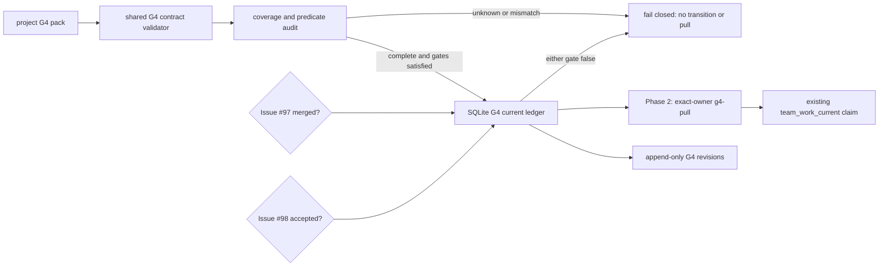

# Issue #102: G4 state/coverage layer 実装設計

## 決定と結論

Issue #102 の A2 / B1 / C1 は採用済みである。

| 論点 | 採用する設計 |
| --- | --- |
| A2: 索引の正本 | agmsg 共通の G4 validator と append-only state ledger を正本にする。project は宣言的な scope と entry pack を渡す adapter だけを持つ。 |
| B1: self-pull | ready entry と work-item contract が完全一致するときだけ、その exact owner seat が claim できる。manager を含む別 seat は拒否する。 |
| C1: blocker 解除 | manager seat が expected revision を指定して明示 transition する。`blocked -> ready` は fresh predicate audit の成功を同じ operation で保存する。GitHub label は読取専用で、自動変更しない。 |

G4 の共通部分は `scripts/lib/` と local SQLite store に置く。
project 固有の Issue の選び方、owner、workKinds、blocker は versioned G4 pack にだけ置く。

最初の実装は read-only coverage audit だけの Phase 1A とする。
Issue #97 の timeout recovery が merge され、Issue #98 の roster/delivery gate が受入れ済みになった後に、G4 ledger と explicit transition を Phase 1B として追加する。
exact-owner self-pull はさらに別の Phase 2 pilot とする。
dispatch の有効化はこの設計の範囲外であり、既存の Phase 3 opt-in を変えない。

## 確認済みの根拠

| 主張 | value | cutoff | source | command |
| --- | --- | --- | --- | --- |
| A2 / B1 / C1 は採用済み | Issue #102 comment が3項目を採用と記録 | 採用前の proposal と区別すること | Issue #102 decision record | `gh api repos/kappaseijin/agmsg/issues/comments/5369510068` |
| 親設計は main に取り込み済み | PR #109 merge commit は `b3ef8f16a4692559db5840db3930b6fa1fb8a3f4` | G4 design の base を固定すること | GitHub PR #109、`origin/main` | `gh pr view 109 --json state,mergeCommit,headRefOid`、`git ls-remote origin refs/heads/main` |
| legacy claim は manager も許している | `requireClaimAuthority` は owner 又は manager を許可する | B1 を既存 `claim` の緩和として実装しないこと | `scripts/lib/team-work.js` | codebase-memory `get_code_snippet(requireClaimAuthority)` |
| audit は pack 内 item だけを読む | `runAudit` は `pack.workItems` を走査し、scope coverage を持たない | G4 を独立の coverage validator とすること | `scripts/lib/team-work-audit.js` | codebase-memory `get_code_snippet(runAudit)` |
| dispatch schema migration が必要 | dispatch state CHECK は `dispatching` / `claimed` のみ | #97 と G4 の storage change を同一 PR に混ぜないこと | `scripts/internal/init-db.sh` | codebase-memory `search_code(team_work_dispatch_current)` |

本書は agmsg の current main と Issue #102 の採用記録を読取検査した結果である。
scale_exporter の原本・store・GitHub write を直接操作していない。

## 非対象

- GitHub Issue / label / Project の自動変更
- Issue の自動 close、seat spawn、dispatch message の送信
- manager が作業内容の優先順位を決めること
- 未登録 team、曖昧な roster、source failure への fail-open
- Issue #97 の dispatch-abandon と dispatch migration の実装

## 構成



`g4-audit` は read-only である。
gate が未充足の間は `g4-bootstrap`、`g4-transition`、`g4-pull` を実装・公開しない。
gate 充足後も `g4-bootstrap` と `g4-transition` は local G4 ledger だけを mutation し、GitHub は読取専用に保つ。

## G4 pack v1

G4 pack は既存の work-item contract pack と別ファイルにする。
既存 pack の `schemaVersion: 1` と互換性を壊さず、G4 adapter を必要な project だけが追加できるためである。

```json
{
  "schemaVersion": 1,
  "team": "example",
  "scopes": [
    {
      "id": "example-open-issues",
      "repository": "kappaseijin/example",
      "issueState": "OPEN",
      "labelsAll": [],
      "basis": {
        "contentDigest": "sha256:...",
        "refs": [{"kind": "git", "repository": "kappaseijin/example", "commit": "..."}]
      }
    }
  ],
  "entries": [
    {
      "schemaVersion": 1,
      "source": {"repository": "kappaseijin/example", "number": 42},
      "state": "blocked",
      "ownerSeat": "example_programmer_codex",
      "workKinds": ["implementation"],
      "basis": {
        "contentDigest": "sha256:...",
        "refs": [{"kind": "github_issue", "repository": "kappaseijin/example", "number": 42}]
      },
      "blocker": {
        "reasonCode": "upstream_issue",
        "releasePredicate": {
          "kind": "issue_closed",
          "repository": "kappaseijin/example",
          "number": 41
        }
      },
      "revision": 1
    }
  ]
}
```

### Schema rules

1. `schemaVersion` はすべて整数の `1` に固定する。
2. `scopes` は空でない一意の `id` を持つ。scope は repository、`issueState: "OPEN"`、`labelsAll` のみで宣言する。自由形式 GraphQL や repository 全件の暗黙取得は許可しない。
3. scope の `basis.contentDigest` は canonicalized scope declaration の SHA-256、`basis.refs` は non-empty の immutable reference とする。validator は digest の自己整合性を確認する。
4. audit は各 scope を GitHub から取得し、重複を除いた `(repository, issue number)` 集合を canonicalize して `coverageDigest` を計算する。
5. `entries` は source ごとに一意で、coverage 集合と完全一致しなければならない。missing、extra、重複、取得失敗、pagination failure は `unknown` で fail closed とする。
6. entry の `ownerSeat` は roster の exact `kind: seat` と一致し、`workKinds` は既存 `WORK_KINDS` と同じ allowlist を使う。
7. entry `basis` も SHA-256 content digest と non-empty immutable refs を必須にする。entry digest は `entryDigest` 自身を除く canonical JSON の SHA-256 とする。
8. `state` は `ready`、`blocked`、`unknown` のいずれかである。`quiescent` は entries が空かつ coverage も空のときの aggregate audit result だけであり、entry state に使わない。
9. `ready` は `blocker` を持たない。`blocked` は `reasonCode` と `releasePredicate` を必須にする。`unknown` は blocker を持たず、claim と dispatch の根拠にならない。
10. `reasonCode` は stable lower-snake-case token とし、自然言語だけの blocker は拒否する。project は `upstream_issue`、`review`、`user_decision`、`not_before`、`observation` などを選べるが、解除条件は共通 predicate grammar に従う。

### Release predicate v1

release predicate は次だけを受け付け、すべて live read により boolean を返す。

| kind | 必須 field | true になる条件 |
| --- | --- | --- |
| `issue_closed` | `repository`, `number` | 対象 Issue が CLOSED |
| `pull_request_merged` | `repository`, `number` | 対象 Pull Request が MERGED |
| `review_approved` | `repository`, `number`, `headOid` | 指定 head に独立 reviewer の APPROVED がある |
| `not_before` | `at` | `at` が RFC3339 の JST offset 付き時刻で、現在時刻が到達済み |
| `issue_comment_digest` | `repository`, `number`, `commentId`, `contentDigest` | 指定 comment が存在し、body SHA-256 が一致する |
| `all_of` | `predicates` | 子 predicate がすべて true |

`observation` は reasonCode として利用できるが、曖昧な「観測済み」predicate は v1 に入れない。
必要なら project adapter が上表の concrete predicate を選び、将来の predicate kind は schemaVersion を上げずに追加しない。

## Shared SQLite ledger

G4 は team database に次の2表を追加する。
これらは #97 が dispatch tables を migration した後の `init-db.sh` に、独立した `CREATE TABLE IF NOT EXISTS` と trigger として追加する。

| table | primary key | 用途 |
| --- | --- | --- |
| `team_work_g4_current` | `(team, source_repository, source_number)` | current entry の state、owner、revision、pack/entry/coverage/audit digest、basis、blocker、last action/actor/evidence を保持する |
| `team_work_g4_revisions` | `(team, source_repository, source_number, revision)` | canonical snapshot と previous revision、action、actor、created time を append-only で保持する |

`team_work_g4_current` の `state` CHECK は `ready` / `blocked` / `unknown` に固定する。
JSON column は `json_valid` を必須にする。
revision は正整数で、current INSERT/UPDATE trigger が snapshot を revisions に追記する。
revisions の UPDATE / DELETE trigger は `RAISE(ABORT, ...)` により拒否する。

`g4-bootstrap` と `g4-transition` は `BEGIN IMMEDIATE` で current row、expected revision、pack digest、entry digest を照合してから mutation する。
zero change、digest mismatch、stale revision、scope mismatch、predicate failure は rollback し、revision を増やさない。

G4 は dispatch tables を読まない。
この分離により #97 の `abandoned` migration と G4 の ledger migration を別 PR として review / revert できる。

## Command contract

### `g4-audit`

```text
team-work.sh g4-audit <team> <g4-state-pack.json>
```

G4 pack と exact roster を検証し、declared scope の live open Issue 集合、coverage、entry validity、release predicates、current ledger digest を読む。
GitHub source が読めない、coverage が不一致、current ledger と pack が一致しない、又は blocked predicate が false のとき、`classificationBasis.status: "unknown"` 又は item state `blocked` を返す。
この command は SQLite と GitHub を変更しない。

### `g4-bootstrap`

```text
team-work.sh g4-bootstrap <team> <g4-state-pack.json> <manager-seat> <evidence>
```

この command は #97 merge と #98 acceptance の後だけ実装する。
exact manager seat だけが、current G4 row が存在しない source を initial revision として記録できる。
coverage audit が complete であること、`ready` entry が blocker を持たないこと、`blocked` entry が valid predicate を持つことを要求する。
既存 row が一つでもある source は拒否し、部分 bootstrap を許可しない。

### `g4-transition`

```text
team-work.sh g4-transition <team> <g4-state-pack.json> \
  <repository> <issue-number> <expected-revision> <manager-seat> <evidence>
```

この command は #97 merge と #98 acceptance の後だけ実装する。
pack 内の対象 entry は current revision の次の revision でなければならない。
manager は判断を新規に作らず、pack と predicate audit が示す transition を記録する。
特に `blocked -> ready` は、対象 blocker の release predicate が fresh audit で true であることを要求する。
false、unknown、coverage mismatch は no mutation で拒否する。

ownerSeat や workKinds の変更は implicit transition にしない。
v1 は同一 source の ownerSeat / workKinds を immutable とし、引継ぎが必要になったときは専用の後続 Issue で authority と active lease の扱いを定義する。

### Phase 2 `g4-pull`

```text
team-work.sh g4-pull <team> <contract-pack.json> <g4-state-pack.json> \
  <work-item-id> <owner-seat> [ttl-seconds]
```

この command は #97 merge と #98 acceptance の後だけ実装する。
次のすべてを一つの operation で確認してから、既存 `team_work_current` に claim を作る。

1. G4 audit が complete、coverage が一致、target entry/current ledger/pack の digest と revision が一致する。
2. target entry は `ready`、source Issue は OPEN、blocker は存在しない。
3. work-item contract の source、ownerSeat、workKinds が G4 entry と完全一致する。
4. caller は exact ownerSeat である。manager、compatible seat、又は stale roster は拒否する。
5. 既存 current lease と unexpired dispatch lease がない。#97 の migration 後の audit/lease semantics を使う。

成功時も GitHub write と dispatch send は行わない。
`g4-pull` を既存 `claim` の authority 緩和として実装してはならない。

## 実装順

1. `g4-contract.js` と `g4-audit.js` を別 PR で実装する。schema、canonical digest、scope/entry/predicate validation、GitHub query、pagination、coverage digest、fail-closed classification を unit test から実装する。これが read-only Phase 1A である。
2. Issue #97 を先行実装・formal review・mergeし、Issue #98 の roster/delivery gate を受入れ完了する。両方の artifact を live で確認するまで G4 ledger command を作成・公開しない。
3. G4 implementation branch を #97 merge commit に rebase し、`g4-ledger.js` と G4 tables/triggers、`g4-bootstrap` / `g4-transition` を実装する。これが control-plane Phase 1B である。
4. README に Phase 1A の G4 pack schema、audit command、出力、state meaning、GitHub write をしないこと、#97/#98 gate を自己完結で追記する。ledger と pilot を追加する PR は、その時点の user-facing operation を README に追記する。
5. 両 gate の後に限り、別 PR で `g4-pull` pilot を実装する。production dispatch opt-in はさらに別 PR とする。

想定する変更先は次である。

| area | 変更 |
| --- | --- |
| `scripts/lib/` | G4 contract validator、audit、ledger transaction、predicate evaluator |
| `scripts/team-work.sh` | `g4-audit`、`g4-bootstrap`、`g4-transition` の argument validation と routing |
| `scripts/internal/init-db.sh` | G4 current/revisions tables と append-only triggers。#97 merge 後に追加する |
| `tests/` | isolated SQLite、GitHub fixture、negative control、mutation test |
| `README.md` | user-facing G4 configuration and operation guide |

## Acceptance and verification

| # | verification | expected result |
| --- | --- | --- |
| 1 | RED test: missing G4 command/validator before implementation | command or validation fails before implementation |
| 2 | scope returns two open Issues; entries map exactly once | complete coverage and deterministic `coverageDigest` |
| 3 | missing, extra, duplicate, pagination failure, GitHub error | `unknown` / fail closed; no bootstrap, transition, pull, or dispatch |
| 4 | ready with blocker, blocked without reason/predicate, non-canonical digest, invalid ref, `quiescent` entry | schema rejects each case |
| 5 | #97/#98 gate 未充足の Phase 1A | G4 は audit のみで、bootstrap、transition、pull command は存在せず local ledger mutation もない |
| 6 | bootstrap | all initial snapshots appear in append-only revisions; a second bootstrap has no mutation |
| 7 | blocked entry with false predicate | `g4-transition` rejects and leaves current/revision counts unchanged |
| 8 | blocked entry with true `issue_closed` and exact expected revision | one `blocked -> ready` revision with audit/coverage/evidence digest |
| 9 | stale expected revision, wrong manager, changed owner/workKinds | rejected with no mutation |
| 10 | immutable revision UPDATE/DELETE mutation tests | both mutants are KILLED |
| 11 | GitHub API spy fixture for all G4 commands | no write method or label mutation is invoked |
| 12 | Phase 2 pilot: exact owner plus matching ready entry | one claim; manager/wrong seat/blocked/stale coverage/mismatched work-item each produce no claim |
| 13 | current G4 ledger after #97 expired dispatch scenario | audit remains fail-closed only for real evidence errors, not the former `local_state_stale` contamination |

Verification reports must separately record local fixture tests, mutation results, live CI, reviewer result, and any real-team pilot.
No fixture PASS is evidence that a production dispatch happened.

## Handoff and review boundary

Issue #97 is independently handed to `agmsg_programmer_codex` from the merged parent design.
That PR must not add G4 tables or commands.

G4 implementation is a Codex-produced PR opened from the producer route and requires an independent Claude formal review on the exact head.
The reviewer must confirm both the absence of GitHub write paths and the B1 distinction between legacy `claim` and Phase 2 `g4-pull`.

## Limits

- The G4 pack is a project adapter input; agmsg does not infer every repository Issue outside declared scopes.
- `unknown` is safety state, not a synonym for `blocked` and not a dispatch permission.
- Predicate results are fresh observations, not evidence that a user or manager made a new priority decision.
- This design does not validate a live shared store or enable a real-team pilot.
