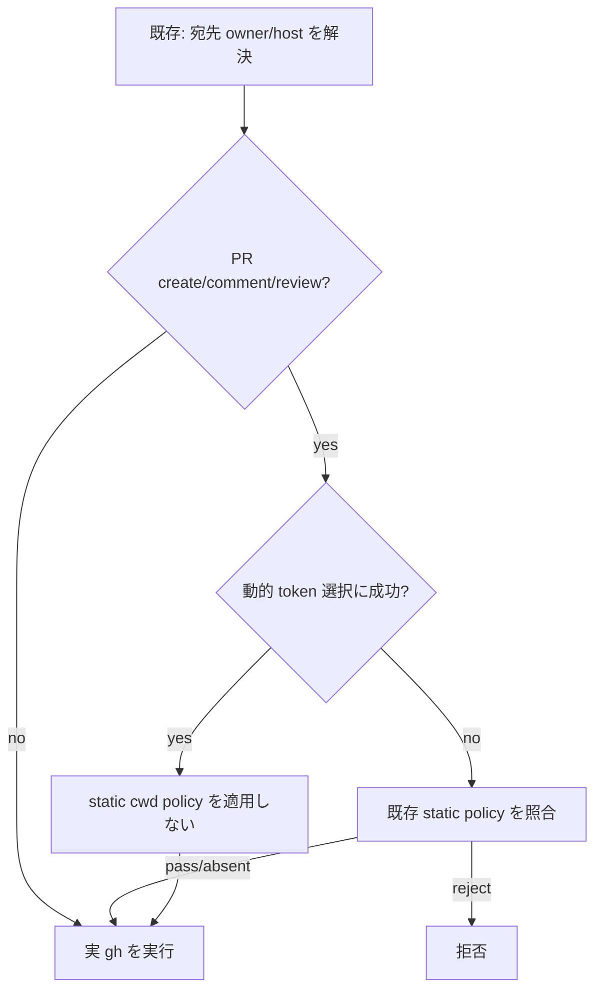

# Issue #123 — gh write-owner guard の動的アカウント選択と静的 policy の統合設計

## 結論

`proactively_select_account()` が実際に `GH_TOKEN` を選択できたときだけ、後段の `enforce_optional_pr_account_guard()` を実行しない。
選択できなかった場合は、既存どおり静的 `pr-account-policy.conf` の照合を実行する。

これにより、同じ cwd にある Claude / Codex の席を cwd 固定の role へ誤って縛らず、明示 credential、曖昧または未登録 identity、token 解決失敗に対する既存の追加拒否を残す。
repository の host / owner 宛先検査は変更しない。

## 現在の観測

- [Issue #123](https://github.com/kappaseijin/agmsg/issues/123) は open で、Claude seat が `scale_exporter` cwd の `creator=kappaseijin4codex` policy により拒否される正負対照を示している。
- `scripts/guards/gh-write-owner-guard.sh` は destination を先に fail-closed で検査した後、`proactively_select_account`、`enforce_optional_pr_account_guard`、実 `gh` の順で起動する。
- 動的 selector は unambiguous な `whoami.sh` の seat type から Claude / Codex の token を選ぶが、static guard は cwd から一つの role を選び、選択された token の login と比較する。この二つの判定軸は、複数 vendor が同じ cwd を使う運用では両立しない。
- 現行の `bats tests/test_gh_write_owner_guard.bats` は 39/39 成功した。既存 GHG-P1〜P7 は selector 単独を確認するが、static policy との衝突を再現していない。

## 設計

### 実行順と契約

`proactively_select_account()` の return status を内部契約にする。

| status | 意味 | 呼出し側の処理 |
| --- | --- | --- |
| `0` | selector が seat type に対応する token を取得し、`GH_TOKEN` を設定した | static policy を実行しない |
| `1` | 対象外 command、明示 credential、identity 未解決 / 曖昧、または token 未取得 | static policy を従来どおり実行する |

`resolve_destination` と `verify_rerun_target` は現在位置のまま完了させる。
その後の PR write path を次の形にする。

```bash
if proactively_select_account; then
  : # active seat vendor がこの invocation の account を確定した
else
  enforce_optional_pr_account_guard
fi
exec "$REAL_GH" "$@"
```

selector 内の現行の no-op `return 0` は `return 1` に置き換える。
`auth token --user` が失敗または空なら `return 1` とし、失敗を許可へ変換しない。
この return code はこの呼出し箇所だけで消費し、環境変数で bypass 状態を渡さない。

### 不変条件

1. `GH_CONFIG_DIR`、`GH_TOKEN`、`GITHUB_TOKEN` のいずれかを呼出し側が指定していれば selector は account を上書きしない。この場合は static policy が従来どおり適用される。
2. `whoami.sh` の出力が不正、`multiple=true`、未登録、または token を取得できない場合も static policy を維持する。
3. `resolve_destination` より前に account 選択を移動しない。third-party host / owner、曖昧な repository、未分類 writer は現在どおり実 `gh` を起動せず拒否する。
4. `enforce_optional_pr_account_guard` を削除しない。動的選択が成立しない既存経路の追加拒否として残す。
5. token 値をログ、README、テスト出力、Issue / PR artifact に書かない。



## 変更範囲

| ファイル | 変更 |
| --- | --- |
| `scripts/guards/gh-write-owner-guard.sh` | selector の return contract と conditional static-policy call を実装する。destination resolver、allowlist、launcher は変更しない。 |
| `tests/test_gh_write_owner_guard.bats` | dynamic/static conflict と selector 非成立時の fallback を追加し、既存の selector・owner guard 対照を維持する。 |
| `README.md` / `README.ja.md` | GitHub account routing の決定順を記載する。明示 credential は優先、未指定なら unambiguous seat type から選択、選択不能時は既存 policy で判定、と明記する。 |

インストール済み `~/.agents/skills/agmsg/` や `~/.agents/bin/gh` は、この設計 PR では直接変更しない。
source の review・merge 後に通常の approved install / migration 手順で反映する。

## 受け入れ試験

| ID | 条件 | 期待結果 |
| --- | --- | --- |
| GHG-P8 | `creator=kappaseijin4codex` の static policy がある cwd、Claude identity、token 解決成功、明示 credential なし | `pr create` は成功し、fake real-gh は Claude token で実行される。Issue #123 の陽性再現を解消する。 |
| GHG-P9 | 同じ static policy、Claude identity、token 解決失敗、明示 credential なし | static policy が拒否し、writer marker は空。selector の失敗を fail-open にしない。 |
| GHG-P1〜P7 | selector 単独の既存正負対照 | 現行の成功、明示 credential 非上書き、曖昧 identity の不選択を維持する。 |
| GHG-01 / 04 / 20 | third-party 宛先、policy 改変、resolver 失敗 | account routing の変更後も writer marker を作らず拒否する。 |
| 全 suite | `bats tests/test_gh_write_owner_guard.bats` | 全ケース成功。 |
| 静的検査 | `bash -n scripts/guards/gh-write-owner-guard.sh` と `git diff --check` | 成功。 |

実装 PR の verifier は、fake `whoami.sh` と fake real-gh のみに限定して GHG-P8/P9 を別 task context で実測する。
外部 repository への write や実 token の出力は行わない。

## 却下した案

| 案 | 却下理由 |
| --- | --- |
| static policy を常に実行する | Issue #123 の Claude seat 拒否を残す。 |
| static policy を完全に削除する | selector が成立しない既存経路の追加拒否を失う。 |
| `gh auth switch` で active account を切り替える | プロセス間で共有される可変状態となり、並行する agent の account routing を race にする。 |
| env flag で「selector 済み」を示す | 呼出し環境に依存した bypass を作る。関数 return status ならこの invocation 内だけで完結する。 |

## 実装開始条件

- 本書の設計承認後に実装へ進む。
- 実装者はまず GHG-P8 を RED にし、最小変更で GREEN にする。
- producer と別 vendor の reviewer が、exact PR head で GHG-P8/P9 と宛先 guard の負の対照を確認する。
- scale_exporter #167 への解除連絡は、PR merge と上記の独立検証後に agmsg PM から行う。Issue の存在や source-only の変更では解除しない。

## 証拠パケット

- **主張:** 問題は動的 selector の不存在ではなく、selector 成功後の static cwd policy との二重照合である。
- **根拠:** Issue #123 の正負対照、`scripts/guards/gh-write-owner-guard.sh` の `proactively_select_account` / `enforce_optional_pr_account_guard`、および current `tests/test_gh_write_owner_guard.bats`。
- **確認方法:** `GH_CONFIG_DIR=/Users/kappa/.config/gh-4codex rtk gh issue view 123 --repo kappaseijin/agmsg --json number,title,state,body,comments,url`、`bats tests/test_gh_write_owner_guard.bats`。
- **確認日時:** 2026-08-23T11:33:33+09:00。
- **未確認・限界:** scale_exporter の独立測定は Issue 本文の記録として参照した。今回の設計段階では production guard や実アカウントへの write を再実行していない。
