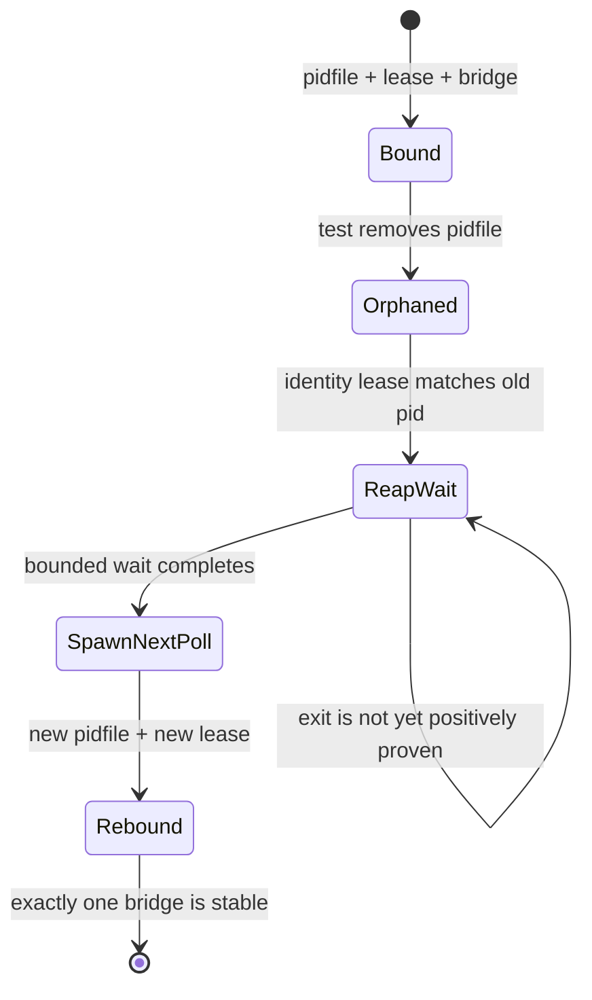

# Issue #128: codex bridge launcher の非決定的試験を状態遷移で検証する設計

## 決定

CI job の再実行、job timeout の一律延長、又は `continue-on-error` は採用しない。

`test_codex_bridge_launcher.bats` の #937、#485、#567 は同じ失敗としてまとめない。
それぞれを独立した状態遷移のテストとして直し、失敗時には pid、start token、pidfile、lease、runtime lock、process tree を出力する。

普通の bridge shutdown は、launcher が fail-closed に一度の reap wait を終えた後の次 poll で再 spawn する設計である。
したがって #937 の受入れは「任意の瞬間に count が 1」ではなく、旧 bridge の同一性を確認してから、その退出と別 identity の replacement が一つだけ安定したことにする。

現時点で launcher 本体の恒常的な二重起動又は Windows liveness 回帰は証明していない。
この設計は試験の観測不足を先に直し、残る失敗を実装不具合として切り分け可能にする。

## 確認済みの根拠

| 主張 | value | cutoff | source | command |
| --- | --- | --- | --- | --- |
| #937 は Ubuntu shard 4 で二回失敗 | attempt 1 は pidfile 削除後の `wait_role_count`、attempt 2 は削除前の singleton count で失敗 | rerun green を解消の証拠にしない | [run 32630509554 job 97172485469](https://github.com/kappaseijin/agmsg/actions/runs/32630509554/job/97172485469)、[job 97175068155](https://github.com/kappaseijin/agmsg/actions/runs/32630509554/job/97175068155) | `gh run view 32630509554 --job <id> --log-failed` |
| #485 は macOS shard 4 で一回失敗 | replacement dispatcher 後、1 秒待機した最終 count が 1 でなかった | 同じ job の rerun green を正常証明にしない | [run 32630509554 job 97172485465](https://github.com/kappaseijin/agmsg/actions/runs/32630509554/job/97172485465) | `gh run view 32630509554 --job 97172485465 --log-failed` |
| #567 は native Windows runtime leg で一回失敗 | capture file が生成されず `no bridge was started on native Windows` | local POSIX host は native `tasklist` を検証できない | [run 32636845356 job 97187815060](https://github.com/kappaseijin/agmsg/actions/runs/32636845356/job/97187815060) | `gh api repos/kappaseijin/agmsg/actions/jobs/97187815060` |
| #937 は現行 exact HEAD でローカル再現 | 無変更 focused run で 8 回中 1 回失敗。一時観測では `initial_role_count=1` の後に `final_role_count=0` を複数回観測し、bridge pid/lease は無く role-child は生存 | 一時観測のコードは完全に撤去済み | `tests/test_codex_bridge_launcher.bats`、`codex-bridge-launcher.sh` | `bats --filter 'reaps a same-\\(project,role\\) orphan' ...` |
| CI shard 内で Bats file を並列実行していない | shard job は `xargs bats` を一回起動する。競合するのは test が起動する dispatcher、role-child、bridge である | matrix job 間で run directory は共有しない | `.github/workflows/tests.yml` | `rg -n -C 8 'xargs bats|Run bats suite' .github/workflows/tests.yml` |
| launcher の再 spawn は意図的に複数段階 | orphan reaper は PID identity を確認して kill し、正常終了を同一 pass で exit 証明と扱わず、timeout 後の次 poll で spawn する | `count == 1` だけでは reaper 実行を証明しない | `scripts/drivers/types/codex/codex-bridge-launcher.sh` | `sed -n '479,536p;700,800p' scripts/drivers/types/codex/codex-bridge-launcher.sh` |

`_wait_role_count` は最初の `count == want` で loop を抜け、最後にもう一度 count するだけである。
pidfile を消した直後に旧 bridge がまだ 1 本なら、reaper が未実行でも成功する。
一方で reaper の途中なら 0 本を観測できる。
この二つを同じ「converging to one」の成功・失敗に混ぜていることが、#937 の試験設計上の原因である。

## 対象状態

`Bound -> Orphaned -> ReapWait -> SpawnNextPoll -> Rebound` を一試験が観測する。
どの状態にいるかを出さずに count だけを読むことをやめる。

## 実装方針

### PR 1 — #937 orphan reaper の遷移テスト

`tests/test_codex_bridge_launcher.bats` の #937 本体を次の順に変更する。

1. 初期 bridge の pidfile、PID、lease、start token を取得し、同じ identity の bridge が連続 2 sample で 1 本であることを確認する。
2. pidfile だけを削除する。
3. 旧 PID が生存し続けていないことを待ち、同じ PID を新 bridge と誤認しないよう new pid 又は start token の変化を要求する。
4. replacement の pidfile、lease、thread、app-server が揃い、旧 PID と異なり、正確に 1 本が連続 3 sample で維持されることを確認する。
5. deadline は launcher の上限（reap wait 5 秒、backoff 最大 2 秒、次 poll の spawn）から導き、親 process はその deadline より長く生かす。初期値は 15 秒とし、失敗ログを得ずに延長しない。

失敗時は old/new PID と start token、pidfile/lease/rate marker、dispatcher と role-child の pid/ppid/stat、elapsed time を出す。
一時の `AGMSG_TEST_*` trace はこの failure output を作るためだけに使い、通常の production runtime へ書き込まない。

負の対照は、foreign host、malformed lease、pair-set mismatch、legacy lease 無しの bridge を reaper が殺さず replacement も開始しない既存の fail-closed tests とする。

### PR 2 — #485 replacement dispatcher の安定性テスト

replacement dispatcher の起動を観測してから、独立 role-child root が 1 つだけであることを連続 sample で確認する。
現在の `sleep 1; count == 1` は固定遅延であり、macOS runner の lock reclaim 又は child exit 遅延を説明できない。

failure output は dispatcher A/B、role-child root とその descendant、child runtime lock の owner、parent liveness を含める。
per-role lock を無効化した対照では独立 child root が 2 本になることを確認し、test が実際に duplicate-prevention を検査していることを示す。

### PR 3 — #567 native Windows lifecycle harness

native Windows test は `sleep 6` の親を同期的に待ってから capture file を 3 秒だけ確認する形をやめる。
親は test deadline より長く生かし、launcher は background で起動し、capture を deadline まで poll してから launcher と親を明示 cleanup する。

failure output は MSYS parent PID、`tasklist` result、local pid probe result、dispatcher/role-child start event、bridge exec event、capture path を残す。
これは tasklist stub の POSIX test を置き換えず、real tasklist / real MSYS PID space の native acceptance を維持する。

## retry と timeout の方針

| 選択肢 | 方針 | 理由 |
| --- | --- | --- |
| CI workflow retry | 不採用 | rerun green は失敗した状態遷移を観測していないため、原因を隠すだけになる。 |
| job timeout 延長 | 不採用 | 各 failure は job cap ではなく test assertion failure である。 |
| `continue-on-error` | 不採用 | required check の安全境界を弱める。 |
| state-aware test deadline | 採用 | product の bounded reaper/backoff contract に対応し、timeout 時に状態を識別できる。 |
| failure-only diagnostics | 採用 | passing CI の雑音を増やさず、次の red を原因分類できる。 |

## 受入れ条件

| PR | 受入れ条件 | 必須の負の対照 |
| --- | --- | --- |
| 1 | #937 が old identity の退出、別 replacement identity、stable singleton を示す | malformed/foreign/legacy lease は kill も replacement もしない |
| 2 | #485 が replacement dispatcher 後に独立 child root 一つを複数 sample で示す | per-role lock 無効化で二重 root を検出する |
| 3 | Windows runtime が real tasklist 下で bridge capture を deadline 内に示す | parent を tasklist が見失う stub path と native path を混同しない |

各 PR は一つの主張だけを扱う。
PR 1 が受入れられるまで launcher production logic を変更しない。
PR 2 と PR 3 も、それぞれの failure-only diagnostics が新しい red を分類できる状態にしてから production fix の要否を判断する。

## 非対象

- `codex-bridge-launcher.sh` の reaper、lock、liveness の production semantics 変更
- Bats shard 数、runner OS matrix、required check の変更
- GitHub Actions retry、job timeout、`continue-on-error` の追加
- CI green rerun を Issue #128 解決の根拠にすること
