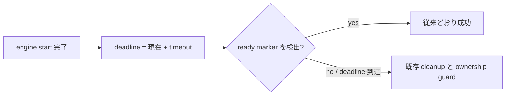

# Issue #88: sync start ready wait deadline

## 主張

`scripts/remote.sh` の `cmd_sync_start()` にある ready marker 待ちを、反復回数ではなく実時間 deadline で終了させる。

今回の PR はこの主張だけを扱い、未ready時の cleanup と engine ownership の fail-closed 挙動は変更しない。

## 契約

| 項目 | 決定 |
| --- | --- |
| 既定値 | `16` 秒 |
| 上書き | `AGMSG_REMOTE_SYNC_READY_TIMEOUT_S`。正の整数秒を受け付ける |
| 開始点 | engine start が完了し、registry lock を解放した直後 |
| 終了条件 | deadline 到達前に当該 startup nonce の ready marker を検出できなければ、既存の未ready cleanup へ進む |
| 維持する範囲 | pid ownership の確認、cleanup の lock 再取得、ready marker の nonce 検証、成功時の出力 |

## 検査

1. RED: ready marker を出さない fake engine が、上書き値の deadline 近傍で終了し、未ready cleanup が実行されること。旧実装の 1600 反復では上書き値を無視して長く待つため失敗する。
2. GREEN: 正常 fake engine が ready marker を出し、同じ deadline 上書き値の範囲で従来どおり成功すること。
3. `git diff --check` と対象 Bats を実行する。実機 CI の macOS runner 状態や Issue の close はこの PR の受入条件に含めない。

## 今回扱わない範囲

- `remote-sync.mjs` の再試行仕様
- CI retry / timeout 設定
- Issue #88 の close 判定
