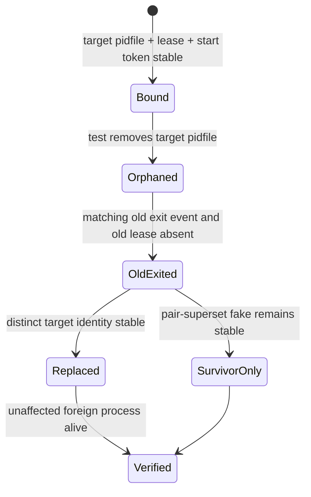

# Issue #151: #937 survivor tests の状態待機を実時間 deadline 化する設計

## 決定

`tests/test_codex_bridge_launcher.bats` の #937 helper と残る 4 ケースを、
回数ベースの待機から、旧 identity の退出と終状態を確認する実時間 deadline 待機へ置換する。
production の `codex-bridge-launcher.sh`、GitHub Actions の retry / timeout、#485 / #567、
watch-once は変更しない。これは「#937 の survivor test が state transition を正しく観測し、
runner 負荷で待機時間が無制限に延びない」という一つの tests-only 主張である。

現行の `_wait_role_count` は `count == want` を一度見たら成功し、最大 100 回の
`sleep 0.1` に依存する。pidfile 削除直後には、old bridge がまだ 1 本でも成功できる。
また負荷時には 100 回が 10 秒を超えて伸び、別ケースの assertion failure として現れる。
count は終状態を補助する値に限定し、reap 自体の成功条件には使わない。

## 根拠

| 主張 | value | cutoff | source | command |
| --- | --- | --- | --- | --- |
| 同一 HEAD で #937 の失敗行が変動する | Ubuntu line 1060 / 1088、macOS line 1102 | rerun の green を解消根拠にしない | Issue #151 | `gh issue view 151 --json body` |
| 4 survivor case は同じ helper を使う | lines 1060, 1074, 1088, 1102 | test 名だけの一致を同一原因と扱わない | `tests/test_codex_bridge_launcher.bats` | `rg -n '_wait_role_count' tests/test_codex_bridge_launcher.bats` |
| 既存 #128 の first #937 test は identity/exit/replacement を観測する | pidfile + lease + start token、old exit event、stable replacement | count-only を reaper 実行の証明と扱わない | `docs/decisions/2026-08-23T230831_issue-128-launcher-flake-design.md`、同 test | `sed -n '850,1105p' tests/test_codex_bridge_launcher.bats` |
| watch-once は既に run 開始時からの deadline を使う | `_AGMSG_WO_START + TIMEOUT` と残時間 sleep | watch hang の観測だけで #151 と因果関係を結ばない | `scripts/drivers/types/codex/watch-once.sh:99-155` | `sed -n '95,160p' scripts/drivers/types/codex/watch-once.sh` |

programmer が報告した watch-once test409 hang の artifact / test 名は、この設計時点では取得できない。
過去の hang forensics にある `test_watch.bats` の別ケースは nested watcher / agent PID 探索の観測であり、
`_wait_role_count` を経由しない。従って Issue #151 の実装へ混ぜず、artifact が得られたときに別途 root cause を判定する。

## 状態と deadline

テスト開始時に `deadline_epoch = $(date +%s) + 15` を一度だけ作る。
15 秒は launcher の reap wait 5 秒、最大 poll/backoff 2 秒、state snapshot と runner slack 8 秒から導く。
各 wait は loop 回数ではなく毎回 `date +%s` を照合し、deadline を過ぎたら失敗する。
親 process は deadline より少なくとも 15 秒長く生かす。連続 3 sample は「安定」の状態定義であり、
待機上限ではない。sample の途中でも deadline を再確認する。

## 実装設計

1. `_wait_role_count` を削除する。`for i in {1..80}`、`{1..100}`、`seconds * 10` で終了を決める
   #937 helper も、絶対 deadline を受け取る形へ置き換える。
2. pidfile・lease・lease 内 pid・start token が一致する target identity を連続 3 sample で確定する。
   この初期状態は role count を 1 と仮定しないため、same-project pair-superset fake を持つケースでも使える。
3. pidfile を消した後、対象 old identity の exit event と old lease の消滅を待つ。これが reaper が実行された
   必須条件であり、count が一時的に 1 であることでは代替しない。
4. OTHER role、other project、prefix-colliding role の 3 ケースでは、old と pid 又は start token が異なる
   target replacement を連続 3 sample で確認し、同時に target role count が 1 であること、foreign fake PID が
   3 sample 生存することを要求する。
5. pair-superset case では、old target の exit 後に direct fake PID（pairs `{alice,bob}`）が 3 sample 生存し、
   target role count が 1 であることを要求する。replacement を期待しない。この分岐を他の 3 ケースと混同しない。
6. failure-only diagnostics は test 名、elapsed/deadline、old/new identity、last count、pidfile、lease、mock exit event、
   fake survivor PID の liveness、runtime lock、関連 process tree を出す。既存 `_diagnose_937_failure` をこの情報で拡張する。

## 検証設計

| 種別 | control | 期待結果 |
| --- | --- | --- |
| 正の対照 | #937 の 4 survivor case を focused 実行 | それぞれ old exit と、replacement 又は survivor-only の固有終状態を deadline 内に示す |
| 既存状態対照 | 最初の `reaps a same-(project,role) orphan ... converging to one` | old/new identity の遷移を維持し、共通 deadline helper でも pass |
| 負の対照 | dispatcher を起動せず live old bridge の identity を渡す #151 専用 case | count が既に 1 でも old exit event が無いため deadline で non-zero、fake は生存 |
| mutation | old-exit predicate を count-only success に一時変異 | 負の対照が success して Bats assertion が **KILLED**。state predicate を削っても green になる偽陰性を防ぐ |

通常環境の正の対照は `/bin/bash` と supported `bash` の双方で実行する。
deadline の負の対照では 1 秒の短い deadline を使い、test suite の遅延を増やさない。
full file の実行、`git diff --check`、変更対象が `tests/test_codex_bridge_launcher.bats` とこの decision record のみであることも確認する。

## 非対象と順序

- production launcher の reap / lock / spawn semantics
- #485 replacement dispatcher、#567 native Windows lifecycle、CI matrix、workflow retry、job timeout
- watch-once test409 の hang 修正（artifact 未取得で #151 との接続根拠なし）

programmer は、最初に #151 専用の negative control を現行 helper で RED として記録し、
次に shared deadline/state helper と 4 survivor case を実装する。
新しい red が production defect を示す場合は、この tests-only PR に production fix を追加せず、
diagnostics と固定 HEAD を添えた別 Issue / PR に分離する。
