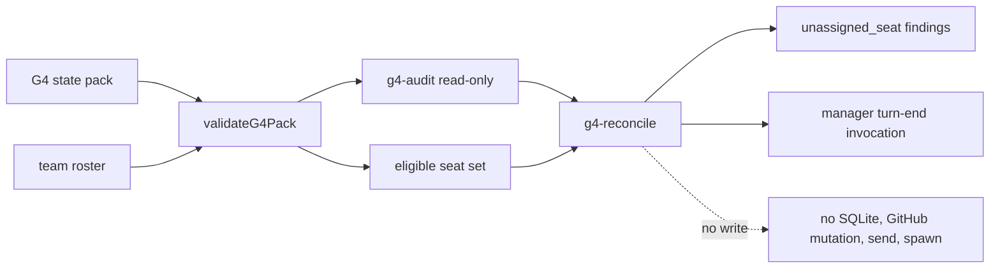

# Issue #210: G4 closeout reconcile の設計

## 決定

`team-work.sh g4-reconcile <team> <g4-state-pack.json>` を追加する。

このコマンドは、G4 state pack の既存の read-only audit と、チーム roster 全体との所有者集合差分を一回の closeout 検査として出力する。

検査対象の seat は、roster の `kind: seat` であり、かつ role が `manager` または `pm` ではない seat に限定する。

`human`、`service`、manager、pm は Issue owner を持たないことが正常なので、未割当として出力しない。

対象 seat が G4 entry の `ownerSeat` に一つも現れなければ、`unassigned_seat` finding を一件出力する。

`blocked` entry は blocker を持つ割当済み work と数える。

未割当の finding は seat 名で安定ソートする。

既存 `reconcile` の contract-pack 入力と SQLite 読み書きは変更しない。

manager の turn-end entrypoint は、manager が終端時に明示実行するこのコマンドとする。

`CodexBridge.onTurnEnded` への自動実行は追加しない。

bridge hook は配信監視を再 arm する vendor 固有の経路であり、G4 の closeout 判定をそこへ混ぜると read-only 検査を暗黙の自動運用へ変えてしまうためである。

## 根拠

| value | cutoff | source | command |
| --- | --- | --- | --- |
| 既存 `seatStatuses` は contract pack の `workItems[].ownerSeat` 集合だけを反復し、roster にだけ存在する seat を観測しない。 | #210 の未割当 seat 検出要件 | `scripts/lib/team-work-reconciler.js:203-211` | `codebase-memory search_graph/get_code_snippet` |
| `g4-audit` は G4 pack を validate して GitHub を read-only 走査し、coverage と blocker predicate から `classificationBasis` を作る。 | #210 の state-pack 入力要件 | `scripts/lib/g4-audit.js:425-530` | `codebase-memory get_code_snippet` |
| `team-work.sh g4-audit` は SQLite を初期化も open もせず、roster JSON を stdin で渡す。 | read-only 境界 | `scripts/team-work.sh:35-43,137-151` | `codebase-memory get_code_snippet` |
| scale_exporter #126 の AC-3 は、manager turn end で未割当 seat と理由不明 block を検出することを求める。 | 上流受入条件 | [scale_exporter #126](https://github.com/kappaseijin/scale_exporter/issues/126) | `gh issue view 126 --repo kappaseijin/scale_exporter` |

## 構成



`g4-reconcile` は `g4-audit` module の新しい exported entrypoint へ route する。

shell dispatcher は `g4-audit` と同じ read-only case に置き、storage helper を source しない。

entrypoint は roster JSON と G4 pack を `validateG4Pack` へ渡してから `runAudit("g4-reconcile", ...)` を呼ぶ。

この順序により、invalid pack を部分解釈して健康と誤判定する経路を作らない。

## CLI と出力契約

```text
team-work.sh g4-reconcile <team> <g4-state-pack.json>
```

成功時は JSON object を stdout に一つだけ出す。

出力は既存 G4 audit の digest と分類根拠を残し、additive な reconcile 情報を持つ。

```json
{
  "schemaVersion": 1,
  "command": "g4-reconcile",
  "team": "example",
  "packDigest": "sha256:...",
  "coverageDigest": "sha256:...",
  "auditDigest": "sha256:...",
  "classificationBasis": {"status": "complete"},
  "findings": [
    {"code": "unassigned_seat", "seat": "example_programmer_codex"}
  ]
}
```

`findings` が空で、`classificationBasis.status` が `complete` または `quiescent` のときだけ closeout 上 healthy と判断できる。

`classificationBasis.status: unknown` は valid JSON output であっても healthy ではない。

reasonless block は既存 `validateEntry` が blocked entry の `reasonCode` と `releasePredicate` を必須にして reject する。

したがって reasonless block の入力は exit 2 とし、partial finding や healthy output を返さない。

## 変更箇所

| path | change |
| --- | --- |
| `scripts/team-work.sh` | `g4-reconcile` の引数検証と、SQLite 非依存の `g4-audit.js` route を追加する。 |
| `scripts/lib/g4-audit.js` | roster から eligible seat を導出し、owner set との差分を stable な `unassigned_seat` finding として加える。 |
| `tests/test_g4_audit.bats` または専用 Bats file | CLI、read-only、分類、集合差分の受入テストを追加する。 |
| `tests/helpers/g4-fixtures.bash` | manager、pm、service、割当済み seat、未割当 seat を分離できる fixture を追加する。 |
| `README.md` | manager の turn-end 手順、入力、出力、exit code、非作用範囲を自己完結で追記する。 |

## 受入テスト

1. manager、worker A、worker B、service を含む roster と、worker A だけが `ownerSeat` の valid G4 pack では、worker B だけが `unassigned_seat` になることを確認する。

2. manager、pm、service が entry を持たない同じ fixture では、それらを finding に含めないことを確認する。

3. worker B が `blocked` entry の owner である fixture では、worker B を未割当と誤報しないことを確認する。

4. `reasonCode` または `releasePredicate` を一つだけ除いた blocked entry は exit 2 で失敗し、stdout に healthy JSON を出さないことを確認する。

5. GitHub source failure による `unknown` 分類はそのまま出力し、healthy へ丸めないことを確認する。

6. owner set の差分計算を削除する mutation は、worker B を期待するテストで `KILLED` になることを確認する。

7. read-only command 実行前後で SQLite file を作らず、GitHub mutation、send、spawn を呼ばないことを確認する。

## 非対象

scale_exporter の state pack、Issue state、ラベル、assignee は変更しない。

既存 contract-pack の `reconcile`、dispatch、watchdog、claim の意味は変更しない。

G4 entry を自動作成、再割当、ready 化、blocked 化しない。

GitHub write、SQLite write、agmsg send、agent spawn を追加しない。

## 引き渡し

この設計の review 合格後、programmer は単独の implementation PR で上記 path と受入テストを実装する。

Issue #211 の ready から blocked への遷移設計は別 PR で扱い、この変更へ混在させない。
