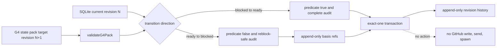

# Issue #211: G4 ready-to-blocked transition の設計

## 決定

既存の `team-work.sh g4-transition` に ready から blocked への re-block 分岐を追加する。

CLI の引数数、manager 認可、expected revision、SQLite の単一更新、revision history trigger は変更しない。

既存 blocked から ready への release 分岐は意味を変えない。

re-block は current が `ready`、target pack entry が `blocked` である場合にだけ許可する。

target blocker は既存 validator を通過しなければならない。

target blocker の `releasePredicate` は transition 時点で `false` でなければならない。

`true` の predicate は既に release 可能なので re-block を reject する。

`unknown` の predicate は再 block の根拠にならないので fail-closed で reject する。

source、ownerSeat、workKinds は両方向で immutable とする。

re-block では basis refs の append-only 拡張だけを許可する。

current basis refs は target basis refs の厳密な prefix でなければならない。

既存 reference の削除、並べ替え、書換えは `immutable_mismatch` で reject する。

これは ready 化後に観測された新しい blocker evidence を足せるようにしつつ、既存の判断根拠を失わせないためである。

## 根拠

| value | cutoff | source | command |
| --- | --- | --- |
| 現在の guard は current `blocked` と target `ready` だけを許可する。 | #211 の ready-to-blocked gap | `scripts/lib/g4-ledger.js:430-608` | `codebase-memory get_code_snippet` |
| 現在の transition は manager、revision、source、owner、workKinds、basis identity、audit、predicate を検査し、`BEGIN IMMEDIATE` transaction 相当の exact-one update を行う。 | 既存の safety contract を維持する | `scripts/lib/g4-ledger.js:430-608` | `codebase-memory get_code_snippet` |
| `g4-audit` は false blocker predicate を `blocked_predicate_false` reason として `unknown` に分類する。 | re-block を audit status だけで一律 reject できない理由 | `scripts/lib/g4-audit.js:425-530` | `codebase-memory get_code_snippet` |
| `g4-transition` は SQLite store を使う明示的 mutating command である。 | read-only #210 との責務分離 | `scripts/team-work.sh:35-43,153-161` | `codebase-memory get_code_snippet` |

## 構成



## CLI と状態遷移契約

```text
team-work.sh g4-transition <team> <g4-state-pack.json> <repository> <issue-number> <expected-revision> <manager-seat> <evidence>
```

入力 pack 内の対象 entry は `expected-revision + 1` を持たなければならない。

成功出力の command は既存どおり `g4-transition` とする。

成功出力へ additive な `transitionKind` を加え、値は `release` または `reblock` とする。

| current | target | predicate | audit | basis | result |
| --- | --- | --- | --- | --- | --- |
| blocked | ready | current blocker が true | complete かつ contract 一致 | 完全一致 | release |
| ready | blocked | target blocker が false | reblock-safe | current refs が target refs の strict prefix | reblock |
| ready | blocked | true または unknown | 任意 | 任意 | reject |
| blocked | ready | true 以外 | 任意 | 任意 | reject |
| その他 | 任意 | 任意 | 任意 | 任意 | `unsupported_transition` |

`reblock-safe` は coverage と contract digest が一致し、source failure、coverage mismatch、unknown entry、predicate unknown を含まない audit と定義する。

audit が `unknown` でも、理由が target を含む declared blocked entry の `blocked_predicate_false` だけなら re-block には利用できる。

この狭い例外以外の `unknown` は `audit_incomplete` として reject する。

Issue #209 が検討する `transition_required` と `quiescent` の分類語彙は、この Issue では変更しない。

## 実装詳細

`transitionG4` は current と target の state で分岐し、共通の入力、manager、revision、target、storage、source、owner、workKinds 検査を先に完了する。

release branch は既存の exact basis identity、current blocker、complete audit、predicate true を保持する。

re-block branch は target blocker を `evaluatePredicate` し、false 以外を `predicate_not_false` で reject する。

re-block branch は `auditSupportsReblock(audit, contract, target)` を新設し、上記の `reblock-safe` 条件だけを許可する。

`basisExtends(current.basis, target.entry.basis)` を新設し、canonicalized refs の exact prefix を検査する。

re-block SQL は `state = 'blocked'`、`blocker_json = target blocker`、`basis_json = target basis`、revision、digest、evidence、actor、timestamp、`last_action = 'g4-reblock'` を更新する。

WHERE clause は team、source、current `ready`、expected revision、owner、workKinds、old basis、old entry digest をすべて比較する。

`changes() = 1` guard と snapshot trigger を既存 release branch と同じ transaction 内で使う。

競合、stale revision、外部更新は partial write を残さず `transition_conflict` または `revision_mismatch` へ fail-closed する。

## 変更箇所

| path | change |
| --- | --- |
| `scripts/lib/g4-ledger.js` | direction dispatch、reblock audit predicate、append-only basis check、exact-one reblock update、`transitionKind` output を追加する。 |
| `tests/test_g4_transition.bats` | release regression と re-block の positive、negative、mutation テストを追加する。 |
| `tests/helpers/g4-fixtures.bash` と必要な audit fixture | false、true、unknown predicate と basis append を一変数ずつ表す fixture を追加する。 |
| `README.md` | 同じ command が二方向を扱うこと、re-block precondition、拒否条件、非作用範囲を自己完結で説明する。 |

SQLite schema migration は不要である。

既存 `team_work_g4_current` は blocker、basis、revision、digest、action、actor を記録し、snapshot trigger は更新後の state を revision history に保存する。

## 受入テスト

1. ready revision 1 の current と、false `issue_closed` predicate を持つ blocked revision 2 target で、manager が re-block できることを確認する。

2. 成功後の current が blocked revision 2、target blocker、append された basis refs、`last_action: g4-reblock` を持ち、history が一件だけ増えることを確認する。

3. current basis refs に target が一件追加した positive control と、削除、並べ替え、既存 ref 書換えを一つずつ行う negative control を分離する。

4. target predicate の true と unknown は、それぞれ nonzero exit と no current mutation と no history increment を返すことを確認する。

5. stale expected revision、wrong manager、owner change、workKinds change、coverage mismatch、source failure は、それぞれ no mutation で reject することを確認する。

6. existing blocked-to-ready fixture は同じ output semantics で成功し、release branch の回帰がないことを確認する。

7. `predicate_not_false` guard を除く mutation と WHERE の current state constraint を除く mutation は、対応する negative test で `KILLED` になることを確認する。

8. command 実行中に GitHub write、agmsg send、agent spawn を実行しないことを確認する。

## 非対象

Issue #209 の G4 audit 分類変更は実装しない。

G4 state pack を scale_exporter 側で更新しない。

Issue state、label、assignee、GitHub comment を変更しない。

automatic re-block、read-only `g4-reconcile`、dispatch、claim、watchdog を変更しない。

## 引き渡し

この設計の review 合格後、programmer は Issue #210 と混在しない単独 implementation PR で実装する。

実装前に Issue #209 の live state を再確認するが、#209 の未完了を re-block 実装の blocker と扱わない。
