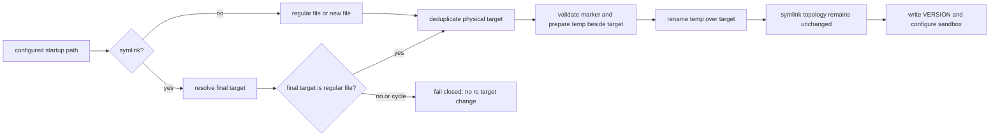

# Issue #219: dotfiles symlink を保持する gh owner guard PATH activation

## 決定

`install.sh --update` と通常 install は、`~/.zshrc`、`~/.bashrc`、実効 Bash login file がシンボリックリンクでも、**最終到達先が通常ファイルなら** gh owner guard の管理 block をその到達先へ更新する。

リンク自身を置換しない。

symlink の最終到達先が存在しない、通常ファイルでない、循環している、または marker が malformed の場合は、従来どおり fail-closed で nonzero を返す。

`--skip-path-activation` は追加しない。

この変更により、dotfiles 管理下の通常ファイルでは guard activation、`VERSION` 更新、`configure_codex_sandbox` まで完走する。

## 問題と原因

`install_gh_owner_guard_path_activation` は `install_gh_owner_guard` から呼ばれる。

現行実装は startup file が存在する場合に `[ -L "$file" ] || [ ! -f "$file" ]` を拒否条件にしている。

そのため、通常ファイルを指す `~/.bashrc` の symlink も、内容を読む前に拒否される。

`install.sh` は `set -euo pipefail` で動作するため、この nonzero は update flow を停止する。

`VERSION` 書込みと `configure_codex_sandbox` は `install_gh_owner_guard` の後なので実行されない。

## 一次資料

| value | cutoff | source | command |
| --- | --- | --- | --- |
| `origin/main = 3061ff0bd06ed7b998c579c2c8345d19bc9b89bb` | この設計の固定対象 | `kappaseijin/agmsg` | `git fetch origin --prune; git rev-parse origin/main` |
| symlink fixture: `rc=1`、link は保持、`VERSION` は未更新 | Issue の失敗を再現する | disposable fake HOME | `HOME=fixture-home PATH=fake-gh-bin ./install.sh --update` |
| regular-file control: `rc=0` | fixture が update 成功を検出できる | disposable fake HOME | 同一 fixture 手順で `.bashrc` を通常ファイルにする |
| symlink を non-regular として拒否する | 原因を入口条件に限定する | `install.sh:414-420` | `git show 3061ff0:install.sh` |
| update の `VERSION` と sandbox は activation の後 | 停止が後続処理を飛ばすことを確認する | `install.sh:780-784` | `git show 3061ff0:install.sh` |
| uninstall も symlink を無条件拒否する | lifecycle も同時に直す必要がある | `uninstall.sh:89-94` | `codebase-memory get_code_snippet remove_gh_owner_guard_path_activation` |
| 既存 install test は temporary HOME、guard activation、idempotence、malformed marker を対象にする | 既存テストへ追加する位置を確定する | `tests/test_install.bats` | `sed -n '1,180p' tests/test_install.bats` |

普通の `.bashrc` を正対照にしても symlink 拒否を再現できない。

したがって、symlink fixture を必須の正対照にする。

## 採用方式

### 1. portable な最終到達先の解決

installer と uninstaller は同じ startup-file resolution 契約を使う。

入力 path が symlink のとき、`readlink` を一段ずつたどり、相対 target はその symlink の物理 directory を基準に解決する。

各段階で parent directory は物理 path に正規化する。

最終 target は通常ファイルでなければならない。

symlink chain の上限は 40 hop とする。

上限超過、`readlink` 失敗、dangling target、directory、FIFO、device、socket はすべて resolution failure とする。

macOS の Bash 3.2 をサポートするため、`readlink -f`、`realpath`、associative array、Python には依存しない。

新規作成する startup file は symlink 解決を行わず、既存どおり configured path 自身を target とする。

### 2. target 単位の preflight と更新

configured path と resolved target を別に保持する。

marker state の判定、`cp -p`、temporary file、final `mv` は resolved target に対して行う。

temporary file は target と同じ directory に作る。

最終 `mv` も target に行うため、configured path の symlink inode と link text は不変である。

複数の configured startup path が同一 target を指す場合は、canonical path または既存 file の同一性で一つに集約する。

この集約により、`.bashrc` と login file が同一 dotfile を指しても marker block は一組だけになり、同じ target を二度 rename しない。

全 unique target の resolution と marker preflight が成功するまで、helper、target、link を変更しない。

helper と launcher の ownership checks、marker malformed の fail-closed 契約、通常ファイルと新規 file の挙動は変えない。

### 3. uninstall の対称性

`uninstall.sh` の `remove_gh_owner_guard_path_activation` も同じ resolver と unique-target 集約を使用する。

valid marker は resolved target から除去し、symlink を置換しない。

resolution または marker validation が失敗した場合は、helper と launcher を消さず nonzero にする。

これにより、新しい installer が作った symlink-aware integration を uninstall が拒否して残す不整合を防ぐ。

## `--update` の結果契約

| startup path の状態 | activation | update の終了 | `VERSION` / sandbox |
| --- | --- | --- | --- |
| 通常ファイル | 従来どおり block を target へ書く | 0 | 更新・実行する |
| 通常ファイルを指す symlink | 最終 target へ block を書き、link は保持する | 0 | 更新・実行する |
| 新規 file | 従来どおり configured path を作る | 0 | 更新・実行する |
| dangling / cycle / non-regular target | 書かない | nonzero | 更新・実行しない |
| malformed marker | 書かない | nonzero | 更新・実行しない |

non-regular target で update を成功扱いにして version だけ更新することはしない。

guard の名前解決を検証できない状態を「更新完了」と表示すると、PATH activation が有効でないのに installer が完了したように見えるためである。

## 受入テスト

1. fake HOME で初回 install を成功させた後、`.bashrc` を **相対 symlink** に交換し、その最終 target を通常ファイルにする。`install.sh --update` は 0、link の `readlink` 値と `test -L` は不変、最終 target の marker pair は各一組、`VERSION` は source revision、出力は `Update complete` になることを確認する。

2. 同じ test を二回 update し、target の marker 数、helper digest、link text が変わらないことを確認する。

3. `.zshrc`、`.bashrc`、実効 login file が同一 target を指す fixture で、target に block が一組だけになることを確認する。これは target deduplication の正対照である。

4. dangling link、directory target、40-hop 超過 chain の各 fixture は nonzero を返し、symlink と最終 target を変更せず、事前の `VERSION` を維持することを確認する。

5. symlink-aware install 後の `uninstall.sh --yes` は target から block を除去し、link の種別と link text を保持し、helper と launcher を従来どおり除去することを確認する。

6. malformed marker、user-owned launcher、user-owned helper の既存 failure tests は維持する。symlink target 内の malformed marker も同じ nonzero・無変更契約を確認する。

7. mutation として resolver の symlink support を外す、または final rename を configured link path へ戻す。前者は update-success assertion、後者は `test -L` assertionでそれぞれ `KILLED` になることを確認する。

すべて disposable fake HOME と fake `gh` だけを使う。

実 user の dotfiles、実 PATH、GitHub write は検証対象にしない。

## README への反映

`README.md` の Update 節を実装 PR で更新する。

`./install.sh --update` は shell startup file が dotfiles symlink でも、最終 target が通常ファイルなら link を保持して agmsg 管理 block を更新することを記載する。

target が解決不能、非通常ファイル、または marker malformed のときは、installer が nonzero で停止し、`VERSION` を成功扱いで更新しないことも記載する。

新規 option はないため、README の command syntax は変えない。

README には shell 設定を手動で外す回避策を載せない。

通常の `./install.sh --update` が dotfiles 管理を壊さず完走することが利用者向け契約である。

## 変更範囲

| path | 変更 |
| --- | --- |
| `install.sh` | startup path resolver、target-level preflight/deduplication、target への atomic rename を追加する。 |
| `uninstall.sh` | 同じ resolution/deduplication 契約で marker を target から除去する。 |
| `scripts/lib/` | installer と uninstaller が共有する、Bash 3.2 互換の resolver を追加する。 |
| `tests/test_install.bats` | symlink success、relative target、duplicate target、non-regular failure、uninstall、mutation を追加する。 |
| `README.md` | Update 節へ symlink support と fail-closed 境界を追加する。 |

`gh-write-owner-guard.sh` の account/repository authorization、PATH helper の prepend algorithm、Issue #209、exflow_api の退避作業は変更しない。

## 不採用案

| 案 | 不採用理由 |
| --- | --- |
| symlink を無条件に拒否したまま `--skip-path-activation` を追加する | 実際の dotfiles 利用者に毎回 manual bypass を要求し、guard activation の保証を option 利用へ後退させる。 |
| symlink を見たら activation だけ自動 skip して update を 0 にする | guard が PATH から選ばれない状態を `VERSION` 更新で隠す。Issue #214 の安全目的と逆行する。 |
| configured symlink path へ temporary file を rename する | `mv` が symlink を通常ファイルへ置換し、dotfiles 管理を破壊する。 |
| symlink target を `$HOME` 配下に制限する | dotfiles target は明示的な startup link を通じて利用者が選んだものであり、外部の dotfiles repository を不必要に拒否する。 |
| `readlink -f` / `realpath` を使う | macOS の標準環境と Bash 3.2 対応を失う。 |

## 引き渡し

この設計の formal review 合格後、`agmsg_programmer_codex` は Issue #219 だけを含む implementation PR を作成する。

implementation PR は README 更新を同じ PR に含める。

architect は実装、PR 作成、formal review を行わない。
