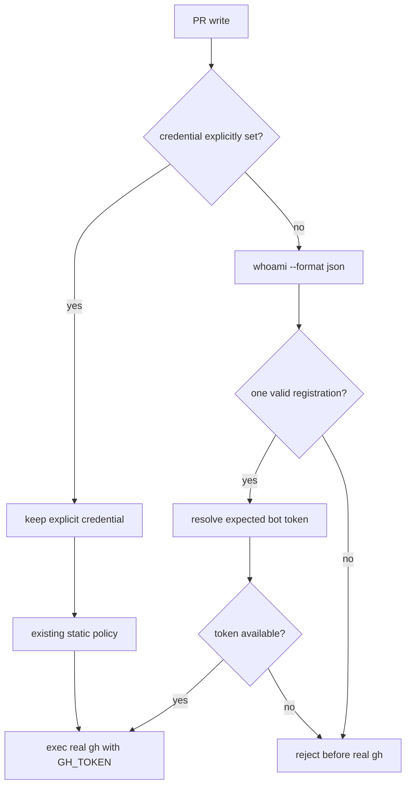

# Issue #221: non-exact whoami identity での gh account fallback を停止する

## 決定

account を自動選択する PR write（`pr create`、`pr comment`、`pr review`）では、caller が credential を明示していない場合、**ちょうど一つの agmsg registration を解決できたときだけ** bot account token を設定して実行する。

`multiple=true`、`suggest=true`、`not_joined=true`、whoami 実行失敗、malformed output、unsupported runtime、expected bot token 未取得はすべて account-resolution failure とする。

account-resolution failure は `enforce_optional_pr_account_guard` へ fallback せず、real `gh` を実行する前に nonzero で停止する。

caller が `GH_CONFIG_DIR`、`GH_TOKEN`、または `GITHUB_TOKEN` を明示した経路は既存どおり上書きしない。

その明示経路では既存の static `pr-account-policy.conf` を適用する。

これは reviewer が当面 `GH_CONFIG_DIR=~/.config/gh-4claude` を明示して作業する回避策を保つ。

`whoami.sh` の human output は UI 契約として維持する。

guard の機械判定は `whoami.sh --format json` の registration array を用い、同じ agent 名でも registration が複数なら曖昧として拒否する。

## 事象と原因

PR #220 の review は同じ fixed HEAD に対して個人 account `kappaseijin` と正規 bot account `kappaseijin4claude` の二つが残った。

Issue #221 は前者を誤経路 review と記録している。

現行 `proactively_select_account()` は exact human output だけから account token を選ぶ。

それ以外は `return 1` する。

呼出し側は `return 1` を「自動選択の非適用」と区別せず、`enforce_optional_pr_account_guard` を実行してから real `gh` を exec する。

その static policy が個人 account を許す場合、non-exact identity が個人 account write へ変換される。

これは roster ambiguity を fail-closed にする契約に反する。

## 一次資料と再現

| value | cutoff | source | command |
| --- | --- | --- |
| PR #220 は `kappaseijin` と `kappaseijin4claude` の APPROVED を同一 head に持つ | 誤経路と正規 review を区別する | GitHub PR #220 | `gh pr view 220 --json reviews,headRefOid` |
| `proactively_select_account()` は exact output 以外で `return 1` | fallback の入口を特定する | `scripts/guards/gh-write-owner-guard.sh:766-792` | `codebase-memory get_code_snippet proactively_select_account` |
| caller は selection failure の後に static policy を実行して real `gh` を exec する | `return 1` が fail-closed でないことを確認する | `scripts/guards/gh-write-owner-guard.sh:794-800` | `codebase-memory search_code proactively_select_account` |
| `whoami.sh` の human output は exact / multiple / suggest / not_joined の四状態を定義する | 状態表の input contract | `scripts/whoami.sh:4-8,184-206` | `codebase-memory search_code 'multiple=true|suggest=true|not_joined=true'` |
| reviewer clone は現在 exact、programmer clone は現在 `suggest=true` | 現在 live な non-exact state を確認する | installed `whoami.sh` | `whoami.sh <clone> <type>` |
| JSON output は reviewer で registration 一件、programmer で空 array | machine-readable exactness を確認する | installed `whoami.sh` | `whoami.sh <clone> <type> --format json` |
| accepting static policy を置いた fake `gh` fixture は四状態すべてで `guard-executed` | current fallback を実 GitHub write 無しで再現する | disposable fixture | `env -i ... gh-write-owner-guard.sh <fake-gh> pr review ...` |
| README は identity/token failure が static policy を継続すると明記する | README 変更が必要な現在の利用者契約 | `README.md:156-163` | `sed -n '130,172p' README.md` |

reviewer の historical `multiple=true` は現在の roster 修正後には live 再現しない。

したがって、その発生事実は GitHub Issue / PR review を一次証跡とし、guard 分岐の再現は disposable fixture で行う。

## whoami 状態と account 自動選択

2026-08-23 cutover の account-routing 正負対照を、non-exact 状態まで拡張する。

| `whoami.sh` human 状態 | JSON registrations | credential 未指定の PR write | 現行 fixture（accepting static policy） | 修正後 |
| --- | ---: | --- | --- | --- |
| exact `agent=... type=claude-code` | 1 | `kappaseijin4claude` token を選ぶ | 実行 | 実行 |
| exact `agent=... type=codex` | 1 | `kappaseijin4codex` token を選ぶ | 実行 | 実行 |
| `not_joined=true` | 0 | identity failure | 実行へ fallback | reject |
| `multiple=true` | 2 以上 | identity failure | 実行へ fallback | reject |
| `suggest=true` | 0 | identity failure | 実行へ fallback | reject |
| human output / JSON が malformed、whoami が nonzero | 不明 | identity failure | 実行へ fallback し得る | reject |
| expected bot token が無い | 1 | account unavailable | 実行へ fallback し得る | reject |

`multiple=true` は human output で異なる agent 名が複数ある代表形である。

human output が同名を畳み込んで exact に見せる場合も、JSON registration 数が二件以上なら guard は reject する。

この stricter condition は、account routing の identity を `(team, agent, registration)` まで曖昧さなく決めるためである。

## 実装契約

### 1. 三値の account-selection outcome

`proactively_select_account()` を単なる success / fallback の二値として使わない。

呼出し側は次の outcome を区別する。

| outcome | 条件 | 次の処理 |
| --- | --- | --- |
| `selected` | target PR write、credential 未指定、exact registration、expected token 取得成功 | token を export して real `gh` を実行する。static policy は実行しない。 |
| `not_applicable` | PR write 以外、または caller が credential を明示 | 現在どおり static policy へ渡す。 |
| `unresolved` | target PR write、credential 未指定で exactness / runtime / token のいずれかが失敗 | static policy を呼ばず `die` する。 |

shell return status または明示 variable は、`not_applicable` と `unresolved` を同じ値にしない。

これは Issue #221 の根因である。

### 2. JSON exactness 判定

guard は `whoami.sh "$CURRENT_CWD" --format json` を実行する。

`sqlite3` JSON1 を用いて schema version、runtime、session project、registration count、registration type を検証する。

agmsg は SQLite を必須依存としているため、新しい runtime dependency は追加しない。

valid selection は次の全条件を満たす一件だけである。

1. whoami は 0 で終了し、JSON は schema v1 として読める。
2. `registrations` の要素数は一件である。
3. `session.project` は空でなく、その registration の `project` と一致する。
4. `runtime` とその registration の `type` は一致する。
5. runtime は `claude-code` または `codex` である。
6. `claude-code` は `kappaseijin4claude`、`codex` は `kappaseijin4codex` の token を取得できる。

JSON parse / validation が一つでも失敗すれば `unresolved` とする。

human output の wording、agent 名、team 名を guard が再実装して解析しない。

### 3. 明示 credential と static policy の境界

`GH_CONFIG_DIR`、`GH_TOKEN`、`GITHUB_TOKEN` のいずれかが caller により設定済みなら、guard はそれを上書きしない。

この経路だけは、既存 `enforce_optional_pr_account_guard` を維持する。

したがって temporary workaround の正しい bot config は継続して使える。

credential 未指定の target PR write で identity が unresolved のとき、static policy は fallback ではない。

policy file が無い、role map が無い、または個人 account を許す map であっても real `gh` は起動しない。

owner / host destination check、read-only operation、PR 以外の command、authorization allowlist は変更しない。

## README への反映

README 影響は **有** である。

現在の README は account routing 節で「missing or ambiguous identity と token lookup failure は static policy を継続する」と明記している。

実装 PR はこの段落を次の契約へ置換する。

- explicit credential は保持し、existing static policy を適用する。
- credential 未指定の PR write は exact agmsg registration と expected bot token が必須である。
- non-exact identity、malformed / unreadable roster output、unsupported runtime、token lookup failure は nonzero で停止し、static policy へ fallback しない。

README に account selection の parser 実装や JSON / SQLite query の内部は記載しない。

## 受入テスト

1. `tests/test_gh_write_owner_guard.bats` の fake whoami は `--format json` を受け、exact / zero / multiple registration を制御できるようにする。

2. Claude と Codex の一件 registration はそれぞれ正しい fake bot token を export し、static policy と競合しても `pr create` を一回だけ実行することを確認する。

3. `not_joined=true`、`multiple=true`、`suggest=true` 相当の JSON fixture ごとに、個人 account を許す static policy を明示しても `pr create` / `pr comment` / `pr review` が nonzero、write log 空であることを確認する。

4. same agent name の二 registration fixture は human 表示が exact でも reject することを確認する。

5. malformed JSON、whoami nonzero、unsupported runtime、expected account token lookup failure も同じ no-write rejection になることを確認する。

6. explicit `GH_CONFIG_DIR` の既存 test は維持し、selector が token を取得も上書きもしないことを確認する。static policy の許否は既存経路のままとする。

7. mutation として `unresolved` を static-policy fallback へ戻す。accepting personal policy と `multiple` fixture の write-log assertion が `KILLED` になることを確認する。

8. `whoami.sh` の plain state contract と JSON registration count の対応を単独 test で確認する。普通の exact fixture だけでは non-exact fallback を再現できないため、三つの non-exact fixture を独立の正対照とする。

すべて fake `gh`、temporary policy、temporary whoami、disposable test directory で行う。

実 GitHub write、実 token、個人 review の dismissal は検証・実装の対象外である。

## 変更範囲

| path | 変更 |
| --- | --- |
| `scripts/guards/gh-write-owner-guard.sh` | account-selection outcome を三値化し、JSON exactness を検証して unresolved の static fallback を遮断する。 |
| `tests/test_gh_write_owner_guard.bats` | non-exact JSON fixture、accepting static policy、no-write assertion、mutation を追加し、旧 fallback success expectation を reject expectation へ置換する。 |
| `README.md` | account routing の fallback 説明を新しい fail-closed 契約へ更新する。 |

`scripts/whoami.sh` の human output contract、Issue #209、Issue #222、Issue #223、destination owner/host authorization、PATH helper prepend algorithm は変更しない。

## 不採用案

| 案 | 不採用理由 |
| --- | --- |
| `multiple=true` だけを文字列検出して reject する | `suggest`、`not_joined`、malformed output、token failure を残し、同名の複数 registration を見逃す。 |
| 全 selection failure で static policy を続ける | accepting policy が個人 account write を許す現行事故を再現する。 |
| 明示 `GH_CONFIG_DIR` も無条件に拒否する | 正しい bot account を人が明示する現在の安全な回避経路まで止める。 |
| `whoami` human text を guard 内で全 field 解析する | UI wording と security parser を結合し、空白・同名 registration の曖昧さを残す。 |
| README を変更しない | 現行 README が正反対の fallback 契約を利用者へ明示している。 |

## 引き渡し

この設計の formal review 合格後、`agmsg_programmer_codex` は Issue #221 だけを含む implementation PR を作成する。

implementation PR は README 更新を同じ PR に含める。

architect は実装、formal review、implementation PR の作成を行わない。
