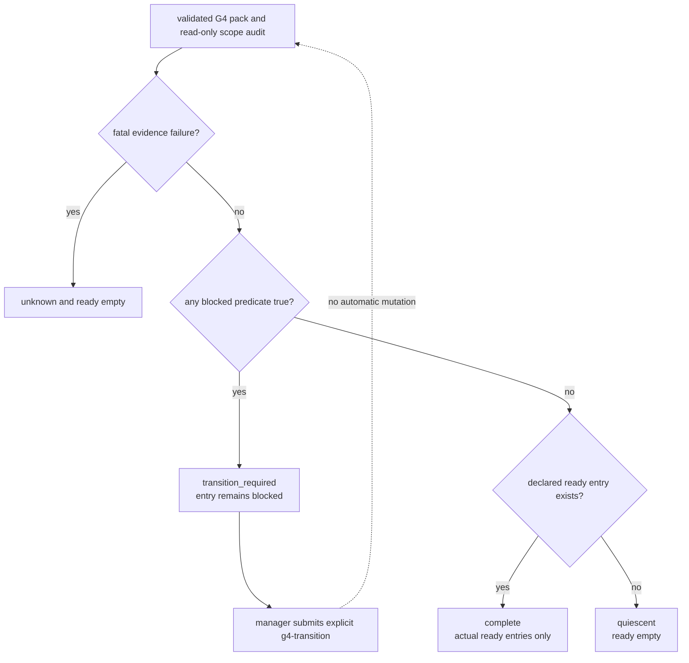

# Issue #209: G4 transition_required と quiescent の監査分類設計

## 決定

`g4-audit` は blocked entry の release predicate を read-only で観測し続ける。

predicate が `true` の blocked entry を `ready` へ自動再分類しない。

代わりに `classificationBasis.status: "transition_required"` と、source を持つ `{"code":"transition_required"}` reason を返す。

この signal は exact manager が後続の `g4-transition` で pack revision を明示遷移させる必要を表す。

predicate が `false` の blocked entry は引き続き `{"code":"blocked_predicate_false"}` として観測結果を出すが、これだけを `unknown` の根拠にしない。

coverage が完全で fatal な evidence failure がなく、`ready` entry が 0 件で、`transition_required` もないとき、aggregate を `quiescent` とする。

これには従来どおりの empty scope / empty entries と、coverage が存在しても全 entry が false predicate の blocked である状態の両方を含む。

entry の state は pack の宣言値のままである。

`g4-audit` は SQLite、G4 ledger、GitHub、label、lease、dispatch を変更しない。

## 分類契約

status は次の優先順で一つだけを返す。

| priority | status | 条件 | `ready` | operator action |
| --- | --- | --- | --- | --- |
| 1 | `unknown` | source / pagination failure、coverage mismatch、entry `unknown`、predicate `unknown` のいずれか | 空 | evidence を復旧して audit を再実行する。 |
| 2 | `transition_required` | `unknown` 条件なし、かつ一つ以上の declared blocked entry の predicate が `true` | declared `ready` entry のみ | manager が fresh pack と expected revision で `g4-transition` を実行する。 |
| 3 | `quiescent` | `unknown` 条件なし、true predicate なし、かつ declared `ready` entry が 0 件 | 空 | 監査時点で起動可能な work はない。次の source change まで待機する。 |
| 4 | `complete` | `unknown` 条件なし、true predicate なし、かつ declared `ready` entry が一件以上 | declared `ready` entry のみ | 既存の ready entry に対する通常手順を使う。 |

`reasons` は status と同義にしない。

`blocked_predicate_false` と `transition_required` は coverage が読めた state signal である。

source failure、coverage mismatch、unknown entry、predicate observation unavailable は fatal reason であり、これらが一件でもあれば status は `unknown` になる。

reason は既存どおり canonical JSON で重複除去・安定ソートする。

`schemaVersion: 1` と object shape は維持する。

status enum の追加と reason の分類意味は README で利用者向けに更新する。

## 根本原因

`evaluatePredicate()` は true / false / unknown を正しく返している。

gap は observation 後の分類にある。

1. `outputEntry()` は observation が `unknown` のときだけ entry state を `unknown` にするため、true observation は blocked state を保持する。
2. `runAudit()` は false observation だけを `blocked_predicate_false` reason に積み、その reason が一件でもあれば aggregate status を `unknown` にする。
3. `quiescent` は `reasons` が空で、coverage と entries の両方が 0 件の場合だけに限定されている。
4. true observation には reason が無いため、explicit transition が必要な source を aggregate output から区別できない。

このため predicate evaluator 自体は動作していても、C1 の explicit transition を促す signal と、coverage-complete の ready=0 を unknown と区別する signal が失われる。

## 一次資料と再測定

Issue #209 が記録した installed version は `v1.2.3-167-g3695b9f` である。

本設計時の installed skill は `v1.2.3-173-g3061ff0` だったが、installed の `scripts/lib/g4-audit.js` と本設計の fixed HEAD の同ファイル、ならびに `scripts/team-work.sh` は byte 一致した。

したがって下表の fixture 再測定は、Issue が指摘した classifier 分岐を現在の installed command で確認するものである。

| value | cutoff | source | command |
| --- | --- | --- | --- |
| predicate evaluator は `not_before`、closed issue、review、comment digest を true / false / unknown で返す | evaluator が根因ではない | `scripts/lib/g4-audit.js:363-388` | `codebase-memory get_code_snippet evaluatePredicate` |
| output entry は predicate `unknown` だけを entry `unknown` にする | true が transition signal にならない直接原因 | `scripts/lib/g4-audit.js:417-433` | `codebase-memory get_code_snippet outputEntry` |
| false predicate は `blocked_predicate_false` reason を積み、reason 非空なら status を unknown、quiescent は coverage=0 / entries=0 に限定する | false-only ready=0 が unknown になる直接原因 | `scripts/lib/g4-audit.js:435-541` | `codebase-memory get_code_snippet runAudit` |
| `not_before` past | true predicate の blocked entry が transition signal を持たないこと | disposable roster / fake `gh` fixture | installed `team-work.sh g4-audit` |
| closed upstream blocker | true predicate の blocked entry が transition signal を持たないこと | disposable roster / fake `gh` fixture | installed `team-work.sh g4-audit` |
| coverage-complete の all blocked false | ready=0 を unknown と誤分類すること | disposable roster / fake `gh` fixture | installed `team-work.sh g4-audit` |
| README は false predicate を unknown と記載する | README 契約更新が必要 | `README.md:862-879` | `sed -n '750,915p' README.md` |

使い捨て fixture は `env -i`、temporary `AGMSG_STORAGE_PATH`、fake read-only `gh` で構成した。

実 GitHub write、real token、scale_exporter の ledger / state pack は使っていない。

| pack mutation | 現行の実測 | 現行判定 |
| --- | --- | --- |
| open Issue を一件 omit | `status=unknown`、`coverage_mismatch`、`ready=[]` | KILLED |
| `not_before` を past にする | `status=complete`、target=`blocked`、predicate=`true`、reason なし | SURVIVED |
| upstream issue_closed を true にする | `status=complete`、target=`blocked`、predicate=`true`、reason なし | SURVIVED |
| coverage fresh で二 entry を false predicate の blocked にする | `status=unknown`、`blocked_predicate_false` 二件、`ready=[]` | SURVIVED |

Issue 本文にある `Scripts/generate-g4-mutation-fixtures.mjs` は current agmsg source と installed skill のいずれにも存在しない。

同じ failure mode を current の `tests/helpers/g4-fixtures.bash` と既存 fake GraphQL fixture で一変数ずつ再現した。

## 実装方式

### 1. reason を fatal evidence と state signal に分ける

`runAudit()` は次の二つを別 collection として組み立て、最終出力時だけ stable な `reasons` に結合する。

| collection | contents | status への効果 |
| --- | --- | --- |
| `fatalReasons` | `coverage_mismatch`、scope source / pagination failure、`unknown_entry`、`blocked_predicate_unknown` | 一件でも `unknown` |
| `stateSignals` | `blocked_predicate_false`、`transition_required` | それだけでは `unknown` にしない |

blocked predicate ごとの処理は以下に固定する。

| observation | entry output | reason | aggregate candidate |
| --- | --- | --- | --- |
| `true` | `blocked` のまま、`releasePredicate.status=true` | `transition_required` と exact source | `transition_required` |
| `false` | `blocked` のまま、`releasePredicate.status=false` | `blocked_predicate_false` と exact source | ready=0 なら `quiescent`、ready があれば `complete` |
| `unknown` | `unknown`、`releasePredicate.status=unknown` | `blocked_predicate_unknown` と exact source / unavailable reason | `unknown` |

既存の `outputEntry()` の read-only behavior は維持する。

true observation により pack、SQLite、entry state、GitHub Issue、label を変更しない。

### 2. aggregate status を reason array の長さから導かない

`runAudit()` は coverage と entry output を確定した後、次の順序で status を選ぶ。

1. `fatalReasons` が非空なら `unknown`。
2. true observation が一件以上なら `transition_required`。
3. `readyCount` が 0 なら `quiescent`。
4. それ以外は `complete`。

`ready` は status が `unknown` のときだけ空にする既存規則を維持する。

したがって `transition_required` でも、別 source の declared ready entry は観測結果として残る。

blocked entry を ready list へ混ぜないため、この signal は local fallback や自動 reclassification にならない。

### 3. g4-transition の既存 re-block safety を保存する

`auditSupportsReblock()` は current の `unknown + blocked_predicate_false が target 一件だけ` を受け入れている。

新しい分類では同じ observation が `complete` または `quiescent` に移るため、source と件数が同じ signal を安全に読み替える必要がある。

`scripts/lib/g4-ledger.js` は次の狭い互換条件へ更新する。

1. `complete` かつ reason が空の既存成功経路を保持する。
2. `complete` または `quiescent` かつ reason が一件だけで、`blocked_predicate_false` の source が transition target と一致するときだけ re-block-safe とする。
3. `unknown`、`transition_required`、別 source、複数 reason は従来どおり reject する。
4. その後の fresh direct predicate evaluation と exact-one SQLite update は変更しない。

これにより、single-target false predicate の既存 re-block を回帰させない。

複数 blocked predicate false がある pack は現在も re-block-safe ではなく、変更後も reason 複数のため拒否する。

この互換処理は g4-transition の新しい policy を導入せず、status vocabulary の変更で失われる既存の許可条件だけを保存する。

## README への反映

README 影響は **有** である。

G4 audit section を次の利用者契約へ更新する。

1. status table に `transition_required` を追加し、manager が `g4-transition` を明示実行することを説明する。
2. `quiescent` を「scope / entries が空」だけでなく、coverage complete・true predicate なし・actual ready=0 まで拡張する。
3. false predicate は diagnostic reason を持ち得るが、それ単独では unknown ではないことを明記する。
4. `unknown` は evidence failure だけであり、ready / transition / quiescent と混同しないことを明記する。
5. `g4-reconcile` の healthy は引き続き `complete` または `quiescent` だけとし、`transition_required` は healthy closeout にしないことを明記する。

`g4-transition` section は、state signal が entry state を変更しないことと、manager の explicit transition が唯一の release path であることを維持する。

## 受入テスト

`tests/test_g4_audit.bats` と disposable fake GraphQL fixture で、以下の source-pack mutation を一件ずつ検証する。

| mutation | expected after implementation | discriminating assertion | current defect / guard mutation |
| --- | --- | --- | --- |
| omit one open Issue | `unknown`、`coverage_mismatch`、`ready=[]` | missing / extra の exact source set を確認する | coverage mismatch を status 選択から除けば KILLED |
| `not_before` in the past | `transition_required`、target state=`blocked`、predicate=`true`、target `transition_required` reason | target を ready へ自動変更していないことも確認する | true predicate signal を積まない旧分岐なら KILLED |
| closed upstream blocker | `transition_required`、target state=`blocked`、predicate=`true`、target `transition_required` reason | `not_before` test と別 fixture / GraphQL operation で確認する | issue_closed true を complete へ落とす旧分岐なら KILLED |
| all blocked with fresh coverage | `quiescent`、coverageCount=entryCount=2、readyCount=0、`ready=[]`、false reason 二件 | status が `unknown` でないことと、coverage mismatch が無いことを同時確認する | `blocked_predicate_false` を fatal reason へ戻す変異なら KILLED |

追加の対照を置く。

1. 一件 false blocked と一件 declared ready は `complete`、ready list は declared ready 一件だけ、false reason は残る。この対照が無いと、実装が blocked entry を ready へ再分類しても検出できない。
2. fake `gh` の predicate source failure は `unknown`、`blocked_predicate_unknown`、`ready=[]` とする。false と unknown を同じ quiescent に丸めない負の対照である。
3. coverage mismatch と false blocked を同時に作り、fatal coverage reason が `quiescent` より優先することを確認する。
4. existing re-block positive fixture は false target predicate で引き続き success し、single target false signal を認識する。
5. two false signals を持つ re-block fixture は `audit_incomplete` と DB checksum / revision count 不変を確認する。複数 source を一件 target の safety exception へ広げない負の対照である。
6. 全 audit fixture は fake `gh` log が read-only GraphQL query だけを持ち、SQLite file、GitHub write、send、spawn を発生させないことを確認する。

`g4-audit` の status selection で true signal を除く mutation、false signal を fatal collection へ戻す mutation、fatal reason を quiescent より後に評価する mutationをそれぞれ実行し、対応する test が `KILLED` となることを記録する。

## 変更範囲

| path | change |
| --- | --- |
| `scripts/lib/g4-audit.js` | fatal evidence と state signal を分離し、`transition_required` / expanded `quiescent` status を出力する。 |
| `scripts/lib/g4-ledger.js` | status vocabulary 変更で失われないよう、single-target false signal の既存 re-block safety だけを互換化する。 |
| `tests/test_g4_audit.bats` | 四 mutation、status precedence、read-only / no-reclassification、KILLED mutation を追加・更新する。 |
| `tests/test_g4_transition.bats` | false signal の re-block compatibility と multi-signal rejection を確認する。 |
| `tests/helpers/g4-fixtures.bash` | all-blocked と predicate state を一変数ずつ作る helper を追加する。 |
| `README.md` | G4 audit / reconcile / transition の status と operator action を自己完結で更新する。 |

## 非対象

- Issue #222 の agguild / agguild_pool 分割
- Issue #223 の Monitor SQLite 競合
- G4 evaluator の追加
- local fallback の追加
- state pack entry の自動 reclassification policy
- `g4-pull`、lease、dispatch の挙動変更
- GitHub Issue、label、assignee、comment の変更
- scale_exporter の live ledger / state pack の変更

## 引き渡し

formal review 合格後、`agmsg_programmer_codex` は Issue #209 だけを含む implementation PR を作成する。

implementation PR は README 更新と受入テストを同じ PR に含める。

architect は実装、formal review、implementation PR の作成を行わない。
