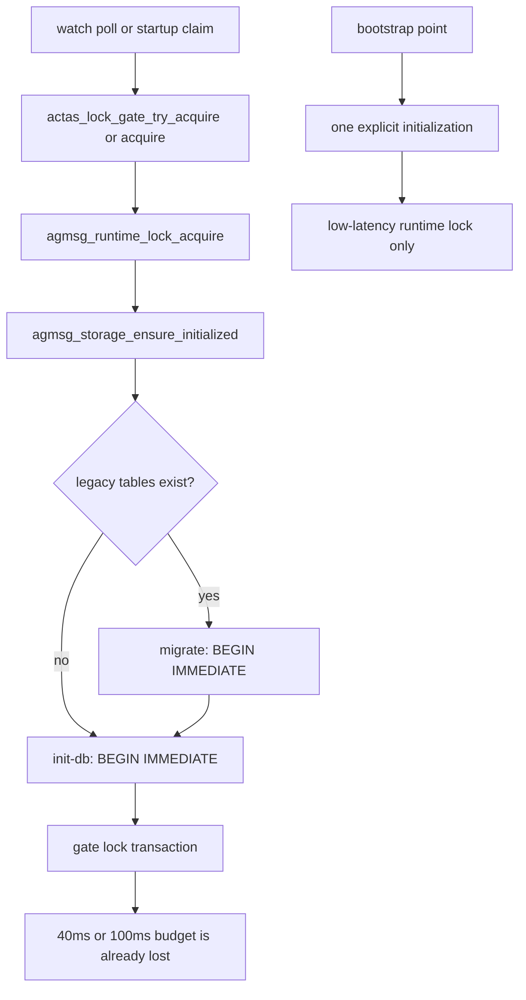

# Issue #223: actas-delivery gate の runtime 初期化分離と dead-owner 回収

## 決定

`agmsg_runtime_lock_*` は、初期化済みの shared runtime store だけを操作する low-latency ABI にする。

`agmsg_runtime_lock_acquire()` から `agmsg_storage_ensure_initialized()` と lazy `CREATE TABLE IF NOT EXISTS locks` を外す。

Issue #223 が触れる runtime-lock caller の schema 初期化は、長い writer transaction を許される三つの bootstrap point だけで一回実行する。

1. `watch.sh` は runtime DB の既存-file healthcheck の後、subscription claim の前に一回実行する。
2. `actas-claim.sh` は対象 team が一件以上と分かった後、最初の claim の前に一回実行する。
3. `codex-bridge-launcher.sh` は dispatcher の最初の runtime lock の前に一回実行する。role child は dispatcher が初期化した store を前提にし、re-exec ごとに初期化しない。

`locks` table は `init-db.sh` の idempotent schema に移す。

watcher の `actas_lock_gate_try_acquire()` は observed owner PID が confirmed-dead のときだけ、残りの 40ms attempt の一つで expected-owner CAS を行う。

これは touched `actas-delivery:` row の lazy GC であり、全 locks table の走査、dead PID の発生経路追跡、filesystem の `actas_lock_gc_stale()` の変更は行わない。

`cannot commit - no transaction is active` は Issue #223 のスコープ外である。一部条件下では再現するが、原因特定・再現・受入条件は別途扱う。

## 問題と一次資料

Issue #223 の GitHub breaker comment は、delivery gate が各取得で storage schema migration と `init-db.sh` を実行し、shared `messages.db` に二つの `BEGIN IMMEDIATE` を追加していると記録する。

current source では、`agmsg_storage_ensure_initialized()` が両スクリプトを毎回起動する一方、通常運用では migration 側が両 legacy table 不在の `table_state=0|0` で `BEGIN IMMEDIATE` より前に終了する。したがって通常時に実行されるのは `init-db.sh` 側の `BEGIN IMMEDIATE` のみであり、migration 側の transaction は legacy table が実在する移行期だけ実行される。

| value | cutoff | source | command |
| --- | --- | --- | --- |
| `agmsg_runtime_lock_acquire()` が `agmsg_storage_ensure_initialized()` を毎回呼ぶ | gate hot path に initialization が無いこと | `scripts/lib/storage.sh:323-347` | `codebase-memory get_code_snippet agmsg_runtime_lock_acquire` |
| ensure が migration と init を順に bash 起動する | bootstrap だけが transaction を実行すること | `scripts/lib/storage.sh:299-306` | `codebase-memory get_code_snippet agmsg_storage_ensure_initialized` |
| holder なし `try_acquire` は 3,169.0ms | `<=200ms` | disposable clone storage | `actas_lock_gate_try_acquire` を isolated `AGMSG_STORAGE_PATH` で実行 |
| breaker の holder なし測定は 8.5s | `<=200ms` | [Issue #223 breaker comment](https://github.com/kappaseijin/agmsg/issues/223#issuecomment-5544364987) | comment 記載の isolated measurement |
| gate は `AGMSG_BUSY_TIMEOUT=40/100` を export する | gate SQL が caller budget を使うこと | `scripts/lib/actas-lock.sh:148-168` | `codebase-memory get_code_snippet _actas_lock_gate_run` |
| migration / init heredoc が `.timeout 5000` を再設定する | inner SQL が gate budget を上書きしないこと | `scripts/internal/migrate-team-work-dispatch.sh:35-38`, `scripts/internal/init-db.sh:321-324` | `rg -n '\\.timeout 5000|BEGIN IMMEDIATE' scripts/internal/{init-db,migrate-team-work-dispatch}.sh` |
| existing `try_acquire` は owner が自分でなければ liveness を確認せず fail する | confirmed-dead row を CAS だけで回収すること | `scripts/lib/actas-lock.sh:196-224` | `codebase-memory get_code_snippet actas_lock_gate_try_acquire` |
| writer-side `actas_lock_gate_acquire` は dead owner を expected-owner CAS で回収済み | watcher 側は同じ狭い CAS までに留めること | `scripts/lib/actas-lock.sh:244-311` | `codebase-memory get_code_snippet actas_lock_gate_acquire` |

独立測定は `/tmp/agmsg-issue-223-probe.MJQzde` の disposable store だけを使った。

実稼働 `~/.agents/skills/agmsg`、live team、message、lock row、GitHub mutation は操作していない。

## 根本原因

`_actas_lock_gate_run()` correctly exports the intended 40ms or 100ms SQLite budget, but `agmsg_runtime_lock_acquire()` immediately invokes `ensure_initialized`.

The two internal scripts contain `.timeout 5000` in their SQL heredocs, so their own SQLite command resets the budget after `agmsg_sqlite` has installed the caller value.

The gate therefore does much more than one lock transaction per attempt, and the documented `try_acquire <=200ms` bound is false even without a holder.

Separately, `actas_lock_gate_acquire()` (writer path) already has safe dead-owner CAS, whereas `actas_lock_gate_try_acquire()` (watcher path) returns `gate-held-by-another-owner` for any non-self owner.

A dead PID left in the runtime `locks` table consequently blocks a watcher even though no live process owns the resource.

## Runtime-lock contract

### Initializer and ABI separation

`agmsg_storage_ensure_initialized()` remains the only schema/migration entrypoint.

It must stop on migration failure before running `init-db.sh`; a failed migration must not be hidden by a later init result.

For both child scripts it explicitly supplies the bootstrap budget `AGMSG_BUSY_TIMEOUT=5000`.

The embedded `.timeout 5000` lines are removed from `init-db.sh` and `migrate-team-work-dispatch.sh`.

Thus the timeout comes from exactly one source: `agmsg_sqlite` receives the bootstrap budget in initialization and the 40ms/100ms caller budget in the gate.

`init-db.sh` creates `locks(resource, owner_pid, acquired_at)` idempotently with the same primary-key and column contract currently created lazily by `agmsg_runtime_lock_acquire()`.

`agmsg_runtime_lock_acquire()` keeps its serialized `BEGIN IMMEDIATE`, INSERT-or-IGNORE, optional expected-owner DELETE, owner SELECT, and COMMIT semantics, but does not run migration or DDL.

All `agmsg_runtime_lock_*` entrypoints fail closed when the runtime DB file is absent, rather than allowing SQLite to create a schema-less database on the first lock operation.

An existing DB without the `locks` table similarly returns the existing SQLite permanent error without creating or repairing schema.

Only the explicit bootstrap points may create or migrate that schema.

### Bootstrap points

| path | initialization placement | failure behavior |
| --- | --- | --- |
| `scripts/watch.sh` | After `watch_check_existing_db "$RUNTIME_DB"` succeeds and before `agmsg_subscription_pairs ... claim` | Existing unreadable DB retains #168's `ERROR: cannot open message DB` diagnostic. Initializer failure is logged as runtime-store initialization failure and exits non-zero before any claim mutation. |
| `scripts/actas-claim.sh` | After the exact registered team set is nonempty and before its claim loop | Exit `3` with the existing unavailable shape; no actas lock file or role-session record is written. A `not_registered` request still creates nothing. |
| `scripts/drivers/types/codex/codex-bridge-launcher.sh` | Dispatcher (`ROLE_PAIR` empty) path before `acquire_runtime_lock "$DISPATCHER_LOCK_RESOURCE"` | No dispatcher or role child starts if initialization fails. The spawned role child and its `exec` re-entry do not initialize again. Direct/invalid role-child invocation fails closed through the runtime-lock precondition. |

`scripts/team-work.sh` and `scripts/lib/claims.sh` already call the explicit initializer on their own mutation paths; they retain that behavior.

`eligible-pairs.sh` and Codex `watch-once.sh` resolve subscriptions without `claim`, so they do not become bootstrap points.

The old storage test that asserts a raw runtime-lock call initializes a fresh store is intentionally replaced: the lock ABI is no longer a schema initializer.

### Watcher dead-owner GC

After a successful `try-acquire` reports an owner other than `$$`, the watcher path follows this order.

1. A live owner remains a fail-closed non-acquisition; the watcher never waits for it.
2. A confirmed-dead numeric PID permits one expected-owner CAS attempt using the already-observed PID.
3. CAS success is accepted only if the returned owner is `$$`; a different, invalid, or live successor is not deleted.
4. SQLite BUSY/LOCKED consumes one of the existing four 40ms attempts; no new sleep or unbounded retry is added.

This preserves the writer path's existing stale-generation safety rule: an old observer may only delete its exact observed generation, never a successor.

It does not sweep unrelated runtime resources, infer death from missing diagnostics, or alter `actas_lock_gc_stale()` (which manages filesystem session locks rather than SQLite `locks` rows).

## Public behavior and documentation

README impact is **無し**。

README documents `actas` exclusivity, watcher/bridge delivery requirements, recovery, and sandbox write access, but not an initializer placement, SQLite busy budget, or runtime-lock GC algorithm.

Successful commands, configuration, mode selection, lock ownership semantics, and user recovery instructions do not change.

The existing `actas` unavailable / watcher non-zero behavior remains fail-closed; only the internal source of a transient gate failure is removed.

`docs/plan/2026-08-26_issue-168-watch-runtime-db-preflight.md` remains historical evidence for the existing-file healthcheck.

Its diagnostic ordering is preserved: an unreadable existing DB is reported before initialization, while a missing store is now initialized explicitly before subscription rather than incidentally by its first gate operation.

## 受入テスト

### Deterministic Bats coverage

| test | expected result | false-negative guard |
| --- | --- | --- |
| uninitialized runtime lock | fresh storage path causes a non-zero result and creates no `messages.db` | Calling `sqlite3` against a missing path would create an empty DB; assert file absence, not only the exit code. |
| explicit initialization | `agmsg_storage_ensure_initialized` creates the full schema including `locks`, then acquire/CAS/release still work | Query `sqlite_master` for `locks`; a bare DB file is not a positive control. |
| no hot-path initialization | stub `agmsg_storage_ensure_initialized` to leave a marker and fail; a prepared-store `try_acquire` succeeds within 200ms and leaves no marker | A test that stubs ensure to success but never checks invocation would miss a restored hot-path call. |
| busy budget | fake `sqlite3` records command and heredoc input: initializer uses 5000 once, gate lock SQL has no inner `.timeout 5000` and receives 40/100 | Checking only exported `AGMSG_BUSY_TIMEOUT` misses an SQL heredoc that later overrides it. |
| dead watcher owner | install a dead PID row, run `try_acquire`, assert expected-owner CAS becomes self; then release leaves no row | Use a real dead PID and a separate live-PID control, not a missing owner string. |
| live owner / busy holder | a live PID remains unclaimed; an actual `BEGIN IMMEDIATE` holder makes `try_acquire` fail closed without changing the holder row and within its budget | A text-only `database is locked` stub cannot prove the transaction and liveness paths are distinct. |
| claim and watch integration | fresh fixture `watch.sh` initializes once before claim; initializer failure yields no filesystem claim; existing unreadable DB keeps #168 diagnostic | Include active-name and broad watcher fixtures so a no-pair path cannot give a false pass. |
| Codex bridge | fresh dispatcher initializes before its first dispatcher lock; child/re-exec does not rerun initializer; already initialized dispatcher/child locks retain CAS behavior | Count initializer invocations across dispatcher plus role child; a dispatcher-only test misses re-exec regression. |

The implementation PR must perform these mutation checks and record each as KILLED.

1. Restore `ensure_initialized` inside `agmsg_runtime_lock_acquire`; the no-hot-path-initialization marker/latency test fails.
2. Restore either heredoc `.timeout 5000`; the fake sqlite command/input test fails.
3. Remove the watcher expected-owner CAS; the real dead-PID test fails.
4. Replace expected-owner CAS with unconditional delete; a successor-race fixture fails because it detects deletion of the successor row.
5. Move watcher initialization after subscription; the fresh-store watch fixture fails before readiness.

### Soak acceptance outside CI

In a disposable skill copy with ten independently registered fixture pairs, start ten active-name `watch.sh` processes at the normal five-second poll interval.

For one hour, require all ten readiness sentinels to remain owned by their watcher and require zero `ownership_gate_unavailable` and zero `agmsg_subscription_pairs failed (status 3)` lines across the ten watch logs.

The test root, storage path, `HOME`, `TMPDIR`, `run/`, roster, and fake transport must all be fixture-local.

No production watcher, team DB, message, or lock is an acceptance target.

## 変更範囲

| path | change |
| --- | --- |
| `scripts/lib/storage.sh` | Explicit bootstrap failure propagation; no runtime-lock initialization/DDL; missing-store fail-closed precondition. |
| `scripts/internal/init-db.sh` | Create `locks` schema idempotently and remove heredoc timeout override. |
| `scripts/internal/migrate-team-work-dispatch.sh` | Remove heredoc timeout override. |
| `scripts/lib/actas-lock.sh` | Bounded, confirmed-dead expected-owner CAS in watcher `try_acquire`; preserve writer CAS. |
| `scripts/watch.sh` | One explicit initializer between existing-DB healthcheck and subscription claim. |
| `scripts/actas-claim.sh` | One explicit initializer after registered-team resolution and before claims. |
| `scripts/drivers/types/codex/codex-bridge-launcher.sh` | Dispatcher-only initializer before runtime lock; child/re-exec precondition only. |
| `tests/test_storage.bats`, `tests/test_actas_lock.bats`, `tests/test_watch.bats`, `tests/test_actas_integration.bats`, `tests/test_codex_bridge_launcher.bats` | ABI, timeout, stale owner, startup, and bridge coverage. |

## 非対象

- Issue #222
- `cannot commit - no transaction is active` の再現・原因特定・受入
- dead PID row の発生経路追跡、または unrelated runtime resource の全件掃除
- filesystem `actas_lock_gc_stale()` の policy 変更
- `g4-pull`、lease、dispatch、delivery fallback の変更
- live production storage / team / watcher / lock への操作
- README、GitHub Issue、label、assignee、comment の変更

## 引き渡し

`agmsg_programmer_codex` は Issue #223 だけを含む implementation PR でこの設計を実装する。

`agmsg_reviewer_claude` は fixed HEAD の全差分、bootstrap と hot-path の分離、timeout source の一意性、CAS の狭さ、deterministic test と fixture-only one-hour soak の両方を一括で確認する。

architect は実装、formal review、implementation PR の作成を行わない。
