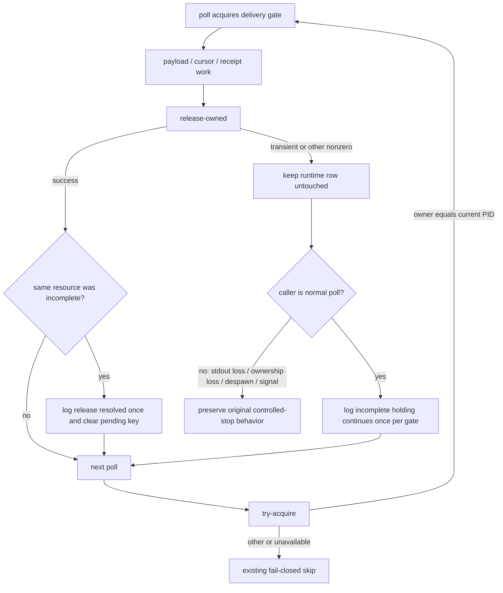

# Issue #230: watcher の delivery-gate release 失敗を停止ではなく継続へ扱う

## 決定

`watch.sh` の通常 poll 中に delivery gate の release が失敗しても、watcher 自身は停止しない。

release が失敗したとき、watcher は runtime `locks` row を削除も上書きもせず、その poll の payload 処理を終え、次の poll へ進む。

row が引き続き当該 watcher の PID を owner として保持していれば、次の `actas_lock_gate_try_acquire()` は既存の `owner == $$` 契約により成功する。

したがって、その後の release 成功まで、同じ watcher が gate を再入して delivery を続ける。

この変更は、release SQL の retry 回数・busy timeout・15 分の `storage_read_cursor_get` busy の原因・Issue #222・Issue #223 の runtime initialization / stdin barrier を変更しない。

`_watch_release_gate()` は release の成功・失敗を caller へ返し続ける。

失敗を常に success に偽装して既存の `if ! _watch_release_gate` を死コードにしない。

代わりに、各 caller を「通常 poll を継続する失敗」と「release 以外の理由で終了する失敗」に分ける。

通常 poll を継続する caller では、release failure を診断したあと `continue` する。

stdout が閉じた、exclusive watcher が ownership を失った、despawn が成立した、または signal / EXIT trap が走った場合は、元からある終了理由を維持する。

release failure 単独は停止理由にしない。

## 問題と一次資料

Issue #230 の breaker 判断は、これは新しい root cause ではなく failure handling の設計誤りだと断定している。

current HEAD では `_watch_release_gate()` が保持中 gate の path / label を release 前に空にし、`actas_lock_gate_release` が非0なら `watcher is stopping` を記録して非0を返す。

通常の poll 終端はその非0を `exit 1` へ直結する。

そのため transient SQLite busy が release の 50 回・100ms の既存 writer budget を使い切ると、watcher は自分が owner の runtime row を残したまま停止する。

停止後の PID は dead になり、Issue #223 で加えた狭い expected-owner CAS が後続 watcher による回収を可能にするが、release failure 自体がこの stale row を作る経路になる。

| value | cutoff | source | command |
| --- | --- | --- | --- |
| `_watch_release_gate` は held path を release 前に clear し、failure で watcher 停止を記録して非0を返す | release failure だけで poll を停止させない | `scripts/watch.sh:612-625` | `nl -ba scripts/watch.sh | sed -n '610,625p'` |
| 通常 poll 終端は release failure で `exit 1` | release failure 後も next poll に到達する | `scripts/watch.sh:897-900` | `nl -ba scripts/watch.sh | sed -n '875,900p'` |
| 同一 PID の observed owner は `try_acquire` 成功 | retained self-owned row で再入できる | `scripts/lib/actas-lock.sh:196-210` | `nl -ba scripts/lib/actas-lock.sh | sed -n '190,260p'` |
| watcher acquire は live other owner を待たず、dead numeric owner だけを expected-owner CAS で置換する | retained self-owner 以外を勝手に奪わない | `scripts/lib/actas-lock.sh:211-260` | 同上 |
| release は transient failure を 50 回・100ms budget 内で retry し、それ以外を非0で返す | retry budget を増やさない | `scripts/lib/actas-lock.sh:354-375` | `nl -ba scripts/lib/actas-lock.sh | sed -n '350,380p'` |
| current source の `_watch_release_gate` call は 9 箇所。通常継続 5、制御終了 3、EXIT cleanup 1 | blanket ignore を導入しない | `scripts/watch.sh:382,718,726,757,773,783,841,881,897` | `git grep -n '_watch_release_gate' -- scripts/watch.sh` |
| release が successor owner を削除しない | release failure を self-retained と決めつけない | `tests/test_actas_lock.bats:381-397` | `rtk bats --filter 'delivery gate: (watcher reclaims a confirmed-dead runtime owner with CAS|release failure preserves a successor owner)' tests/test_actas_lock.bats` |
| dead owner の watcher CAS 回収と successor-preservation test | 2/2 pass | same test source | same command; current base `b2e3af3…` |
| README は watcher の内部 release failure / recovery contract を説明しない | public CLI / configuration change が無ければ README を変えない | `README.md:71-73,263-265,342-344` | `rg -n -i 'watch.*(stop|delivery|release|gate)|delivery.*watch|monitor.*(stop|delivery|gate)|ownership.*(gate|watch)|poll' README.md` |

Issue #230 の live state は OPEN、breaker comment は 1 件である。

Issue #223 の PR #231 は merged で、ここでの base head はその merge commit `b2e3af3c3682dd3e9b40756c9dc9314ca79e46a5` である。

実稼働の watcher、team DB、message、runtime lock row は本調査で操作していない。

## Failure-handling contract



### Gate ownership

`actas_lock_gate_release()` remains the only component permitted to delete an owned runtime row.

On a nonzero result, `watch.sh` must not issue an unowned delete, force a CAS, create a replacement row, or inspect a PID and infer that it may take ownership.

The existing primitive already distinguishes three outcomes needed here.

1. A row still owned by `$$` is a safe reentrant acquisition for this same sequential watcher.
2. A live different owner remains unavailable; the poll skips fetch, output, consume, and receipt exactly as it does now.
3. A confirmed-dead different owner may be replaced only through the existing expected-owner CAS.

This means a release failure caused by a logical owner mismatch is safe as well: a successor row remains untouched, and the watcher does not falsely say that it still owns that gate.

The successful reentrant path is a contract, not an incidental implementation detail.

The implementation must retain the two direct `owner == $$` success branches in `actas_lock_gate_try_acquire()` (ordinary observe and expected-owner-CAS observe).

No sleep, retry, timeout, or wait is added to watcher `try_acquire`.

### Release-pending diagnostic state

`watch.sh` gains process-local, path-keyed pending-release state.

It uses a Bash-3-compatible newline-delimited key set, following the existing once-per-process reporting style; associative arrays are not introduced.

The key is the exact `WATCH_HELD_GATE_PATH`, not a generic boolean and not only the display label.

For a normal-poll release failure, add the key if absent and write exactly one `watch_log` record for that key:

```text
<team>/<agent>: ownership gate release incomplete; holding continues to the next poll.
```

Repeated failures for that same path do not emit more records.

If a later `actas_lock_gate_release` for that exact path succeeds, remove only that key and write exactly one resolution record:

```text
<team>/<agent>: ownership gate release resolved; normal release resumed.
```

A release success for another role must not resolve this role's pending key.

An acquisition failure must not be reported as a release resolution.

If ownership changes to another live session before a matching later release succeeds, the pending warning remains historical evidence; the watcher does not claim a resolution it did not perform.

The two records go through `watch_log`, hence stderr and the bounded per-watcher log only.

They never go to stdout, which is the message-delivery protocol.

### Caller matrix

| current location | current release-failure effect | new effect |
| --- | --- | --- |
| `cleanup()` EXIT trap | best-effort only; process is already ending | Keep best-effort release. A failure records shutdown diagnostic only; there is no next poll to promise. Existing dead-PID CAS remains the recovery path. |
| `pair_state` read failure | `exit 1` | Record incomplete-once and skip this poll. |
| exclusive `pair_state=other` | `exit 1` before the ownership-loss explanation | Preserve ownership-loss stop (`exit 0`); release failure does not replace its reason. Do not promise continued holding. |
| broad `pair_state=other` | `exit 1` | Record incomplete-once and continue serving other / later re-acquired pairs. |
| unusable `pair_state` | `exit 1` | Record incomplete-once and skip this poll. |
| `storage_watch_after` failure | `exit 1` | Record incomplete-once and skip this poll. |
| closed stdout | cleanup then `exit 1` | Preserve nonzero stdout-closure exit. Release failure is diagnostic only and must not change the exit cause or status. |
| despawn | already continues role drop after a failed release | Keep drop / controlled exit behavior; route any diagnostic through the once-per-path state so it is not duplicated. |
| normal end of a pair poll | `exit 1` | Record incomplete-once and continue to the next pair / next poll. |

The current call-site count is intentionally recorded because the scope is not “replace one `exit 1`.”

Every direct caller must be audited against this matrix.

## 受入テスト

### Deterministic Bats coverage

| test | expected result | false-negative guard |
| --- | --- | --- |
| same-PID reentrancy | In one top-level Bats shell, acquire a fresh gate, call `actas_lock_gate_try_acquire` again without `run` / subshell, assert both succeed and owner remains `$$`, then release. | A second `run` starts a different shell / PID and does not test reentrancy. |
| same-PID mutation | Change either self-owner success comparison in a fixture copy; the direct reentrancy test fails before payload work. | A test that only checks the final row can pass after a failed second acquire. |
| release failure keeps successor | Retain and run the existing `release failure preserves a successor owner` test. | A self-owned-only fixture cannot detect deletion of another session’s row. |
| normal-path release failure | Stub only owned release to fail after a real successful acquisition; watcher remains alive, writes one incomplete record to stderr and watcher log, and writes none to stdout. | Wait for the gate-acquire barrier before forcing release failure; otherwise a watcher that never acquired can appear healthy. |
| recovery once | Make the next release for the same path succeed; assert exactly one resolution record and no duplicate incomplete / resolution records across additional polls. | Count both stderr and `$RUN_DIR/watch.<iid>.log`; one sink alone cannot prove `watch_log` routing. |
| path-keyed resolution | Fail release for pair A, successfully release pair B, and assert A remains pending; only a later A release clears A. | A boolean pending flag would falsely pass single-pair coverage. |
| controlled-stop preservation | Closed stdout still exits nonzero; exclusive ownership loss still exits zero with its ownership explanation; despawn still completes the role drop. | A blanket “release failure means success” change can hide an actual stdout transport failure. |

### 12-second SQLite-holder acceptance

The integration test uses a disposable Bats skill copy and its test-local runtime DB only.

1. Queue a fixture message and start one active-name watcher with the existing `AGMSG_TEST_ACTAS_DELIVERY_GATE_BARRIER`.
2. Wait for the barrier sentinel. This proves the watcher already owns the runtime gate before the holder begins.
3. Start a separate real SQLite holder using the established test pattern: `( printf 'BEGIN IMMEDIATE;\nSELECT 1;\n'; sleep 12; printf 'COMMIT;\n' ) | sqlite3 "$db"`. Wait for its ready signal before releasing the watcher barrier.
4. Let the watcher reach release. Its unchanged 50×100ms release budget expires while the holder remains active.
5. Before the holder’s 12 seconds end, assert the watcher PID is alive, the incomplete record exists exactly once, and no stop diagnostic was emitted solely for release failure.
6. Release / wait for the holder, queue a new post-holder fixture message, and wait for it on watcher stdout. Assert the matching release resolution record appears once.
7. Stop the watcher deliberately and verify fixture cleanup.

The mandatory negative control runs the same holder fixture against detached base `b2e3af3c3682dd3e9b40756c9dc9314ca79e46a5`.

That run must reach its bounded release failure and exit before the 12-second holder releases; it must not deliver the post-holder message.

The candidate run must remain alive and deliver that message after the holder releases.

This control proves that the fixture actually enters the failure mode under repair, rather than merely observing a healthy watcher after the holder was gone.

The holder uses a real transaction, not a string-only SQLite error stub, because the suspected false negative is a test that produces an error text without preventing the release write.

### Required implementation verification

The implementation producer records these mutation results as KILLED.

1. Restore normal-poll `exit 1` after `_watch_release_gate`; the 12-second candidate must stop and fail the alive / post-holder delivery assertions.
2. Remove either `owner == $$` success branch from `actas_lock_gate_try_acquire`; same-PID reentrancy fails.
3. Replace path-keyed pending state with one global boolean; two-pair resolution fails.
4. Route release warning to stdout; stdout-protocol assertion fails.
5. Treat release failure as an unconditional success; closed-stdout controlled-stop test fails.

The verifier executes the fixed implementation HEAD only after the programmer’s test evidence is available.

It independently repeats the 12-second holder test and reports `value / cutoff / source / command`, including the detached-base negative-control result.

## Public behavior and documentation

README impact is **無し**.

The public contract remains a short exclusive lease that delivers host text and persists a receipt.

No command, configuration key, mode, stdout message grammar, lock-recovery instruction, or user action changes.

The change only prevents an internal release failure from unnecessarily ending an otherwise live watcher.

The existing README wording for `actas` recovery and `despawn` partial outcomes remains correct: a true controlled stop or explicit lock-state failure is still reported as such.

No README, docs/actas, live Issue comment, label, assignee, production watcher, team store, or runtime lock mutation belongs in this Issue.

## 変更範囲

| path | change |
| --- | --- |
| `scripts/watch.sh` | Path-keyed incomplete-release state, once-only incomplete / resolution diagnostics, and caller-specific continuation / controlled-stop handling. |
| `tests/test_watch.bats` | Real 12-second SQLite holder integration, stderr/log/stdout separation, controlled-stop preservation, and detached-base negative-control procedure. |
| `tests/test_actas_lock.bats` | Same-PID reentrancy contract and its mutation-sensitive assertion; retain successor-preservation coverage. |

## 非対象

- Issue #222
- 15 分継続した `storage_read_cursor_get failed (status 13)` / SQLite busy の原因特定、再測定、retry 拡張、timeout 変更
- Issue #223 の runtime initialization、stdin `.bail on`、dead-owner CAS の再変更
- all-runtime-row sweep、dead PID の全発生経路の列挙、filesystem `actas_lock_gc_stale()` の変更
- delivery payload、cursor / receipt semantics、subscription / actas ownership policy の変更
- README、公開 CLI、設定、GitHub Issue metadata の変更
- live production storage / watcher / message / lock への操作

## 引き渡し

`agmsg_programmer_codex` は Issue #230 だけを含む implementation PR で、caller matrix を満たす最小変更と deterministic test を実装する。

`agmsg_verifier_codex` は disposable fixture の 12-second holder acceptance と detached-base negative control を独立実測する。

`agmsg_reviewer_claude` は fixed HEAD の全差分を一括確認し、same-PID contract、path-keyed once logging、controlled-stop preservation、stdout protocol、スコープ外 timeout / busy 変更が無いことを判定する。
