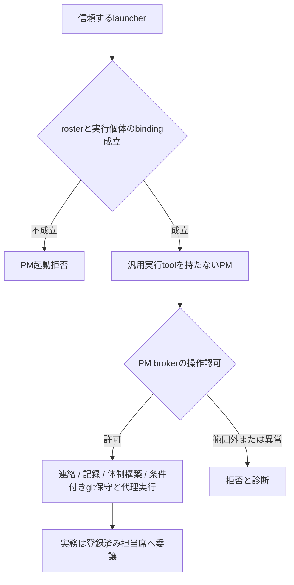

# PM委譲義務の実行境界

## 結論と今回の範囲

command型PreToolUseを追加するだけでは、障害時を含む委譲の強制は成立しない。
正常に動けば拒否できるが、起動不能やtimeoutでは通常のpermission判定へ戻るためである。
ユーザー決定により、PMから汎用実行ツールを外し、連絡、記録、体制操作を引数制限付きの専用窓口へ限定するPM broker方式を採用する。
これは設計上の条件付き成立であり、現環境での拒否成功や導入可能性を実測済みとはしない。

本書の一主張は「PMの直接実作業を防ぐには、注意文の注入ではなく実行能力の境界が必要」である。
起草はagmsg_architect_codex、実装は別依頼後のagmsg_programmer_codex、formal reviewはagmsg_reviewer_claudeとする。
正式レビューは設計PRの固定HEAD全差分を対象にする。
今回は調査と設計文書だけを扱い、既存hook、起動設定、製品コードを変更しない。
#230、PR #233、remind-clickable-options.sh等の既存リマインダー修正は対象外とする。
内部運用の検討書なので今回のREADME変更はない。
共有launcherやactas連携へ実装する場合、影響候補はagmsgチームだけでなくagmsgを利用する全プロジェクトのPM運用である。
導入は対象team/agentを明示して段階的に行い、未導入席と非PM席への無変更を受入条件に含める。

## 根拠と確認範囲

確認日: 2026-09-05。ローカル確認の基準時刻は2026-09-05T15:02:40+09:00。

| 主張 | value / cutoff | source / command | 限界 |
| --- | --- | --- | --- |
| 注意文は実行拒否ではない | breakerは入力hook成功後のBash結果3件を確認。実行前拒否なら対象操作は走らない | [breaker断定](https://github.com/kappaseijin/agmsg/issues/236#issuecomment-5549817379)、`rtk gh issue view 236 --repo kappaseijin/agmsg --json title,state,comments` | 原セッションの実測はbreakerによる。architectの再実験ではない |
| cwdではPMを一意に決められない | 同じprojectにPMとownerが登録されている | 正式`team.sh agmsg`、breakerの`whoami.sh`結果 | rosterの存在は現在の実行主体の証明ではない |
| 既存再開記録は認可には不足 | 保存失敗でも成功扱い、SID逆引きは最初の一致で終了 | 固定HEADの`actas-claim.sh`、`role-session.sh`を読取。対象ファイルの`rtk git diff -- ...`は空 | 保存用契約を壊さず、認可用の厳格な照合を別に設ける必要がある |
| 能力を絞るCLI入口が存在する | ローカルCLIは2.1.261、helpに`--restricted`、`--tools`、`--strict-mcp-config`がある | `claude --version`、`claude --help` | 存在確認だけ。対象PMのCLI 2.1.260での動作試験とは別 |

breakerの限定証拠は`/private/tmp/agmsg-issue236-breaker.ip5pbb9j/evidence.json`にある。
原記録は同packetの`session_source`で、関係行は6109–6113、6115、6400、7338–7339、7348/7350、7360/7362、7369/7371である。
packetの限定項目を読み、実測の帰属を保持した。
一時ファイルの残存を永続的な受入証拠にせず、後工程の試験packetは秘密値を除いた専用artifactに保存する。

履歴検索は`ctx search 'Issue 236 PM PreToolUse' --workspace /Users/kappa/Dropbox/data/dev/agmsg --refresh off`で応答が得られず中断した。
履歴検索の空出力を不存在証拠には使わない。
コード探索はcodebase-memoryから開始したが、`actas_lock_state`の索引行と現ファイルにずれがあったため、該当ファイルを直接読み直した。

## hook方式の限界と候補比較

公開仕様では、PreToolUseは有効なdeny判断またはexit 2で実行前に拒否できる。
一方、command hookの起動不能とtimeoutは拒否にならない。
SDK callbackのPreToolUse timeoutは別契約で、tool callをblockする。
この差をcommand hookにも適用できるとは解釈しない。
PostToolUseは実行後なので予防にはならない。[公式hook仕様](https://code.claude.com/docs/en/hooks#timeouts)

| 方式 | 防げる範囲 | 残る問題 | 判定 |
| --- | --- | --- | --- |
| 注意文 + command型PreToolUse | 正常時に判定できた対象操作 | hook未起動、timeout、判定対象外ツール、記述を変えたcommand | 強制境界として不採用 |
| SDK callbackで全toolを仲介 | callback到達時の拒否。timeoutの非阻止問題を改善できる | ハーネス移行、例外時と未登録時の確認、操作の意味分類、迂回toolの制限が別途必要 | 比較候補。今回の最小導入には選ばない |
| PMの能力制限 + 専用操作窓口 | 提供していない実行能力を直接使えない。窓口の異常で汎用shellへ戻さない | 窓口と起動契約の新設、既存PM操作の移設、実機受入が必要 | ユーザー採用決定。実装と受入は未実施 |

`git`や`gh`の文字列禁止だけでは、別インタプリタ、別tool、ラッパー、GUI経由で同じ実作業を行える。
逆に全Bashを拒否するだけでは、現在Bash経由のagmsg連絡まで止まる。
したがって禁止語を増やす方式でなく、PMに残す操作を列挙する。
自然言語の目的を完全に分類する保証は置かない。
PMが文脈を読んで会話することと、成果物の調査を自分で実行することは、専用窓口の提供範囲で分ける。

## セッション識別の契約

既存の[actas-claim.sh](https://github.com/kappaseijin/agmsg/blob/581970ad61e6d5ea1b4b52b31fa6e740ab427787/scripts/actas-claim.sh)は明示agent名を受け、claim後に再開用recordをbest-effortで保存する。
[role-session.sh](https://github.com/kappaseijin/agmsg/blob/581970ad61e6d5ea1b4b52b31fa6e740ab427787/scripts/lib/role-session.sh)の`agmsg_role_session_lookup_by_sid`は一意性を確認しない。
[session-start.sh](https://github.com/kappaseijin/agmsg/blob/581970ad61e6d5ea1b4b52b31fa6e740ab427787/scripts/session-start.sh)はsession IDとCLI PIDを組み合わせて並行resumeを分離するが、PID未解決時はbare SIDへ縮退する。
これらは配送と再開の材料として使い、単独で「認可済みPM」と判定しない。

新しいPM起動契約では、信頼するlauncherが明示的な`team / agent / seat type / policy version`を固定し、起動したprocess generationへ結び付ける。
session IDは再開の識別子、process generationは今回の実行個体の識別子として別々に保持する。
親processまたは専用channelに保持したbindingを正本とし、tool引数のagent名、cwd、プロンプトのactas宣言、書換可能な環境変数だけから権限を取得させない。

1. 起動前に正式rosterと明示agentを照合する。欠落、複数一致、未対応seat typeは起動拒否とする。
2. 起動個体とclaimのownerを照合する。bare SIDだけ、古いPID、読取失敗、複数recordを許可根拠にしない。
3. 認可用bindingを作れなければ汎用toolを持つPMを開始しない。初期claimはlauncher側が行い、PMのBash許可をbootstrap例外にしない。
4. resume時にも今回のgenerationを再検証する。PMからownerへのactasによる権限昇格は許さず、別席起動として扱う。
5. 同じcwdのownerやprogrammerの起動にはPM制限を誤適用しない。cwdはproject整合性の検査にだけ使う。

これは信頼したlauncherと実行ハーネスの内側で、モデルの誤操作を防ぐ契約である。
同じOSユーザーの別processによる認可file改ざん、管理者による起動引数変更、ハーネス自体の欠陥まで防ぐとは主張しない。
そこまで含めるなら別OS権限等の隔離が必要で、別途採否を決める。

## PMに残す操作と実行境界

CLIの`--tools`はbuilt-in toolの集合を制限するが、MCPには別の制限が必要である。
`--strict-mcp-config`は指定MCP構成だけを使う入口になる。
`--restricted`は補助として利用候補になるが、それだけで全調査能力を除けるとはしない。[公式CLI仕様](https://code.claude.com/docs/en/cli-reference)
`--allowedTools`を許可集合の強制と誤認せず、denyと利用可能toolの制限を区別する。[公式permissions仕様](https://code.claude.com/docs/en/permissions)

専用窓口を**PM broker**と呼ぶ。
PM brokerは任意command、任意URL、任意path、任意コードを実行するAPIを持たず、次の構造化操作だけを扱う。

| PMの責務 | 残す操作 | 禁止する拡張 |
| --- | --- | --- |
| 会話、受信、委譲 | team内のinbox/history/send、他PMとの連絡。送信元はbindingから固定 | 任意sender詐称、他席の履歴全量読取、shell式を引数として評価 |
| 提示と記録 | 指定PLAN/NOTESへの追記、指定Issue/PRの連絡用取得とコメント、承認済み判断の状態反映 | 任意file編集、任意GitHub API、PR一括棚卸し、設計や実装の生成処理 |
| 体制操作 | 登録済み席の状態取得、固定profileによる起動。停止は既存の所有権条件を維持 | 任意argv、別profileへの差替え、汎用pane command、端末への任意文字投入 |
| git保守と代理実行 | 条件を満たすローカル/リモートの作業ブランチ削除、`git fetch --prune`、mainのff-only同期、post-merge検証、レビュー用worktree撤去/prune、`sync-origin-clone.sh`、代理commit/代理push/代理PR作成 | 対象未確定の棚卸し、未取り込み内容の無承認削除、force push、無合意差分の代理作成 |
| 体制構築と決定反映 | 決定済み方針に基づく作業クローン作成、AGENT.md/config.toml作成更新、登録と配置、ユーザー所有botへのprivate repo collaborator追加と招待受諾、グローバルルールとCLIホットキャッシュ更新、stale pidfile/lockの限定除去 | public化、第三者への権限付与、既存collaborator削除の無承認実行、任意設定変更、稼働中lock除去 |

最後の2行は既存の`~/.agents/rules/git.rule.md`「マージ後の後片付け」「原本クローンを最新に保つ」と`~/.agents/rules/autonomy.rule.md`の許可を維持するための構造化APIである。
この修正でworkerへの委譲へ方針転換せず、PMに汎用Bashを戻すこともしない。
「任意file編集」「任意GitHub API」の禁止は無制限の入力を禁止する意味であり、以下の対象と条件を固定した操作を禁止しない。

| broker操作 | 構造化入力と実行前条件 | 拒否する対照 |
| --- | --- | --- |
| `git_maintenance` | 登録済みrepo ID、対象PR/branch/commit、操作enum。マージ済み内容の取込を実際に照合し、指定cloneのfetch --prune、mainのff-only同期、対象branch削除、登録されたpost-merge preflight/test、レビュー用worktree撤去を実行する | 未取り込み内容、対象変更、未合意command、untrackedメモ削除。必要な承認がない破壊操作は停止 |
| `sync_origin_clone` | 登録済み原本repo IDから絶対pathを解決し、固定`sync-origin-clone.sh`を呼ぶ。tracked差分なし、main上、ff-only可能を確認し、同期後HEADとorigin/mainを照合する | dirty tree、別branch、分岐、未登録path。untrackedメモは保持 |
| `proxy_git_write` | 依頼元seat、sandbox制約の確認資料、合意した差分digest/commit message、対象repo/branchとexpected HEAD、操作enum。実際の差分と制約を確認し、代理commit/push/PR作成だけを行う | 制約未確認、差分不一致、対象HEAD変動。producer vendor由来のaccountと独立review条件を変更しない |
| `team_provision` | 決定記録ID、team/role、登録済みtemplateとprofile、許可先path ID。作業clone、AGENT.md、config.toml、agmsg登録、herdr配置を固定操作で作成更新する | 任意argv、任意path、決定外のmodel/権限変更。自席の稼働中policyを書き換えて権限を増やす操作 |
| `bot_collaborator` | 対象repo ID、ユーザー所有bot ID、決定済み権限、招待ID。所有関係とprivate状態をAPIで確認し、追加または対応招待受諾だけを行う | public repo、第三者/organization、権限増大、招待のrepo/受取人不一致、既存collaborator削除 |
| `apply_decision` | 決定記録ID、合意済みpatch digest、許可されたrule/hot-cache/profile path ID、expected preimage。決定事項だけを反映する | 未承認方針、別file、preimage不一致、symlink逸脱。broker自身の認可変更は通常更新APIから拒否 |
| `stale_runtime_cleanup` | 登録席とexact pidfile/lock ID、所有者とprocess generationの失効証拠。削除直前にも所有状態を照合する | 生存、不明、所有者交代、広域削除。削除失敗を成功にしない |

上表の確認はPMの自己申告booleanだけでは満たせず、brokerの固定検査か対象HEADに結び付いた独立証拠を用いる。
依頼元と合意した内容を代理実行することと、PMが差分や調査手順を起草することを分ける。
post-merge検証も登録済み手順だけを実行し、任意shellやコードを引数として受け取らない。
通常の調査としての`fetch`、remote branch棚卸し、PR一覧集計はworkerへ依頼する。
同じfetchでも、対象確定済みのpost-merge保守または規約上の代理保守だけを`git_maintenance`の限定操作として扱い、自由なfetch APIは設けない。
特定PRの状態確認と全PRを調べる実作業を同じAPIへまとめない。
起動、記録の各操作は固定実行ファイルと構造化引数を使い、message本文をshellへ渡して評価しない。
記録先はcanonical pathと固定許可先を照合し、symlinkによる設定fileへの逸脱を拒否する。

PMの汎用Bash、PowerShell、コード実行、任意file read/write、調査用Web/GUI/MCP、任意構成の子agent起動を提供しない。
委譲は登録済み実務席へ行い、PM自身が別権限の子processを作る迂回路を残さない。
必要な規則と依頼文脈は起動時の固定資料とbrokerの限定取得で供給する。
新しいtool、plugin、skillのcommand実行も能力追加として検査対象にし、未確認ならPM起動を拒否する。

## 故障と移行の扱い

hookは拒否理由の説明補助に留め、hookを削除した状態でも汎用toolの不在を維持する。
brokerのidentity解決失敗、設定破損、未対応操作、起動失敗は操作を実行せずエラーにする。
broker timeoutで既に実行中の許可操作が自動的に取消されたとは扱わない。
request IDと`not_started / completed / outcome_unknown`を分け、結果不明の書込を自動再送しない。
診断にはpolicy version、generation、tool/operation、判定理由、request IDだけを残し、受信本文や秘密値を複製しない。

移行は隔離fixtureの受入後にPM席だけを制限付きlauncherで再起動する。
旧PMの汎用実行経路を同時稼働させたまま完了にしない。
本番の他席や全チーム共通hookを試験台にしない。
brokerが使えなければPMはユーザーへ状況を返し、汎用Bashへfallbackしない。

## 後工程の受入条件

programmerが隔離fixtureを実装し、独立実測は既存verifier等の別task context、formal reviewはClaude reviewerが担当する。
今回architectは以下を実行していない。

| 条件 | 必要な対照と期待値 |
| --- | --- |
| 元の3操作 | PMで実行marker 0、委譲先で同一fixtureのmarker 1。拒否文だけを証拠にしない |
| 偽陰性対照 | 実行可能な無害stubが単独でmarker 1になることを先に確認。実行物不存在を拒否成功と数えない |
| 同cwd別席 | PM拒否とowner/programmer許可。既存roleの差を保持 |
| identity異常 | 未claim、record欠落、複数record、stale generation、並行resume、偽agent引数で拒否 |
| 別表記と別tool | 絶対path、rtk、shell包囲、インタプリタ、GUI、MCP、子agentの迂回がPMから利用不能 |
| hook故障 | hook削除、非実行可能、exit 1、timeoutでも元3操作のmarker 0 |
| 構成変動 | plugin追加、MCP追加、resume、設定破損、未知toolで能力が増えない。読込結果不明なら起動拒否 |
| PMの正常操作 | agmsg連絡、依頼の記録、指定PR確認、固定profileの席操作が通る。本文のshell文字はデータのまま |
| git保守の許可境界 | 隔離repoで取込済みbranch削除、fetch --prune、ff-only同期、post-merge検証、worktree撤去、原本同期が通る。未取込branch、dirty tree、分岐、対象差替えでは拒否し、untrackedメモを保持 |
| 代理実行の許可境界 | 確認済みsandbox制約と合意digest/HEADで代理commit/push/PRが通る。制約不明、差分変更、誤accountでは副作用0 |
| 体制構築の許可境界 | 決定済みtemplateによるclone/AGENT.md/config.toml/登録/配置、ruleとhot-cache更新、失効済みpidfile/lock除去が通る。任意path、未承認patch、稼働中owner、自席の認可変更では拒否 |
| bot権限の許可境界 | fixture APIでユーザー所有botとprivate repoの追加/招待受諾が通る。第三者、public化、既存collaborator削除、不一致招待ではAPI書込0。本番権限を試験で変更しない |
| 保守と調査の区別 | 同じfetch stubが、確定済み保守requestではmarker 1、一般調査requestでは0。単にgitを全面許可/全面拒否した実装は双方の対照を通せない |
| 導入範囲 | 導入対象PMだけに制限が適用され、同一共有scriptを使う未導入teamと非PM席の実効tool/起動契約は変わらない |
| broker異常 | identity/config障害では副作用0、実行後timeoutではoutcome_unknownを返し重複実行しない |

packetには`value / cutoff / source / command`、CLI版、起動profile digest、固定HEAD、実効tool一覧、markerの生出力を残す。
CLI helpの存在と実効tool一覧、hook登録と発火、発火と拒否、通知と実行開始を別々に判定する。
全条件を通すまで「強制済み」「fail-closed導入済み」と報告しない。

## 次善策の位置付けと採用決定

比較した次善策は事後監査であり、今回の採用方式ではない。
対象PMのtool eventを独立監視し、直接実作業を検出したらユーザーへ通知し、以後の作業を担当席へ戻す。
監視欠落はhealthyにせずunknownとして報告する。
ただし、これは実行済みの操作を取消さず、監視と停止の間の次操作も保証しないため、#236の「実行前に防止」の完了条件を満たさない。
この案は採用したPM broker方式からの自動fallbackではない。

ユーザーはPM専用の能力制限とbroker導入を採用し、設計PRの作成を依頼した。
方式の採用はformal review完了や実装受入を意味しない。
最初の実装依頼は起動と元3操作の隔離対照を含む検証可能な一単位に限定し、本番導入を別ゲートにする。
今回の成果物は設計PRのみで、Issueをcloseしない。
実装開始と設定変更は別の進行依頼に従う。
