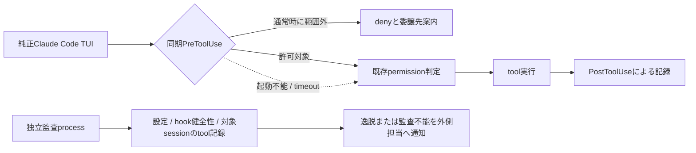

# 純正TUIを維持するPM実行hook

## ユーザー判断と結論

Claude Code本体を変更せず、純正TUI、通常の入力、AskUserQuestion、会話履歴を維持する。
host製UI、print modeへの切替、SDK hostは導入しない。
ユーザー決定により、採用済みPM brokerの操作分類を再利用し、同期command型PreToolUseで通常時の直接実作業を拒否する方式を採用する。
フックが起動しない場合やtimeout時には操作が通り得ることを、採用に伴う既知の残存リスクとして明記する。
別プロセスの監査はこの穴を検出して以後の運用を止める補完であり、実行済み操作を予防に変えるものではない。

ユーザーは完全なfail-closedより純正TUI体験の維持を優先すると決定した。
本書はその優先順位に従う。具体的な検出間隔と対照の妥当性はformal reviewと後工程の実測で確認する。
「障害時も必ず実行前に拒否」という以前の本番受入基準を、そのまま本案の達成基準に使わない。
PR #237の仕様読解とPR #238の隔離fixtureは確定済みの履歴として保持し、改変も再判定もしない。
採用決定に伴い、managerがIssue #236の本番受入を「正常時の拒否と障害時の検出」に改めたことを、Issue本文と機械可読な導入状態へ同時に記録する。設計の採用を本番導入済み状態にしない。

producerはagmsg_architect_codex、実装は別依頼後のagmsg_programmer_codex、formal reviewerはagmsg_reviewer_claude。
今回は設計だけであり、hook、起動設定、実PM、READMEは変更しない。
Issue #239のPATH guard修正も対象外とする。

## 成立範囲と資料

公開仕様ではPreToolUseのdenyまたはexit 2でtool callを阻止でき、他hookのallowよりdenyが優先する。
command hookの起動不能とtimeoutは通常permissionへ戻るため、拒否を保証しない。
PostToolUseは実行後の通知であって取消ではない。[公式hook仕様](https://code.claude.com/docs/en/hooks#pretooluse-decision-control)

根拠の区分は次のとおりとする。

| 主張 | 根拠と確認方法 | 限界 |
| --- | --- | --- |
| 元の問題は注意不足だけではない | Issue #236のbreaker記録とPR #237。入力hook成功後の直接作業が3件 | breakerの引用測定。今回の再実測ではない |
| cwdからPMは確定できない | 正式rosterで同じprojectにowner/PMが存在。前段の`team.sh`確認 | 登録情報だけでも現在のprocessは特定できない |
| 再開recordを単独の認可に使えない | source_headの`actas-claim.sh`と`role-session.sh`を前段で読取。best-effort保存とfirst-match逆引き | 今回は既存契約を変更せず専用の厳格照合を追加する提案 |
| native起動経路に制限を付けられる | 同HEADの`spawn.sh`、`lib/boot-command.sh`、`internal/resurrect-panes.sh`はCLI argvを生成 | hook設定が実セッションに効くことは実CLI試験が必要 |
| 通常時denyと障害時の非阻止 | 本手番で公式hooksの拒否、timeout、起動不能の記述を再取得 | 実CLIの故障試験は未実施 |

ローカル調査基準時刻は2026-09-05T17:45:03+09:00。
codebase-memoryによる前段探索ではscriptsが索引除外だったため直接読取を使用した。
本案は一次資料と同一スレッドの前段調査を基にし、未確認のlive設定を確認済みとはしない。

## 構成と変更箇所

1. 新規`pm-pretool-guard`をPM用起動profileのPreToolUseへ同期登録する。matcherは全toolとし、Bashだけの迂回防止に限定しない。
2. `spawn.sh`と共通boot生成/復元で、対象PMだけにhook profileと厳格なsession bindingを付ける。最終動作は通常の`exec claude ...`で、画面や会話transportを置き換えない。
3. 新規の正式`session-identity`照会APIをagmsg側へ追加し、hookからrosterと現在claimを確認する。hook自身がチームDBを独自形式で読む実装にしない。
4. PMの既存許可操作には固定command helperを使う。daemonやMCP hostは不要で、先行設計の構造化操作を通常のBash toolから呼ぶ。
5. PostToolUse/PostToolUseFailureの記録hookと、これらから独立した読み取り監査jobを追加する。

同一cwdの全席へ`.claude/settings.local.json`だけで一律適用せず、明示team/agentを対象とする起動profileで分離する。
既存の日本語/選択肢リマインダーはそのままにする。
新hookは表示形式を修正せず、操作を拒否する役割だけを持つ。

## session識別とbootstrap

rosterは登録席の集合を示すが、今回のtool callの席を示さない。
hook入力のsession ID、実CLIのprocess個体、起動時に指定したteam/agent、現在claimの4点を結び付ける。
`AGMSG_AGENT`等の任意環境変数やプロンプトのactas宣言だけでは許可しない。

対象PMのnative launcherは、起動前に正式rosterを照合してsession ID、generation、明示agent、CLI processの対応recordを生成する。
launcherからCLIへのexecでPIDを保持し、hookは現在の実行ファイルとprocess開始識別子も確認する。
resumeではsession IDが同じでもgenerationを更新し、並行resumeを混同しない。
このrecordは同じOSユーザーによる悪意ある改ざんを防ぐsecurity境界とはしない。

通常tool callのたびに正式APIでbindingとrosterの整合、claim ownerの一致を確認する。
0件、複数一致、read失敗、stale processは識別不能として拒否する。ただし純正の会話と質問toolは止めない。
これはhookが動いている場合の挙動で、hookそのものの欠落まで拒否できるとはしない。

初回actas前は、起動recordに固定した同一agentへのclaimと、そのprofile/規則の限定読取だけをbootstrap操作として許可する。
任意agentへのactas、unknownをowner扱いするfallback、汎用shellをbootstrap例外にする方式は採らない。
claim完了後は通常判定へ遷移する。
手動起動や既存PMへの初回適用は、外側担当が実sessionとclaimを確認して対応付けた後、同じnative launcherで再開する。
識別未確立のセッションを「hook導入済みPM」と報告しない。

## 拒否範囲とPMに残す操作

hookは目的をLLMに推測させず、tool名と構造化入力を照合する。
対象PMの任意Bash、PowerShell、コード実行、調査用Web/GUI/MCP、任意file操作、任意子agent起動を拒否する。
未知toolも既定拒否とし、nativeの会話/質問等の非実作業toolだけを明示許可する。
読み取りでも一般のコード調査や一覧集計は委譲対象である。

| PMの必要操作 | 通す条件 |
| --- | --- |
| agmsg送受信と委譲 | 正式scriptの固定実体、同一sender/対象team、literal引数だけ。本文はデータとして渡す |
| Monitor | 既存watch.shの固定実体、現在session/型、exact role指定だけ。別command、roleなし購読、追加shell式は拒否 |
| actas/dropとMonitor停止 | bindingの同一role、自己所有のtask IDだけ。dropは席終了扱いで、その後の汎用作業は許可しない |
| 規則読込と記録 | 起動資料manifestの固定file読取、指定PLAN/NOTESへの構造化記録だけ。任意source探索は不可 |
| git保守と代理実行 | PR #237の`git_maintenance`、`sync_origin_clone`、`proxy_git_write`の条件をhelperが再検証 |
| 体制構築と決定反映 | PR #237の`team_provision`、`bot_collaborator`、`apply_decision`、`stale_runtime_cleanup`の条件をhelperが再検証 |
| 特定Issue/PRと席操作 | 指定対象の状態取得、コメント、固定profileの起動/停止。一般調査の一覧APIへ拡張しない |

許可commandの先頭一致だけでは通さない。
shell構文を限定して単一の固定実行fileとliteral argvへparseし、pipe、リダイレクト、command substitution、変数展開、連結、任意wrapperを拒否する。
メッセージ等の複雑な入力は固定helperへのbase64url JSONなど、shell展開を必要としないデータ引数で渡す案とする。
helperはdecode後にschema、対象、権限を再検証し、文字列をevalしない。
既存agmsg scriptをそのまま通す場合も、quoteの扱いを含む同じ構文制限を満たすことを受入条件とする。

許可側ではhookから一律allowを返さず、既存permission判定を維持する。
拒否側は理由と委譲対象を返しexit 2で停止する。
他hookが入力を書換える構成は別途対照を取り、未確認なら対象PMへの併用を開始しない。
Monitor等の拡張toolが実際にPreToolUseを通ることも必須試験とする。通らない実行toolが残る構成は「通常時拒否」の達成対象から黙って除外しない。

## 障害時の既知リスクと軽量な補完

guard内部のparse、roster、claim読取失敗は捕捉してexit 2を返す。
guard内の照会deadlineを2秒、外側hook timeoutを5秒とする初期案で、通常時の余裕を実CLIで測定する。
捕捉可能なエラーを拒否へ変換しても、プロセス未起動、SIGKILL、外側timeout、不正設定でhook自体が発火しない場合は防げない。
この場合は通常permission次第で直接作業が実行され得る。

補完は同じhookだけに依存させない。
独立監査jobを60秒周期で動かし、対象sessionの限定tool metadataとhook診断、設定/script digest、bindingを読み取る案とする。
PostToolUseは迅速な補助通知であり、それが欠落しても監査jobがtool記録とPreToolUse判断recordを突き合わせる。
判断recordはsession/generation/tool_use_id/input digest/decision/policy versionだけを保存し、本文や秘密値は複製しない。
許可したBashには正常な連絡も含まれるため「Bashを使っただけ」で違反扱いせず、許可操作との一致を調べる。
対応する判断recordのない実行、deny後の実行、未許可command/tool、監査対象消失を警報対象とする。

監査jobは毎周期heartbeatを記録し、別の既存監視経路が180秒以上の欠落を監査不能として表示/通知する。
通知先は現PMだけでなく、導入時に指定した外側operatorとユーザーの既存通知経路とする。
通知先と実際の到達をpilotで確認できなければ導入しない。
60秒/180秒は検査設定であり、OS停止や通知障害を含む到達時間保証ではない。

健全性確認は起動/再開時、設定更新時、定期監査で行う。
存在/digest確認に加え、別の使い捨てprobe processで拒否用入力をguardへ渡してexit 2を確認する。
probeの結果はhook関数の健全性だけを示し、実PMでの発火証拠とは区別する。
実セッションの初回無害拒否試験と定期的な実行記録照合で、その差を補う。

警報時は外側operatorがPMへの新規実作業投入を保留し、証跡を確認してhook修復とnative再開を行う。
対象processが一意に確認できない場合、推測でkillしない。
自動ロールバックや実行済み変更の自動取消は行わない。
hookと監査が同時に壊れる場合、記録未flush、記録形式変更、改ざん、OS停止、未捕捉toolは残存リスクとなる。
監査は後続事故を減らす措置で、最初の1回の副作用を救済しない。

## 評価と導入前の対照

元の事故は、正常に動くPMが委譲規則を適用せず、Bashでfetch、branch棚卸し、PR一覧取得をしたものだった。
本案はその同じ正常経路を同期denyで止めるため、注意文だけより直接的な抑止になる。
ただし抑止率の実測値はなく、悪意ある迂回や障害時まで十分とする根拠はない。
「通常の委譲忘れを阻止し、阻止機構の故障を可視化する」という目標に対して条件付きで妥当と評価する。
完全防止の代替として同等とは評価しない。

| 条件 | 実CLIで必要な正負対照 |
| --- | --- |
| 元の3操作 | guard正常時はPMのmarker 0、同じstubが委譲先では1。hook deny表示だけでは合格にしない |
| PM正常運用 | native TUI/質問/履歴、actas、role限定Monitor、送受信、7操作の許可条件が通る。一般調査fetchは拒否し保守fetchは許可 |
| 構文と別tool | 連結、絶対path差替え、quote内外の展開、rtk、他shell、MCP、Monitor別command、子agentの各迂回を拒否 |
| identity | 同cwd ownerは影響なし。偽agent、role変更、stale/並行resume、roster欠落/複数一致でPMの実作業を拒否 |
| guard内部故障 | parse不正と照会timeoutをexit 2へ変換しmarker 0 |
| guard外側故障 | hook削除、非実行可能、SIGKILL、外側timeoutでは、許可済み無害stubが通り得ることを確認し、独立監査が検出する。ここでmarker 0を必須にして実際の穴を隠さない |
| 監査独立性 | PostToolUseを止めても実行記録から逸脱検出。監査jobを止めると別監視がheartbeat欠落を検出。全部停止なら保証なしと記録 |
| hook相互作用 | 他hookのallow/updatedInput、実permission mode、プラグインtoolを含む組合せで実際の到達と最終実行を確認 |
| 通知と復旧 | 対象PMと外側担当へ通知が到達し、既存native TUIへ修復再開できる。未処理依頼と履歴を失わない |

試験は新しい隔離実CLI試験で行い、PR #238 fixtureは変更しない。
固定HEAD、CLI版、hook/profile digest、value/cutoff/source/command、到達時間、tool IDとmarker生出力を独立packetへ残す。
最初はagmsg内の検証席だけで試し、reviewer受入後に現PMへ適用する。
全チーム一斉適用はしない。
本書保存時点では全試験が未実施であり、導入効果は設計評価である。

## 採用決定と次工程

ユーザーが採用した対象は「純正TUIを維持する同期hook拒否と、既知の非阻止障害を補う独立監査」である。
この変更で先行の完全fail-closed本番条件から保証を弱めること、監査前に1回以上の操作が走り得ることを明示的に受け入れる。
今回の依頼は設計PRの作成までで、実装起点依頼は設計確定後にmanagerが別途行う。実装/実測/導入は別工程とする。
却下されたhost/UI案は参考として残すだけで、そこへの再移行や隠れたfallbackは設けない。
