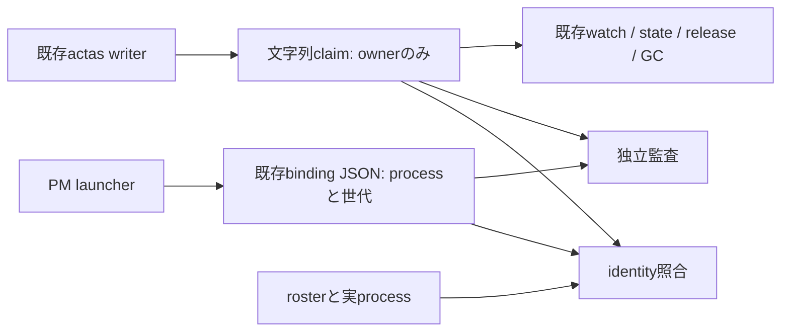

# claim所有者とPM bindingの統合契約

## 結論と範囲

**既存の文字列claimを排他所有者の唯一の正本として維持し、PMの追加属性には既存binding JSONを使う。**
ユーザー決定により案Dを採用し、`session-identity.js`と`pm-audit.js`のclaim読取を、この既存形式へ同時に合わせる。
新しいJSON claimや二重の所有者台帳は追加しない。
形式統一とは全ファイルをJSON化することではなく、同じclaimパスに対するwriter・readerの契約を一致させることである。

本書の一つの主張は「既存排他ロックを変えず、PM identityと監査を接続する契約」である。
設計のみを起草し、実装は別依頼後のagmsg_programmer_codex、formal reviewはagmsg_reviewer_claudeが固定HEADの全差分へ行う。
実claim、起動設定、READMEは変更しない。
P2 pilot・P3現PM交代・P4横展開、broker操作分類の再設計、PR #238の旧fixture変更は対象外とする。
純正TUIを維持し、hook不発・timeout時は実行を防げないという採用済みリスクも変更しない。

## 一次資料と原因

確認日時は2026-09-05T20:57:39+09:00、読取対象はsource_headとする。
codebase-memoryの再索引ではscriptsが除外され、symbol検索にも対象実装が出なかったため、当該ソースを直接読んだ。

| 主張 | value / cutoff / source / command | 未確認・限界 |
| --- | --- | --- |
| #241はマージ済み | MERGED / source_head / [PR #241](https://github.com/kappaseijin/agmsg/pull/241) / `gh pr view 241 --repo kappaseijin/agmsg --json state,mergeCommit,files` | マージは本番導入の証明ではない |
| writerは文字列 | `printf '%s\n' "$sid"`とhard linkによる公開 / source_head / `scripts/lib/actas-lock.sh`の`_actas_lock_try_claim` / 当該関数の直接読取 | 今回は実claimを作成していない |
| 既存readerも文字列 | `actas_lock_owner`、`release_all`、`gc_stale`が`head -1` / 同HEAD / 同ファイル / 各関数の直接読取 | JSON化するとowner比較と生存判定が一致しなくなる |
| PM readerはJSON | `readJson(claimFile, 'claim_unreadable')` / 同HEAD / `scripts/session-identity.js` / 末尾のclaim照合を読取 | 既存writerの正常出力を受け入れない |
| 監査もJSON | `readJson(claimFile, 'claim_unavailable', alerts)` / 同HEAD / `scripts/pm-audit.js` / claim照合を読取 | identityだけ直しても監査に不整合が残る |
| テストが実writerを代替していた | claimをJSONで直接生成 / 同HEAD / `tests/test_pm_pretool_guard.bats`と`tests/isolated/test_pm_pretool_guard_real_cli.sh` / setup・launcher部分を読取 | 既存writerとの組合せを証明していない |

Issueの[P2前提整理](https://github.com/kappaseijin/agmsg/issues/236#issuecomment-5551590113)と矛盾しない。
テストの偽陰性条件は「readerに都合のよい形式をテスト自身が書き、実writerを通らない場合」である。
対照には既存writerが生成したclaimを使い、JSON自己生成の成功だけを受入根拠にしない。

## 代替案

| 案 | 既存consumerと稼働claim | 評価 |
| --- | --- | --- |
| A: 全claimをJSONへ移行 | writer、owner/state、release、GC、稼働中旧readerまで協調更新が必要。既存文字列の移行と旧processの排除も必要 | 全ロールに影響する移行をP2の前提として増やすため不採用 |
| B: JSON claimを別パスへ新設 | 既存claimは保てるが、所有者と世代を二つのclaimへ書く順序・失敗回復・削除の同期が必要 | binding JSONとの重複になるため不採用 |
| C: 同一パスのdual-format reader | 全旧consumerもJSON対応させない限りJSON writerを投入できない。文字列側には世代情報がなく、形式ごとに保証が異なる | 一時fallbackの終了条件が増えるため不採用 |
| D: 文字列claim＋既存binding JSON | 既存writer・consumer・claimを維持。新PM readerと監査を修正 | 採用。所有者と追加属性の責務を分離する |

## データ契約

| 正本 | 保存する事実 | 照合方法 |
| --- | --- | --- |
| `run/actas.<encoded-team>__<encoded-agent>.session` | 現在の排他所有者token | PMでは`${sessionId}.${pid}`との完全一致 |
| 既存binding JSON（schemaVersion 1） | team、agent、type、canonical project、sessionId、pid、pidStart、generation、各digest、policyVersion | launcher selector、hook入力、roster、実processとの照合を維持 |
| 正式roster | 登録席とtype/project | 一意一致を要求。0件・複数・読取不能は識別不能 |

claimのパスエンコードは既存`actas_lock_path`と同じUTF-8 byte percent encodingを使う。
文字列claimはJSONとして解釈しない。
PM用readerは期待するowner文字列だけ、またはその直後に単一LFがある内容のみを受け入れる。
空、JSON、追加行、CRやNUL等の追加文字、別owner、欠落、読取失敗は拒否または監査alertとする。
前後の空白をtrimして一致させない。
これは新PM readerの厳格さであり、既存全ロールのparserを変更する要求ではない。

既存のbare session ID fallbackは通常席では引き続き既存契約に従う。
PM認可ではbare SIDをcompositeと同一視しない。
PIDを確定できないPMは未確立として停止し、運用担当が正式なclaim経路で再確立する。
既存claimからgenerationやpidStartを推測・補完しない。

## 読取・世代・競合の契約

1. identityはbindingの必須項目・selector・hook入力・canonical project・rosterを検証する。
2. 現行のprocess開始token、祖先関係、`agmsg_instance_alive`による生存照合を残す。
3. team/agentから導出したclaimを読み、期待ownerと完全一致させる。
4. 成功返却前にbindingの内容とclaimを再読し、最初の読取と同じであることを確認する。変化・欠落・失敗は識別不能とし、再試行によって別世代へ追従しない。

共通のclaimパス生成・厳格読取・owner比較を小さなmoduleへ集約し、identityと監査が使用する。
監査はhookの子孫ではないため、identity CLI全体をそのまま呼び、祖先検査を適用する方式にはしない。
`AGMSG_PM_CLAIM_FILE`は監査でも自由な代替正本にしない。
維持する場合はbindingのteam/agentと同一skill rootから導出したパスとの一致を必須とし、別ファイルへの差替えはalertとする。
隔離試験はskill rootを隔離することで成立させる。

claimから削除する照合項目は、元々本番writerが保存していなかったproject・generation・pidStartである。
これらはbindingと実process側で照合し、claim自身が保証しているとは記述しない。
世代ごとにbindingの保存先を分け、起動中の同一bindingを更新しない。
resumeでは新generationを発行し、旧bindingを上書き・再利用しない。
generationはlauncherが管理する属性であり、文字列claimに独立したgeneration証明は存在しない。
pidStart照合と祖先照合は維持するが、任意の同一ユーザーによるbinding改ざんを防ぐ境界にはならない。

再読は途中の所有者変更を検出する補助であり、同値へ戻るABAや返却後の変更まで排除する原子的認可ではない。
既存delivery gateをtool実行終了まで保持する設計には拡張しない。
同一processのrelease→reclaimを別世代のclaimとして区別する要求が生じた場合は、nonceを含む全writer協調プロトコルの別設計が必要となる。
本案はそこまでの保証を追加せず、既存claimのprocess所有権と採用済みhookの範囲を維持する。

## 既存consumerへの影響

`actas_lock_owner/state/claim/release/release_all/gc_stale`のファイル形式・公開方法・delivery gateを変更しない。
`watch.sh`、`lib/subscription.sh`、`check-inbox.sh`、`despawn.sh`、`doctor.sh`、`spawn.sh`、`internal/resurrect-panes.sh`等の既存読取経路にも形式変更を要求しない。
`whoami.sh`を含む既存identity導出の利用経路も回帰対象にする。
既存処理のfail-open分岐等を本変更へ混ぜない。

実装対象は共通claim reader、`session-identity.js`、`pm-audit.js`、#241の二つの試験と必要な統合試験に限定する。
新binding writerの本番配線はP2導入工程で扱い、本修正PRだけで導入済みとはしない。
先行設計の「現在claim」は本書の文字列ownerを意味し、JSON claimを生成する指示として解釈しない。

## 移行手順と停止条件

1. programmerは隔離rootで修正する。既存正式writerでclaimを生成し、readerと監査を同時に切り替える。稼働中のrunファイルは触らない。
2. 固定HEADの全差分をreviewerへ渡し、既存lock回帰と新PM受入を通す。PR #241の過去PASSを代用しない。
3. 配布時はreaderと監査を同じ修正版へ揃え、digest/profileをその版に対応させる。混在版をpilot可能と報告しない。
4. 既存の文字列claimは移行不要でそのまま存続させる。全席停止・再claim・JSON変換・一括GCをしない。
5. P2対象PMだけ別途承認済みのnative起動経路でbindingを確立し、正式claimと照合する。既存PMへの勝手なhot attachはしない。
6. 実claimにJSONや異常内容が疑われた場合はP2を停止し、正式診断経路で対象とownerを確認する。自動変換・削除・旧形式fallbackはしない。

rollback時もclaimは変更しない。
JSON reader版へ戻す必要がある場合はPM pilotを停止し、その版を有効な本番保護として稼働させない。
bindingの残骸を削除する場合も対象世代とprocess終了を確認する別運用とし、claim cleanupへ結合しない。

## 受入観点

| 試験 | 期待結果 |
| --- | --- |
| 隔離rootの正式`actas_lock_claim`が書いたcompositeを新readerへ渡す | 一致するbinding・roster・生存process条件で成功 |
| 同じclaimを既存owner/state/watch経路へ渡す | 従来のownerとmine判定を維持し、配送試験も回帰しない |
| 正式release・release_all・stale GCと並行claim競合 | 既存排他と削除条件を維持。新PM bindingを必要としない |
| JSON claimを同じパスに置く負の対照 | identity拒否、監査alert。成功へfallbackしない |
| bare SID、別PID、同SID並行resume、stale process、偽pidStart、別generation selector | PMは拒否。通常席のbare SID契約は既存試験どおり |
| 欠落・空・追加行・追加空白・読取不能・不正claimパス | identityは成功せず、監査も正常扱いしない |
| 読取中のclaim交換・binding交換を同期して注入 | 不一致を検出。単なるsleep依存試験にしない |
| team/agentに空白・日本語・percent・underscoreを含む対照 | 既存パス生成と一致し、異なる名前は衝突しない |
| #241実CLI試験のclaim生成を正式writerへ置換 | 正常拒否・Monitor・identity anomaly等の既存観点を維持 |

追加世代試験はbindingのみを壊す場合、claimのみを壊す場合、両者を同時に偽装する場合を分ける。
pidStart偽装ではJSON claimを編集する旧試験手順を残さず、bindingと実processの対照を使う。
本手番はソース調査と設計起草のみであり、これらの試験を実行済みとは主張しない。
PMは統合修正の受入が終わるまでIssue #236のP2未着手を維持する。
