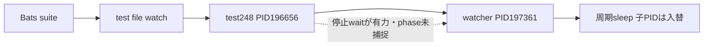

# 結論

**停止していたのは248番のbroad watcher試験であり、247番の試験後に全suiteが完了していたわけではない。**
GitHubの30分上限でcancelされたことは確定した。
保存sampleには同じBats test processとそのwatcher子が長時間残り、watcherはsleepを繰り返している。
親の無期限waitが最有力の停止境界だが、syscall/wchan/phaseが未保存なので断定範囲はtest248と親子生存までとする。
最小案は対象の停止待機を既存deadlineへ接続し、signal・wait・終了のphaseを記録して、時間切れを明示的なtest failureとして返すこと。
TERMが効かなかった理由やproduction watcherの欠陥を確定したとは扱わない。

実装、無変更rerun、timeout延長、試験除外、#260のmerge巻戻しは行わない。
README影響なし。#261の失敗表示問題や#255のWindows cleanupとは独立した主張とする。

## 証拠パケット

確認日時はfrontmatter。run33992757299、固定HEADはfrontmatter。
workerがGitHubから取得した原artifactをarchitectが直接読んで判断した。新たなLinux実行ではない。

| value | cutoff / source / command | 意味と限界 |
| --- | --- | --- |
| 最後のokは247。次の出力まで約24分14秒 | [job101377861519](https://github.com/kappaseijin/agmsg/actions/runs/33992757299/job/101377861519)、491–492行。`gh api --allow-escape-sequences repos/kappaseijin/agmsg/actions/jobs/101377861519/logs` | 最後の成功番号は実行中番号ではない |
| maximum execution time 30m0s、job cancelled | `gh api repos/kappaseijin/agmsg/check-runs/101377861519/annotations`。固定workflow timeout-minutes=30 | 外部cancel主体は上限。job metadataのtimeout_minutes=nullから上限不明とは結論しない |
| sample13〜46にtest248のPID196656と子watcher197361 | [artifact9977550802](https://github.com/kappaseijin/agmsg/actions/runs/33992757299/artifacts/9977550802)、`hang-samples.txt` | test名・suite番号・親子関係が直接記録されている。sample13から46は約16分33秒 |
| sample44/45/46でも同じ親子、watcher配下sleepは入替 | `last-3-hang-samples.txt`のprocess表 | watcherは少なくとも周期処理を続ける。全体が停止したとは言わない |
| watcher FD1は61byte broad.log、FD4は通常ファイル248.out。TAP pipe14435をwatcherは保持していない | 同抽出のlsof、PID197361のdescriptor一覧 | FD4閉じ忘れだけをTAP EOF待ちの根本原因としない。FD142/145の共有も待機の証明ではない |
| 親196656はFD2=/dev/null、FD13=248.out。outは0byte | 同抽出のlsof | stderrを退避した`wait ... 2>/dev/null`と整合するが、実行行/カーネル待機状態の直接証拠ではない |

原資料rootは`/tmp/agmsg-issue261-262-JRCJBt/`。
run/job metadata、`artifact.zip`、`artifact/hang-samples.txt`、`last-3-hang-samples.txt`、`run.artifacts.json`を保持する。
runのhead_shaは依頼値と一致。取得はkappaseijin/agmsg GitHub APIのみ。
raw artifactは46sampleで終わり、cancel直前約7分半は定期sampleがない。別のjob終端forensicsと混同しない。
samplerはps -efとlsofであり、wchan/syscall/待機先を記録していない。

## manifestの扱い

指定bats-manifest-ubuntu-latest-1はrun artifact一覧に存在しない。
workflowのRecord which files this shard ranはcancelでskipされた。取得不能を空manifestに変換しない。
ただしsamplerのbats argvには実行ファイル列があり、test248の名前・番号はbats-exec-test argvから直接取得できる。
これは保存manifestそのものではないが、対象特定の独立した一次資料になる。
全件の実行完了や未実行件数はこの特定と別であり、推定していない。

## 固定sourceとの対応

`tests/test_watch.bats:974`の対象試験はwatcherを起動、messageを送信、出力markerを確認、生存中のsentinel不在を検査し、最後に`_stop_watcher "$w"`を呼ぶ。
`_stop_watcher`はkillとwaitの両方を`2>/dev/null || true`で処理し、wait自体にはdeadlineがない。
marker待ちは`tests/test_helper.bash:641`の既存deadlineを使う。
markerの内容はartifactにないので、broad.logが61byteだからmarker確認済みと断定しない。
`scripts/watch.sh:435`付近はEXIT cleanupとINT/TERM/HUPでexitするtrap、末尾はsleepをbackground起動してwaitする形である。
signal送信時刻・rc・対象世代・trap受信phaseがないため、signal失敗、trap実行、cleanup内待機をまだ分離できない。

構造は保存sampleの観測、点線のみ仮説。
247のokだけで247を修正対象にせず、test248が終了することとBats/xargs/stepが終了することを別々に確認する。

## 最小案と保持する失敗検出

1. 対象testの停止経路にstop-request、signal-result、wait-enter、wait-exit、test-endを記録する。PID/PPID/開始識別子、rc、実行側時刻を付け、stderrを捨てず秘密のない専用packetへ残す。production loopへ先に手を入れない。
2. `_stop_watcher`の停止確認を既存`wait_for_pid_exit`のdeadline/unknown判定へ接続する。消失確認後にchildをwaitして終了値を回収する。kill失敗を機械的に成功とせず、既終了/生存/unknownを区別する。既存のsignal終了をどこまで期待値として扱うかは明示し、全nonzero無視を廃止する。
3. timeoutならその場でtestを失敗にし、fixture-ownedと確認できる残留PIDだけを別cleanupで回収する。回収失敗・状態不明を保持し、主失敗を上書きしない。PID再利用/他rootをkillしない。生存中のfixtureを消して診断材料を失わない。
4. 観測がTERM未送信/別PIDならcallerだけ、TERM受信後cleanup停止ならその境界だけを次の修正対象とする。証拠なくtrap変更・強制kill常用・watch仕様変更へ広げない。

deadline導入は「停止不能を成功にする修正」ではなく、無期限待ちを局所失敗へ変える最小是正である。
停止不能の根本修正と診断の正常化を混同しない。共通helper変更時は全callerの失敗伝播も回帰対象にする。

## 対照と受入条件

偽陰性は「対象testのokだけを見て、残留子またはBatsの未終了を見落とす」条件で起きる。
fixture-owned watcherがTERMを受けても終了しない負対照で、deadline内のnonzero・残留packet・回収完了までを要求する。
通常TERMで終了する正対照、既終了、signal権限/状態unknown、foreign PIDの対照を分ける。
reader pipeを保持する別childの対照ではtest終了とsuite EOFを区別できることを確認し、今回そのchildが原因だったとは扱わない。
最終受入は対象248自身の結果、直後testへの進行、Bats/xargs/step終了、fixture-owned残留なし、必要CI全pass。
採否はbreaker、実装はprogrammer、独立実測はverifier、formal reviewは固定HEAD全差分のClaude reviewer。
