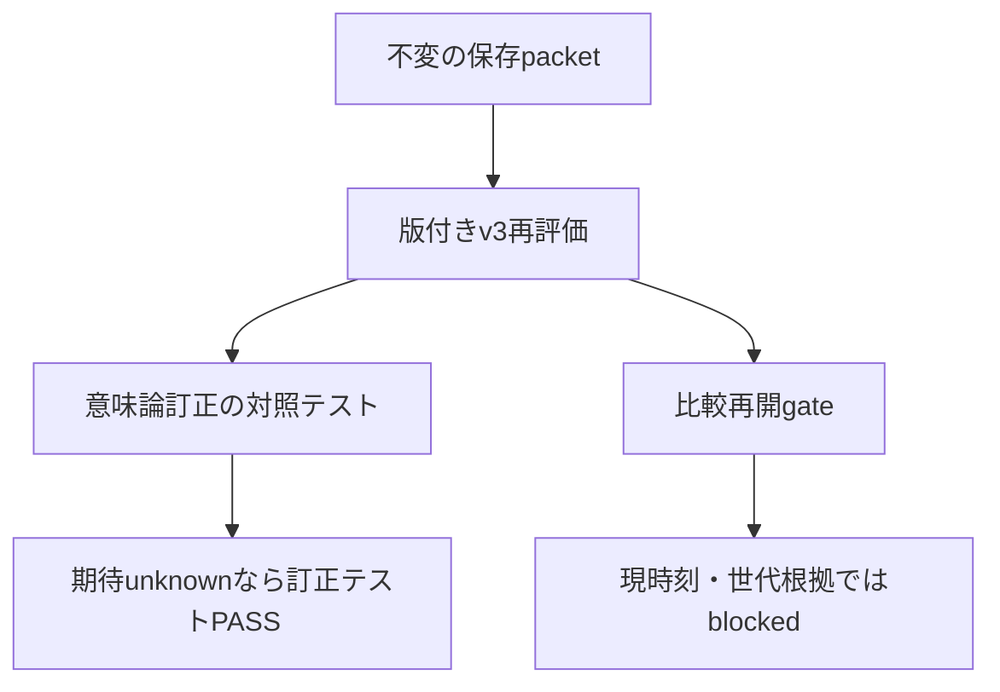

# 一件の主張と対象

WMI通知の生成時刻を実プロセスの生存時刻とする前提を、旧・新評価器とその契約・試験から一括して除く。
通知捕捉の成功と実時刻・実世代の確定を分離し、裏付けのない値をunknown/nullにする設計である。
起点は[breaker断定](https://github.com/kappaseijin/agmsg/issues/255#issuecomment-5555456729)。
producerはagmsg_architect_codex、formal reviewerはagmsg_reviewer_claude。
review対象は本設計PRの固定HEAD全差分。rosterのtypeはそれぞれcodex/claude-codeで確認した。
実装は別起点依頼でprogrammerへ渡す。本PRはdocs-only、Refs #255でありIssueを閉じない。
GetProcessTimes実験、新backend、fixture変更、3条件比較、PR #263のmergeは対象外。
ユーザー向け機能・設定変更はなくREADMEへの追記は不要。

# 根拠パケット

確認日時: 2026-09-06T08:22:00+09:00。

| 項目 | source / command / value | cutoff・限界 |
| --- | --- | --- |
| 旧評価器 | main `2f968ba`、`rtk git cat-file blob origin/main:tests/windows/process-lifetime-collector.ps1` | Evaluate-Recordsが通知時刻差からlifetime/holdとkill前後を算出。generation文字列一致も実世代の独立証拠ではない |
| 新評価器 | PR #263 `cb0f903d9a4fbbe4ff8c7219e2b28ad122611cb0`、同SHAの`tests/windows/lifetime_packet.py`をcat-fileで取得 | root binding、親子所属、possible、世代ペア、stop_relationまでイベント生成区間に依存 |
| 実行識別 | [run33997760834](https://github.com/kappaseijin/agmsg/actions/runs/33997760834) | manifestのcollector HEADは`bb44b611a429c09ec91c37a63707157719823f2e`。PR HEADとの同一tree確認はbreakerによる測定の引用で、自分の独立測定としない |
| 保存packet | [artifact9978574473](https://github.com/kappaseijin/agmsg/actions/runs/33997760834/artifacts/9978574473) | root bindingよりstart通知生成が239.0374ms後。child通知間隔2tickを実寿命と認定しない |

[StartTrace](https://learn.microsoft.com/en-us/previous-versions/windows/desktop/krnlprov/win32-processstarttrace)と[StopTrace](https://learn.microsoft.com/en-us/previous-versions/windows/desktop/krnlprov/win32-processstoptrace)のTIME_CREATEDはイベント生成時刻である。
UTC/FILETIMEという形式の一致は、開始・終了という出来事の一致を証明しない。
固定offset、許容幅、受信時刻への置換、条件式削除によるknown化はいずれも採用しない。

# 派生評価の契約

raw packetと既存artifactは不変にする。
訂正結果は別名`packet.evaluation-v3.json`で保存し、`evaluation_schema_version=3`、`evaluator_revision`（固定commit）、`source_packet_sha256`、`source_packet_schema`（旧形式はlegacy）を必須とする。
packetのschema_versionを3に書き換えるのではない。旧summaryの上書きや旧knownの継承は禁止する。
未知schema、破損、複数run混在は評価unknownと理由を返し、旧形式へ推測fallbackしない。
旧既定summaryだけを読む経路は受入に使わず、v3対応がないconsumerは再開gateを通せない。

## 四つの品質と集約

| 品質 | knownにできる事実 | unknownとなる条件 |
| --- | --- | --- |
| notification_capture_quality | 要求PIDについて必要な通知レコードが保存され、購読開始/終了・packet完結が確認された | 欠落、破損、購読不明。knownでもOS全イベントの完全捕捉は意味しない |
| clock_format_quality | rawが範囲内の整数FILETIMEで、UTC変換・単位が解釈可能 | 不正値、形式不明。通知時刻であるという意味は変えない |
| process_time_quality | 実プロセスの開始/終了を意味する採用済み時刻源が対応する同一個体についてある | 現WMI-onlyの旧/新packetはunknown |
| process_generation_quality | PID再利用を排除できる同一個体の独立証拠がある | PID一致、通知数一致、raw時刻順だけならunknown |

品質は全体と対象PID/operation別に持ち、各reasonに対象record IDを添える。
全体knownは必要対象の全品質・所属・operation境界が成立するときだけとする。
`comparison`/`collector_quality`など既存の集約欄を残す場合もunknownから昇格させない。
`uncaptured=unknown`、`termination_actor=not-determined`を維持する。
通知捕捉knownと実世代unknownは矛盾しない。生のgeneration_quality=knownは旧生産者の主張として保持するが、v3が信用する根拠にはしない。

## 値と因果判断

| 欲しい判断 | 現packetから取得できる範囲 | v3の派生結果 |
| --- | --- | --- |
| rootがどの個体か | bindingのPID、CreationDate、match、通知に記載されたPID | binding観測を保存。通知との世代対応/root所属の確定はunknown |
| 子がroot配下か | 通知のParentProcessID、required-processの報告 | reported_parent_pidと候補を保存。親世代・確定所属はunknown |
| 同PIDのstart/stopが同一世代か | run、レコードID、PID、通知生成時刻 | 観測候補IDのみ。実generationはunknown。時刻順で区切って確定しない |
| 寿命/hold | 通知生成値、operation actor値 | lifetime_ms/hold_ms=null。通知差を表示するならevent_generated_span_msと明記し、候補間差であって実寿命ではない |
| killがどの個体を対象にしたか | operation_id、引数PID、出力PID、rc、begin/endの報告 | 操作記録の完全性とPID候補は出す。実世代mappingはunknown |
| stopがkill前/中/後か | event生成値とactor値 | stop_relation/reaper_judgment=unknown。停止原因はnot-determined |
| subject成功と評価成立 | subject-resultの終了状態・rc | rc=0/7を改変せず独立保存。rc0だけで品質knownにはしない |

operation記録のbegin/endが一対で形式正常なら、その記録完全性はknownとできる。
ただし実プロセスへのmapping品質と同じquality欄に混ぜない。
旧taskkillはbegin相当のactor時刻だけでend境界がないため、endをreceiptから補完しない。
MSYS/native PID対応も宣言値を保存するだけでは実世代を確定しない。
将来、実時刻と世代が成立しても時間的な前後だけではkillが原因だったとは断定しない。

## 欠落と対応不明の区別

要求PIDについてrawのstartが0件なら`missing-start-notification`、stopが0件なら`missing-stop-notification`。
通知は存在するが実時刻は不明なら`process-time-unproven`、世代は`process-generation-unproven`、所属は`scope-unproven`とする。
複数候補は`notification-association-ambiguous`とし、候補選択に失敗しただけでmissingとしない。
同PIDに別個体のstopがある場合、件数が非0でも必要個体のstopが揃うとは言わない。実世代不明を残す。
理由は集合として併記し、一つの早期returnで他の欠落や対応不明を隠さない。
関係未確定のrawレコードも派生評価から消さず、source record IDで追跡可能にする。

# 旧・新経路への一括適用

| 対象 | 設計上の変更責務 |
| --- | --- |
| 旧PowerShell Evaluate-Records / New-UnknownSummary | 通知品質と実時刻品質を分離。最初のstart/stopと旧generation文字列からのknown化・寿命/kill順序算出を停止 |
| 旧Get-Generation / Write-ProcessTraceRecord / Invoke-RecordedTaskkill | 既存rawは変更しない。新規出力でも文字列生成を実世代knownと呼ばず、評価で再確認する。taskkill動作・fixture寿命は変更しない |
| 新Python evaluate / possible | root・parent・required・operationの全経路で時間区間による確定を除き、観測候補と未証明項目を返す |
| replay/run/preflightと試験 | v3派生出力と元hashを検証し、意味論訂正テストのPASSと比較再開許可を別にする |
| #260設計・#263適用契約・PR本文 | 旧preflightは通知捕捉と欠測対照に限定。実寿命・実世代・kill前後の受入済みという記述を明示的に撤回 |

旧artifactの再評価は派生v3だけを追加し、旧証拠を削除・書換えない。
過去のGitHubコメントは訂正リンクで失効範囲を示し、履歴を隠さない。

# 最小の判別対照と独立受入

偽陰性の典型は「入力rawは変わらないのに旧knownを信用し、unknownであるべき個体対応を通す」ことである。
そのため正常通知と不成立の実時刻対応が共存する保存packetを正対照にする。

| 対照 | 期待値 | 検出したい誤り |
| --- | --- | --- |
| 保存済み旧/新packetと旧known欄 | raw hash不変、通知存在を報告、実時刻/世代unknown、寿命null | 旧summaryまたはgeneration_qualityの盲信 |
| 遅延通知・行順逆転 | 安定record IDで同じ観測集合、実時刻/世代unknown | 到着順・TIME_CREATED順を実生存順へ読み替える |
| 同PID別世代を含むsynthetic入力 | 複数観測候補を保持、世代unknown | 次startで区切れば確定するという前提 |
| 必要stopを除く、無関係PIDのstopは残す | 必要PIDのmissingを報告、全体unknown | どこかにstopが一件あれば通る検査 |
| subject rc0/7、破損/時計不正/操作境界欠落 | subject rcは保持、各品質理由を独立報告、比較再開不可 | subject成功、形式正常、評価コマンドrc0を受入と誤認 |

行順対照はpayloadのrecord IDを固定した並べ替えとする。ID自体がない旧形式ではsource hash/元行番号で識別し、比較は観測集合の意味に限定する。
同PIDの別世代stopだけ残る対照も追加し、missingを断定できない場合でも対応unknownを落とさない。
元ファイルとは別コピーに対照変形し、変形内容・元hash・派生hashを証拠へ残す。
独立verifierは固定HEADで旧/新評価器の共通期待値を確認し、value/cutoff/source/commandと生出力を記録する。
formal reviewerは固定HEAD全差分を一括走査する。起草者の自己確認を独立検証と呼ばない。

訂正テストのPASSからgate.jsonのacceptedを生成してはならない。
評価コマンドが正常終了しても、比較preflightは未成立である。
一般子孫を含む必要時刻・世代・operation境界の根拠、採用契約、固定HEADの独立実測が揃って初めてbreakerへ再開判断を返す。

# 次案に残す範囲

必要なのは、同一個体の開始/終了、親子の個体対応、操作の実境界、必要子孫の捕捉範囲を区別できる証拠である。
GetProcessTimesは制御下の同一handleに対するcreation/exit取得候補だが、一般短命子孫への適用成立性は未確認。
ETWも本件に必要な世代・操作対応が成立するか未調査であり、名前だけで解決案としない。
次案の最小対照は「制御下個体は取得できるが、通知前に終了する一般子孫は未取得」という境界を再現するものとする。
同PID再利用・操作境界近傍の終了・通知遅延を分けて判別し、未取得個体をunknownに残せることが必要である。
これは将来案の要件であり、実験や新backendの着手許可ではない。
