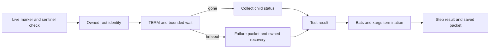

# One claim

A broad-watcher stop failure terminates locally with nonzero and a diagnostic packet, without overwriting the live sentinel assertion. The existing production watcher, shared `_stop_watcher`, other watcher callers and #255/#261 are unchanged.

The adopted source contract is `2026-09-06T071632_issue-262-shard-stop-boundary.md`, SHA256 `910b0c88903411904ba8536c116e803ef92d42f1c1e96f24c53b49e8ec69aa8d`. The latest origin request authorizes the separate #262 branch without waiting for #255.

# Implementation boundary

- Only the broad-watcher test uses `watch_stop_helper.bash`. Registration records direct-child PPID, PID, process start identity and expected fixture script. Linux uses `/proc/PID/stat` start ticks; other POSIX hosts use the existing-style `ps lstart` identity together with direct parent and unique fixture path. No assertion of subsecond timestamp precision is made for the latter.
- Stop records actor time, stop-request, TERM result, wait-enter/exit, child status, recovery and test-end. `wait_for_pid_exit` supplies the existing deadline and conservative absence check. Only confirmed-gone children enter Bash `wait`; normal exit 0 and TERM exit 143 are expected, other child statuses fail.
- Deadline failure stays nonzero even when recovery succeeds. Recovery revalidates the fixture root, sends STOP only on the timeout path, confirms stopped state, captures descendant identities and validates each PID/PPID/start before KILL. Unknown or foreign identities are not signaled. Root and residual checks use bounded waits; no process-name or group-wide kill occurs.
- Marker failure, live sentinel failure and stop failure are combined. The sentinel check stays before stop. Other `_stop_watcher` callers retain their original implementation and behavior.
- Packets are outside the deleted fixture root, under RUNNER_TEMP in CI. Always-upload steps retain packet and xargs/step-exit-request records; GitHub step completion remains the authoritative step-end result.

# Validation

Local command: `printf '%s\n' tests/test_watch_stop.bats tests/test_watch.bats | xargs bats --tap --filter 'bounded watch stop:|a broad \(non-actas\)|ready sentinel records the owner'`.

Seven tests passed and the enclosing xargs returned 0. Controls cover normal and already-exited children, TERM-ignored timeout/nonzero/owned recovery, foreign root/generation mismatch, signal error, actual caller stop failure, live sentinel deletion on cleanup, and a separate real Bats child keeping fd3 open. The latter proves the test body can finish before suite EOF; releasing that child allows Bats/xargs/driver to finish with 0.

The first four controls failed against the placeholder stop implementation before implementation. The caller failure injection uses the actual broad-watcher test body and the real stop helper, overriding only the returned stop result after actual cleanup. Moving the sentinel assertion after stop would incorrectly pass its cleanup-removes-sentinel control.

Bash syntax and diff whitespace checks passed. Enforceable assertion count remains 718 (baseline). Full Linux/macOS CI and independent fixed-HEAD verification are pending. Local success is not merge approval or evidence that the original TERM failure cause has been fixed. No unchanged CI rerun, timeout extension, production trap change or skip was made. README impact: none.
