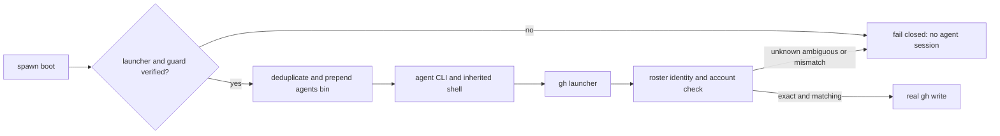

# Issue #239 gh write guard の管理席入口契約

## 結論

`~/.agents/bin/gh` をPATHへ置くだけでは、管理席のwrite経路を保証できない。
管理対象の席はspawn時に、検証済みguard launcherを先頭にしたsession-local PATHと、rosterから
毎writeで導出・照合するaccount選択を持つ。この前提を作れない席はGitHub writeをfail-closedにする。

PATH先頭のHomebrew `gh` は、管理席の起動契約によりguard launcherへ置換される。`which`、
doctor、rc file、設定値は補助観測であり、write enforcementの証明にはしない。

## 1. 範囲

対象は manager、Codex producer、Claude reviewer を含む、agmsg rosterに登録された管理席の
GitHub writeである。accountは自己申告env、cwdだけ、または静的role mapだけから選ばない。

次は対象外とする。

- Issue #280の、guard通過後の`pr merge`をmanager専用に狭める認可
- P2接続、公式agmsgへの採用、個人accountへのfallback
- agent process外からの`/opt/homebrew/bin/gh`等の絶対path実行

最後の経路はuser-space PATHで横取りできない。これを「guard済み」と診断したり、正常writeとして
受け入れたりしない。OSレベルの実行制御を別途導入しない限り、この保証外経路を拒否する技術的根拠は
ないため、本Issueの成功条件へ偽って含めない。

## 2. 管理席の起動入口

`spawn.sh` が作るboot scriptを管理席の唯一の支持された起動入口にする。CLIをexecする前に、
session-local guard environmentを構成するhelperを実行する。

1. helperは`~/.agents/bin/gh`がagmsg生成launcherであり、launcherが絶対pathの
   `gh-write-owner-guard.sh`とreal `gh`を固定していることを検証する。
2. helperは`~/.agents/bin`の重複を除去してPATHの先頭へ一度だけ置く。親shellのPATH、
   Homebrew順序、interactive rc fileの読込順は入力にしない。
3. launcher/helperの欠落、非agmsg置換、検証不能なreal `gh`、またはPATH正規化失敗では、
   agent CLIを起動せずnonzeroで停止する。guard無しの素のagent sessionへfallbackしない。
4. bootがCLI終了後に開くinteractive shellにも同じPATHを継承させる。再sourceしても同じPATHに
   収束することを必須とする。

既存のBash/Zsh startup-file helperは、人間のinteractive shellへの利便性として残してよい。
しかし管理席の保証はrc fileではなくboot environmentで成立させる。

## 3. writeごとのidentityとaccount

guardはdestination-checked writeごとに、公開registration queryを用いてcallerのsession identityと
roster registrationを解決する。正常実行には、次がすべて必要である。

| condition | required result |
| --- | --- |
| seat identity | sessionとregistrationが一意に対応する |
| harness type | roster typeが`codex`または`claude-code`で、session runtimeと一致する |
| expected account | Codex=`kappaseijin4codex`、Claude=`kappaseijin4claude` |
| actual account | guardが選んだcredentialでreal `gh api user`がexpected accountと一致する |
| destination | 既存owner/host/write allowlistを通る |

seat不明、registration複数、schema/read failure、type不一致、token取得不能、actual login不一致、
またはguard不在はすべてwrite前にnonzeroで停止する。個人account、既存default credential、
static cwd policyへfallbackしない。

callerが`GH_CONFIG_DIR`、`GH_TOKEN`、`GITHUB_TOKEN`を設定していても、それはaccountの正本ではない。
guardはそのcredentialを利用してよいが、actual loginがroster導出expected accountと一致しない限り
writeを拒否する。これにより、正しい明示bot credentialの運用は可能にしつつ、手動envによる
個人account縮退を許さない。

read-only `gh`は既存の分類を維持する。Issue #280で扱うmerge権限はここで追加しない。

## 4. 実効対照

fixtureはreal GitHub、real token、real user shell rc fileを使わない。fake `gh`はwriteの到達を
append-only logへ残し、guard通過を模倣した文字列ではなくwrite logの有無で判定する。

| case | setup | required result |
| --- | --- | --- |
| PATH先頭raw gh | fake raw ghをagents binより前に置く管理席boot | guard経由の正しいbot writeが1件 |
| manager / Codex / Claude | 各々一意なroster fixtureとexpected fake credential | vendor対応accountでallow |
| seat不明 / multiple | zeroまたは複数registration | nonzero、write log空 |
| 誤account | personalまたは反対vendor credentialを明示 | nonzero、write log空 |
| launcher欠落・置換 | nonagmsg `gh`またはguard不在 | bootまたはwriteがnonzero、raw write log空 |
| wrapper迂回 | boot後にPATHからagents binを除くfixture | これはsupported管理入口の外として、testはraw writeを許容してpassしてはならない。検出・fail-closed可能なnative execution controlが無いことを記録する |

各allowは同じ入力をguardなしで実行した負の対照と比較し、raw fake ghが選ばれることを示す。
各denyは`which`出力だけでなくwrite logが空であることを確認する。

mutationは、(a) boot helperのprependを削除、(b) actual-account比較を削除、(c) ambiguous outcomeを
static policyへfallback、の三つを個別にKILLする。正常なPATHや正しいcredentialだけでは、これらの
偽陰性を検出できない。

## 5. 診断とREADME

`doctor.sh`はPATH、launcherの来歴、roster resolution、expected accountを表示できる補助診断として
追加してよい。ただしdoctor成功はwrite許可の根拠でなく、doctor失敗をwrite enforcementへfallback
させない。write時のguardが唯一の認可点である。

doctorのユーザー向けCLI契約を追加・変更する場合だけ、READMEとREADME.ja.mdへ設定、実行、出力、
uninstall、保証外境界を自己完結で追加する。内部helperだけならREADME変更は不要である。

## 6. 最小実装境界と引き渡し

implementation PRは次だけを含む。

| path | change |
| --- | --- |
| `scripts/spawn.sh`と新規helper | verified session-local guard environmentをagent CLI前へ注入 |
| `scripts/guards/gh-write-owner-guard.sh` | roster導出expected accountとactual accountの一致をwriteごとに強制 |
| `tests/test_gh_write_owner_guard.bats` | deny/allow/write-log/mutation対照 |
| `tests/test_*spawn*.bats` | PATH先頭raw-ghの管理席boot対照 |
| `scripts/doctor.sh`とREADME群 | 必要になった場合だけ、診断の補助性を維持して追加 |

formal review受入後、programmerがこの1主張だけを実装する。verifierは固定HEADについて上表全対照、
既存guard回帰、artifact範囲を独立に再測定する。Issue #280は本PRへ含めない。

Refs #239, #222, #236
