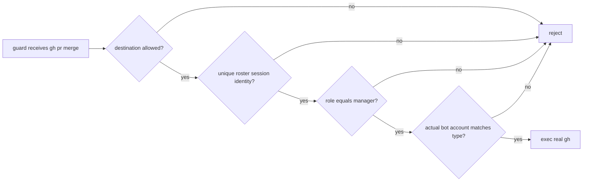

# Issue #280 gh pr merge のmanager専用認可

## 決定

`gh pr merge`は、guardが現在の呼出しsessionをroster上の一意なmanager席として解決した場合だけ
実行する。programmer、worker、architect、verifier、reviewer、breaker、ownerを含む非manager席は、
正しいvendor bot account、destination、review、CIであっても拒否する。

roleが不明、registrationが複数、roster読取・schema検証・session照合が失敗、role/vendorが未対応、
またはmanager expected accountとactual loginが一致しない場合は、real `gh`を起動せずnonzeroで停止する。

## 1. 認可の順序

既存のdestination owner/host検査、Issue #239のguard入口、vendor別account照合を維持し、`pr merge`
だけへmanager-role gateを追加する。

role判定の入力は、Issue #239で確立したguard経由sessionと公開registration queryのtupleとする。
cwd、agent名文字列、環境変数、静的policy単独をmanagerの正本にしてはならない。manager roleを返す
registrationが一意で、runtime/typeとsession projectが一致するときだけ許可する。

## 2. 非対象

GitHub上のAPPROVED、CI、merge queue、branch protectionの判定をguard内で再実装しない。
managerだけが実行できることは、GitHubがmergeを受け入れることを保証しない。

Issue #239のboot PATH、直接real-gh実行へのOS強制、Issue #236のP2接続、`pr merge`以外の
write commandのmanager-only化は変更しない。absolute real-ghは既存のuser-space guard保証外のままである。

## 3. 実効対照

テストはfake `gh`、temporary roster/session、write logだけを使う。`which`、role設定値、または
guardの診断文字列だけでは許可・拒否を判定しない。

| case | expected result |
| --- | --- |
| 一意なmanager + 正しいClaude credential | `pr merge`が1回だけfake write logへ到達 |
| programmer / worker / architect / verifier / reviewer / breaker | 各々nonzero、merge write logは空 |
| unknown、multiple registration、read/schema/session failure | nonzero、merge write logは空 |
| manager + personal/反対vendor credential | nonzero、merge write logは空 |
| manager + disallowed destination | nonzero、merge write logは空 |
| non-merge destination write | 既存authorization/account routing結果を維持 |

正のmanager対照は、manager roleを別の有効roleへ変える変異でKILLする。さらに、(a) role gateを削除、
(b) unresolved roleを許可、の各一点変異をproducer/unresolvedのwrite-log空assertionでKILLする。
既存CI/reviewの成功を模倣してproducer mergeを通す対照は作らず、role gateがその前に停止することを確認する。

## 4. 最小実装境界

| path | change |
| --- | --- |
| `scripts/guards/gh-write-owner-guard.sh` | `pr merge`だけの一意manager-role解決とfail-closed gate |
| `tests/test_gh_write_owner_guard.bats` | manager allow、非manager/unknown deny、write-log、3 mutation対照 |
| account/roster helper | 既存公開registration queryを利用する最小のrole解決補助のみ |

README、doctor、spawn PATH helper、GitHub review/CI判定は変更しない。実装PRはこの1主張を超えてはならない。

## 5. 引き渡し

formal review受入後、programmerが実装する。verifierは固定HEADでmanager allow、全deny、mutation、
既存non-merge write回帰、artifact範囲を独立に測定する。managerだけがmerge実行を担当する運用は、
このgateをGitHub merge成功やverifier完了の代用にしない。

Refs #280, #222, #239
