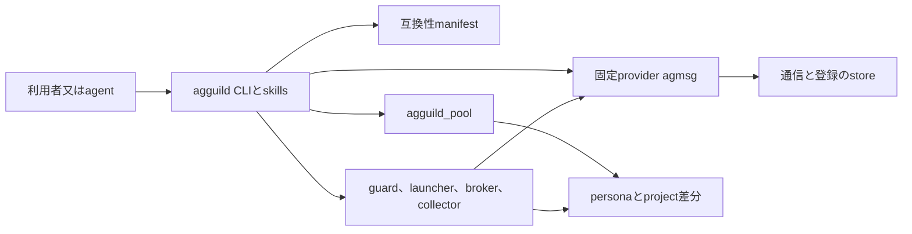

# Issue #373 分離移行計画

## 決定

三層を別repositoryとして扱う。

`agmsg` は固定した公式providerを利用する通信基盤である。

`agguild` は独自運用の共有実行層である。

`agguild_pool` はpersonaと管理manifestを保持するデータ層である。

公式 `fujibee/agmsg` へPRを提出しない。

提案、適合試験、パッチは `kappaseijin/agmsg`、又は新設する `kappaseijin/agguild` の範囲に留める。

この文書は構成と移行の設計である。

repository新設、コード移動、data移行、Issue本文の更新、README更新は含まない。

## 1. 目標構成



`agguild` は manifest に固定した provider root と commit、公開command、schema、exit status だけを使う。

`agguild_pool` は agmsg store、runtime claim、共有PATH、共有skillを保持しない。

`codex_monitor_agents` は移行元としてのみ扱う。

各作業cloneのGit rootと、agmsg registration の `project` path は移さない。

personaをpoolへ配置しても registration path が変わらないため、移行前の agent identity を暗黙に壊さない。

### 1.1 repositoryとディレクトリ

| repository | 目標root | 保持するもの | 保持しないもの |
| --- | --- | --- | --- |
| `kappaseijin/agmsg` | `scripts/`、`docs/`、公式互換試験 | 独自運用の共有runtime、persona data、pool data |
| `kappaseijin/agguild` | `bin/agguild`、`skills/`、`lib/`、`manifests/`、`tests/` | role運用、launcher、guard、broker、collector、provider compatibility | agmsg private storeの外側reader、personaの認可正本 |
| `kappaseijin/agguild_pool` | `personas/`、`projects/`、`manifests/`、`kaizen/` | persona、project差分、明示されたpersona固有設定 | shared executable、shared PATH、live DB、runtime claim、作業clone |

pool内のpersona固有実行物は `personas/<persona>/local/` に閉じる。

別persona又は全teamが使う実行物は `agguild` へ移す。

pool内のmanifestは参照先、digest、schema version、所有personaを記録する。

secret、token、SQLite store、session transcriptはmanifestへ複製しない。

### 1.2 data flow

1. agentは `agguild` のskill又はCLIを起点にする。
2. `agguild` は互換性manifestを読み、provider root、固定commit、要求capabilityを検査する。
3. capabilityが一致したときだけ、agmsgの公開commandを固定argvで呼ぶ。
4. persona固有の設定が必要なときだけ、pool manifestで解決した当該personaの `local/` を読む。
5. provider、manifest、identity、停止点のいずれかが不明なら、agguildは副作用を起こさず停止する。

## 2. 成果物

| 層 | 成果物 | 受入可能な最小状態 |
| --- | --- | --- |
| agmsg | 公式互換のprovider checkout、公開CLI仕様、provider release/commit記録 | agguildが使う公開commandと出力/exit statusを固定できる |
| agguild | CLI、skills、compatibility manifest schema、guard/launcher/broker/collector modules、隔離試験 | providerの内部fileを読まず、unknownを成功へ縮退しない |
| agguild_pool | persona manifest schema、persona/project/kaizen data、限定local例外の宣言 | shared executableを含まず、registration projectと別項目でpersona pathを保持する |
| 移行証跡 | plan manifest、preflight report、対象席のID境界、rollback record | live dataを公開せず、対象、digest、結果、停止理由を追跡できる |

各repositoryのREADMEは実装Issueで追加又は更新する。

READMEはインストール、provider version、pool schema、設定の決定順、実行、停止、復旧、アンインストールを単独で説明する。

## 3. agguild のtarget CLIとskill

次は設計上のtarget interfaceである。

現時点で実装されておらず、実装前に実行してはならない。

| command又はskill | 引数 | 成功時の出力 | fail-closed条件 |
| --- | --- | --- | --- |
| `agguild provider check` | `--manifest <file> --provider-root <path>` | fixed commit、capability、schema、結果 | root、commit、schema、capabilityのいずれかが不一致又は不明 |
| `agguild pool validate` | `--pool <path> --manifest <file>` | persona entriesとlocal例外の検証結果 | shared executable、secret、必須field欠落、digest不一致 |
| `agguild identity resolve` | `--project <path> --type <type> --pool <path>` | 一意なseatとpersona参照 | 複数identity、registration未解決、pool参照不一致 |
| `agguild migrate preflight` | `--plan <file> --seat <name>` | 未処理ID、ack境界、owner、resume、writerの取得結果 | 取得不能、unknown、複数writer、対象外seat |
| `agguild migrate apply` | `--plan <file> --seat <name> --approve-digest <sha256>` | 実行recordと切替結果 | preflight未受入、digest不一致、live DB競合、確認不能な処理済みID |
| `$agguild` | agent向けskill入口 | provider check、pool validate、preflightの選択 | 実行権限や必要証跡が無い操作を提案又は実行しない |

利用例は実装後に次の形とする。

```bash
agguild provider check \
  --manifest manifests/providers/agmsg.json \
  --provider-root /opt/agmsg

agguild pool validate \
  --pool /srv/agguild_pool \
  --manifest manifests/pool.schema.json

agguild migrate preflight \
  --plan plans/worker-a.json \
  --seat agmsg_worker_codex
```

`migrate apply` は preflight report のdigestと明示承認値が一致する場合だけを対象にする。

この設計PRはそのcommandを実装又は実行しない。

## 4. 移行issueの分割

**物理移行ゲート G0** は、#300、#236、#341、#294、#273、#272、#268、#362 の全てが
`CLOSED` 又は明示 `NOT_PLANNED` である状態と定義する。

G0を満たすまで、repository skeleton、コード切出し、persona/data移行、又は現役切替を始めない。

解決順は #300 の状態整合、#236 のgate再設計、#341、#294、#273、#272、#268、#362 とする。

#236のgate再設計は、PM自己実施防止という主目的と、過去commentで追加されたP2後続実装の依存境界を分けるarchitect作業である。

#222 CLOSEDと公式PR禁止決定の後は、後者のgateが公式へのPR提出を前提にしないよう再定義する。

| 完了 | title案 | 依存 | 受入条件 |
| --- | --- | --- | --- |
| [ ] | agguild: repository skeleton と provider manifest schema | G0、#373設計受入 | repoはshared runtime用の空構成だけを持ち、provider commit/capabilityを表現できる。agmsg内部fileを読まない |
| [ ] | agguild_pool: repository skeleton と persona manifest schema | G0、#373設計受入 | poolはpersona dataだけを持ち、shared executable、live DB、secretを拒否する |
| [ ] | agguild: provider check と pool validate を隔離fixtureへ実装 | G0、前2Issue | positive providerと不一致commit/schema、poolのshared executable/secretを対照にし、全拒否変異をKILLする |
| [ ] | agguild: guard と launcher の共有実行層を切り出す | G0、provider check | gh/git destination guard、identity resolution、PATH固定を公開provider APIだけで通す。個人account又はunknownへのfallbackをしない |
| [ ] | agguild: broker、collector、auditの共有実行層を切り出す | G0、guard/launcher切出し | agmsg公開通信と独立collectorの境界を保持する。#236の主目的であるPM自己実施防止の本番導入、及び過去commentのP2実接続は開始しない |
| [ ] | agguild_pool: codex_monitor_agents dataの隔離fixture移行 | G0、pool validate、preflight | persona pathとregistration projectを別項目で保持し、未処理ID、owner、resume、writerの停止点を全て取得できる |
| [ ] | agguild_pool: 停止可能な1席の限定移行 | G0、fixture移行 | idle対象1席だけを移し、identity一意性と未読集合を前後比較する。新旧writerは同じlive DBへ接続しない |
| [ ] | agmsg: 独自拡張の残存台帳と切出し完了判定 | G0、各agguild切出し | `222-hunk-ledger.tsv` の各対象を移動、保持、廃棄のいずれかへ根拠付きで対応付ける。公式へのPRは出さない |
| [ ] | 分離完了: 現役切替と旧root削除の可否判定 | G0、限定移行の受入 | 全対象のrollback確認後に、別起点でのみ削除可否を判定する。全席一括移動、未読reset、全claim GCを行わない |

各rowは独立したIssueとPRにする。

Issue #373本文の作業表はPMがこの順番、Issue URL、state、完了チェックを更新する正本とする。

作業途中の文章だけを更新して、Issue表のstateを置き去りにしない。

## 5. 停止、再開、rollback

実移行は隔離fixtureから始める。

各対象席について、未処理message ID、ack境界、actas owner、resume対象、稼働writerを取得する。

一つでも取得不能、unknown、又は相互に矛盾する値なら、その席は停止状態のままにする。

rollbackは新側writerを停止してから旧pathとregistrationを再利用する。

新側で処理済みmessageがある場合、古いDB snapshotを復元してはならない。

IDとcursorを照合できるまで停止を維持する。

## 6. 既存open Issueの扱い

#358、#355、#308、#304、#296 は record-only であり、ユーザー決定により分離の前提から除外する。

これらはIssue #373本文の参考表に残すが、着手又はcloseを求めない。

#300、#236、#341、#294、#273、#272、#268、#362 は G0 の前提Issueである。

各Issueはbreaker指定順に解決し、`CLOSED` 又は明示 `NOT_PLANNED` をGitHub正本で確認するまで、§4の全移行Issueに着手しない。

#236はPM自己実施を仕組みで防止するIssueである。

過去commentでP2 pilotの後続実装も同じ `blocked:dependency` に置かれたが、これを#236の主目的又はB3 Issue #253そのものと読み替えない。

PM自己実施防止の本番導入、P2実接続、pilotはいずれも本計画の範囲外である。

ただし過去commentのP2依存gateは、#222 CLOSEDと公式PR禁止決定を前提にarchitectが再設計する。

## 7. 受入対照

| 対象 | 正の対照 | 負の対照 |
| --- | --- | --- |
| provider | 固定commitの公開commandがmanifestどおりに応答する | commit、schema、capabilityの不一致を成功にしない |
| pool | 一つのpersona manifestとlocal例外が解決する | shared script、secret、別persona参照を受け入れない |
| identity | 作業clone pathで一意にseatを解決する | persona path移動をregistration path変更と誤認しない |
| preflight | 必要な五つの停止点を取得できる | `notFound`、unknown、複数writerを安全と扱わない |
| rollback | 未処理IDとcursorが一致する状態へ戻る | 新側処理後の旧snapshot復元を許可しない |
| destination | `kappaseijin/*`内の設計PRが通る | `fujibee/agmsg`へのPR又はpushを拒否する |

README、コード、data、GitHub Issue本文はこの設計PRで変更しない。

Refs #373 #372 #222 #236
