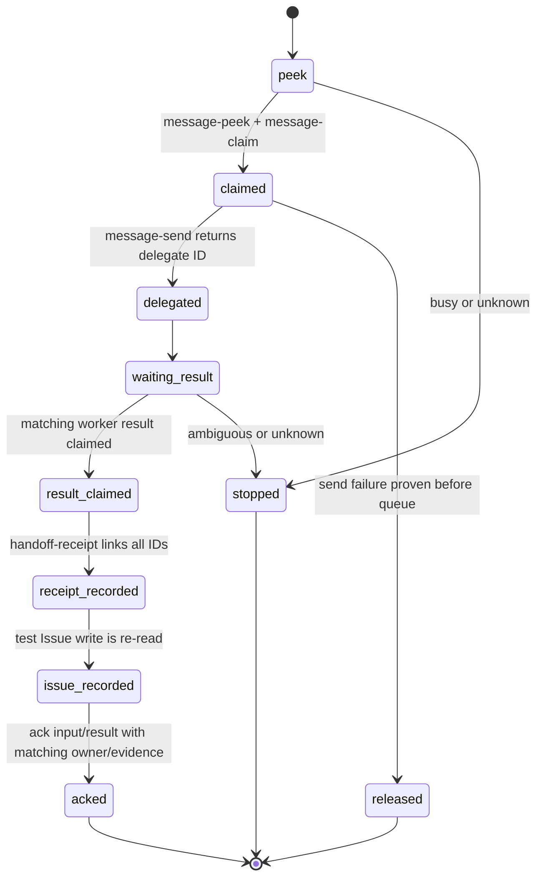

# Issue #380 P2 PM委譲consumer契約

## 決定

P2 consumerは、pilot宛の一件を受信し、事前登録済みworkerへ定型作業を委譲し、
worker結果を検証用Issueへ記録する限定状態機械とする。

必要なB3 capabilityは`message-peek`、`message-claim`、`message-release`、
`message-ack`、`message-send`、`handoff-receipt`である。

`history`は`not-used`とする。

現行`inbox.sh`はstdout handoff後にread/receiptを書き、失敗を非fatalに扱うため、
P2の`receive`には使わない。

現行`pm-broker.js`の`accepted`はrequests.jsonlとmarkerだけを記録し、送信、配送、
worker処理、Issue書込を証明しないため、P2成功の根拠に使わない。

この設計はG3 consumer計画を固定するだけである。

G2のprovider capability実装・検証、G4のadapter/collector接続、pilot起動は行わない。

## 1. 固定するactorとscope

run manifestは一意な`runId`、pilot seat、worker seat、reviewer seat、test Issue番号、
provider commit、provider manifest digest、consumer contract digestを起動前に固定する。

| entity | 固定値又は制約 |
| --- | --- |
| pilot | `agmsg_pm_pilot_claude`だけ。現`agmsg_pm_claude`を対象にしない |
| worker | run manifestに一件だけ登録した`agmsg_worker_codex`。動的探索又は任意宛先は禁止 |
| team | manifestの一件だけ。cross-team送受信は禁止 |
| Issue | manifestの`testIssueNumber`だけ。#236、#380、通常Issueの書換えは禁止 |
| provider | G1で受入した`kappaseijin/agmsg`のcanonical rootと40桁commitだけ |
| operation | §2の6 capabilityと§3の5 consumer operationだけ |

actor、team、recipient、Issueのいずれかがmanifestと一致しなければ、consumerは副作用を起こさず`denied/scope_mismatch`で停止する。

## 2. B3 requiredCapabilities

G2への入力は次のcapability manifestである。

| capability | 必要性 | 成功時の最小返却 | 禁止する縮退 |
| --- | --- | --- | --- |
| `message-peek-v1` | required | recipient限定のimmutable `messageId`、from、to、body、createdAt | read、receipt、ackを書かない。unknownを空配列へしない |
| `message-claim-v1` | required | `messageId`、opaque owner、lease状態 | busy、別recipient、unknownをclaim成功へしない |
| `message-release-v1` | required | 同じmessageId/ownerのrelease状態 | 別ownerのrelease、unknown時の削除をしない |
| `message-ack-v1` | required | 同じmessageId/owner、evidence ID、ack状態 | receipt無しack、別owner ack、unknownの成功化をしない |
| `message-send-v1` | required | immutable delegate/result `messageId`、queued状態 | queuedを配送/処理開始へ昇格しない |
| `handoff-receipt-v1` | required | input ID、request ID、delegate/result ID、receipt ID、記録状態 | ID未対応、重複不明、記録失敗を成功にしない |
| `history` | not-used | なし | 人向け表示、全team探索、read状態の推測をP2判定に使わない |

`message-peek-v1`はread-onlyである。

現行`inbox.sh`、`history.sh`、`claim.sh`、storage driver、SQLite、claim fileをconsumerが直接実行又は読取することは、この契約の公開capabilityではない。

G2は公開command、固定argv、JSON schema、exit statusをcapabilityごとに新たに固定する。

## 3. 共通payloadと値域

全consumer requestはJSON objectで、次の共通fieldを持つ。

```json
{
  "schemaVersion": 1,
  "runId": "opaque-run-id",
  "requestId": "opaque-request-id",
  "operation": "receive|delegate|collect-result|issue-record|observe-owner",
  "team": "agmsg",
  "actor": "agmsg_pm_pilot_claude",
  "generation": "positive-integer-string"
}
```

`runId`、`requestId`、provider message ID、receipt ID、owner tokenはopaqueであり、consumerは分解又は生成規則の推測をしない。

全JSONはUTF-8で8,192 bytes以下、任意の本文又はtask/result textは4,096 UTF-8 bytes以下とする。

未知field、重複key、非object、未知schema version、制御文字を含むidentity field、上限超過は`error/invalid_payload`で拒否する。

### operation別入力

| operation | 追加field | 成功条件 | failure/unknown |
| --- | --- | --- | --- |
| `receive` | なし | pilot宛のpeek結果から1件をclaimし、input message IDとownerを返す | `absent`は副作用なし完了。`busy`/`unknown`はackせず停止 |
| `delegate` | `inputMessageId`、`worker`、`task` | workerがmanifestと一致し、delegate message IDとrequest IDを返す | queuedだけではworker到達としない。送信結果不明なら再送しない |
| `collect-result` | `requestId`、`delegateMessageId` | worker結果のmessage IDがrequest/delegate IDへ一意対応する | 0件/複数/ID不一致/unknownは成功にしない |
| `issue-record` | `requestId`、`inputMessageId`、`delegateMessageId`、`resultMessageId`、`body` | test Issueだけに書き、再取得したcomment URLと実本文が一致する | write結果不明なら自動再送せず停止 |
| `observe-owner` | `agent=agmsg_pm_pilot_claude` | B2のopaque owner/stateを返す | `unknown`をfree、absent、許可へ変換しない |

`task`は既知fixtureの定型集計だけを表すdataであり、shell、command line、URL fetch、任意コード、GitHub write指示を含めない。

## 4. 状態遷移とack境界



input又はresultのackは、対応するhandoff receiptとtest Issue comment URLが確定した後だけに行う。

queued、delivery receipt、worker処理開始、Issue書込を同じ成功状態へ畳まない。

送信後又はIssue書込後に結果がunknownなら、consumerはrelease、ack、再送を自動実行しない。

operatorがrequest IDと下流artifactを照合するまで`stopped_for_unknown`を維持する。

## 5. 必須対照

| 対象 | 正の対照 | 負の対照 |
| --- | --- | --- |
| receive | pilot宛の一件をpeek→claimする | `inbox.sh`利用、別recipient、busy、unknownでread/ackが0 |
| delegate | manifest workerへ定型taskを一回queuedする | 任意worker、shell含有task、queuedをdelivery/処理成功にする変異を拒否 |
| collect-result | request/delegate/result IDが一意に対応する | resultなし、複数、別request、opaque ID推測を拒否 |
| issue-record | test Issueへ実改行を含む本文を書き再取得する | 別Issue、本文不一致、write unknownの自動再送を拒否 |
| owner | pilotのB2 stateを観測する | 現PM/worker照会、unknown→absent/freeを拒否 |
| provider route | manifest固定root/commitの公開commandだけを呼ぶ | `history.sh`、`claim.sh`、SQLite、claim file、任意wrapper/rootを拒否 |

G2のmutationは、`message-peek`がreadを行う、ackがreceipt前に通る、別ownerのrelease/ackが通る、
queuedをdeliveryへ昇格する、unknownを正常状態へ縮退する変異を個別にKILLする。

## 6. G2/G4へのhandoff

G2はこの文書のrequiredCapabilitiesを増減せずに公開provider契約と対照を実装する。

capabilityを追加、削除、又は`not-used`から変更する場合は、G3を再設計してfixed HEAD reviewを取り直す。

G4はG1 provider manifest、G2 capability artifact、このconsumer contractの三digestが一致する場合だけ、
native launcher、broker adapter、独立collectorの実装へ進める。

G4はgeneric Bash実行をconsumerの復旧経路にしない。

## 7. 状態と除外

G3受入後もIssue #236はOPENかつ`blocked:dependency`のままである。

G3はprovider実装、B3検証、P2接続、pilot成功を証明しない。

次は対象外である。

- G1 provider manifest/B1/B2対照の実装
- G2 capability実装、G4接続実装、pilot起動と実測
- P3現PM交代、P4横展開
- `agguild`/`agguild_pool`新設、Issue #373 G0解除
- `fujibee/agmsg`へのPR、push、提案

README影響はない。

Refs #380 #236 #377 #378 #379 #373
