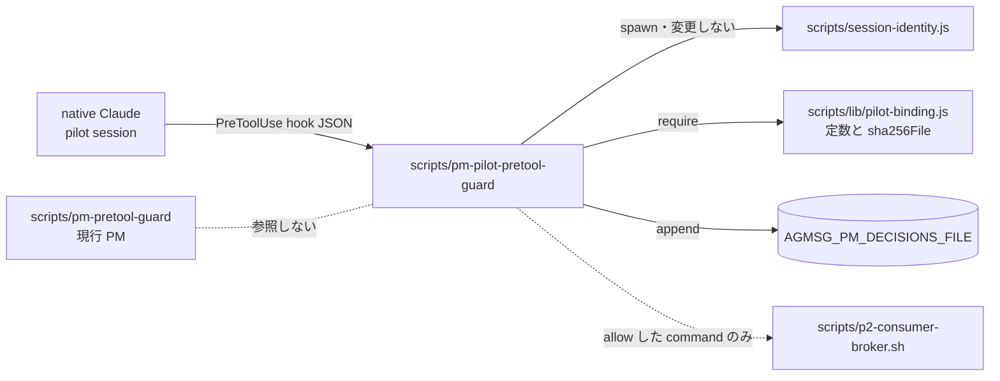

# Issue #404: pm-pilot-pretool-guard の契約

## 1. 目的と範囲

`scripts/pm-pilot-pretool-guard` は launcher・binding・gate harness から参照されているのに、ファイルが存在しない。
G4 設計（`2026-09-10T083500_issue-385-g4-resolution.md` §3）は「pilot 専用 guard を新設する」と断定したが、§7 はその作成をどの PR にも割り当てていなかった。

**方針は §3 のまま変えない。** 本書は、欠けていた **契約** を定める。

| 扱う | 扱わない |
| --- | --- |
| guard の入力、判定規則、binding digest 検証、出力と exit code、決定記録、非共有の境界 | 実装（programmer、別 PR） |
| guard が前提とする profile 側の接続条件（§9） | profile ファイルの作成担当（§12.1 で未割当として報告する） |
| 実装 PR の試験要件（§11） | harness 側の欠陥修正（#405、#406、および §12.2） |
| | G1〜G4 の再設計 |

## 2. 既存コードが期待している挙動（契約の出発点）

契約は下表の期待から逆算する。各行は main（`f0c96a5`）で確認した。

| # | 期待 | 出所 |
| --- | --- | --- |
| E1 | パスは `$SKILL_DIR/scripts/pm-pilot-pretool-guard`（lexical） | `scripts/pilot-launcher.sh:42`、`scripts/lib/pilot-binding.js:1917-1925` |
| E2 | 通常ファイル・symlink でない・実行可能 | `pilot-launcher.sh:243-262,752`、`scripts/lib/pilot-gate-f2.py:1051-1059` |
| E3 | raw bytes の `sha256:<hex>` が binding の `guardDigest` に固定され、exec 直前に再照合される | `pilot-binding.js:1957,1988-1994`、`pilot-launcher.sh:742-745` |
| E4 | binding の `policyVersion` は `pm-pilot-pretool-v1` | `pilot-launcher.sh:36`、`pilot-binding.js:74` |
| E5 | launcher が guard 用に環境変数を export する（`AGMSG_PM_*` 12 個） | `pilot-launcher.sh:758-771` |
| E6 | harness は `AGMSG_PM_DECISIONS_FILE` を渡し、`toolUseId` と `decision` を持つ JSONL 行を読む。行が無ければ unknown | `scripts/lib/pilot-gate-i1.py:225-240,433,487-489` |
| E7 | 次の Bash command に `decision=allow` が記録されること：`<broker> --config <config> <operation> < <request>` | `pilot-gate-i1.py:302-306,693`、`scripts/lib/pilot-gate-f3.py:433-438,525` |
| E8 | 上記以外の Bash（F2 の probe script 実行）は `decision=deny` を記録し、実行させない | `pilot-gate-f2.py:817-845`、runbook §15.1 |
| E9 | profile の PreToolUse handler はちょうど 1 個で、guard の絶対パス、`args` なし | `pilot-gate-f2.py:140-185` |
| E10 | 既存 `scripts/pm-pretool-guard` は byte 単位で変わらない | `tests/test_pilot_launcher.bats:1475-1529`、runbook §8 |
| E11 | broker は request を **stdin** から読み、`issue-record` だけは `--gh-config-dir` が必須 | `scripts/p2-consumer-broker.sh:24-34,3404-3406` |

**E7 と E11 から、既存 guard の command parser は使えない。** 既存 guard は `<` を含む command を拒否し、トークン数を 3 に固定している（`scripts/pm-pretool-guard:106-108`）。
pilot は stdin へ request を渡すため、入力リダイレクト 1 個だけを文法として許す必要がある。

## 3. 構成と非共有の境界



| 区分 | 内容 |
| --- | --- |
| **MUST NOT** | `pm-pretool-guard`、`pm-broker.sh`、`pm-broker.js`、`session-identity.sh` を require・spawn・読取りしない。既存 guard のコード（`BROKER_OPERATIONS`、`parseLiteralCommand`、`monitorCommand`）を複製しない |
| **MUST NOT** | 共有を理由に現行 PM 側のファイルを変更しない（E10） |
| 使ってよい | `scripts/session-identity.js` を無変更のまま子プロセスで呼ぶ。§3 が共通化を認める「identity 検証の純粋 helper」にあたる |
| 使ってよい | `scripts/lib/pilot-binding.js` の `POLICY_VERSION`、`PILOT_AGENT`、`PILOT_TYPE`、`PROVIDER_COMMIT`、`sha256File`。これは pilot 専用モジュールであり、定数を二重に持たないために使う |

`session-identity.js` は `session-identity.sh` を経由せず、`process.execPath` で直接起動する。
既存 guard が使う wrapper を経由すると、現行 PM 側の経路と結合するためである。

`session-identity.js` は binding の `policyVersion`・`providerCommit`・digest と実ファイルの一致を**照合しない**（`scripts/session-identity.js:142-161` は形式検査のみ）。
この照合は guard 側の責務とする（§6）。

## 4. 実装言語とファイル

- `#!/usr/bin/env node` の単一ファイル `scripts/pm-pilot-pretool-guard`。拡張子なし、mode `0755`
- 実行中に自分自身や他の保護対象ファイルを書き換えない（E3。1 byte でも変わると次の起動が拒否される）
- 定数 `GUARD_POLICY = 'pm-pilot-pretool-v1'` は `pilot-binding.js` の `POLICY_VERSION` を使い、別の文字列を書かない

## 5. 入力

hook JSON を stdin から読む。

| 条件 | 違反時の reason |
| --- | --- |
| stdin を読める | `hook_input_unreadable` |
| 1 MiB 以下 | `hook_input_too_large` |
| JSON object である | `hook_input_invalid` |
| `session_id`、`cwd`、`tool_name`、`tool_use_id` が空でない文字列で、制御文字を含まない | `<field>_invalid` |
| `tool_input` が object である | `tool_input_invalid` |
| `hook_event_name` がある場合は `PreToolUse` である | `hook_event_invalid` |

guard が読む環境変数は次のとおりである。**未設定・空・制御文字を含む値は deny とする。**
値はすべて launcher が設定する（§9.1）。

| 変数 | 用途 |
| --- | --- |
| `AGMSG_PM_PILOT_SESSION_ID` | `session_id` との一致 |
| `AGMSG_PM_BINDING_FILE` | binding の読取り（session-identity.js も読む）。記録先の検査（段 0）の基準 |
| `AGMSG_PM_GUARD_PATH` | 自分のパスとの一致 |
| `AGMSG_PM_BROKER_PATH` | broker パスとの一致 |
| `AGMSG_PM_DECISIONS_FILE` | 決定記録の出力先（§8）。置き場所を段 0 で検査する |
| `AGMSG_PM_EXECUTIONS_FILE` | guard は書かない。PostToolUse handler（`pm-posttool-record`）の出力先であり、置き場所を段 0 で検査する |
| `AGMSG_PM_TEAM`、`AGMSG_PM_AGENT`、`AGMSG_PM_TYPE`、`AGMSG_PM_PROCESS_PID`、`AGMSG_PM_PROCESS_GENERATION`、`AGMSG_PM_PROCESS_START`、`AGMSG_PM_TEAMS_DIR`、`AGMSG_PM_CLAIM_FILE` | session-identity.js へそのまま渡す |

変数の欠落・不正を表す reason は `env_<name>_invalid` とする。`<name>` は変数名から `AGMSG_PM_` を除いて小文字にしたものである（例: `env_binding_file_invalid`）。
reason 名の細部は実装の裁量とする（errata 2）。

## 6. 判定の順序と規則

**上から順に評価し、最初に失敗した段の reason で deny する。** 全段を通過した場合だけ allow する。
例外・timeout・想定外の値はすべて deny とする（`guard_internal_error`）。

| 段 | 検査 | 失敗時の reason |
| --- | --- | --- |
| 0 | 記録先の置き場所（§8.1）。`AGMSG_PM_DECISIONS_FILE` と `AGMSG_PM_EXECUTIONS_FILE` が pilot seat の `logs/` 直下にあり、symlink でない。**違反時は決定記録を書かない**（stderr のみ） | `decision_log_unconfigured` / `decision_log_outside_seat` / `executions_log_outside_seat` |
| 1 | 入力（§5） | §5 の各 reason |
| 2 | `tool_name === 'Bash'` | `tool_not_allowed` |
| 3 | command 文法（§7） | `command_not_in_pilot_contract` |
| 4 | identity：`session-identity.js` が 2 秒以内に exit 0、stdout が `status=ok` の JSON | `session_identity_unavailable` / `session_identity_invalid` |
| 5 | identity の `agent === PILOT_AGENT`、`type === PILOT_TYPE`、`sessionId === AGMSG_PM_PILOT_SESSION_ID === input.session_id` | `pilot_identity_mismatch` |
| 6 | binding を再読取りし、`policyVersion === POLICY_VERSION`、`providerCommit === PROVIDER_COMMIT` | `binding_policy_mismatch` / `binding_provider_mismatch` |
| 7 | guard 自身：`AGMSG_PM_GUARD_PATH` が絶対パスで basename が `pm-pilot-pretool-guard`、lexical パスが lstat で通常ファイルかつ symlink でない、その realpath が `__filename` の realpath と一致、`sha256File` が `binding.guardDigest` と一致（§6.3） | `guard_path_mismatch` / `guard_digest_mismatch` |
| 8 | profile：`<binding.project>/.claude/settings.local.json` の `sha256File` が `binding.profileDigest` と一致 | `profile_digest_mismatch` |
| 9 | broker：§7 の broker トークンが `AGMSG_PM_BROKER_PATH` と文字列で一致（どちらも lexical）、lexical パスが symlink でない通常ファイルで実行可能、その realpath が `path.join(realpath(__dirname), 'p2-consumer-broker.sh')` と一致、`sha256File` が `binding.brokerDigest` と一致（§6.3） | `broker_path_mismatch` / `broker_digest_mismatch` |
| 10 | 引数パス（§7.3） | `argument_path_invalid` |
| 11 | 決定記録の書込み（§8） | `decision_log_unavailable` |

### 6.1 Bash 以外の tool をすべて deny する

既存 guard は `AskUserQuestion`、`EnterPlanMode`、`ExitPlanMode` を無条件に通し、`Monitor` を条件付きで通す。
**pilot guard はどれも通さない。**

理由は 2 つある。

- G4 設計 §2 は「pilot の実作業経路は G3 の 5 operation 以外へ拡張しない」と定める。pilot は受信を broker の `receive` で行うので、`Monitor` は要らない
- pilot は PTY 上で harness から操作される。ユーザー入力を待つ tool を通すと、run が止まる

`Read`、`Write`、`Edit` なども同じ規則で deny する。これが効くのは、profile の matcher が全 tool を対象にしている場合だけである（§9）。

### 6.2 段 3 を identity より先に置く理由

F2 control は、binding が正常な状態で probe の deny を確かめる（E8）。
文法違反を identity の前で deny すると、identity helper が壊れていても probe は必ず deny される。**deny 側に倒れる順序である。**
allow には全段の通過が要るので、順序によって allow が増えることはない。

### 6.3 パスの比べ方（errata 1）

**lexical なパス同士は文字列で比べる。`__filename` と `__dirname` との比較は realpath で行う。**

Node は main module を symlink 解決して読み込むため、`__filename` と `__dirname` は canonical になる。
macOS では `/tmp/x.js` が `/private/tmp/x.js` になる（PR #414 で実測）。
一方、launcher は `SCRIPT_DIR` を lexical のまま export する（`pilot-launcher.sh:26-31`）。

初版は段 7 と段 9 を `path.join(__dirname, ...)` との**文字列一致**としていた。この形では、`/tmp` や `/var` 配下で動かすと必ず deny になり、実行できない契約だった。

訂正後の規則は次のとおりである。

| 比べるもの | 方法 |
| --- | --- |
| lexical 同士（`AGMSG_PM_BROKER_PATH` と command の broker トークン） | 文字列一致 |
| lexical パスそのもの | lstat で symlink でない通常ファイル |
| lexical パスと guard 自身・broker の置き場所 | realpath 同士の一致 |

symlink は lexical パスそのものの lstat で拒否する。祖先ディレクトリの symlink（`/tmp` → `/private/tmp`）は許す。
これは `pilot-binding.js` のパス方針（同ファイル冒頭のコメント）と同じであり、fail-closed の性質は変わらない。

## 7. command 文法

### 7.1 許す形は 2 つだけ

```text
形 A（5 operation すべて）
<B> --config <C> <OP> < <R>

形 B（issue-record のみ）
<B> --config <C> --gh-config-dir <G> issue-record < <R>
```

- `<OP>` は `receive`、`delegate`、`collect-result`、`issue-record`、`observe-owner` のいずれか
- 形 A の `issue-record` も文法上は許す。broker は `gh_config_dir_required` で拒否する（`p2-consumer-broker.sh:3404-3406`）。拒否は broker 側で fail-closed に働くので、guard で先回りしない
- 形 B で `issue-record` 以外の operation を指定したら、段 3 で deny する

### 7.2 字句規則

- `command === command.trim()` であり、改行（`\n` `\r`）を含まない
- 半角空白 1 個ずつで分割する。空トークンがあれば deny
- トークン数は、形 A なら 6、形 B なら 8 ちょうど
- リテラルトークン（`--config`、`--gh-config-dir`、`<`、`<OP>`）は完全一致で比べる
- パストークン（`<B>` `<C>` `<G>` `<R>`）は `^/[A-Za-z0-9_./:-]+$` に一致し、`//`、`/./`、`/../` を含まず、`/.` や `/..` で終わらない

この字句規則は harness の `SAFE_PATH_TOKEN`（`pilot-gate-i1.py:30`）と同じ文字集合に絶対パスの条件を加えたものである。
quote、`$`、`` ` ``、`|`、`;`、`&`、`>`、`(`、glob 文字が入る余地は無い。

### 7.3 引数パスの検査（段 10）

| トークン | 条件 |
| --- | --- |
| `<C>`、`<R>` | lstat で通常ファイルかつ symlink でない。realpath が `binding.project` の配下 |
| `<G>` | lstat でディレクトリかつ symlink でない。realpath が `binding.project` の配下 |

I1 は config を `<gate_repo>/.agmsg-gate/i1-run-config.json` に、request を `<gate_repo>/.agmsg-gate/i1-requests/` に置く（`pilot-gate-i1.py:660,687`）。`binding.project` は gate repo の canonical path なので、この条件を満たす。

**guard は request の中身を検査しない。** 中身の検証は broker の責務である。
guard の判定から shell が request を読むまでの間に request が差し替えられても、broker は G3 の 5 operation しか実行しない。

## 8. 決定記録

`AGMSG_PM_DECISIONS_FILE` へ 1 行 1 JSON を追記する（E6）。

```json
{"schemaVersion":1,"observedAt":"<ISO8601>","guard":"pm-pilot-pretool-guard","policyVersion":"pm-pilot-pretool-v1","sessionId":"<input.session_id>","generation":"<AGMSG_PM_PROCESS_GENERATION>","toolUseId":"<input.tool_use_id>","tool":"<input.tool_name>","inputDigest":"sha256:<hex>","decision":"allow|deny","reason":"<reason or null>"}
```

- `decision` は `allow` と `deny` の 2 値だけとする。既存 guard の `native` は使わない（§6.1）
- 変数が未設定・空・相対パスなら記録できない。この場合は deny し、reason `decision_log_unconfigured` を stderr にだけ出す
- **allow の記録に失敗したら deny に変える。** 記録されない allow は harness から unknown に見え、検証できないためである
- deny の記録に失敗しても deny は維持する
- 入力が読めない段階の deny では、取得できない項目に `"unknown"` を入れる

### 8.1 記録先は pilot seat の中に限る（errata 4）

**live PM の記録先へ pilot の決定が混ざる経路を、guard の側でも塞ぐ。**

pilot の起動経路では、`AGMSG_PM_DECISIONS_FILE` と `AGMSG_PM_EXECUTIONS_FILE` が live PM の環境から継承されうる（#415 に関する breaker 断定）。
継承された値のまま動くと、pilot の決定と実行記録が live PM の log へ書かれる。

記録先の基準ディレクトリは pilot seat の `logs/` とする。

```text
SEAT_DIR  = dirname(dirname(AGMSG_PM_BINDING_FILE))   # run/pilot/<team>__<agent>
LOGS_DIR  = SEAT_DIR/logs
```

binding は `SEAT_DIR/bindings/` に置かれる（`pilot-launcher.sh:180-181`）。
記録を `bindings/` に置かないのは、`bindings/` が不変の binding だけを持つディレクトリだからである。

段 0 の条件は次のとおりである。

| 対象 | 条件 |
| --- | --- |
| `LOGS_DIR` | lstat でディレクトリかつ symlink でない。`SEAT_DIR` も symlink でない |
| `AGMSG_PM_DECISIONS_FILE` | 絶対パス。`realpath(dirname(file)) === realpath(LOGS_DIR)`。file が既に在るなら、lstat で通常ファイルかつ symlink でない |
| `AGMSG_PM_EXECUTIONS_FILE` | 同上 |

- 「配下」ではなく **`logs/` の直下と一致** させる。範囲を広く取る理由が無いためである
- 段 0 で deny するときは**決定記録を書かない**。書こうとした先そのものが疑わしいからである。reason は stderr にだけ出す
- 段 0 は入力の解析（段 1）より前に置く。どの段の deny でも記録を書くため、書く前に置き場所を確かめる必要がある
- guard は `AGMSG_PM_EXECUTIONS_FILE` を書かない。それでも検査するのは、PostToolUse handler が同じ環境を受け取るからである。guard が deny すれば tool は実行されず、handler も書かない

この段は launcher 側の環境契約（§9.1）と二重になる。launcher の契約が破られた場合に備えた、実行時の防御である。

## 9. profile との接続条件

guard が働くのは、profile が guard を正しく呼んだ場合だけである。guard 側の前提を次に固定する。

| 項目 | 条件 | 理由 |
| --- | --- | --- |
| 対象ファイル | `<project>/.claude/settings.local.json`（launcher が `--settings` で渡し、digest を固定する） | `pilot-launcher.sh:780-790` |
| PreToolUse handler | ちょうど 1 個。`type: "command"`、`command` は guard の絶対パス、`args` なし | E9 |
| matcher | **全 tool を対象にする**（`matcher` を省略するか `"*"`） | `"Bash"` にすると `Write` や `Edit` が guard を経由せずに通る。§6.1 の deny が効かない |
| timeout | guard の最悪時間（identity の 2 秒と digest 計算）より長い値。目安は 10 秒 | 短いと F2b と同じ「timeout で通る」経路が通常時にも開く |
| PostToolUse handler | ちょうど 1 個。`type: "command"`、`command` は既存の `scripts/pm-posttool-record` の絶対パス、`args` なし。出力先は `AGMSG_PM_EXECUTIONS_FILE`（§8.1 の `LOGS_DIR` 直下） | F3 はちょうど 1 個の handler を要求する（`pilot-gate-f3.py:137-166`）。G4 設計 §6 は `executions.jsonl` を第二観測源として前提にしている（errata 3） |

F2 の単体試験 fixture は `"matcher": "Bash"` を使っている（`tests/test_pilot_gate_f2.py:327-354`）。
F2 は handler の数とパスしか検査しないので、matcher を `"*"` にしても F2 の判定は変わらない。

**PostToolUse に新しい handler を作らない。** F3 は「PostToolUse を止めても collector は transcript から検出する」ことを示す。
止める対象が `executions.jsonl` の書き手でなければ、F3 が止めるものと G4-C が照合するものが食い違う（#415 本文）。

`pm-posttool-record` を使うのは、§3 の「既存 guard と共有しない」に反しない。共有を禁じたのは PreToolUse の許可 policy であり、`pm-posttool-record` は許可判定をしない記録器である。
ただし、pilot のために `pm-posttool-record` を変更してはならない（G4 設計 §2）。

### 9.1 launcher の環境契約（errata 5）

**launcher は、継承した `AGMSG_PM_*` を接頭辞で全部 unset してから、必要な変数を全部 export する。**

```text
1  環境にある AGMSG_PM_ で始まる変数を、名前を列挙せずにすべて unset する
2  SEAT_DIR/logs を作る（symlink でない実ディレクトリであることを確かめる）
3  §5 の表の変数をすべて export する
     AGMSG_PM_DECISIONS_FILE  = SEAT_DIR/logs/pretool-decisions.jsonl
     AGMSG_PM_EXECUTIONS_FILE = SEAT_DIR/logs/executions.jsonl
4  exec
```

**個別の変数を足していく方式を採らない。** これが設計判断の中心である。

個別に上書きする方式では、launcher が知らない `AGMSG_PM_*` が継承されたまま残る。
live PM 側に新しい変数が増えるたびに、pilot へ漏れる経路が一つ増える。しかも launcher の差分には現れないので、気づけない。

全部消して全部設定する方式なら、pilot の環境にある `AGMSG_PM_*` は launcher が書いたものだけになる。
launcher の export の一覧が、そのまま pilot の環境の完全な一覧になる。

この契約により、harness は `AGMSG_PM_DECISIONS_FILE` を外から与えられなくなる。
I1 と F2 は決定記録を `SEAT_DIR/logs/pretool-decisions.jsonl` から読むことになる（`pilot-gate-i1.py:405,433` の変更が要る）。harness の変更は #415 の範囲である（#415 本文の作業内容 4）。

## 10. 出力と exit code

| 結果 | stdout | stderr | exit |
| --- | --- | --- | --- |
| allow | `{"hookSpecificOutput":{"hookEventName":"PreToolUse","permissionDecision":"allow","permissionDecisionReason":"pm-pilot-pretool-v1: fixed broker contract"}}` | なし | 0 |
| deny | `{"hookSpecificOutput":{"hookEventName":"PreToolUse","permissionDecision":"deny","permissionDecisionReason":"<reason>; pilot accepts only the fixed p2-consumer-broker contract"}}` | `pm-pilot-pretool-guard: deny <reason>` 1 行 | 2 |

- **deny を exit 2 と stdout JSON の両方で表す。** Claude Code は exit 2 の場合に stderr を拒否理由として扱う。JSON の解釈がどちらに転んでも拒否になる
- **allow は明示の `permissionDecision: "allow"` で返す。** 既存 guard は exit 0 で何も出さず、通常の permission 判定に委ねている。pilot は PTY 上で操作されるため、確認プロンプトが出ると run が止まる
- **exit 0 で stdout が空の経路を作らない。** 例外は最上位で捕捉して deny 扱いにする。捕捉できない終了（プロセスの強制終了など）は hook の失敗であり、F2 が扱う残存リスクにあたる（G4 設計 §9）

実 CLI での `permissionDecision: "allow"` の挙動は、実装 PR の isolated 試験で確かめる（§11.2）。

## 11. 実装 PR の試験要件

### 11.1 component 試験

**試験は本物の guard を使う。** `tests/test_pilot_launcher.bats:37-41` の偽 guard は撤去する。

各分岐は **他の条件をすべて満たした状態で単独に** 崩す（`development.rule.md`「優先順位のある分岐は、各分岐を単独でも検証する」）。

| 区分 | ケース |
| --- | --- |
| allow | 形 A で 5 operation 各 1 件、形 B の `issue-record` |
| 文法で deny | 形 B で `issue-record` 以外、`|`、`;`、`&&`、`>`、quote、`$`、改行、二重空白、相対パス、`..`、トークン過不足、未知 operation |
| tool で deny | `Write`、`Edit`、`Read`、`Monitor`、`AskUserQuestion` |
| binding で deny | `policyVersion` 違い、`providerCommit` 違い、session 違い、guard digest 違い（1 byte 追記した複製）、profile digest 違い、broker digest 違い |
| パスで deny | broker が symlink、broker が非実行、config か request が symlink、project の外、`<G>` がファイル |
| 環境で deny | 各 `AGMSG_PM_*` の欠落、`AGMSG_PM_DECISIONS_FILE` の欠落、identity helper の失敗と timeout |
| 入力で deny | 不正 JSON、1 MiB 超、必須フィールド欠落 |
| 記録 | allow と deny の各行が §8 の schema を満たす。allow の記録失敗で deny に変わる |
| 記録先（段 0） | `AGMSG_PM_DECISIONS_FILE` か `AGMSG_PM_EXECUTIONS_FILE` が `LOGS_DIR` の外、`LOGS_DIR` の下位ディレクトリ、symlink の file、symlink の `logs/` のいずれかなら deny し、**その file に 1 byte も書かない** |
| パスの比べ方（§6.3） | guard と broker を `/tmp` 配下（macOS では symlink の祖先を持つ）に置いても allow になる。lexical パスそのものを symlink にすると deny になる |
| launcher の環境（§9.1） | 名前の知られていない `AGMSG_PM_ZZ_UNKNOWN` を与えて起動しても、exec 後の環境に残らない。継承した `AGMSG_PM_DECISIONS_FILE` と `AGMSG_PM_EXECUTIONS_FILE` が `LOGS_DIR` 直下の値へ置き換わる |
| 非共有 | guard が `pm-pretool-guard`、`pm-broker`、`session-identity.sh` を参照しないことを grep で確かめる。在ると分かっている語（`session-identity.js`）で正の対照を取る |
| 既存不変 | 試験の前後で `scripts/pm-pretool-guard` の digest が一致する |

変異試験の結果は `KILLED` / `KILLED-BY-TSC` / `SURVIVED` の三値で報告する。
少なくとも段 2・3・5〜10 の各条件を 1 つずつ反転させ、対応する試験が落ちることを示す。

### 11.2 実 CLI の isolated 試験

`tests/isolated/test_pm_pretool_guard_real_cli.sh` を手本に、pilot guard 用の isolated 試験を置く。`run-isolated` 経由で実行する。

- 形 A の command が確認プロンプトなしで実行される
- probe command が deny され、marker が作られない
- matcher `"*"` のとき `Write` が deny される

## 12. 報告事項（本書の範囲外）

### 12.1 pilot profile の作成が誰にも割り当てられていない

`<gate_repo>/.claude/settings.local.json` を作るコードも雛形も、repo に無い（`.claude/` は `.gitignore:6` で除外されている）。
launcher・F2・F3 はいずれもこのファイルが在る前提で動く。**guard と同じ型の割当漏れである。**

guard だけを実装しても、N1 は profile の欠落で止まる。profile の生成担当（harness か、別の子 issue か）を決める必要がある。§9 がその生成物の条件になる。

### 12.2 I1 の `issue-record` は現状の command では broker に拒否される

`exact_broker_command`（`pilot-gate-i1.py:302-306`）は `--gh-config-dir` を付けない。broker の `issue-record` はこの引数を必須とする。
guard は形 B を許すので、harness 側が形 B を組み立てれば通る。harness の修正であり、本書の範囲外である。

### 12.3 runbook の構成図が現行 PM の guard を指している

`2026-09-10T212712_issue-395-g4-integration-gate-runbook.md` §3 の図と本文 95 行目は、pilot の経路に `scripts/pm-pretool-guard` を書いている。
正しくは `scripts/pm-pilot-pretool-guard` である。この取り違えも、guard の不在が見逃された一因と考えられる。

## 13. 断定一覧

| # | 断定 |
| --- | --- |
| 1 | guard は Node 単一ファイルとし、既存 guard・PM broker・`session-identity.sh` を参照しない |
| 2 | identity は無変更の `session-identity.js` を直接呼ぶ。policy・provider・guard・profile・broker の digest 照合は guard が行う |
| 3 | allow は `Bash` の形 A と形 B だけ。Bash 以外の tool はすべて deny する |
| 4 | 文法は空白区切りの固定トークンと入力リダイレクト 1 個に限る |
| 5 | deny は exit 2 と deny JSON、allow は exit 0 と明示の allow JSON で返す。exit 0 で出力が空の経路は作らない |
| 6 | 決定記録は必須とする。allow を記録できなければ deny に変える |
| 7 | profile の matcher は全 tool を対象にする。profile の作成担当は未割当として報告する（その後 PR #414 が profile 生成を担当した） |
| 8 | lexical 同士は文字列で、`__filename`・`__dirname` とは realpath で比べる（errata 1） |
| 9 | 決定記録と実行記録の置き場所は pilot seat の `logs/` 直下に限り、guard が段 0 で検査する（errata 4） |
| 10 | PostToolUse handler は既存の `pm-posttool-record` を使う（errata 3） |
| 11 | launcher は `AGMSG_PM_*` を接頭辞で全部 unset してから全部 export する（errata 5） |

## 14. Errata（2026-09-11T15:29:03+09:00）

errata の出所は 3 種類ある。**混同しないよう、行ごとに出所を分けて書く。**

| 出所の種類 | 該当 | 意味 |
| --- | --- | --- |
| 実装が先行した | 1、2 | PR #414 の実装が初版と異なり、breaker が「実装のほうが正しい」と判断した |
| Issue の断定 | 3 | Issue #415 の「作業内容」に列挙された断定。**PR #414 には未実装である**（`scripts/lib/pilot-profile.js` の `renderProfile()` は `PostToolUse` を生成しない） |
| breaker 断定の具体化 | 4、5 | breaker の断定（PM 経由、2026-09-11T15:27:38+09:00 の依頼）を本書が規則にした。本 PR の作成時点で、Issue #415 本文にこの規則は無かった。4 のうち「`SEAT_DIR/logs/` の直下と一致」という配置は本書での設計判断である。その後 PM が #415 本文の作業内容 3・4 に追記した |

| # | 箇所 | 初版 | 訂正後 | 出所 |
| --- | --- | --- | --- | --- |
| 1 | §6 段 7・段 9、§6.3 | `path.join(__dirname, ...)` との文字列一致 | lexical 同士は文字列、`__filename`・`__dirname` とは realpath で比べる | 実装が先行（PR #414 head `5fdcdd0` の `checkGuard`・`checkBroker`）。Node は main module の `__filename` を realpath で解決する（`/tmp/x.js` → `/private/tmp/x.js`） |
| 2 | §5 | 環境変数欠落時の reason 名が未定義 | `env_<name>_invalid`。細部は実装の裁量 | 実装が先行（PR #414 head `5fdcdd0` の `envText`） |
| 3 | §9 | PostToolUse は guard の契約外 | 既存の `scripts/pm-posttool-record` を handler にする | Issue #415 の断定（作業内容 2）。根拠は G4 設計 §6。PR #414 には未実装 |
| 4 | §6 段 0、§8.1 | 無し | 決定記録と実行記録の置き場所を pilot seat の `logs/` 直下に限る | breaker 断定「binding 配下、symlink でない」を具体化。`SEAT_DIR/logs/` 直下という配置は本書での設計判断 |
| 5 | §9.1 | 無し | launcher は `AGMSG_PM_*` を接頭辞で全部 unset してから全部 export する | breaker 断定（PM 経由）。書き先の値は 4 に従う |

**§12.1（profile 作成の未割当）は初版時点の報告として残す。** その後 PR #414 が profile 生成を担当した。
