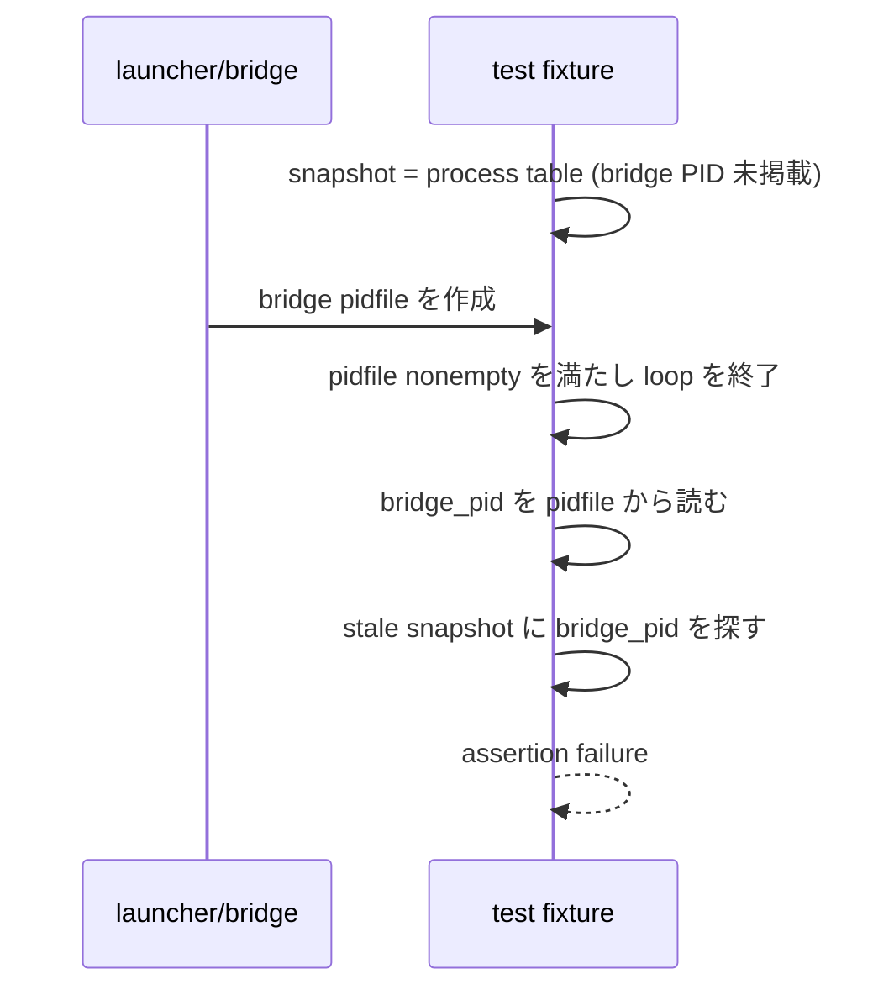

# Issue #341: launcher 所有 PID snapshot の生成競合の診断

## 1. 結論

`launcher: reaps owned launcher and bridge but leaves foreign controls` の失敗は、**試験 fixture が bridge の pidfile を確認した時点と、その bridge PID が `ps` snapshot に現れた時点を同一状態として扱っている競合**である。

修正対象は `tests/test_codex_bridge_launcher.bats` の当該 fixture の readiness predicate に限る。
production launcher、bridge の lease/reap 契約、foreign control の選別、CI の再実行、Issue #294 は本件の対象外である。

README への影響は無い。

## 2. 根拠

### 2.1 固定対象

| 項目 | 値 |
| --- | --- |
| cutoff | `69b698a4f8039e5c00466f6d30d1f3cda9adca3e` |
| source | `tests/test_codex_bridge_launcher.bats:345-387` |
| 一次ログ | GitHub Actions job `101910140823` |
| command | `GH_CONFIG_DIR=/Users/kappa/.config/gh-4codex rtk gh api --allow-escape-sequences repos/kappaseijin/agmsg/actions/jobs/101910140823/logs` |

job `101910140823` は対象 test を `not ok 2` とした。診断 packet は phase `owned-inclusion`、body rc `1` を記録している。

同 packet の値は、dispatcher=`3747`、bridge=`4106` に対し、snapshot が `3747,3908,4093,4096` だった。したがって dispatcher の包含は満たす一方、**pidfile から後で読んだ bridge PID `4106` は snapshot に無い**。失敗は reaper、foreign-exclusion、cleanup ではなく、次の二つ目の包含 assertion で起きた。

```bash
printf '%s\n' "$snapshot" | grep -Fxq "$bridge_pid"
```

### 2.2 現行 predicate が許す時系列

現行 loop は snapshot が非空、pidfile が非空、foreign 二者が生存なら終了する。pidfile の内容を読むのは loop 終了後であり、その PID が保存済み snapshot に含まれることは predicate にない。



この経路は、process table の取得と pidfile publish が独立に進む場合に起こる。Linux job の一次ログが実例である。Issue 本文にある Ubuntu/macOS の同一 test の反復は OS 固有ではないという観測と整合するが、同一の内部時系列を各失敗で実測したわけではない。

## 3. 実装方針

programmer は loop の各反復で、**同じ反復内に読んだ pidfile の PID が、その反復で取得した snapshot に含まれる**ことまで readiness predicate に加える。

1. pidfile が非空であることだけを success 条件にしない。
2. pidfile を読み、数値 PID として妥当であることを確認する。
3. 同一反復の snapshot に dispatcher とその PID の双方が含まれるときだけ、snapshot と bridge PID を確定する。
4. foreign listener と other-project launcher の生存確認、および existing foreign-exclusion assertions は残す。
5. timeout 時は、最後に読んだ pidfile PID と snapshot を診断出力に残し、空の assertion failure と区別できるようにする。

snapshot の後に pidfile を読むだけ、または assertion の順序を入れ替える修正は採らない。いずれも異なる時点の二観測を結び付ける競合を保存する。

## 4. 受入条件

| # | 実装後に verifier が確認すること | 期待 |
| --- | --- | --- |
| 1 | readiness predicate の bridge PID を snapshot に含めない変異 | timeout または明示診断となり、正常 ready へ進まない |
| 2 | bridge PID を snapshot に含める正の fixture | owned-inclusion、reap、foreign-alive を通過する |
| 3 | foreign listener を snapshot へ混入する既存 control | foreign-exclusion で失敗する |
| 4 | foreign other-project launcher を snapshot へ混入する変異 | foreign_launcher-excluded で失敗する |
| 5 | fixed HEAD で対象 Bats test を繰返し実行する独立実測 | Linux と macOS の双方で同じ readiness assertion が再発しない。実行回数・cutoff・raw log を記録する |

1 は今回の失敗モードを再現する対照である。単なる pidfile 非空や snapshot 非空を負にしても、両者の時点ずれを再現しないため対照にならない。

## 5. 非対象と限界

- `#294` の stdout delivery 後の consume failure は、本診断から原因を推定しない。
- Broken pipe / shard self-check の失敗は launcher fixture の snapshot 競合とは別分類のまま保持する。
- production の `_reap_orphan_bridges` は lease と start token に基づく別経路であり、本件だけを根拠に変更しない。
- 本書は既存 GitHub Actions log と source の照合による診断であり、修正後の反復実行や OS 横断受入を完了したという主張ではない。

## 6. 引き継ぎ

この設計を実装する PR は programmer が作成し、formal review は `agmsg_reviewer_claude` が固定 HEAD の全差分で行う。実装 PR の受入証跡は verifier が `value / cutoff / source / command` と raw output の保存先を添えて別に提出する。
