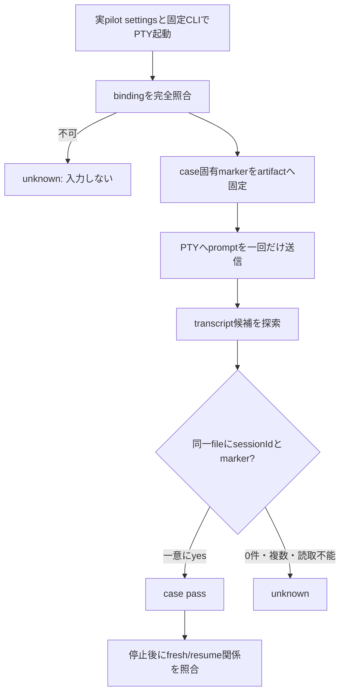

# Issue #434 N1 native transcriptの識別用marker投入設計

## 1. 決定

N1は、`scripts/pilot-gate-runner.sh` が実pilot settings・実
`scripts/pilot-launcher.sh`・固定native Claude CLIを使ってfresh/resumeを起動した後、
**bindingの完全照合に成功してから**、各native PTYへ無害な識別用プロンプトをちょうど1回だけ
送る。

このプロンプトは外部command、Bash tool、broker、provider、GitHub、ファイル変更を要求せず、
次の一意markerだけを返信するよう求める。

```text
AGMSG_N1_TRANSCRIPT_MARKER_<run-id>_<mode>_<nonce>
```

成功条件は、同じ正規ファイル・非symlinkのtranscriptに次の両方があることとする。

1. bindingの`sessionId`と一致するsession identity
2. 当該case固有のmarker

これにより、filenameだけの一致、探索root誤り、過去の別session transcript、markerだけを含む
別sessionを成功として扱わない。どちらかを証明できない場合は`unknown`とする。

## 2. 根拠と変更境界

verifier T4〜T6は、隔離設定で準備完了画面へ進めても無送信25秒では`projects` directoryも
transcriptも生成されないことを示した。ただし、この観測は「25秒以内に無送信で観測できなかった」
だけであり、永続的不生成の証明ではない。また、送信後にtranscriptが生成されることは未測定である。

現行`launch_n1_case`はbinding、native process、実CLI argvを照合した後、
`wait_for_transcript "$session_id"`を呼ぶ。既存`pilot-pty.py`はchildのPTY master FDを保持し、
I1の`NativePilot.invoke`も同FDへpromptとCRを一回書く。したがって本変更はnative起動や
binding contractを置換せず、N1の観測開始前に限定した1入力を追加できる。

変更する候補は次だけである。

| 範囲 | 変更 |
| --- | --- |
| `scripts/pilot-gate-runner.sh` | case固有markerの生成、PTYへの1回入力、marker+sessionIdによる待機・artifact記録 |
| `scripts/lib/pilot-pty.py` | 必要なら、runnerが安全に入力できる最小のcontrol channelを追加する。launch時のPTY意味論は変えない |
| `scripts/lib/pilot-gate-isolation.py` | transcript候補を「sessionIdかつmarker」で判定するread-only helperを追加する |
| `tests/` | 下記のfixture-bound controlを追加する |

変更しないものは、`scripts/pilot-launcher.sh`、`pilot-binding.js`、`p2-consumer-broker.sh`、
`pilot-collector.sh`、実pilot profile/settingsの意味論、gateの`pilot_ready`判定である。

## 3. 実行順序とfail-closed判定



### 3.0 前提条件: N1はPTY起動に限る

本設計の「promptを1回送り、transcriptを観測する」は、**N1のnative CLIが
`scripts/lib/pilot-pty.py`経由のPTYで起動され、runnerがそのchildのPTY master FDへ書ける**
ことを前提とする。PTYで起動していなければpromptを送れず、promptを送らなければtranscriptは
生成されない（§2のT4〜T6）。

- N1の起動経路は、現行の`pilot-gate-runner.sh`が`pilot-pty.py run`を呼ぶ経路だけとする。
- prompt送信の直前に、送信先がspawn済みchildのPTY master FDであることを確かめる。
  FDを確保できない、childがPTY配下で起動していない、または確かめられない場合は、
  **promptを送らず（送信回数0）、そのcaseを`unknown`とする。**
- その場合に、stdin・FIFO・file・別プロセスのpane入力など**代わりの入力経路を試さない**。
  代替経路はCLIの対話modeを変え得るうえ、PTY前提の観測と別の事象を測ることになる（§5手順1）。
- この前提の不成立を`fail`や`pass`へ変換しない。`pilot_ready=false`を維持する。

§3.2の「FD不在は`unknown`」は送信時点の失敗を扱う。本節は、そもそもPTY起動でない状態を
送信前に検出して止めることを定める。

### 3.1 入力前提をN1のidentity contractから分離する

テーマ選択・login choice・folder trust確認は、markerを投入してよい準備完了画面へ至るための
**投入前提**である。gate側は現行の隔離HOME/XDG/`CLAUDE_CONFIG_DIR`と実pilot settings/launcher経路で
その前提を満たすことを観測する。

この前提は、bindingの`team`、`agent`、`project`、`generation`、`sessionId`、pid、実argv、
profile/guard/broker digestの照合を代替しない。準備完了が不明、bindingが不完全、PIDが死んでいる、
実argvが不一致なら、promptを送らず`unknown`または既存の`fail`にする。

### 3.2 marker生成と送信

- `run-id`、`mode`（`fresh`または`resume`）、cryptographic nonceからASCII markerを作る。
  markerはfresh/resume間、再実行間で重複してはならない。
- prompt本文はmarkerの**正確な一回の返信だけ**を依頼し、tool使用・command実行・ファイル操作・
  ネットワーク操作を禁止する。sessionIdやtoken等の秘密値はpromptへ入れない。
- promptとmarkerは`N1/<mode>/prompt.txt`、`marker.txt`へ保存する。入力成功は、master FDへの
  `write`が完全長を書いたことまでを記録する。partial write、EIO、FD不在、child終了は`unknown`で、
  retryしない。
- 送信回数はcase artifactのcounterまたは入力recordで`1`を強制する。timeout時にも同caseへ第二promptを
  送ってはならない。

### 3.3 transcript探索

探索rootは`GATE_CLAUDE_CONFIG`のcanonicalized projects rootだけとし、live HOME、既存の
`~/.claude`、artifact root、別gate rootを探索しない。候補ごとに次を確認する。

1. regular fileで、symlinkではない。
2. canonical pathが探索root配下である。
3. JSONLの内容を解析してbindingの`sessionId`を含む。
4. 同じファイル内容にそのcaseの完全markerを含む。

0候補、複数候補、JSON/UTF-8/I/O不良、markerが他fileだけにある、sessionIdが他fileだけにある、
探索root自体が不明のいずれも`unknown`とする。sessionId不一致が識別できる候補、またはmarkerが
別sessionだけにある候補は探索失敗をpassへ畳み込まない。

## 4. fresh/resumeの確認契約

freshではmarker `M_fresh` とbinding session `S` の同一transcriptを確認する。resumeでは、freshを
正常停止した後に、別marker `M_resume` とresume binding session `S` の同一transcriptを確認する。

N1 passには、既存契約に加え次を全て要求する。

| 観測 | fresh | resume |
| --- | --- | --- |
| marker | `M_fresh`を1回送信し同一transcriptで発見 | `M_resume`を1回送信し同一transcriptで発見 |
| sessionId | non-empty UUID `S` | `S`と完全一致 |
| generation | `1` | freshより厳密に増加（現行期待値`2`） |
| event | markerを含むfresh固有event | markerを含むresume固有event。fresh artifactの再読では不可 |
| immutable binding | fresh bindingを保存 | fresh binding digest不変、resume bindingは別file |

resumeで同一sessionIdだけを確認しても、fresh transcriptを誤再利用していれば十分ではない。
`M_resume`がresume case固有であることにより、新規eventを確認する。

## 5. 実装者への手順

1. `pilot-pty.py`の現行launch pathを保ったまま、runnerがspawn済みmaster FDへ一回だけ書ける設計を
   実装する。runnerがFIFO/file stdinへ切り替える実装は禁止する。これはCLIをprint modeへ変え得る。
2. `launch_n1_case`のbinding/process/argv validation成功後、現行`wait_for_transcript`の前に
   marker artifactを作り、完全書込を確認して一回だけpromptを投入する。
3. `find-transcript`相当のread-only helperを拡張または新設し、sessionIdとmarkerの**同一file結合**を
   返す。filename一致だけでは成功にしない。
4. `N1/fresh`と`N1/resume`にprompt、marker、input record、candidate診断、選択したtranscript pathを
   保存する。環境変数値・認証token・未加工の秘密入力は保存しない。
5. 既存の三値とcleanup経路を維持する。inputまたは探索の不確実性を`fail`へ勝手に変換せず`unknown`にし、
   `pilot_ready=false`を維持する。

## 6. 検査設計

最初に想定する偽陰性は「sessionIdを含む古いtranscriptを探索してしまい、markerを別fileで見つけても
passとしてしまう」ことである。従って通常の正しいfixtureだけでなく、**sessionIdとmarkerを意図的に
別fileへ分離する対照**を必須にする。

| ID | fixture / 操作 | 期待 | 検出する失敗モード |
| --- | --- | --- | --- |
| N1M-01 | fresh、固定runner/launcher/PTYでmarkerを1回送信。1 fileに正しいsessionIdとmarker | pass | 正常経路とPTY inputの不成立 |
| N1M-02 | resume、別marker、同一sessionId、generation増加、fresh binding digest不変 | pass | resumeがfresh扱い、旧binding破壊、新規event欠落 |
| N1M-03 | markerを含むがsessionIdが異なる別session file | unknown | marker-only探索 |
| N1M-04 | 正しいsessionIdを含む古いfileと、正しいmarkerだけの別file | unknown | file横断の誤結合 |
| N1M-05 | 同じsessionId+markerを含む候補を2 file用意 | unknown | 非一意候補の任意選択 |
| N1M-06 | 探索root外の正しい候補、root内は0件 | unknown | home/別sessionを誤探索 |
| N1M-07 | master writeをpartial/EIOにする | unknown、送信record=1、retry=0 | 送信失敗の隠蔽・重複入力 |
| N1M-08 | 無送信で短い観測窓を通す旧経路 | passにならない | 25秒0件を永続的不生成または成功と誤読 |
| N1M-09 | PTY master FDを持たない起動（例: pipe stdinでchildを起動、またはFDを送信前に閉じる） | unknown、送信record=0、代替入力0 | PTY前提（§3.0）の不成立を見逃し、別経路で入力する・passにする |

N1M-01/02は実pilot settings、実launcher、固定CLI版を用いる独立smokeの候補である。fixture testは
PTY/input、candidate selection、三値、counterを決定的に検査するが、native smokeを代替しない。

## 7. smokeの位置づけ

実装後のsmokeは、隔離clone・隔離HOME/XDG・gate専用teamだけで実施する。value / cutoff / source /
commandと、fresh/resumeそれぞれのraw artifactを保存する。tokenは環境へ渡しても、値・伏字・hashを
artifact、ログ、Issue、agmsgへ出さない。

smokeが示すのは、固定CLI版・実pilot settings/launcher経路でmarker投入後にtranscript観測が可能か、
およびfresh/resumeのidentity contractが保たれるかだけである。

**smokeはG4 gate受入の代替ではない。** I1/F1〜F5、live PM negative control、全gateの集約判定、
`pilot_ready=true`、live起動、物理移行はいずれも本Issueで承認・実行しない。`pilot_ready`はfalseのままにする。

## 8. 受入条件と非対象

この設計を実装へ渡す条件は次である。

1. N1は実binding照合後にだけ、case固有の無害marker promptを一回送る。
2. fresh/resumeはmarkerとbinding sessionIdが同じ唯一のregular transcript fileで確認される。
3. resumeは同sessionId・generation増加・新規marker event・fresh binding不変を同時に確認する。
4. old session、root外、複数候補、別file結合、I/O/parse不明は`unknown`である。
5. tokenその他の秘密値は出力・記録されない。
6. fixture controlsと実native smokeを分け、smokeをgate受入へ代用しない。
7. N1はPTY起動に限り、PTY master FDを確保できないcaseはpromptを送らず`unknown`とし、代替入力経路を試さない（§3.0、N1M-09）。

非対象は実装、PR作成、全gate再実行、live pilot起動、physical migration、README変更である。
