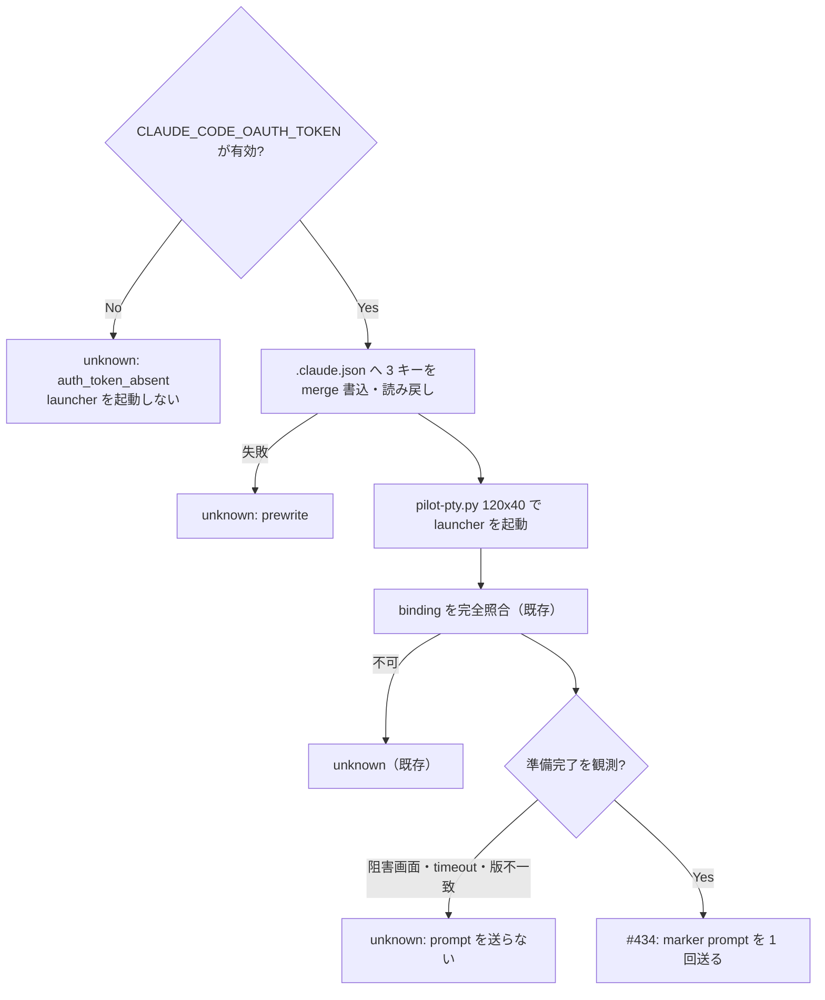

# Issue #444: N1 の投入前提（事前書込・token 受け渡し・準備完了検出）

## 1. 決定

**gate runner は、N1 の各 case を起動する前に次の 3 つを満たす。どれかを確かめられなければ、prompt を送らずその case を `unknown` とする。**

| # | 前提 | 決定 |
| --- | --- | --- |
| 1 | 初回セットアップと folder trust を画面操作なしで通過する | `$GATE_CLAUDE_CONFIG/.claude.json` へ 3 つのキーだけを merge して書く（§3） |
| 2 | 認証 | `CLAUDE_CODE_OAUTH_TOKEN` を**環境変数だけ**で受け取り、pilot へ継承させる。無ければ launcher を起動せず `auth_token_absent`（§4） |
| 3 | 準備完了 | PTY 出力（`pty.raw`）で準備完了の表示を正に観測し、既知の阻害画面が 1 つも無いことを確かめる（§5） |

この 3 つは #434 設計 §3.1 の「投入前提」にあたる。binding・process・argv の照合（identity contract）を代替しない。

README への影響: 無（gate harness は開発・受入用の内部ツール）。

## 2. 根拠（verifier T4〜T6 の実測）

出所は verifier から PM への報告（agmsg、2026-09-13T07:46:09+09:00）である。本書では再実測していない。

条件: `HOME`、`XDG_*`、`CLAUDE_CONFIG_DIR` をすべて使い捨てにし、`ANTHROPIC_API_KEY`、`GH_TOKEN`、`GITHUB_TOKEN` を unset、`CLAUDE_CODE_OAUTH_TOKEN` を設定した。`claude --session-id <uuid>` を Python の `pty` で 120x40 の端末として起動した。Claude Code は 2.1.268。

| 条件 | 事前に書いた `.claude.json` | 送ったキー | 最終画面 |
| --- | --- | --- | --- |
| T4 | なし | テーマ選択で Enter 1 回 | `Select login method:` |
| T5 | `hasCompletedOnboarding=true`、`theme=dark` | なし | `Quick safety check: Is this a project you created or one you trust?`（既定の選択は `No, exit`） |
| T6 | T5 に `projects.<実パス>.hasTrustDialogAccepted=true` を追加 | なし | 準備完了。`Sonnet 5 · Claude API` と `⏸ manual mode on · ? for shortcuts`（起動 3 秒後） |

verifier 自身が挙げた限界は次のとおりである。

- キーが効くことは 2.1.268 で確かめただけで、公式の契約ではない
- gate の `--settings` を渡した場合の画面は未確認である
- T4〜T6 の間に token と同じ文字列を含むファイルは 0 件だった（正の対照として、token ファイル自身では 1 件検出されることを確認済み）

**本書の現状確認（main `84bc134`）**: `scripts/pilot-gate-runner.sh` の `export_isolated_environment` は、`HOME`、`XDG_*`、`CLAUDE_CONFIG_DIR` を gate 用へ向けるだけである（`pilot-gate-runner.sh:637-645`）。
事前書込、token の扱い、準備完了の検出はどこにも無い（#444 本文、breaker の grep 実測）。
`scripts/lib/pilot-pty.py` は端末サイズを設定していない（`winsize`、`TIOCSWINSZ`、`rows`、`cols` の grep は 0 件。同じファイルで `def pump` は検出される）。

## 3. 事前書込の JSON 形

### 3.1 書く内容

```json
{
  "hasCompletedOnboarding": true,
  "theme": "dark",
  "projects": {
    "<GATE_REPO>": {
      "hasTrustDialogAccepted": true
    }
  }
}
```

- `<GATE_REPO>` は runner の `GATE_REPO` そのものである。`RUN_ROOT` が canonical 化されている（`pilot-gate-runner.sh:440`）ので canonical path になる。N1 は同じ文字列を `--cwd` と `--project` に渡す（`pilot-gate-runner.sh:1139-1147`）
- 値は T6 の実測値をそのまま使う。`theme` は T5・T6 と同じ `dark` にする
- **これ以外のキーを書かない。** 特に、他のパスの trust、権限モード、認証情報を書かない

### 3.2 書き方

| 規則 | 内容 |
| --- | --- |
| 書込先 | `$GATE_CLAUDE_CONFIG/.claude.json` だけ。`GATE_CLAUDE_CONFIG` は `RUN_ROOT` 配下の canonical path であることを書く前に確かめる |
| 禁止 | 実 `$HOME/.claude.json`、実 `~/.claude/`、`RUN_ROOT` 外への書込 |
| 既存ファイル | 存在すれば JSON object として読み、§3.1 の 3 つのキーだけを設定し、他のキーは保つ。読めない・object でない・symlink なら書かずに `unknown`（`claude_config_unreadable`） |
| 原子性 | 同じディレクトリの一時ファイルへ書き、mode `0600` にしてから rename する |
| 読み戻し | rename 後に読み直し、3 つのキーが期待値であることを確かめる。違えば `unknown`（`claude_config_prewrite_unverified`） |
| 時期 | **fresh と resume の各 case の launcher 起動直前に、毎回行う。** fresh の実行中に CLI が同じファイルを書き換えるため、resume の前に前提が保たれている保証が無い |
| 記録 | `N1/<mode>/claude-config-prewrite.json` に、書込先パス、設定した 3 つのキーとその値、読み戻しの結果を残す。ファイル全体は残さない（CLI が書き足した内容を含むため） |

### 3.3 未確認の点

**T6 が `.claude.json` をどのパスに置いたかは、verifier 報告に明記されていない。** 本書は #444 本文の `$GATE_CLAUDE_CONFIG/.claude.json` を採る。

パスが違った場合は、CLI が事前書込を読まない。その場合は T4 か T5 の画面が出る。§5 の検出がこれを阻害画面として捉え、`unknown` にする。**誤ったパスで先へ進むことはない。**
実装 PR の native smoke で、準備完了まで進むことを確かめる（§7.2）。

## 4. token の受け渡し

### 4.1 経路

```text
呼出し側（verifier）の環境
  CLAUDE_CODE_OAUTH_TOKEN
    -> pilot-gate-runner.sh（読むのは環境変数だけ）
      -> export_isolated_environment（値に触れず、継承させるだけ）
        -> pilot-pty.py -> pilot-launcher.sh -> claude（exec で継承）
```

| 規則 | 内容 |
| --- | --- |
| 入力 | runner が見るのは環境変数 `CLAUDE_CODE_OAUTH_TOKEN` だけである。token ファイルのパスを引数・設定・既定値として持たない。ファイルを読まない |
| 受け渡し | 環境の継承だけで渡す。argv に載せない（`ps` で見えるため） |
| 競合する認証 | runner は `ANTHROPIC_API_KEY` と `ANTHROPIC_AUTH_TOKEN` を unset する（T4〜T6 と同じ条件にし、どの認証が使われたかを一意にする）。unset した変数名だけを記録する |
| 書かない | 値を、ファイル・artifact・ログ・PTY への入力・Issue・agmsg に書かない。伏字・長さ・hash・先頭数文字も書かない |
| 記録 | `N1/auth.json` に `{"oauthTokenEnv": "present" \| "absent", "unsetCompetingEnv": [...]}` だけを残す |

launcher は `AGMSG_PM_*` だけを消す（`pilot-launcher.sh:58-66`）ので、`CLAUDE_CODE_OAUTH_TOKEN` は claude まで継承される。launcher の変更は要らない。

### 4.2 無いときは起動しない

`CLAUDE_CODE_OAUTH_TOKEN` が未設定、空、または制御文字を含むとき:

- N1 の fresh と resume の両方を、**launcher を起動せず**に `unknown`（reason `auth_token_absent`）とする
- `pilot_ready=false` を保つ
- token ファイルを探しに行かない。別の認証へ fallback しない

起動してから認証失敗を画面で待つ方式は採らない。T4 が示したとおり、token があってもログイン方法の選択画面は出る。**画面から「token が無い」ことを判別できない。**

### 4.3 既存の環境記録

`capture-environment`（`scripts/lib/pilot-gate-isolation.py`）が環境変数を記録する場合は、`CLAUDE_CODE_OAUTH_TOKEN`、`ANTHROPIC_API_KEY`、`ANTHROPIC_AUTH_TOKEN` の値を出してはならない。**実装 PR で、この 3 つの名前について値が出力されないことを試験する（§7.1）。**

## 5. 準備完了の検出

### 5.1 観測源

`pilot-pty.py` が PTY master から読んで追記する `N1/<mode>/pty.raw` を使う。
画面を観測できる手段はこれしか無い。CLI は準備完了を機械可読な形では出さない。

判定の前に、`pty.raw` を UTF-8（不正バイトは置換）で読み、ANSI の CSI 列と OSC 列を取り除く。

### 5.2 判定

binding の完全照合に成功した後で、次を `READY_TIMEOUT`（30 秒）まで繰り返し評価する。

| 観測（ANSI 除去後の全文に対して） | 判定 | reason |
| --- | --- | --- |
| `Select login method` を含む | 即 `unknown` | `login_method_screen` |
| `Quick safety check` を含む | 即 `unknown` | `trust_dialog_screen` |
| 上の 2 つを含まず、`? for shortcuts` を含む | 準備完了 | — |
| `READY_TIMEOUT` までどれにも当たらない | `unknown` | `ready_not_observed` |
| child が終了した、`pty.raw` を読めない | `unknown` | `ready_observation_failed` |

- **阻害画面を 1 度でも観測したら、後から準備完了の表示が出ても準備完了にしない。** 途中の画面を通過したことは、事前書込が効かなかったことを意味するからである
- **阻害画面を通過するためのキー入力を送らない。** T5 の trust 確認は既定の選択が `No, exit` であり、Enter を送れば終了する
- テーマ選択画面の文字列は T4 の記録に無い。そのため、阻害画面としては判定に使わない。テーマ選択で止まった場合は、準備完了の表示が出ずに `ready_not_observed` となる
- 準備完了と判定した後にだけ、#434 の marker prompt を送る

### 5.3 CLI 版への束縛

上の文字列は Claude Code 2.1.268 で観測したものである。

- runner は既に `CLAUDE_VERSION` を取得している（`pilot-gate-runner.sh:410`）
- `CLAUDE_VERSION` が、検出文字列を実測で確かめた版と一致しなければ、準備完了を判定せず `unknown`（`ready_patterns_unverified_for_cli_version`）とする
- 確かめた版の一覧は runner の定数に持つ。版を追加するのは、verifier がその版で T6 相当の準備完了と阻害画面を実測した後だけとする

### 5.4 端末サイズ

T4〜T6 は 120x40 の端末で観測した。現在の `pilot-pty.py` は端末サイズを設定しない（§2）。
サイズが 0 のままだと、表示の折り返しや省略が変わり、§5.2 の文字列が崩れうる。

**`pilot-pty.py` は子を起動する前に PTY の端末サイズを 120x40 に設定する。** 変わるのは端末の大きさだけで、PTY で起動するという launch の意味は変えない（#434 §2 の変更境界と両立する）。

### 5.5 `--settings` による表示差

T6 は gate の `--settings`（pilot profile）を渡していない。profile によって権限モードの表示（`manual mode on` の部分）が変わりうる。
判定には `? for shortcuts` だけを使い、権限モードの文字列は使わない。`? for shortcuts` 自体が出なければ `ready_not_observed` になり、先へは進まない。

## 6. 実行順序



fresh と resume はそれぞれこの順に進む。resume でも token の確認と事前書込をやり直す（§3.2）。

## 7. 実装 PR への要件

実装は別 PR（`agmsg_programmer_claude`）とする。変更対象は `scripts/pilot-gate-runner.sh`、`scripts/lib/pilot-pty.py`、`scripts/lib/pilot-gate-isolation.py`、`tests/` である。

### 7.1 fixture 試験

**試験に実 token を使わない。** 合成した一意の文字列（例: 実行ごとに作る `qqzz-synthetic-<nonce>`）を `CLAUDE_CODE_OAUTH_TOKEN` に入れる。

| ID | 操作 | 期待 | 検出する失敗モード |
| --- | --- | --- | --- |
| N1P-01 | 合成 token あり、CLI の代わりに準備完了表示を出す fake を PTY で起動 | 準備完了、prompt 送信 1 回 | 正常経路の不成立 |
| N1P-02 | `CLAUDE_CODE_OAUTH_TOKEN` 未設定 | `auth_token_absent`、launcher の起動 0 回、prompt 0 回 | token 無しで起動してしまう |
| N1P-03 | 空文字列の token | N1P-02 と同じ | 空を有効扱い |
| N1P-04 | fake が `Select login method:` を出した後に `? for shortcuts` を出す | `login_method_screen`、prompt 0 回、キー入力 0 回 | 阻害画面を見逃す・キーで突破する |
| N1P-05 | fake が `Quick safety check` を出す | `trust_dialog_screen`、prompt 0 回、キー入力 0 回 | 同上 |
| N1P-06 | fake が何も出さない | `ready_not_observed`、prompt 0 回 | timeout を準備完了扱い |
| N1P-07 | `CLAUDE_VERSION` を未確認の版にする | `ready_patterns_unverified_for_cli_version`、prompt 0 回 | 版の束縛が効かない |
| N1P-08 | 既存 `.claude.json` に他のキーがある | 3 キーだけが変わり、他のキーは残る | 上書きによる破壊 |
| N1P-09 | `.claude.json` が symlink、または JSON として不正 | `claude_config_unreadable`、書込 0 回 | symlink 越しの書込・不正ファイルの上書き |
| N1P-10 | `GATE_CLAUDE_CONFIG` を `RUN_ROOT` 外へ向ける | 書込 0 回、`unknown` | 実環境への書込 |
| N1P-11 | fresh の後に fake が `.claude.json` の trust を消す | resume の前に書き直され、読み戻しが通る | resume で前提が崩れる |
| N1P-12 | 実行後、`RUN_ROOT` と artifact 全体を合成 token で検索する | 0 件。正の対照として、合成 token を書いた検査用ファイル 1 件は検出される | token の漏洩 |
| N1P-13 | `ANTHROPIC_API_KEY` を設定して起動 | 子の環境に無い。`auth.json` には変数名だけが残る | 競合する認証の混入 |
| N1P-14 | `capture-environment` に合成値の 3 変数を与える | 出力に合成値が 0 件 | 環境記録からの漏洩 |
| N1P-15 | fake が子の端末サイズを報告する | 120x40 | 端末サイズ未設定 |

N1P-04 と N1P-05 は、阻害画面の判定が「準備完了の表示が無い」ことだけに頼っていないかを確かめる。どちらも準備完了の表示を後から出すため、阻害画面の判定を消すと準備完了になってしまう。

### 7.2 native smoke（verifier、実装 merge 後）

- 隔離 clone・隔離 HOME/XDG・gate 専用 team で行う。token は verifier が実行時の環境で渡し、記録しない
- 期待: fresh と resume の両方で、準備完了を観測してから marker を送る。これで #434 の N1M-01 と N1M-02 へ進める
- 準備完了まで進まなかった場合は、観測した reason を報告して止める。§3.3（書込先のパス）と §5.5（`--settings` による表示差）の未確認点がここで判明する
- token 漏洩の検査（N1P-12 相当）は、実 token について件数だけを出力する形で行う。一致した行は出力しない

## 8. 非対象

- #434 の native smoke そのもの、#407 の 4 回目の実行
- gate team DB の events テーブル欠落の原因調査
- I1・F1〜F5 の投入前提。本書の規則は runner の N1 の経路に置く。他の phase へ広げるかは、それぞれの Issue で判断する
- `pilot-launcher.sh`、`pilot-binding.js`、pilot profile の変更
