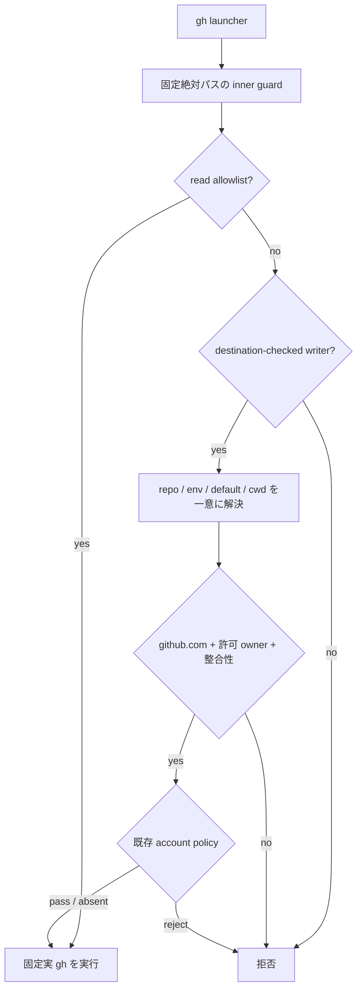

# Issue #10 — gh 書込み宛先所有者ガード実装計画

## 目的

`gh` の repository writer が `kappaseijin` / `kappaseijinjp` 以外の GitHub repository を対象にしないよう、インストール時に実行先を固定した guard を配置する。
allowlist に分類できない command、alias 実行、extension 実行、非 GET の `gh api` は fail-closed とする。

作業は内部依存の順序に従い、Issue #8（spawn の role overlay）完了後、Issue #3 の前に実施する。
既存の Issue #21 / PR #21 を Issue #10 の唯一の実装 PR として継続する。

## 制約

- 対向 LLM と formal reviewer は起動しない。
- Codex の単一エージェントで実装・検証する。
- 1 issue / 1 PR を維持する。
- PR はテスト成功後に自律的に更新・マージする。

## 実装方針

1. `/bin/sh` launcher から `/bin/bash` の inner guard を起動し、guard と実 `gh` を絶対パスで固定する。
2. 宛先は明示 `-R` / `--repo`、`GH_REPO`、`gh repo set-default --view`、cwd の順に一意に解決する。
3. 明示 repository、default、cwd の resolver は固定した実 `gh` を非対話で呼び、host / owner / repository の整合性を再検査する。
4. host は `github.com`、owner は `kappaseijin` または `kappaseijinjp` に固定する。
5. installer は非 agmsg の `~/.agents/bin/gh` を上書きせず、uninstaller は agmsg の marker がある guard だけを削除する。
6. 既存の PR account policy は owner guard 通過後の追加拒否としてのみ適用する。
7. README / README.ja に導入、PATH、宛先解決、fail-closed 条件、再実行、アンインストールを記載する。

## 受け入れ条件

| 条件 | 検証 |
| --- | --- |
| GHG-01〜04 | 第三者 owner、scratch cwd、設定変更による bypass を拒否し writer marker を残さない |
| GHG-05〜10 | 宛先優先順位、明示値、欠値、重複、`--` を検証 |
| GHG-11〜12 | host / repository grammar と allowlist 設定の改変を拒否 |
| GHG-13 | alias / extension の任意 command 実行を拒否 |
| GHG-14〜15 | `gh api` の method / field grammar と読み取り allowlist を検証 |
| GHG-16〜18 | shell startup hook、PATH decoy、scratch cwd を検証 |
| GHG-19 | 許可 owner の `pr merge` を通し argv を保持 |
| GHG-20 | explicit / default / cwd resolver の失敗、空、複数行、不一致、prompt を拒否 |

## 検証記録

- `bats tests/test_gh_write_owner_guard.bats`: 20/20 成功。
- `bats tests/test_install.bats`: 50/50 成功。
- `bats tests/`: 900/900 成功、終了コード 0（明示 resolver の追加後の最終差分）。
- `bash -n install.sh uninstall.sh scripts/guards/gh-write-owner-guard.sh scripts/guards/gh-write-owner-guard-launcher.sh`: 成功。
- ShellCheck: 新規指摘なし。既存 `install.sh:87` の SC2004 のみ残る。
- `git diff --check`: 成功。

## 完了判定

最終全体テスト 900/900 の成功を確認済み。PR #21 の head 同期、GitHub checks、merge、Issue #10 close 後に `status: completed` へ更新する。
