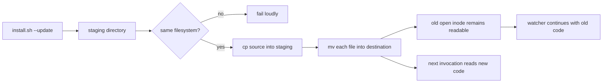

# Issue #22 — install 時の安全な scripts 同期を codex 側で引き取る計画

## 目的

`install.sh --update` が実行中の `watch.sh` 系プロセスの読み取り中ファイルを `cp -R` で in-place 上書きし、途中から別内容を読み込ませる問題を解決する。

対象は agmsg の Issue #22 とし、元の PR #2 の変更を `origin/main` へ載せ直して、Codex 側の 1 PR として提出する。

## 受け入れ条件

- `install.sh` の scripts 同期が、既存ファイルの inode を in-place 変更しない。
- 実行中スクリプトが同期中も最後まで完走し、旧ファイルを読み続けることを試験で示す。
- 旧 `cp -R` 相当では試験が失敗し、安全な実装では成功する。
- 新しいファイル、既存ファイル、source に無い destination の orphan を含む同期仕様を試験する。
- 同期元と staging 先の filesystem が異なる場合は安全性を偽装せず失敗する。
- `README.md` と `README.ja.md` だけで update の実行方法と、実行中 agent への影響・確認方法が分かる。
- ADR に設計判断、既知の Windows/MSYS2 未検証範囲、代替案を記録する。
- `origin/main` へ rebase 後、関連テストと全 required CI を実測する。
- Issue #22 と 1 対 1 の PR を `kappaseijin4codex` で提出する。
- 対向 LLM エージェントは起動せず、`codex_product_owner` 派生席のセルフチェックで進める。

## 実施順

1. origin Issue #22、元 PR #2、`herdr-agent-monitor_owner_codex` からの引き継ぎ情報を確認する。
2. `issue-22-safe-dir-sync-codex` を `origin/main` から作成し、既存の安全同期実装を載せ直す。
3. `safe_dir_sync` の仕様・異常系・実行中プロセス保護を確認し、必要な実装・テスト・README を更新する。
4. shellcheck、対象 bats、全テスト、実 install/update の隔離実測を行う。
5. Codex アカウントで Issue #22 と対応する PR を作成する。CI とセルフチェックの証拠を本文へ記録する。
6. ユーザー指定の一時運用制約により formal cross-vendor reviewer が利用できない場合は、レビュー不能を記録してマージせず、PR と Issue の状態を報告する。

## 実態の流れ

## 変異試験の実測

2026-08-14T11:59:38+09:00 に、対象試験の無変異・変異・復元を順に実行した。

- 無変異: `bats --filter 'safe_dir_sync leaves a running script completely undisturbed' tests/test_safe_dir_sync.bats` が `ok`（exit 0）。
- `M-SAFE-DIR-CP-R`: 一時コピー内の `safe_dir_sync` を `cp -R` 実装へ戻す変異を適用すると、同じ対象試験が `not ok`（exit 1）。復元後は再び `ok`。判定は `KILLED`。
- `KILLED-BY-TSC`: 対象は Bash 実装で TypeScript 型検査を使用しないため `not_applicable`。
- `SURVIVED`: なし。

変異は一時コピーだけに適用し、リポジトリの実装は復元済みである。

## 完了条件

Issue #22 の実装・文書・テスト・CI・PR 状態を current state で再確認し、未解決の review gate が無い場合だけ merge する。レビュー不能または required CI 未完了の場合は、解決済みと扱わない。
