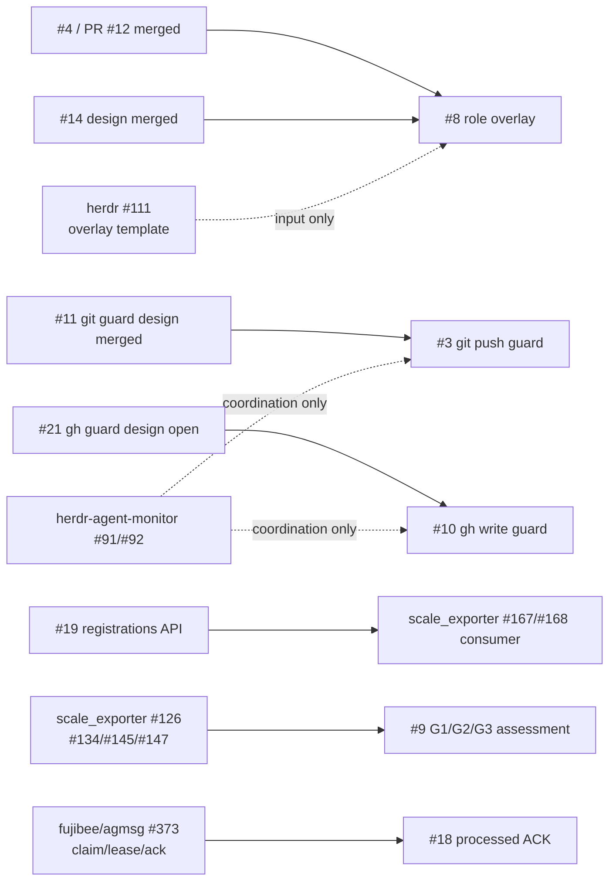

# Issue #28 — open issue の依存監査と内部解決順

## 目的

2026-08-14 時点の agmsg の open issue / PR を、実装場所と外部依存の有無で分類する。
agmsg 内で完結するものは、前提を満たす順に 1 issue / 1 PR で実装・検証・merge する。
別プロジェクトの成果物・仕様・実行状態が必要なものは、依存先と待機条件を Issue #28 に残す。

## 調査範囲と事実

- open issue は #3、#8、#9、#10、#13、#18、#19、調査起票後の #28。
- open PR は #21 のみ。#21 は #10 の設計書だけを含み、実装は未着手。
- #3 の設計 PR #11、#8 の設計 PR #14、#9 の旧評価 PR #16、#4 の修正 PR #12 は merge 済み。
- #19 の API は `scripts/api.sh` の公開 JSONL resource として追加でき、members の後方互換を保てる。
- #13 は `tests/test_codex_bridge_launcher.bats` の固定 3 秒 poll が対象で、コード上の内部テスト問題である。
- #8 は #4 の BSD awk 修正と設計 PR #14 が完了済みで、`spawn-options.sh` の実装へ進める。

## 依存グラフ

## 分類と着手順

| 順 | agmsg issue | 分類 | 前提・扱い |
| ---: | --- | --- | --- |
| 1 | [#19](https://github.com/kappaseijin/agmsg/issues/19) | 内部実装可能 | API の実装・fixture・後方互換確認は agmsg 内で完結する。scale_exporter #167/#168 は利用者契約の入力であり、実装の hard blocker ではない。 |
| 2 | [#13](https://github.com/kappaseijin/agmsg/issues/13) | 内部実装可能 | Windows runtime test の同期を直す。外部入力なし。 |
| 3 | [#8](https://github.com/kappaseijin/agmsg/issues/8) | 内部実装可能 | #4 / PR #12 と設計 PR #14 が merge 済み。herdr #65/#111/#117 は入力・実測参照であり、agmsg の実装を待たない。 |
| 4 | [#10](https://github.com/kappaseijin/agmsg/issues/10) | 内部実装可能 | 既存 PR #21 を同 issue の実装 PR へ仕上げる。herdr #91/#92 は重複調整の参照であり、完了条件にはしない。 |
| 5 | [#3](https://github.com/kappaseijin/agmsg/issues/3) | 内部実装可能 | merge 済み設計 PR #11 に基づく git push guard。#10 と経路・PRを分離する。herdr #91/#92 は coordination only。 |
| 6 | [#9](https://github.com/kappaseijin/agmsg/issues/9) | 外部入力を要する再評価 | scale_exporter #126 と merge 済み #134/#145/#147、handoff 文書を読み、G1/G2/G3 の schema / 所有境界を agmsg 側で再判定する。engine の実装を先行しない。 |
| 7 | [#18](https://github.com/kappaseijin/agmsg/issues/18) | 外部依存・保留 | upstream [fujibee/agmsg #373](https://github.com/fujibee/agmsg/issues/373) の claim/lease/ack と、herdr / Codex の turn 境界が processed の定義に関わる。現状の `send.sh` だけで真の処理完了を断定しない。 |

## Issue #21 の扱い

PR #21 は `kappaseijin4codex` 作成で、#10 に対応する設計だけが存在する。
新しい設計 PR を作らず、同じ head branch に実装・試験・README を追加し、本文を実装完了条件へ更新する。
これにより #10 は一つの PR だけで完了し、設計だけの open PR を残さない。

## PR と検証の規約

- 各実装は対応 issue を一つだけ `Closes #N` で参照する。
- 起草者と異なる formal reviewer、対向 LLM、追加エージェントは起動しない。ユーザーが明示した単独 Codex 運用を優先する。
- merge 前に対象 bats / shellcheck / `git diff --check` と、必要な CI を確認する。
- Issue #28 へ各 PR の URL、検証結果、残る外部待機条件を追記する。

## 完了条件

- Issue #28 に open issue / PR の分類、依存対象、待機条件が記録されている。
- #19、#13、#8、#10、#3 を上記順に一対一の PR で解決するか、実測付きの阻害理由を残す。
- #9 は外部 handoff を参照した再評価結果を返し、#18 は upstream 依存を明示して重複実装を避ける。
- `main` が各 merge 後に同期され、作業ブランチと不要な open PR が残らない。
