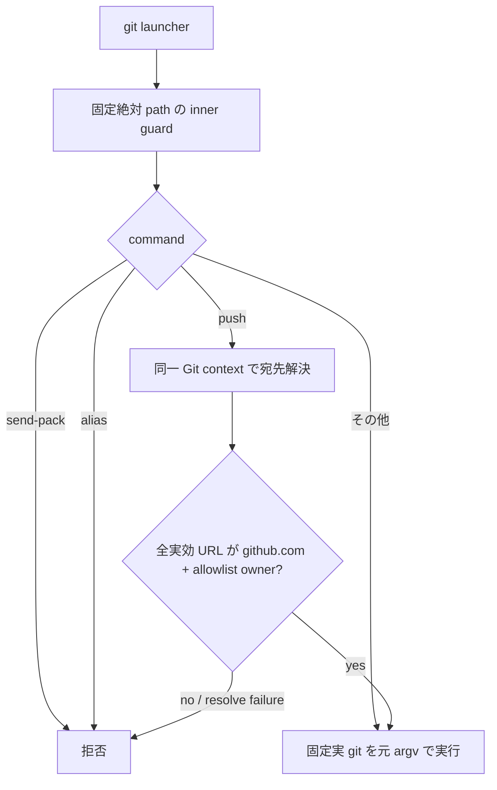

# Issue #3 — git push 宛先所有者ガード実装計画

## 目的と境界

`gh` の write 経路は完了済みの Issue #10 が担当するため、本 Issue は `git push` と同等の `git send-pack` 経路だけを扱う。
`~/.agents/bin/git` を標準 agent PATH の先頭へ置き、clone 内の hook や remote 設定に依存せず、再 clone 後も実効 push URL を検査する。

allowlist は guard のコード内リテラル `kappaseijin` / `kappaseijinjp` だけとし、環境変数、Git config、`PR_ACCOUNT_POLICY` から変更できないようにする。

## 実装方針

1. `/bin/sh` launcher と固定絶対 path の Bash inner guard を配置する。
2. `git push` の global option を保持し、`-C`、`--git-dir`、`--work-tree`、`-c`、`--config-env` を同じ context で resolver に渡す。
3. remote 名は `remote get-url --push --all` の全行を検査する。
4. 直接 URL は temporary bare repository の synthetic remote に置き、`insteadOf` / `pushInsteadOf` 適用後の URL を検査する。
5. URL は `https://`、`ssh://`、SCP 形式だけを受け付け、host 完全一致と owner 完全一致で認可する。
6. Git alias の実行と `send-pack` は fail-closed、その他の Git command は固定実 Gitへ元の argv で pass-through する。
7. installer は非 agmsg の `~/.agents/bin/git` を上書きせず、uninstaller は agmsg marker の guard だけを削除する。
8. README / README.ja に PATH、導入、実 agent launcher の確認、保証境界、アンインストールを記載する。

## 受け入れ条件

| 条件 | 検証 |
| --- | --- |
| GPG-01〜04 | 第三者 URL、許可外 pushurl、再 clone を fake SSH / bare remote で検証 |
| GPG-05 | `insteadOf` / `pushInsteadOf` と command-line URL rewrite 後の実効 URLを検証 |
| GPG-06 | `-c` と `--repo` の宛先指定を同一 context で検証 |
| GPG-07〜08 | alias 経由、policy / env 改変を拒否 |
| GPG-09〜12 | file/local/不正 URL、userinfo、host末尾 dot、owner前方一致、大小混在を検証 |
| GPG-10 | `send-pack` は許可 URL でも拒否 |
| GPG-11 | `BASH_ENV` / exported function で認可器を汚染できないことを検証 |
| GPG-13〜15 | global context、PATH decoy、標準 install 導線を検証 |

## 検証記録

実装後に次を記録する。

- `bats tests/test_git_push_owner_guard.bats`
- `bats tests/test_install.bats`
- `bats tests/`
- `bash -n`、ShellCheck、`git diff --check`
- 第三者本番 repository へ接続しない fake SSH / bare remote の負のコントロール

## 完了判定

GPG-01〜15、全体テスト、GitHub checks が成功し、Issue #3 の実装 PR を merge して Issue を close した時点で `status: completed` に更新する。
