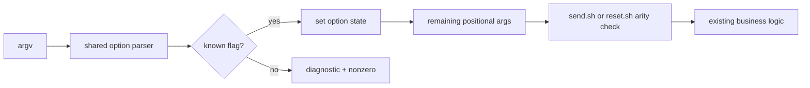

# Issue #7 と Issue #17 — 位置非依存フラグ解析と reset 再提出計画

## 目的

Claude アカウントで作成された PR #6 を直接利用せず、Issue #17 の受け入れ条件を満たす Codex 側の実装 PR を作成する。
Issue #17 は `--no-resolve` の位置依存を Issue #7 の共通フラグ解析で解消する順序を指定しているため、先に Issue #7 を独立した PR として完了させる。

## 現在の事実

- PR #6 は `kappaseijin4claude` 作成で、レビュー可能な作成者・検証者の分離を満たさない。
- Issue #17 は open で、対応する Codex PR はまだ存在しない。
- Issue #7 は open で、`send.sh` は `--force` を `$5` だけで認識する。
- `resolve-project.sh` は `AGMSG_RESOLVE_PROJECT=0` を既に提供しているため、Issue #17 の主価値は `reset.sh` での発見可能性と検索 path の診断である。
- `origin/main` を基点に作業し、第三者 upstream へ書き込まない。

## 受け入れ条件

### Issue #7

- `send.sh --force` が先頭・中間・末尾のいずれでも同じ意味になる。
- 未知のオプション、typo、余分な位置引数を黙って捨てず、原因が分かるエラーで失敗する。
- 正常な送信と `--force` による未登録 roster の送信は従来どおり成功する。
- 失敗する入力と成功する入力を試験で両方向確認し、壊した実装で対象試験が落ちることを確認する。

### Issue #17

- Issue #7 で追加する共通オプション解析を `reset.sh` でも使い、`--no-resolve` を先頭・末尾で受け付ける。
- 削除 0 件のとき、検索した path と引数の path を常に出力し、異なる場合は `--no-resolve` の手掛かりも示す。
- バグ再現試験（unmodified な reset 相当）と新診断・修正確認試験を分離する。
- exact path の登録を `--no-resolve` で削除できること、通常の解決動作を壊さないことを確認する。
- `README.md` と `README.ja.md` の参照だけで send/reset のオプション位置と用途が分かる。
- 正常状態と意図的に壊した状態を両方向で確認し、判定を `KILLED` / `SURVIVED` に分けて記録する。

## 実装方針

位置引数を確定する前に、`scripts/lib/cli-options.sh` の小さな共通 parser が認識済みフラグを取り除く。
呼び出し側は許可するフラグ集合を指定し、未知の `-` 始まり引数と余分な位置引数を拒否する。
`--` 以降は位置引数として扱い、ハイフンで始まる本文や path が必要な場合の明示的な escape にする。

Issue #7 の send 用 PR と Issue #17 の reset 用 PR は分ける。
各 PR は対応する Issue だけを `Closes` で参照し、Issue と PR の一対一を維持する。

## 実施順

1. `fix/issue-17-reset-no-resolve-codex` を `origin/main` から作成する。
2. 仕様計画を保存した後、共通 parser・send の試験・README を実装し、Issue #7 用の Codex PR を作成する。
3. Issue #7 PR の required CI とセルフチェックが成功したら merge し、main を同期する。
4. reset の `--no-resolve`、path 診断、分離試験、README を同じ作業ブランチへ反映し、Issue #17 用の Codex PR を作成する。
5. required CI、対象 bats、shellcheck、負の対照を実測してから Issue #17 PR を merge する。
6. Issue #17 の実装 PR merge 後に旧 PR #6 を説明付きで close する。旧 PR のブランチは変更せず、main と作業ブランチを同期・整理する。

## 実測結果

2026-08-14T13:48:02+09:00 時点の実測結果を記録する。

- Issue #7 は Codex 作成の PR #26 で merge 済みであり、`origin/main` に共通 parser と send の修正が含まれる。
- #7 の旧 parser を一時的に戻した対照では、先頭・中間・末尾の `--force` 試験と未知 option 試験が失敗した。現行実装では `tests/test_messaging.bats` が 29/29 pass し、対象回帰は `KILLED` となった。
- Issue #17 の unmodified reset 相当では、プロセス marker による path のすり替わり再現試験は pass した一方、exact path の `--no-resolve` 削除試験と検索 path 診断試験は失敗した。現行実装では `tests/test_resolve_project.bats` が 36/36 pass し、両方の修正対照は `KILLED` となった。
- 追加の `SURVIVED` はなく、Bash スクリプトのため TSC 判定は対象外である。

## 運用制約

- `agmsg_owner_codex` 単独で実施する。
- 対向 LLM、formal reviewer、追加エージェントは起動しない。
- `kappaseijin4codex` で作成する PR に `kappaseijin4claude` の reviewer を要求しない。
- `herdr-agent-monitor_owner_codex` へ進捗と完了を agmsg で共有する。
