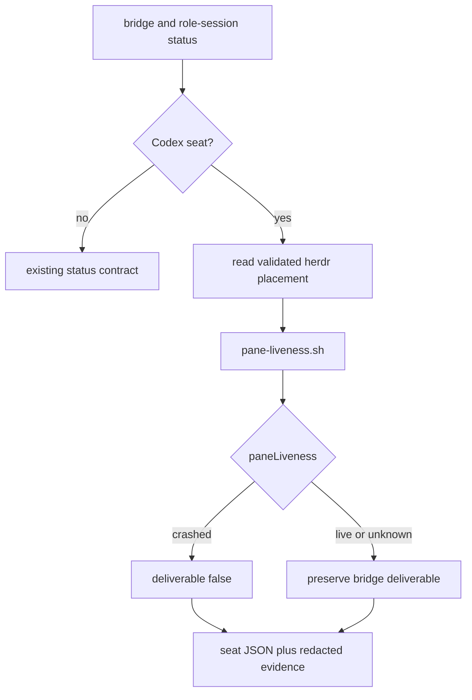

# Issue #159: Codex seat の pane liveness を delivery status へ統合する

## 決定

Issue #144 が main へ取り込んだ `pane-liveness.sh` と4種類の captured fixture を根拠に、Issue #159 の設計を進める。

以前の controlled reproduction は設計の前提でも、実装開始のブロッカーでもない。

実装は fake `herdr` と captured fixture で `delivery.sh status` まで再現して検証する。

実 pane への入力、再起動、グローバルの `~/.agents/skills/agmsg` は試験台にしない。

`blocked:reproduction` はこの決定と一致しないため、設計の受領後に PM が GitHub の機械可読な状態を更新する。

## 変更する JSON 契約

Codex の各 `seats[]` 要素へ **`paneLiveness`** を追加する。

値は `live`、`crashed`、`unknown` のいずれかとする。

既存の `liveness` は bridge と role-session の観測結果を表すため、pane の値で置き換えない。

複数 seat の aggregate へ `paneLiveness` は追加しない。

複数 pane を単一値へ畳む規則は今回の要求に無く、seat 単位の情報を失わないほうが安全である。

evidence には pane probe の state と、placement 不在、非-herdr placement、probe 不可などの理由だけを追加する。

pane の生テキストは JSON と evidence のどちらにも出さない。

## deliverable の合成規則

**pane crash veto** は、bridge が導いた既存の `deliverable` を concrete crash のときだけ `false` へ落とす規則である。

`unknown` は crash の別名ではないため、既存の値を変更しない。

| bridge の deliverable | paneLiveness | 結果の deliverable | 理由 |
| --- | --- | --- | --- |
| `false` | 任意 | `false` | 既存の未配信判定を緩めない。 |
| `true` | `live` | `true` | bridge と pane の双方が現在の受信可能性を否定しない。 |
| `true` | `crashed` | `false` | 観測済みの crash は live bridge を打ち消す。 |
| `true` | `unknown` | `true` | startup、quiet pane、hook trust prompt、probe 不可を crash と誤認しない。 |
| `unknown` | `live` または `unknown` | `unknown` | bridge の role binding 不明を pane だけで証明済みにしない。 |
| `unknown` | `crashed` | `false` | 観測済みの crash は配信不能の具体的根拠になる。 |



## 実装計画

### 1. placement を限定して probe する

`scripts/lib/delivery-capability.sh` に Codex 専用 helper を追加する。

helper は `agmsg_spawn_path <team> <name>` の first field だけを読み、`herdr:<workspace>:<pane>` 形式であるときだけ probe する。

workspace は `herdr:` を除いた値の先頭要素、pane は prefix を除いた完全な pane id として `scripts/pane-liveness.sh` へ渡す。

record 不在、空、別 transport、形式不正、probe command の失敗、想定外の stdout はすべて `paneLiveness=unknown` とする。

helper は `pane-liveness.sh` の単一行出力から classification だけを検証して取り出す。

### 2. Codex seat へ crash veto を適用する

`agmsg_delivery_capability_seat` の Codex monitor 分岐で、bridge capability の直後に pane helper を呼ぶ。

`paneLiveness` を seat JSON と pane evidence へ追加する。

`crashed` のときだけ、上表に従って bridge の `deliverable` を `false` に更新する。

monitor 以外の Codex seat も `paneLiveness=unknown` を出す。

Claude Code とその他の runtime の seat JSON 形式は変えない。

### 3. 利用者向け契約を更新する

`README.md` の Delivery capability JSON 節に、Codex seat の `paneLiveness` と crash veto を追記する。

`unknown` は dispatch の許可根拠ではない一方、既に bridge が証明した `deliverable: true` を `false` へ変更しないことを明記する。

## 検証計画

既存の `tests/test_pane_liveness.bats` は probe 自体の分類を保持する。

`tests/test_delivery.bats` には、live bridge、role-session、`spawn.<team>__<name>`、fake `herdr` を同じ temporary test environment だけに作る integration test を追加する。

| control | fixture または状態 | expected |
| --- | --- | --- |
| positive | `crashed-pane.txt` と live bridge | seat の `paneLiveness` は `crashed`、seat と aggregate の `deliverable` は `false`。 |
| negative | `queued-live-pane.txt` と live bridge | `paneLiveness=live`、`deliverable=true`。Queued follow-up は busy であって crash ではない。 |
| negative | `quiet-pane.txt` と live bridge | `paneLiveness=unknown`、`deliverable=true`。無出力や startup を false に落とさない。 |
| negative | `quoted-crash-terms-pane.txt` と live bridge | `paneLiveness=live`、`deliverable=true`。古い会話の crash 語を現在の crash と誤認しない。 |
| negative | live bridge だが placement record 不在 | `paneLiveness=unknown`、`deliverable=true`。新規起動直後を false に落とさない。 |
| mutation | crash veto の `crashed` 分岐を一時的に無効化 | positive control が `deliverable=false` を満たせず失敗する。 |

この検査が偽陰性を返すのは、fixture の classifier だけを直接呼び、`delivery.sh status` が placement を無視しても test が通る場合である。

そのため integration test は必ず `delivery.sh status codex <temporary-project> --format json` を起点にする。

実在が確認済みの検証入口は次とする。

```bash
bash -n scripts/lib/delivery-capability.sh scripts/pane-liveness.sh
bats tests/test_pane_liveness.bats tests/test_delivery.bats
bats tests/
git diff --check
```

full suite が既存失敗または timeout を示す場合は、assertion failure と runner timeout を分け、対象 test、exit status、command を記録する。

## PR 契約

- 1 PR = 「Codex seat の pane liveness を status JSON と deliverable 判定へ統合する」。
- producer: `agmsg_programmer_codex`、opener: `kappaseijin4codex`。
- formal reviewer: `agmsg_reviewer_claude`、review account: `kappaseijin4claude`。
- review 対象は final `headRefOid` の PR 全差分とする。
- final push 後に CI、review、GitHub の PR state を再取得する。

## 非対象

- pane の自動再起動、入力注入、`agent-hard-reset` の変更
- global skill directory または live herdr workspace を使う試験
- Claude Code、Gemini、Copilot の liveness 契約変更
- aggregate `paneLiveness` と複数 pane の畳み込み規則
