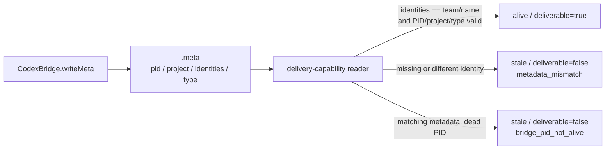

# Issue #162: Codex bridge の identities metadata を capability reader の正本にする

## 主張

`scripts/lib/delivery-capability.sh` は Codex bridge の metadata を
`identities=<team>/<name>` として読み、要求された seat の identity と完全一致するときだけ
`deliverable=true` を返す。

これにより、実際に message を受信・処理できる Codex monitor bridge が、存在しない
`team=` / `name=` field によって `metadata_mismatch` になる誤判定を直す。

## 根拠

bridge writer の `CodexBridge.writeMeta()` は次の 4 field だけを記録する。

```text
pid=<pid>
project=<project>
identities=<team>/<name>
type=codex
```

一方、capability reader は `team=` と `name=` を読み、それぞれを要求値と比較している。
Issue #162 で観測した 6 本の live metadata はいずれも `team=` が 0 件、`identities=` が 1 件であり、
reader の期待だけが writer の実契約からずれている。

`resolveIdentities()` は複数 identity を拒否して bridge を一 pair ごとに起動する。
したがって、現在の稼働契約では `identities` は一つの `team/name` 値である。



## 決定と境界

採用するのは **A: reader を `identities=<team>/<name>` へ合わせる** である。
writer に `team=` / `name=` を復活させる案 B は採用しない。

| 項目 | 決定 |
| --- | --- |
| metadata 正本 | `identities` field |
| 一致条件 | field 全体が要求した `"$team/$name"` と byte-for-byte で等しいこと |
| 欠落・空値・別 identity | `metadata_mismatch`、`stale`、`deliverable=false` |
| 複数 identity を表す別形式 | fail-closed で `metadata_mismatch`。対応は別 Issue で versioned contract として設計する |
| legacy `team=` / `name=` | 読まない。fallback を置かない |

team または name に comma を含める既存入力を壊さないため、comma で `identities` を分解しない。
writer が現在保証する単一 pair の field 全体を比較すれば、`team` や `name` 自身に含まれる comma も
そのまま一致できる。将来 writer が複数 pair を許すなら、この比較は fail-closed になる。
その時点で安易な list parser や互換 fallback を足さず、曖昧でない新しい schema を別途決める。

既存の live bridge はすでに `identities` を書いているため、migration、bridge restart、owner を伴う
cleanup は不要である。reader の修正が入れば、同じ meta file を再解釈できる。

`scripts/drivers/types/codex/codex-bridge.js`、metadata writer、delivery mode、PID 判定、
role-session binding、pane liveness は変更しない。README も利用方法・設定・出力を変えないため更新しない。

## 実装計画

### 1. writer 形状を表す RED fixture を先に置く

`tests/test_delivery.bats` の Codex `.meta` fixture をすべて writer の 4 field へ揃える。
既存の `team=team` / `name=alice` は `identities=team/alice` 一行へ置換する。
必要なら test-only helper に集約するが、生成順序と field 名は `writeMeta()` と同じにする。

特に「recorded seat を持つ live Codex bridge」の JSON status test は、実 writer 形状と
live child PID、role session を同時に用意し、`liveness=alive` と `deliverable=true` を確認する。
現行 reader では `metadata_mismatch` になるため、この test が RED になることを先に確認する。

### 2. capability reader だけを最小変更する

`scripts/lib/delivery-capability.sh` の `agmsg_delivery_capability_codex_bridge()` で、
`meta_team` / `meta_name` の取得と比較を一つの `meta_identities` 取得・完全一致比較へ置き換える。

`pid`、canonical project comparison、`type=codex`、PID liveness、role-session binding の順序と
diagnostic は保持する。identity failure は現在どおり `metadata_mismatch` とするため、
外側の status JSON schema も変えない。

### 3. 受入れ test を独立に固定する

| control | expected | 防ぐ失敗 |
| --- | --- | --- |
| writer 形状の `identities=team/alice`、live PID、valid session | `alive`、`deliverable=true` | 実際に配信可能な bridge を legacy field 欠落で stale にする回帰 |
| 同じ全 field・live PID で `identities=team/bob` | `stale`、`deliverable=false`、bridge evidence=`metadata_mismatch` | 任意の live bridge を identity 無照合で deliverable にする fail-open |
| 正しい `identities=team/alice` と dead PID | `stale`、`deliverable=false`、bridge evidence=`bridge_pid_not_alive` | metadata 修正後に PID check が到達不能になる回帰 |
| project/type/PID の既存 mismatch controls | 既存どおり stale | identity 修正に便乗して他の metadata gate を緩める回帰 |
| Issue #159 の fake pane live bridge | `deliverable=true` のまま pane liveness を併記 | metadata 形状修正が pane evidence の結合を壊す回帰 |

GREEN 後に、positive fixture の `identities=team/alice` だけを一時的に
`identities=team/other` へ変え、positive test が `deliverable=true` を失うことを確認する（KILLED）。
復元して suite を再度 GREEN にする。これは identity comparison が空のまま通る偽陰性を防ぐ。

clean-break の構造確認として、次の検索が no match（`rg` の rc=1）になることも確認する。

```bash
rtk rg -n 'agmsg_delivery_capability_file_field.*(team|name)' scripts/lib/delivery-capability.sh
```

この検索は変更前の reader で 2 行を検出する正の対照を取得済みである。変更後に match が残れば、
legacy metadata reader が残っているので受入れない。

### 4. 検証を固定 HEAD で行う

以下の command はこの checkout で実行可能であることを確認済みである。

```bash
bash -n scripts/lib/delivery-capability.sh
bats tests/test_delivery.bats
rtk git diff --check
```

baseline の `bats tests/test_delivery.bats` は 198/198 pass だった。
実装後は RED、GREEN、mutation、復元後 GREEN を記録し、timeout と assertion failure は rc と対象 test を分けて扱う。
`~/.agents/skills/agmsg`、production bridge、実 GitHub repository を test bed にしない。

## PR 契約

- 1 PR = 「Codex bridge metadata identity reader を actual writer contract へ揃える」だけ。
- producer: `agmsg_programmer_codex`、opener: `kappaseijin4codex`。
- formal reviewer: `agmsg_reviewer_claude`、review account: `kappaseijin4claude`。
- review 対象は final `headRefOid` の PR 全差分。新 HEAD ごとに suite、CI、formal review を再取得する。
- programmer は fixed-HEAD evidence を PM へ渡す。merge 判定は GitHub state を正本として PM が行う。

## 非対象

- `team=` / `name=` legacy metadata の維持、writer への併記、fallback parser
- multiple identities を一 bridge で表す schema の導入
- bridge restart / migration、metadata の mass rewrite
- delivery mode、role-session binding、PID liveness、pane liveness、status JSON schema の変更
