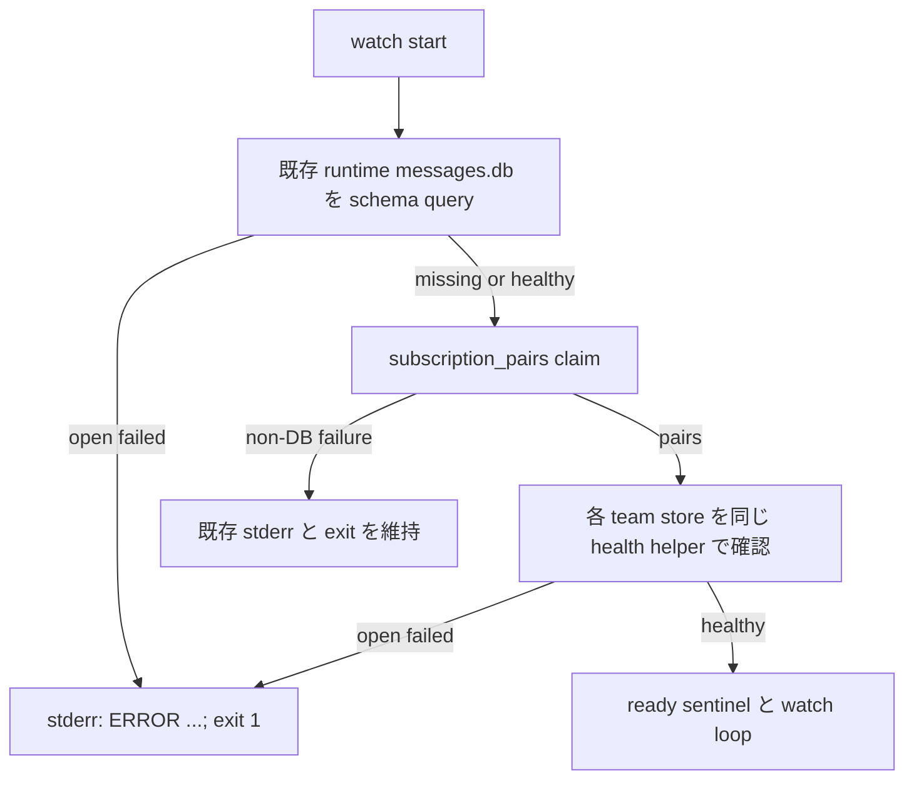

# Issue #168: watch の subscription 前に runtime DB を診断する

## 主張

`watch.sh` は `agmsg_subscription_pairs ... claim` より前に、claim が使う共有 runtime DB（`messages.db`）を既存ファイルに限って schema query する。開けなければ `ERROR: cannot open message DB <path>` を **stderr** に一度だけ出して non-zero で終了する。subscription 自体の非 DB 失敗は既存の理由と exit status を維持し、この診断へ畳み込まない。

## 根拠と選択

現行 `scripts/watch.sh` は subscription/claim を先に実行し、DB healthcheck はその後にある。claim は `scripts/lib/actas-lock.sh` 経由で team selector を取らない `_agmsg_runtime_db_path`、すなわち共有 `messages.db` を開く。そのため unreadable な共有 DB では healthcheck に到達できず `exit 1` だけが残る。

`subscription_pairs` の失敗を返り値から DB 障害と再分類する案は採らない。held ownership、roster 不備、gate failure も同じ経路で non-zero になり、DB と断定すると AC-3 に反する。runtime DB を claim 前に直接確認する案は、診断対象と依存先が一対一で、失敗理由を失わない。

## 実装契約

1. `scripts/lib/storage.sh` に、selector を受けない公開 resolver `agmsg_runtime_db_path` を追加する。内部 `_agmsg_runtime_db_path` の薄い facade とし、`agmsg_storage_dir`・`_agmsg_db_file` が持つ `AGMSG_STORAGE_PATH` と Windows path 変換の規約を再実装しない。
2. `scripts/watch.sh` に `watch_check_existing_db <path>` を置く。ファイルが存在しない場合は成功（初回 claim が初期化できる通常状態）、存在し `agmsg_sqlite "$path" "SELECT name FROM sqlite_master LIMIT 1;"` が失敗した場合だけ、正確に `ERROR: cannot open message DB <path>` を stderr へ一行出して non-zero を返す。
3. subscription 解決の直前に runtime path を解決して helper を呼ぶ。resolver 自身が失敗した場合はその固有診断で non-zero にし、DB-open の文言を捏造しない。
4. subscription の後にある team ごとの healthcheck は削除しない。partitioned team store の unreadable/corrupt 状態を ready 前に止める契約は維持し、同じ helper を使って stderr 出力へ揃える。
5. preflight 成功後の `agmsg_subscription_pairs` の non-zero は捕捉・変換しない。held ownership 等は現在の stderr / exit status のまま返す。新たな fallback、旧 stdout 診断、DB を作るためだけの初期化は追加しない。

## 変更範囲

| ファイル | 変更 |
| --- | --- |
| `scripts/lib/storage.sh` | runtime DB path の公開 facade を追加 |
| `scripts/watch.sh` | claim 前 preflight、再利用 helper、team healthcheck の stderr 化 |
| `tests/test_watch.bats` | #197 の stderr 回帰・通常 DB 正対照・team-store 回帰を更新 |
| `tests/test_actas_integration.bats` | held ownership の非 DB 負対照へ DB diagnostic 不在を追加 |
| `docs/plan/2026-08-26_issue-168-watch-runtime-db-preflight.md` | この設計記録 |

production の `~/.agents/skills/agmsg`、storage ABI の team selector 規約、subscription/lock の exit contract、README は変更・試験台にしない。これは watcher 内部の障害診断であり、利用者の設定・実行手順を変えない。

## 検証計画

1. **RED / AC-1**: #197 fixture は valid な shared `messages.db` を `send.sh` で作り `chmod 000` にする。watch の stdout と stderr を別ファイルへ capture し、`wait_for_file_contains` で stderr の正確な ERROR 行を待って終了を `wait` で観測する。stdout にその診断が無いこと、stderr に一行だけあることを確認する。root では permission fixture が成立しないため既存 skip を維持する。
2. **正対照 / AC-2**: readable な同じ runtime DB で watcher を起動し、ready/pid marker を観測して停止する。stderr に DB diagnostic が無いことを確認する。既存の multi-team unreadable team-store test も通し、preflight 導入で後段の診断を失っていないことを確認する。
3. **負対照 / AC-3**: 有効な DB で別 session が active name を保持する既存 integration fixture を使う。watch は `cannot claim` と non-zero を返し、結合出力に `ERROR: cannot open message DB` が無いことを確認する。この fixture は subscription failure を実際に起こすため、単なる文字列不在チェックではない。
4. **KILLED / AC-4**: 実装後、claim 前 helper 呼出（または helper の ERROR 出力）だけを作業ツリーで一時的に外し、#197 focused test が ERROR assertion で落ちることを確認する。直ちに復元して同 test を再度 green にする。
5. **実行**: `bash -n scripts/lib/storage.sh scripts/watch.sh`、上記の3 focused Bats、続けて `bats tests/test_watch.bats` と `bats tests/test_actas_integration.bats` を実行する。fixed HEAD の `rtk git diff --check <base>..<head>`、CI、Claude formal reviewer の fixed-HEAD 一括 review を PR 判定に使う。

現行 HEAD の事前測定では、#197 focused test は診断不在で RED、multi-team existing-store healthcheck と held ownership 負対照は GREEN だった。実装者はこの RED を仕様未達の基準として保持する。

## PR 契約

1 PR = 「watch が subscription 前に runtime DB の open failure を stderr へ診断し、非 DB subscription failure を誤分類しない」という一主張にする。producer は `agmsg_programmer_codex`、formal reviewer は `agmsg_reviewer_claude`。レビュー対象は fixed HEAD の PR 全差分であり、#164 の writer gate や production install は今回扱わない。
