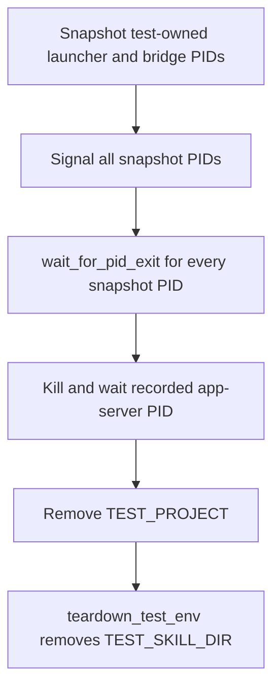

# Issue #169: codex-monitor 試験の detached launcher-chain を teardown で収束する

## 結論

1 PR の主張は「`tests/test_codex_monitor.bats` が自分で起動した POSIX の detached `codex-bridge-launcher.sh` / bridge を、fixture を消す前に所有範囲だけ signal → wait する」である。

macOS CI run `32925092125` の test 416 は、app-server PID `9453` の `ps` 照会が失敗した後にも、同じ一意な `$TEST_SKILL_DIR` の launcher と `$TEST_PROJECT` を argv に含む PID `9835` が残っていたことを示す。`9835` の argv に第 5 引数 `ROLE_PAIR` はないため、証明された owner は per-role child ではなく dispatcher である。`ppid=1` は orphan 化を示すが、この1 packetだけで「全 #169 が同じ process による」「その process が DB handle の唯一の owner」とは結論しない。

それでも修復に進む根拠は限定的である。現行 `test_codex_monitor.bats` は app-server pidfile だけを kill/wait し、detached launcher-chain は対象外である。一方 `test_codex_bridge_launcher.bats` には、test 固有の launcher path・project path・run pidfile に絞って集合を一度 snapshot し、全 PID を signal してから全 PID を wait する同じ teardown contract が既にある。従ってこれは一般的な process cleaner ではなく、既存の test ownership contract をこの suite に適用する修復である。

## 観測と判断の境界

| 事実 | このPRで扱う判断 | 扱わない判断 |
| --- | --- | --- |
| macOS packet に test root を含む launcher dispatcher PID が残る | `test_codex_monitor.bats` は launcher-chain を明示的に収束させる必要がある | dispatcher が `rm` failure の唯一原因である |
| `codex-monitor.sh` は launcher を background 起動し、直後に `exec` する | teardown は app-server pidfile だけに依存できない | production の `nohup` / lifetime policy を変える必要がある |
| sibling test は bounded owner selection と kill→wait を実装済み | 同じ POSIX-only pattern を採る | 全 project process を名前や PID だけで kill する |
| Windows Git Bash は full `ps` / raw PID の解釈が不確実 | このPRの reaper を Windows へ拡張しない | Windows #169 の owner を推測する |

`rm` stderr capture の配置不備は別の診断修復 #169B である。このPRはその repair を置き換えず、capture、Windows PID mapping、`tasklist`、CIM、handle 調査、retry を変更しない。

## 実装境界

### 1. POSIX の test-owned launcher-chain だけを列挙する

`tests/test_codex_monitor.bats` に suite-local helper を置く。

- launcher candidate は argv に **この test の** isolated launcher script path と **この test の** `TEST_PROJECT` を両方含む PID だけにする。これにより packet の dispatcher と、将来同 test が生む role child を同じ集合へ含める。
- bridge candidate は、この test の `$TEST_SKILL_DIR/run/codex-bridge.*.pid` の numeric PID と、argv に `TEST_PROJECT` と `codex-bridge.js` を両方含む PID の和集合に限定する。
- PID 集合は cleanup 前に一度だけ snapshot する。列挙・kill・wait を PID ごとに交互に行わず、最初に全 candidate を signal してから `wait_for_pid_exit` で全 candidate の終了を確認する。
- 列挙・kill・wait は `MSYSTEM` が MSYS/Git Bash を示す時は実行しない。Git Bash の process listing と PID namespace は #169B で別に観測を直すため、未検証の namespace から kill target を作らない。

候補が空なら正常終了とする。candidate が既に終了済みなら signal failure は無視できるが、snapshot に含まれた PID が wait deadline まで残れば teardown failure として表面化させる。`kill -9`、任意の `pgrep`、全 process dump、sleep による固定待機、production script の変更は入れない。

### 2. teardown の順序を固定する

`test_codex_monitor.bats` の teardown は次の順で行う。

reaper の wait failure と `teardown_test_env` failure のどちらも隠さない。fixture removal は必ず実行し、最終 status は実際に失敗した cleanup を非zeroとして返す。ここで `teardown_test_env` のcapture収集を書き換えないため、actual `rm` stderr の恒久保持は #169B の責務に残る。

### 3. owner filter を試験で証明する

existing test 416 の foreign Python listener は `TEST_PROJECT` の下に存在しても launcher/bridge identity を持たない。この test に reaper 後の `kill -0 "$foreign_pid"` を追加し、reaper が foreign process を signal しないことを確認する。

別の POSIX focused test は default `codex-monitor.sh` を実行後、test-owned launcher PID が実際に観測できるまで既存の bounded wait helperで待つ。reaper を明示呼び出しし、全 snapshot PID が終了したことを確認する。OS scheduler に期待する固定 sleep は使わない。Windows job ではこの owner/exit test を skip し、macOS runner の実行を受入根拠とする。

## 受入れと対照

| 観点 | 正の対照 | KILLED / 負の対照 |
| --- | --- | --- |
| owner discovery | default monitor が起動した dispatcher の argv に isolated launcher path と `TEST_PROJECT` があり、reaper snapshotへ入る | `TEST_PROJECT` の下の foreign Python listener は snapshotに入らず、reaper後も `kill -0` が通る |
| orderly cleanup | snapshotした launcher/bridge を signal後に全 PIDが `wait_for_pid_exit` を通り、fixture teardown が成功する | wait を外す mutationでは post-reap PID absence assertion が red になる |
| dispatcher/child coverage | no-`ROLE_PAIR` dispatcher と pidfile/argvで発見できる bridgeを同じ snapshot→signal→wait に含める | launcher script path 又は bridge identity filter を外す mutationでは discovery assertion が red になる |
| platform boundary | macOS CIでfocused testが実行される | `MSYSTEM` を設定した controlでは reaperがtargetを列挙・killしない。Windows livenessをtasklistの結果で断定しない |

「DB handleを掴んだ process を観測する」ことはこのPRのacceptanceではない。packet と同じ `rm` failure を合成しただけでは macOS/Windows の根因を再現したことにならないため、再現試験を根拠に production lifecycle を変更しない。

## 一PRの範囲と順序

| 含める | 含めない |
| --- | --- |
| `tests/test_codex_monitor.bats` のPOSIX test-owned launcher/bridge reap-and-wait | `scripts/drivers/types/codex/codex-monitor.sh` と `codex-bridge-launcher.sh` のlifetime変更 |
| focused macOS regression と foreign-process negative control | `tests/test_helper.bash` のcapture/PID diagnostic（#169B） |
| この設計書 | Windows process enumeration / kill、tasklist、CIM、handle tool、runner設定 |

Lane A の順序は **R1 横断PR → #169 launcher-chain teardown → #169B 診断修復 → R5-T1 → R5-P3** と更新する。R1 と #169B は `tests/test_helper.bash` を共有するが、この修復は `test_codex_monitor.bats` に閉じる。#169Bは依然必要であり、Windows packetに対して今回のmacOS ownerを一般化しないための診断境界である。

## 限界

この設計が保証するのは POSIX macOS/Linux test suite が自分の launcher-chain をfixture破棄前に収束させることだけである。Windows #169 の `rm` failure、`messages.db` WAL/SHMのhandle owner、app-serverの生死、または production session の孤児化を解決済みとは主張しない。#169Bで actual stderr と PID namespace evidence を回収し、ownerが追加で観測されたときだけ別の限定修復を設計する。
