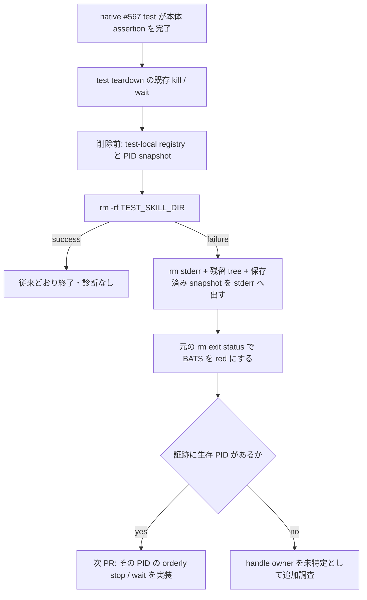

# Issue #169: Windows BATS teardown の残留物を失敗時だけ証跡化する

## 主張

`teardown_test_env` は `$TEST_SKILL_DIR` の `rm -rf` が失敗したときだけ、削除前の test-local runtime PID/lease registry、当該 PID の process snapshot、削除後の残留 tree、`rm` の stderr と exit status を stderr へ出し、**元の `rm` exit status をそのまま返す**。これにより Windows native #567 の teardown failure は green に変換されず、次の lifecycle 修正を特定の PID と残留物へ限定できる。

## 現在の証拠と未確定事項

GitHub Actions run `32814971644` の Windows runtime (#567) job は、`codex-monitor: windows-native reaches the bridged handoff (#567)` を `ok` にした後、launcher の二件目で `teardown_test_env` の `rm -rf` が exit 1 になった。表示されたのは `/tmp/tmp.2mNdgUprnd: Directory not empty` だけで、残留した leaf と open handle の owner は記録されていない。Issue 本文にある `messages.db` / `-wal` / `-shm` の busy と、同じ原因であることも未確認である。

現行 `tests/test_helper.bash` の `teardown_test_env` は `rm -rf "$TEST_SKILL_DIR"` の一行だけである。`test_codex_monitor.bats` は app-server PID file を kill/wait し、`test_codex_bridge_launcher.bats` は launcher/bridge PID を探索して kill/wait するが、いずれも cleanup の失敗を `|| true` で捨てる箇所がある。launcher dispatcher は per-role child を `nohup` で分離するため、親・dispatcher が終わっても child/bridge の寿命が残る race はあり得る。ただし現行 CI にはその PID の生存を示す証拠がない。

したがって「SQLite WAL を持つプロセスが原因」と断定して kill 対象を増やす案は採らない。まず test が既に管理する registry と test root に限定した証跡を残す。

## 実装契約

1. `tests/test_helper.bash` に、`$TEST_SKILL_DIR` を引数に取る best-effort snapshot helper を追加する。削除**前**に次だけを文字列として保持する。
   - `run/` 配下の既知 runtime artifact（`codex-app-server.*.pid`、`codex-bridge.*.pid`、bridge lease）の path と、PID/lease に必要な先頭の値。
   - artifact から得た数値 PID ごとの `ps` record。Windows では `tasklist` が利用可能な場合に限り同じ PID の record も取る。
   - command line に当該 `$TEST_SKILL_DIR` が含まれる process record。全プロセス表や無関係な open-file scan は出さない。
   snapshot 内の補助コマンドが失敗しても、失敗理由を marker 化して snapshot 自体は成功扱いにする。teardown の主 exit status を diagnostics の可否で置き換えない。
2. `teardown_test_env` は snapshot を採取してから `rm -rf` の stdout/stderr を捕捉する。削除が成功すれば従来どおり静かに成功する。失敗時だけ、安定した header、`rm` の exit status と stderr、削除前 snapshot、削除後に `$TEST_SKILL_DIR` だけを起点にした残留 tree を stderr へ出し、捕捉した `rm` の non-zero を return する。
3. diagnostic は `rm || true`、retry loop、sleep、process kill を追加しない。今回の一主張は「失敗を識別可能にする」であり、cleanup policy の変更ではない。正常な teardown を待たせず、真の assertion failure と teardown failure のどちらも BATS の red を維持する。
4. `tests/test_fixture_helpers.bats` に、test scope の `rm` stub を使う regression test を追加する。stub は fixture root への削除だけを固定の non-zero と stderr にし、helper がその status・stub stderr・registry snapshot header・残留 path を出すことを確認する。通常の writable fixture の teardown は status 0 かつ diagnostic header 不在を確認する。
5. Issue #169 の native tests はこの PR で kill 対象を変更しない。実 CI の failure packet が app-server、launcher child、bridge のいずれか（または registry 外）を示してから、次 PR を一原因一修正で切る。registry 外かつ handle owner 不明なら、`tasklist` を「process exists」の証拠に留め、file handle を示せる Windows capability の有無から別途調査する。

## 変更範囲

| ファイル | 変更 |
| --- | --- |
| `tests/test_helper.bash` | deletion failure 時だけ test-local lifecycle evidence を出して元の status を返す helper |
| `tests/test_fixture_helpers.bats` | forced-`rm` failure の正対照、正常 teardown の負対照 |
| `docs/plan/2026-08-26_issue-169-windows-teardown-evidence.md` | この設計記録 |

`tests/test_codex_monitor.bats`、`tests/test_codex_bridge_launcher.bats` の kill/wait 対象、production の launcher/monitor、SQLite schema、README、Windows runner の global process cleanup は変更しない。test 失敗を `rm || true` で隠す案、全 PID への kill、固定 sleep は今回の範囲外である。

## 検証計画

1. **RED を再現する正対照**: fixture-helper regression の `rm` stub は fixture root を実際に消さず、固定の non-zero と sentinel stderr を返す。test は helper 自身の non-zero、sentinel、残留 path、registry/PID snapshot header を assertion する。単なる文字列検索ではなく、対象 path の削除を拒否するため current bug class（teardown deletion failure）を再現する。
2. **正常 teardown の負対照**: writable temp fixture では `teardown_test_env` が status 0 で終了し、diagnostic header が出ず、fixture root が消えていることを確認する。diagnostic が常時出て正常 run を汚していないことを示す。
3. **KILLED**: implementation の `return "$rm_rc"` を一時的に `return 0` へ変える。forced-failure regression は status assertion で red にならなければならない。直ちに復元して green に戻す。この mutation は `rm || true` と同じ「teardown failure を成功へ変換する」失敗モードを殺す。
4. **本体 assertion の red 維持**: Windows CI 上で native #567 test の本体 assertion を一時的に反転させる mutation を別作業ツリーで実行する。teardown diagnostic の有無にかかわらず job は non-zero でなければならない。mutation は提出 HEAD に含めない。
5. **実行**: `bash -n tests/test_helper.bash`、`bats tests/test_fixture_helpers.bats`、`bats --filter 'windows-native' tests/test_codex_monitor.bats tests/test_codex_bridge_launcher.bats`、Windows runner の同 focused tests、fixed HEAD の `rtk git diff --check <base>..<head>`、CI、Claude formal reviewer の fixed-HEAD 一括 review を PR 判定に使う。

現行 macOS worktree では `bats tests/test_fixture_helpers.bats` は 2/2 green、Windows-native filter は 2/2 skip である。skip は Windows process/handle の正対照にならないため、native lifecycle の受入は Windows CI を唯一の実測とする。

## PR 契約と後続判断

1 PR = 「BATS fixture の deletion failure を test-local lifecycle evidence と元の non-zero で表面化する」という一主張にする。producer は `agmsg_programmer_codex`、formal reviewer は `agmsg_reviewer_claude`。review 対象は fixed HEAD の PR 全差分である。

この PR の green は diagnostic の回帰防止を示すだけで、Issue #169 の root cause 解決を意味しない。後続 PR は CI packet が示す生存 PID にだけ orderly stop/wait を追加し、その PID を残す KILLED control と Windows native green を揃える。packet に owner が出ない場合は、推測の cleanup を積まず Issue を evidence-needed として保持する。
