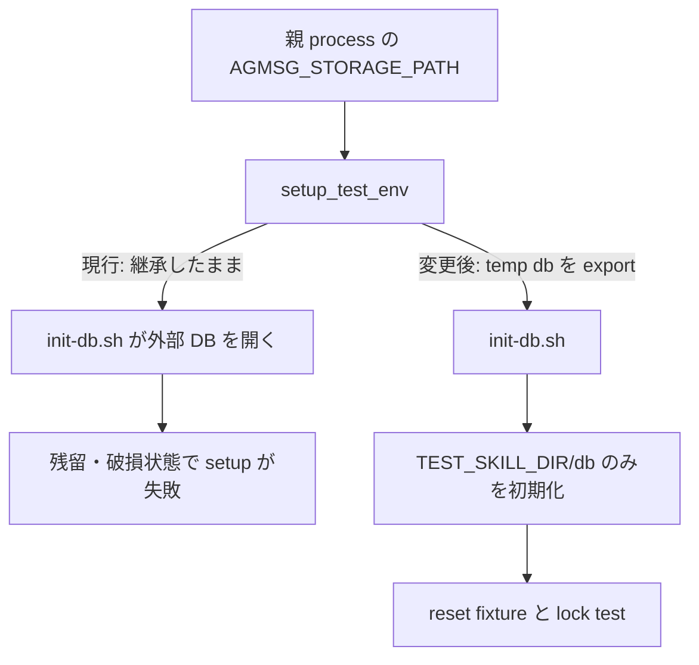

# Issue #171: BATS fixture の runtime storage を初期化前に隔離する

## 主張

`setup_test_env` は `init-db.sh` を呼ぶ**前**に `AGMSG_STORAGE_PATH="$TEST_SKILL_DIR/db"` を export する。これにより、この helper を使う BATS test は親プロセスから継承した runtime DB を初期化・読書きせず、test ごとの temp DB だけを使う。

## 根拠と訂正

Issue の初期本文は reset の製品契約違反を疑ったが、GitHub Issue comment の CI と fresh-clone 測定は契約が通ることを示している。現行 `test_reset.bats` を `AGMSG_STORAGE_PATH` 未設定で実行すると green で、`$SCRIPTS` は `setup_test_env` が temp にコピーした scripts を指す。したがって「`BASH_SOURCE` が repo/db を選ぶ」という説明は、この現行 fixture では再現しない。

一方、親から `AGMSG_STORAGE_PATH` を継承すると、`setup_test_env` はそれを上書きしないまま `init-db.sh` を実行する。専用 temp directory に壊れた `messages.db` を置き、その path を継承して `test_reset.bats` を実行したところ、setup の `init-db.sh` が `file is not a database (26)` で deterministic に失敗した。原因は storage resolver の順序ではなく、fixture が環境 override を初期化前に pin していないことである。

## 選択と範囲

採るのは shared `setup_test_env` の一点修正である。この helper は「各 test に独立した skill dir と DB」を提供すると既に文書化しており、親環境の override を通す現在の挙動はその helper 契約に反する。`test_reset.bats` だけで export する案は目先の症状を止めるが、同じ helper を使う他の BATS test に同じ穴を残すため採らない。

`scripts/lib/storage.sh` の `AGMSG_STORAGE_PATH > BASH_SOURCE > SKILL_DIR` という製品の解決順序を変える案も採らない。override は本番の公開契約であり、ここで必要なのは test harness が自分の override を明示して外部環境を遮断することである。

## 実装契約

1. `tests/test_helper.bash:setup_test_env` は `TEST_SKILL_DIR` と `db/` を作成した直後、`init-db.sh` より前に `AGMSG_STORAGE_PATH="$TEST_SKILL_DIR/db"` を export する。
2. `DBPATH`、`SCRIPTS`、`TYPES`、`HOME`、teardown の契約は変えない。既に自分の store を設定する test は、その test 内の明示的 export が後勝ちになる。
3. `tests/test_fixture_helpers.bats` に、壊れた外部 `messages.db` を `AGMSG_STORAGE_PATH` として child shell へ継承させる regression test を追加する。child は `setup_test_env` 実行後に、環境値・`agmsg_storage_dir`・作成済み DB がすべて `TEST_SKILL_DIR/db` を指すことを確認する。外部 DB の内容は変わらないことも確認する。
4. child shell は `set -e` と cleanup trap を使う。export が無い、または `init-db.sh` より後なら、外部の壊れた DB を開く時点で non-zero になり、テストが成功を偽装できない。
5. `test_reset.bats` の reset/lock 契約 assertion は緩めない。実装後は同 test を、壊れた外部 storage を継承した状態でも green にする。

## 変更範囲

| ファイル | 変更 |
| --- | --- |
| `tests/test_helper.bash` | runtime storage override を init より前に temp DB へ固定 |
| `tests/test_fixture_helpers.bats` | inherited storage を遮断する regression / negative control |
| `docs/plan/2026-08-26_issue-171-bats-storage-isolation.md` | この設計記録 |

`test_reset.bats`、`scripts/lib/storage.sh`、`scripts/lib/actas-lock.sh`、`scripts/reset.sh`、production の `~/.agents/skills/agmsg`、README は変更・試験台にしない。

## 検証計画

1. **RED（測定済み）**: `AGMSG_STORAGE_PATH` に専用 temp directory 内の壊れた `messages.db` を指定して `bats --filter 'reset: drop removes only current registration but releases target lock in every team' tests/test_reset.bats` を実行する。現行 HEAD は `setup_test_env` の `init-db.sh` で `file is not a database (26)` となり exit 1 である。
2. **正対照**: 実装後、同じ poisoned parent environment で新しい fixture-helper regression test と `test_reset.bats` を実行する。どちらも green、helper が使う DB は `$TEST_SKILL_DIR/db/messages.db`、外部の壊れた DB は未変更でなければならない。
3. **既存の正対照**: `AGMSG_STORAGE_PATH` を test 内で `unset` する `storage: default path resolves under the skill dir` が green であることを確認する。製品の default resolver を test fixture の export が書き換えていないことを示す。
4. **KILLED / 負対照**: `setup_test_env` の新しい export 一行だけを一時的に外す（または init の後へ移す）。fixture-helper regression と poisoned `test_reset.bats` は setup failure で red になる。直ちに復元し、両方を green に戻す。
5. **実行**: `bash -n tests/test_helper.bash scripts/lib/storage.sh scripts/lib/actas-lock.sh scripts/reset.sh`、`bats tests/test_fixture_helpers.bats`、`bats tests/test_reset.bats`、上記 storage focused test を実行し、続けて `bats tests/test_fixture_helpers.bats tests/test_reset.bats tests/test_storage.bats` を実行する。fixed HEAD の `rtk git diff --check <base>..<head>`、CI、Claude formal reviewer の fixed-HEAD 一括 review を PR 判定に使う。

## PR 契約

1 PR = 「shared BATS helper が parent `AGMSG_STORAGE_PATH` を初期化前に遮断し、test ごとの runtime store を保証する」という一主張にする。producer は `agmsg_programmer_codex`、formal reviewer は `agmsg_reviewer_claude`。#171 の reset 契約を変更・緩和しない。#168/#172 の watcher DB diagnostic、storage の製品解決順序、全 test の個別 refactor は今回扱わない。
