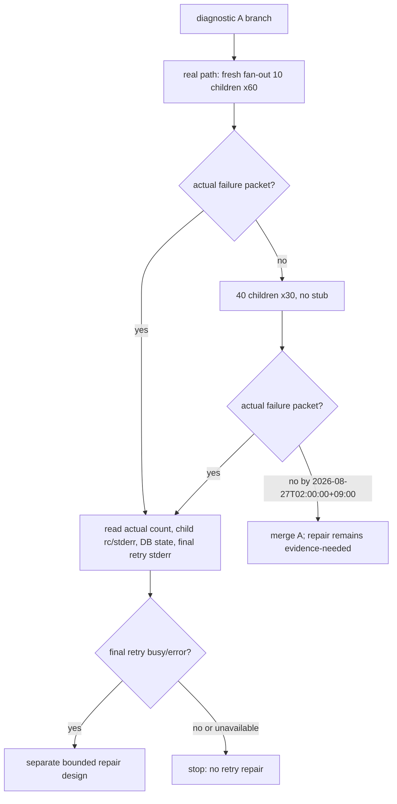

# Issue #181: fresh-store fan-out 失敗の原因を失敗時だけ残す

## 結論

この PR の唯一の主張は、未初期化 SQLite store への10並行 `send.sh` が失敗したとき、**実件数・各 child の exit/stderr・限定した DB 状態・最終 INSERT retry の SQLite stderr**を Bats / CI の failure log に残すことである。

これは fail-closed / clean-break の「失敗を分類する前に、理由が残る形にする」を適用した順序である。二回目 INSERT の `2>/dev/null` を残したままbusy対策やretry変更を足さない。診断が unavailable のときは空の正常値として扱わず、unavailable として出し、元の失敗を成功に変えずに停止する。

再試行回数、`busy_timeout`、`storage_init` の競合制御、schema、送信成功条件は変更しない。
診断が二回目 INSERT の `busy` / SQLite error を示した場合だけ、別 Issue / 別 PR で修復を設計する。init、`send.sh` 前段、count query、または別の経路なら、「retry 1回」修復は台帳へ戻す。

## 一次証跡と判断境界

main の同一 `tests/test_storage.bats:233` assertion は直近80 runで4回、さらに当日の main Ubuntu 2/4 jobs `32925092125` / `32927659721` でも失敗している。Issue #181 の failure は現行 main の実害であり、診断 PR を先行させる breaker の断定を満たす。

現行 test は全 child の stdout/stderr を `/dev/null` に捨て、最後の `wait` のみを実行して `n == 10` を確認する。そのため CI log は実際の `n`、失敗 child、SQLite error のいずれも示さない。

現行 `storage_send` は、最初の INSERT を静かに probe し、`storage_init` 後の **二回目 INSERT も** `>/dev/null 2>&1 || return 1` にしている。`send.sh` は空の message id を検出して nonzero を返すが、final retry の SQLite stderr はそこで既に失われている。

| 事実 | この PR で決めること | 決めないこと |
| --- | --- | --- |
| failure は `n < 10` として現れる | failure packet を出す | message が静かに消えたと呼ぶこと |
| `send.sh` は空 id で exit 1 | child exit/stderr を保存・表示する | caller retry / delivery semantics を変えること |
| final retry stderr が捨てられる | final retry の失敗時だけ stderr を上流へ通す | retry回数・deadline・busy timeout を変えること |
| init race / final INSERT busy / pre-send failure は未区別 | packet を原因選択の根拠にする | `retry 1回` を原因と断定して修復すること |

## 実装契約

### 1. fan-out test は全 child を回収してから failure packet を出す

`tests/test_storage.bats` の fresh-store fan-out に suite-local helper を置く。

- childごとに index、PID、stdout file、stderr file、exit-status file を `$BATS_TEST_TMPDIR` 下へ割り当てる。子は `send.sh` の終了 status を file に書いた後、同じ status で終了する。
- 親は全 PID を個別に `wait` する。最初の failure で `false` せず、全 child の status artifact が揃ってから count と resource state を読む。
- packet を出す条件は、既存 assertion と同じ **actual count が選択したfan-out数（通常10）でない、又は count query が失敗した** とする。child nonzero はその packet の必須フィールドだが、それだけで既存の count-based acceptance を新しい失敗へ変えない。正常なら header、artifact内容、SQLite stderr を一切標準エラーへ出さない。
- failure packet は `expected=<fan-out> actual=<n-or-unavailable>`、child `index/pid/exit`、その child の stderr、DB の存在、`events` の `seq/id/to_agent` だけを stderr に出す。message body、test の送信本文、環境値、任意の process dump は出さない。
- DB state query そのものが失敗した場合は、その query の exit/stderr を `state-query=unavailable` として一度だけ残す。`n=0` とquery不能を混同しない。診断出力失敗は元の fan-out failure を success に変えず、`teardown_test_env` は必ず続ける。

既存の初期化済み10並行 fan-out test は変更しない。fresh-store normal case も実行時 packet が無いことを確認する負の対照にする。

### 2. production では最終 retry の失敗だけを見えるようにする

`scripts/drivers/storage/sqlite.sh:storage_send` の最初の INSERT probe は、現行どおり静かに失敗を検出する。
`storage_init` 後の二回目 INSERT は stdout を捨てるが、`2>&1` で SQLite stderr を捨てない。変更後の最終retry経路に旧いstderr抑制経路を併存させない（clean-break）。

`storage_send` が nonzero を返すと、その stderr は既存の `send.sh` command substitution を通って送信者へ届き、既存の empty-id error と同じ failure stream に残る。
二回目 INSERT が成功したときは SQLite stderr を出さない。初回の missing-table probe、normal init、successful fan-out に診断を常時出さない。

`scripts/send.sh` はこの PR で変更しない。送信成功/失敗の exit contract、message-id format、stdoutの queued message 表示を変えない。

### 3. root-cause packet は実経路の反復で収穫する

強制controlはpacket出力の正対照であり、fresh-store競合の帰属には使わない。A のbranchでverifierが、stub・shim・送信wrapper無しのfresh-store fan-out testを既存の10 childのまま60回反復する。各attemptはBatsの既存failure出力を保存し、最初の実failure packetが出た時点でarchitectがそのpacketを読む。

60回でpacketが0件なら、**同じ実経路**のchild数だけを40へ上げて30回反復する。このためtest側のfan-out数はtest専用の明示的な環境値で10（通常）または40（収穫時）だけを受け付け、未指定は10、他の値はtest setup failureとして停止する。production script、SQLite shim、送信内容、timeout/retry値は変えない。40 childは失敗率を上げるための負荷差であり、原因を作るstubではない。

実packetを得たら、最終retryのSQLite stderr、child status、count、state-queryの三値を照合する。final retryの `busy` / SQLite errorなら有界retryと上限到達時の停止を満たす修復を別PRで具体化する。init失敗、`send.sh` 前段、state-query unavailable、またはpacketなしは原因未確定であり、production修復をcommitしない。

2026-08-27T02:00:00+09:00 までに実packetが0件なら、Aのみを取り込み、Bは雛形に留め、#181は「修正の根拠未取得」として未完了のまま報告する。このfallbackは失敗を成功扱いにしないfail-closed境界である。

## 受入れと対照

| 観点 | 正の対照 | KILLED / 負の対照 |
| --- | --- | --- |
| child packet | test-only send wrapper が一 child を exit 73 / sentinel stderr にすると、outer test は expected/actual・当該 index/exit/stderr・events inventory を得る | child output を再び `/dev/null` に捨てる mutation では packet assertion が RED |
| full reaping | forced child failure 後も全10 child の status artifact が存在する | first failing `wait` で即 abort する mutation では後続artifact assertion が RED |
| final retry stderr | sqlite shim が初回 probe を失敗、init後の retry を sentinel SQLite error にすると、`send.sh` は nonzeroかつ sentinel を stderr に出す | final retry を `2>/dev/null` へ戻す mutation では sentinel assertion が RED |
| quiet success | shim が初回 probeだけを失敗させ最終retryを成功させると、message id を返し stderr と packet header は空 | 初回 probe stderr を常時出す mutation では quiet assertion が RED |
| 実経路の収穫 | stub無しのfresh fan-outを10 child x60、0件なら40 child x30で反復し、failure packetを保存する | shim / wrapper のpacketを原因帰属としてproduction修復をunblockしない |
| fan-out入力 | test専用値10/40はそれぞれ同数をexpectedへ出す | 未対応値は10へ黙って丸めず、test setup failureとして停止する |
| current contract | initialized-store fan-out と通常 fresh-store fan-out は10/10で green | failure packet が成功 status、message body、全DB dump を出さない |

shim は test fixture 内の `sqlite3` command wrapper とし、INSERT SQL を一意に識別して初回/最終retryだけを分ける。init SQL は実 SQLite へ委譲する。これは production skill directory を試験台にせず、final retry stderr の経路だけを識別する正の対照である。

## 範囲と順序

| 含める | 含めない |
| --- | --- |
| `tests/test_storage.bats` のfailure packetとdiagnostic regressions | `storage_send` のretry回数・deadline・bootstrap coordinator |
| `scripts/drivers/storage/sqlite.sh` のfinal retry stderr propagation | `scripts/send.sh` のsuccess/failure contract変更 |
| この設計書 | #189、registry lock、store初期化の全call-site走査、README |

1 PR = 「#181 fresh-store fan-out の失敗理由を失敗時だけ可観測にする」である。producer は `agmsg_programmer_codex`、formal reviewer は `agmsg_reviewer_claude`。#181以外の修復を混ぜない。

診断 packet が実経路の反復で二回目 INSERT のbusy/errorを示したときのみ、その失敗を一時的と分類して、有界retryと上限到達時の停止を満たす修復を別Issue / 1 PRで設計する。別原因、state-query unavailable、または2026-08-27T02:00:00+09:00までpacket不成立は原因未確定として停止し、retry回数・deadline・bootstrap協調を推測で変えない。

## 限界

この PR は failure の**原因を表示する**だけであり、fresh-store fan-out の約5%の失敗を直したとは主張しない。SQLite busy、WAL transition、schema initialization、filesystem、`send.sh` 前段のいずれが根因かは、diagnostic branchのstub無し反復で得るactual failure packetを待つ。強制controlの成功は、診断経路の作動証明に限る。
