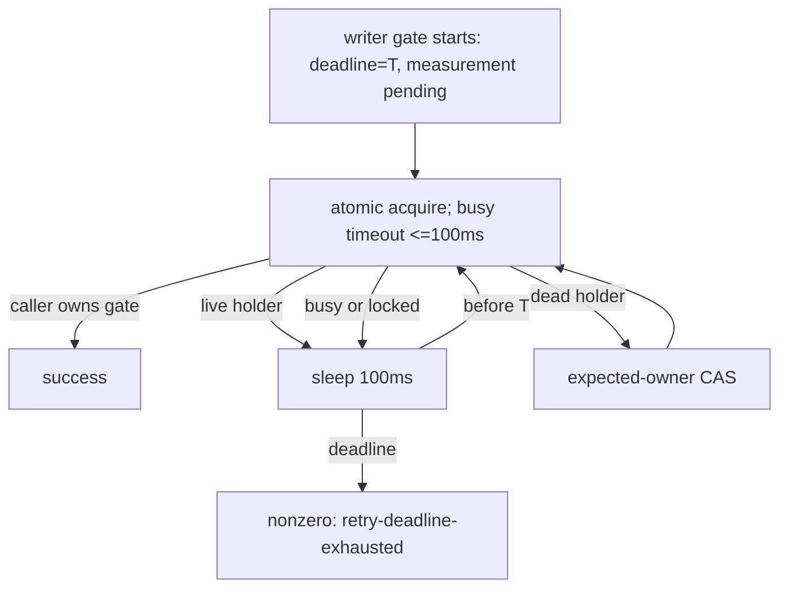

# Issue #198: writer gate の実時間 deadline を既存 handover budget と両立させる

## 結論

PR #198 の writer gate deadline は、現時点で **10秒へ固定してはならない**。
10秒は unbounded だった base の #683 が単発で約9.96秒を要したことから得た候補であって、中央値・最速・上限・遅い runner に対する余裕のいずれも示していない。
SQLite `busy_timeout` は現 HEAD のまま **固定上限100ms**、effective timeout は `min(100ms, remaining deadline)` とする。
deadline 比率、remaining deadline 全量、progress reset、owner-read poll の新設は引き続き採らない。

旧実装は `while attempts < 50` であり、live holder 時の100ms sleep以外に総実時間の上限を持たなかった。
したがって最短でも約4.9秒、SQL / process startup / scheduler の時間を含めると5秒を超えて待てた。
新実装は5秒の実時間 deadline で必ず止まるため、既存 #683 handover が macOS CI で必要としていた待機 budget を切り詰めた。

従って #198 は数値を実装・review に進めず HOLD とする。
先に base 相当の正常 handover の実時間分布を同一 macOS runner class で回収し、hard deadline をその packet から改めて選ぶ。
unbounded retry への復帰は候補にしない。



## 一次観測

PR #198 の macOS CI job では test 379 (`watch: writer handover waits for the delivery gate (#683)`) が失敗した。

```text
classification=live-holder
sqlite_error=<not-invoked>
reason=retry-deadline-exhausted deadline_s=5 elapsed_s=5 attempts=12
```

`sqlite_error=<not-invoked>` により、SQLite busy timeout が5秒を使い切ったという説明は採らない。
現 HEAD の `_actas_lock_gate_busy_timeout_ms` も、remaining seconds が2以上なら100、最後の1秒なら0を返す。busy slice は旧実装と同じ100msである。

base `d80cd0b` の同一 macOS shard は #683 test を約9.96秒で pass した。これは **1回だけの positive observation** である。
PR HEAD の同 shard は同 test を約17.43秒後に fail し、その内訳には `writer.done` の10秒 wait と inner gate の5秒 deadline failure がある。
この比較は、5秒 deadline が existing handover acceptance に足りないことを示す。
一方で、9.96秒から「10秒で十分」とは導けない。
attempts=12 の原因を SQL transaction、process startup、scheduler のいずれかへ断定するにも、timeout の分散を導くにも測定が足りないため、今回は数値・構造変更の根拠にしない。

| 項目 | 決定 | 根拠 |
| --- | --- | --- |
| outer deadline | **未決定（10秒は候補）** | base macOS の約9.96秒は単発であり、hard cutoff の余裕を示さない |
| SQLite busy timeout | fixed cap 100ms | current source と reviewer measurement で確認済み。long SQLite blockは今回の証拠にない |
| poll interval | 100msのまま | deadlineと独立の短い観測頻度を維持する |
| retry count | diagnostic only | success / timeout の判定に戻さない |
| progress reset | 追加しない | owner changesで無期限に延長する別の契約を導入しない |

## 実装契約

1. **数値を実装しない。** `_ACTAS_LOCK_GATE_DEFAULT_DEADLINE_S` の値は追加測定を通すまで据え置く。10秒を default、production environment override、または acceptance criterion として導入しない。
2. `_ACTAS_LOCK_GATE_BUSY_SLICE_MS=100` と `_actas_lock_gate_busy_timeout_ms()` の `min(100ms, remaining deadline)` は、採用する hard deadline の値と独立して保つ。remaining deadline をそのまま busy timeout にしない。
3. acquire / release の successful predicate、live/dead holder の CAS、unknown / permanent error の fail-closed、deadline failure diagnostic を変えない。
4. deadline failure は引き続き `retry-deadline-exhausted deadline_s=<n> elapsed_s=<actual> attempts=<n>` とし、attempts は observability のみである。
5. `actas_lock_gate_try_acquire`、watcher behavior、storage schema、owner read path、README は変更しない。

## 検証計画

`attempts >= N` を CI 共通の pass/fail 条件にはしない。
その値は SQLite process startup、runner load、scheduler に依存し、今回疑う「busy timeout が長すぎる」失敗を再現できない。

### 数値を決める前の measurement gate

数値を決める根拠は、同じ macOS runner class 上の #683 の **成功した実時間標本**だけとする。
各標本は `value / cutoff / source / command` を残し、source は base 相当の旧 handover semantics でなければならない。
最低5回の独立 job から全値・min/max・timeout/runner image・commit SHA を保存する。
1回の最速値、平均だけ、Linux の局所測定、`attempts`、failure run の wall time は cutoff 根拠にしない。

GitHub Actions の現行 `tests.yml` は `push` と `pull_request` だけで `workflow_dispatch` を持たない。
さらに `gh-write-owner-guard` は成功済み base job `98130020486` の `gh run rerun` を拒否した。
よってこの履歴 job を追加標本として再実行することはできない。
追加標本が必要なら、base 相当 code を保った **measurement-only の別 Issue / 別 PR** を作り、その exact macOS #683 job を複数回測る。
その PR は deadline policy を変更せず、計測 artifact と test start/end evidence だけを追加し、測定完了後に閉じる。

| gate | expected | fail-closed result |
| --- | --- | --- |
| sample provenance | 5以上の成功 macOS #683 values が同一 source family・runner class・command を持つ | sample が不足、別 source、または runner/provenance不明なら数値を決めない |
| cutoff choice | 採用する固定 deadline は全成功値より十分な明示 margin を持ち、margin と最大値を artifact に記録する | 9.96秒単発や平均だけで数値を選ばない |
| busy slice seam | recorded `AGMSG_BUSY_TIMEOUT` の全値が `<=100` | remaining deadline を long busy timeout として再導入しない |
| live holder then release | 採用した deadline より前に holder を解放すると caller が取得する | 5秒deadline のように release opportunity を捨てる値は RED |
| live holder remains live | deadlineでnonzero、holder/CAS state不変 | deadline延長をownerの上書きへ変える fail-open は RED |

measurement packet と deadline value が確定した後にだけ、`tests/test_actas_lock.bats` の gate-level fixture と default-deadline assertion を追加する。
その実装 PR は `bash -n scripts/lib/actas-lock.sh`、`bats tests/test_actas_lock.bats`、`bats -f 'writer handover waits for the delivery gate' tests/test_actas_integration.bats`、fixed HEAD の macOS shard / full job、CI、Claude formal reviewer の一括 review を再取得する。

## test 379 の cleanup は別 Issue / 別 PR

test 379 は `wait_for_file "$writer_done" || { ...; false; }` の assertion failure 時に、その後ろの `wait "$writer"`、old watcher / newpid の `kill` / `wait` へ到達しない。
実 CI でも全519 tests完了後に job が終了できず、15分無出力で cancellation された。

これは writer gate deadline と別の test lifecycle claim である。
**#198 に混ぜず、failure pathでもtest自身が起動したchildをreapする follow-up Issue / 1 PR とする。**

- scope: `tests/test_actas_integration.bats` の test-scoped teardown registry / cleanup helper、failure-path test、child PID の `kill` + `wait`。
- non-scope: writer gate、watcher production code、deadline値、global cleanup、sleep retry。
- dependency: #198 の formal acceptance は cleanup PR を先に merge して rebase / fixed-HEAD CI を取り直すまで fail-closed で保留する。

## PR 境界

measurement gate 完了後の PR #198 の次 HEAD は、**「writer gate の既存 handover budgetを無制限retryに戻さず、測定 packet で選んだ固定 real-time deadlineとして明示する」**だけを変更する。

- producer: `agmsg_programmer_codex`
- formal reviewer: `agmsg_reviewer_claude`
- review target: rebased fixed HEAD の全差分
- PR description: `Part of #178`。root epic に closing keyword を使わない

README、storage schema、watcherのruntime behavior、owner-read polling、release gate、test 379 cleanup、production environment overrideはこの PR の対象外である。

## 現在の HOLD

PR #198 は #199 の merge だけでなく、上記 measurement-only packet が揃うまで implementation、formal review、merge を始めない。
この HOLD は「10秒では足りない」と断定するものではない。
単発の9.96秒を上限・中央値と誤読して hard deadline を決めない fail-closed 判断である。
