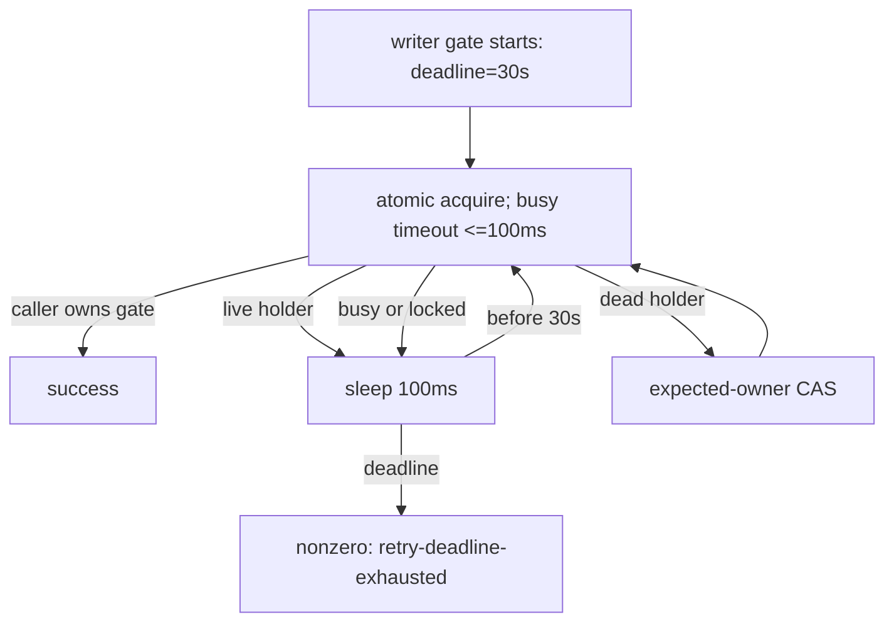

# Issue #198: writer gate の実時間 deadline を既存 handover budget と両立させる

## 結論

PR #198 の writer gate deadline は **固定30秒**にする。
R5 の受入れ主張は「writer が回数ではなく実時間で必ず非zeroへ収束する」であり、deadline の性能最適値を求めることではない。
base の #683 が単発で約9.96秒を要した観測に対し、30秒は約3.01倍（`30 / 9.96`）の明示した safety factor を持つ。
この1標本を中央値・上限と主張しないが、finite deadline のために measurement-only PR を増やすよりも、観測値を越える十分大きい固定上限を置くほうが課題の境界に合う。
SQLite `busy_timeout` は現 HEAD のまま **固定上限100ms**、effective timeout は `min(100ms, remaining deadline)` とする。
deadline 比率、remaining deadline 全量、progress reset、owner-read poll の新設は引き続き採らない。

旧実装は `while attempts < 50` であり、live holder 時の100ms sleep以外に総実時間の上限を持たなかった。
したがって最短でも約4.9秒、SQL / process startup / scheduler の時間を含めると5秒を超えて待てた。
新実装は5秒の実時間 deadline で必ず止まるため、既存 #683 handover が macOS CI で必要としていた待機 budget を切り詰めた。

30秒は無制限 retry へ戻す値ではない。
既存の `despawn` graceful wait の既定値も30秒であり、同じ「相手 process の協調終了を待つ」クラスの bounded wait として整合する。
writer gate は30秒に達したら、live holder / SQLite transient を成功へ丸めず `retry-deadline-exhausted` で fail-closed に終える。



## 一次観測

PR #198 の macOS CI job では test 379 (`watch: writer handover waits for the delivery gate (#683)`) が失敗した。

```text
classification=live-holder
sqlite_error=<not-invoked>
reason=retry-deadline-exhausted deadline_s=5 elapsed_s=5 attempts=12
```

`sqlite_error=<not-invoked>` により、SQLite busy timeout が5秒を使い切ったという説明は採らない。
現 HEAD の `_actas_lock_gate_busy_timeout_ms` も、remaining seconds が2以上なら100、最後の1秒なら0を返す。busy slice は旧実装と同じ100msである。

base `d80cd0b` の同一 macOS shard は #683 test を約9.96秒で pass した。これは **1回だけの positive observation** であり、中央値・最速・上限ではない。
PR HEAD の同 shard は同 test を約17.43秒後に fail し、その内訳には `writer.done` の10秒 wait と inner gate の5秒 deadline failure がある。
この比較は、5秒 deadline が existing handover acceptance に足りないことを示す。
9.96秒から「10秒で十分」とは導けないため10秒案は採らない。
一方、R5 は tail latency の最小化ではなく有限性を受け入れる課題である。
30秒は観測成功値を3倍以上上回り、それでも既存の回数 retry が持たなかった wall-clock upper bound を与える。
attempts=12 の原因を SQL transaction、process startup、scheduler のいずれかへ断定しない。これは30秒の選択根拠ではない。

| 項目 | 決定 | 根拠 |
| --- | --- | --- |
| outer deadline | fixed 30 seconds | 9.96秒単発の約3.01倍で、R5 に必要な有限性を満たす。deadline の最適化は今回の主張でない |
| SQLite busy timeout | fixed cap 100ms | current source と reviewer measurement で確認済み。long SQLite blockは今回の証拠にない |
| poll interval | 100msのまま | deadlineと独立の短い観測頻度を維持する |
| retry count | diagnostic only | success / timeout の判定に戻さない |
| progress reset | 追加しない | owner changesで無期限に延長する別の契約を導入しない |

## 実装契約

1. `_ACTAS_LOCK_GATE_DEFAULT_DEADLINE_S` を `30` にする。`AGMSG_TEST_ACTAS_GATE_DEADLINE_S` は test-only override のままとし、production environment override は追加しない。
2. `_ACTAS_LOCK_GATE_BUSY_SLICE_MS=100` と `_actas_lock_gate_busy_timeout_ms()` の `min(100ms, remaining deadline)` は、採用する hard deadline の値と独立して保つ。remaining deadline をそのまま busy timeout にしない。
3. acquire / release の successful predicate、live/dead holder の CAS、unknown / permanent error の fail-closed、deadline failure diagnostic を変えない。
4. deadline failure は引き続き `retry-deadline-exhausted deadline_s=<n> elapsed_s=<actual> attempts=<n>` とし、attempts は observability のみである。
5. `actas_lock_gate_try_acquire`、watcher behavior、storage schema、owner read path、README は変更しない。

## 検証計画

`attempts >= N` を CI 共通の pass/fail 条件にはしない。
その値は SQLite process startup、runner load、scheduler に依存し、今回疑う「busy timeout が長すぎる」失敗を再現できない。

### 固定30秒の受入れ

30秒は「正常 handover の処理時間を30秒まで許容する」性能主張ではなく、無期限化を防ぐ outer deadline である。
従って measurement-only PR は不要とする。
通常の fixed-HEAD CI は、30秒 writer gate と独立した10秒の #683 test wait の双方で #683 が成功することを確認するが、そこから runner latency の分布・30秒の最適性を主張しない。

| control | expected | 防ぐ失敗 |
| --- | --- | --- |
| default deadline | normal writer acquire/release diagnostics が `deadline_s=30` を持つ | 5秒のまま残る・production override の混入 |
| busy slice seam | recorded `AGMSG_BUSY_TIMEOUT` の全値が `<=100` | remaining deadline を long busy timeout として再導入する回帰 |
| live holder then release | real runtime lock holderを6秒保持して解放する | caller が30秒 deadline内に取得し、5秒cutoffで失われた release opportunity を回復する |
| live holder remains live | 30秒deadlineでnonzero、holder/CAS state不変 | deadline延長をownerの上書きへ変える fail-open |
| KILLED | default deadlineを一時的に5へ戻す | 6秒hold→release control が RED になる |

第3 control は `tests/test_actas_lock.bats` に置く新しい gate-level fixture とする。
holder を6秒で解放し、30秒 deadline では caller が取得、KILLED の5秒では取得不能にする。
既存 #683 handover test の `wait_for_file "$writer_done"` は shared test helper の独立した10秒 contract であり、今回30秒へ拡張しない。
30秒 writer deadline でもこの10秒 wait が実 CI で切れるなら、それは #198 の finite-gate claim を無効化する根拠ではなく、#197/R5-T1の test wait contract の別 Issue として扱う。

実装後は `bash -n scripts/lib/actas-lock.sh`、`bats tests/test_actas_lock.bats`、`bats -f 'writer handover waits for the delivery gate' tests/test_actas_integration.bats` を実行する。
fixed HEAD で macOS shard の #683 と full job が終了すること、CI、Claude formal reviewer の一括 review を再取得する。

## test 379 の cleanup は別 Issue / 別 PR

test 379 は `wait_for_file "$writer_done" || { ...; false; }` の assertion failure 時に、その後ろの `wait "$writer"`、old watcher / newpid の `kill` / `wait` へ到達しない。
実 CI でも全519 tests完了後に job が終了できず、15分無出力で cancellation された。

これは writer gate deadline と別の test lifecycle claim である。
**#198 に混ぜず、failure pathでもtest自身が起動したchildをreapする follow-up Issue / 1 PR とする。**

- scope: `tests/test_actas_integration.bats` の test-scoped teardown registry / cleanup helper、failure-path test、child PID の `kill` + `wait`。
- non-scope: writer gate、watcher production code、deadline値、global cleanup、sleep retry。
- dependency: #198 の formal acceptance は cleanup PR を先に merge して rebase / fixed-HEAD CI を取り直すまで fail-closed で保留する。

## PR 境界

PR #198 の次 HEAD は、**「writer gate の既存 handover budgetを無制限retryに戻さず、30秒の fixed real-time deadlineとして明示する」**だけを変更する。

- producer: `agmsg_programmer_codex`
- formal reviewer: `agmsg_reviewer_claude`
- review target: rebased fixed HEAD の全差分
- PR description: `Part of #178`。root epic に closing keyword を使わない

README、storage schema、watcherのruntime behavior、owner-read polling、release gate、test 379 cleanup、production environment overrideはこの PR の対象外である。

## 現在の HOLD

PR #198 は #199 の merge、#199 merge commit への rebase、fixed-HEAD CI、Claude formal review が完了するまで HOLD とする。
measurement-only PR はこの順序条件ではない。
