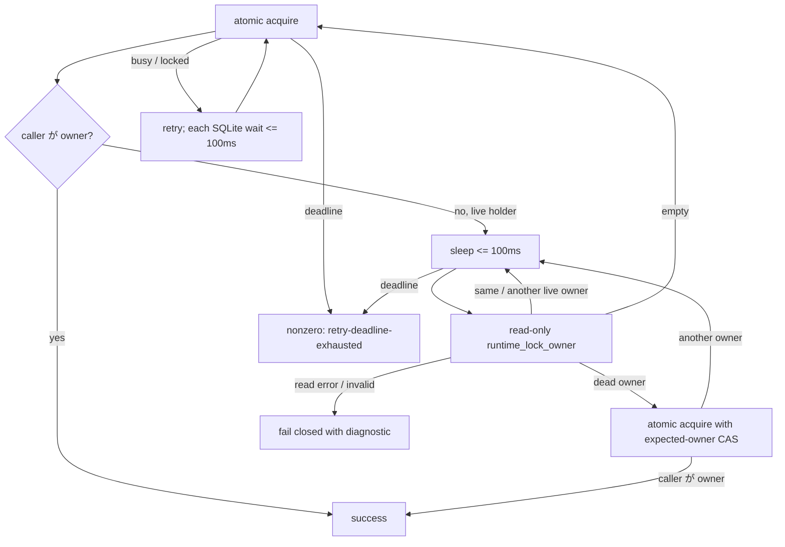

# Issue #198: writer gate の live-holder 観測を短い read poll へ分離する

## 結論

採る修正は、writer gate が live holder を確認した後、毎回の `agmsg_runtime_lock_acquire`（writer transaction）を再実行して空きを待つのではなく、**100ms 間隔の read-only owner poll** で owner の変化を観測し、空・dead・別 owner になった時だけ atomic acquire / CAS へ戻すことである。

SQLite `busy_timeout` は **固定上限 100ms** とする。比率や「deadline の残り全部」は採らない。effective timeout は `min(100ms, remaining deadline)` で、残りが 1 秒以下なら 0ms にする。

PR #198 の現 HEAD `0a36fe2` は既にこの 100ms cap を実装している。
したがって、`attempts=12` を「SQLite が約4秒 block した」根拠にはしない。primary CI log の failure は `sqlite_error=<not-invoked>` であり、各 acquire が SQLite busy timeout を使い切って失敗したのではなく、**live holder を正常に返した end-to-end loop が 5 秒で12回しか回らなかった**ことを示す。



この分離で ownership safety は変えない。owner read は「次の atomic mutation を試すべきか」の観測だけであり、actual acquisition / stale replacement は現在の `agmsg_runtime_lock_acquire` と expected-owner CAS が唯一の正本である。

## 観測と判断

PR #198 の macOS CI job で test 379 (`watch: writer handover waits for the delivery gate (#683)`) が失敗した。

```text
classification=live-holder
sqlite_error=<not-invoked>
reason=retry-deadline-exhausted deadline_s=5 elapsed_s=5 attempts=12
```

`<not-invoked>` は gate acquire が SQLite busy / locked error を分類した結果ではない。
`agmsg_runtime_lock_acquire` が live owner PID を返した後、gate は 100ms sleep と次の full writer transaction を繰り返していた。
この transaction は `agmsg_storage_ensure_initialized`、`CREATE TABLE IF NOT EXISTS`、`BEGIN IMMEDIATE`、`INSERT OR IGNORE`、`SELECT`、`COMMIT` を含むため、CI 上の一周は 100ms sleep より長くなり得る。

従って、busy timeout の cap を追加・比率化・延長するだけでは、今回の successful live-holder observation の回数を増やせない。
hard cap は plan `2026-08-26_r5p3-writer-gate-deadline.md` と現 HEAD に既にあるため維持し、full writer transaction を liveness poll に使う構造だけを直す。

| 判断項目 | 決定 | 理由 |
| --- | --- | --- |
| busy timeout | fixed 100ms cap | 旧 gate の granularity を保ち、deadline 比率による初回の長い block を作らない |
| deadline | 5秒のまま | R5-P3 の real-time budget を緩めない。retry count は成功/失敗を決めない |
| live-holder の再観測 | `runtime_lock_owner` の read-only poll | transaction overhead を「holder が空いた瞬間」の観測回数へ混ぜない |
| free / dead を見た後 | atomic acquire / expected-owner CAS | read→write の TOCTOU を success 根拠にしない |
| owner read failure | nonzero、named diagnostic、mutation なし | unknown を free と扱わない |

## 実装契約

1. `actas_lock_gate_acquire` は最初の atomic acquire の結果が別の live owner なら、100ms 以下の sleep 後に runtime gate resource の owner-only read を行う。
2. owner-only read が同じまたは別の live PID を返す限り、deadline まで poll を続ける。この分岐では `agmsg_runtime_lock_acquire` を再発行しない。
3. read が empty を返したときだけ expected owner なしの atomic acquire を行う。read が dead PID を返したときだけ、その PID を expected owner にした CAS acquire を行う。CAS が別 owner を返せば、その owner を改めて live/dead 判定する。
4. runtime owner read が nonzero、空でない non-numeric value、または liveness を確認できない value を返したときは fail closed にする。`retry-deadline-exhausted` へ丸めず、operation/resource/observed owner/read error を出して nonzero を返す。
5. `_ACTAS_LOCK_GATE_BUSY_SLICE_MS=100` は production constant とし、test-only deadline override 以外の environment override を追加しない。busy timeout helper は remaining deadline を上限として再利用する。
6. `actas_lock_gate_release` は今回の live-holder acquire loop を持たないため、retry / deadline / owner-conditional `changes=1` 契約を変えない。

## 検証計画

「CI で attempts が 12 以上」のような実行環境依存の閾値は受入条件にしない。
それは scheduler / sqlite process startup が遅いだけでも false failure になり、今回疑う失敗モードを再現しないためである。

代わりに、full transaction が遅く、owner read は速いという今回の failure mode を test seam で再現する。

| control | fixture | expected | 防ぐ失敗 |
| --- | --- | --- | --- |
| positive: live holder becomes free | 初回 atomic acquire は live PID。以降の full acquire は意図的に遅い。owner read は live → empty を返す | initial acquire + owner read + final atomic acquire で deadline 前に caller が owner | costly full acquire を poll に使い、空きを見逃す回帰 |
| negative: holder remains live | owner read は live PID を返し続ける | deadline で nonzero、holder row は不変 | read poll が holder を free と推測する fail-open |
| CAS safety | owner read が dead PID、その直後の atomic CAS が別 live owner を返す | caller は owner にならず、新 owner を消さない | stale read から successor を上書きする TOCTOU |
| busy cap | SQLite busy seam が受け取った全 `AGMSG_BUSY_TIMEOUT` を記録する | 全値 `<=100`、deadlineを超えない | 残り deadline を long busy timeout として再導入する回帰 |
| KILLED | live-holder branch を旧「full acquire を繰り返す」に一時変異する | first control が deadline failure になり RED | test seam が遅い transaction と owner poll の差を検査していない偽陰性 |

focused execution は `bash -n scripts/lib/actas-lock.sh`、`bats tests/test_actas_lock.bats`、`bats -f 'writer handover waits for the delivery gate' tests/test_actas_integration.bats` を行う。
CI は macOS で #683 focused test を連続実行し、fixed HEAD の full job が exit することまで確認する。

## test 379 の cleanup は別 Issue / 別 PR

test 379 は `wait_for_file "$writer_done" || { ...; false; }` の assertion failure 時に、その後ろの `wait "$writer"`、old watcher / newpid の `kill` / `wait` へ到達しない。
実 CI でも全519 tests完了後に job が終了できず、15分無出力で cancellation された。

これは writer gate の acquisition semantics と別の主張である。
**#198 に混ぜず、Bats test が起動した child を assertion failure 時にも reap する follow-up Issue / 1 PR とする。**

- scope: `tests/test_actas_integration.bats` の test-scoped trap / cleanup helper、failure-path test、child PID の `kill` + `wait`。
- non-scope: writer gate、watcher production code、timeout値、global cleanup、sleep retry。
- dependency: #198 の formal acceptance は cleanup PR を先に merge して rebase / fixed-HEAD CI を取り直すまで fail-closed で保留する。

この分離は「failure 時に CI が終わる」という harness claim を、writer handover correctness の PR に後付けしないためである。

## PR 境界

PR #198 の次 HEAD は、**「live holder を待つ writer gate が、deadline 内の availability observation に full writer transaction を使わない」**だけを変更する。

- producer: `agmsg_programmer_codex`
- formal reviewer: `agmsg_reviewer_claude`
- review target: rebased fixed HEAD の全差分
- PR description: `Part of #178`。root epic に closing keyword を使わない

README、storage schema、watcherのruntime behavior、release gate、test 379 cleanup、timeout値の引上げはこの PR の対象外である。
