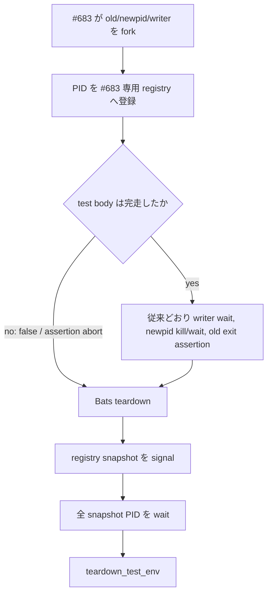

# Issue #199: #683 の assertion abort 後も test-owned child を teardown で回収する

## 結論

`tests/test_actas_integration.bats` の `watch: writer handover waits for the delivery gate (#683)` が起動した child PID を、起動直後に同 test file の suite-local registry へ記録する。

同 file の `teardown()` は registry を先に **signal → wait** してから既存の `teardown_test_env` を呼ぶ。

`false` を含む失敗分岐の後ろにある既存 cleanup は、TOCTOU の線形化に必要な成功時の順序を変えないため残す。

採らないのは `trap EXIT` である。
Bats 1.14.0 の隔離プローブでは、test body の `false` の後に単純な EXIT trap を置くと child が残り、runner が待機した。
同じ child を global PID として `teardown()` から kill/wait した対照は、test 自体は expected red で終了し、cleanup marker を残して child は不在になった。
従って「assertion abort をまたいで Bats が実行する lifecycle hook」を使うべきであり、shell 終了時の trap に lifecycle を委ねない。

## 観測と境界

PR #198 の current HEAD `0a36fe24000cbe9f268805c87e8c8b2f77a59019` は、run `32955524245` / macOS job `98136260723` で #683 の `writer_done` 待機を失敗させた。
診断は `retry-deadline-exhausted deadline_s=5 elapsed_s=5 attempts=12` である。
この分岐は diagnostic を出して `false` を実行するため、その後の `wait "$writer"`、`wait_for_pid_exit "$old"`、`kill/wait "$newpid"`、最終 `kill/wait "$old"` に到達しない。
その job は全 519 test の出力後に 15 分間停止して cancel された。

| 事実 | 今回の判断 | 今回扱わないこと |
| --- | --- | --- |
| #683 は `old` watcher、`newpid` の sleep holder、`writer` subshell を明示的に fork する | この3 PID だけを test-owned として teardown で reap する | repository 全体の child-process 所有者を探索・cleanup すること |
| `false` は正常経路の cleanup より先に test body を打ち切る | cleanup の到達性を Bats teardown へ移す | #683 の assertion、delivery gate、lock claim/release の意味を変えること |
| #169/#195 は teardown に reaper 自体が無かった | 本件は「既に書かれた cleanup が abort 後に実行されない」別型として file-local に直す | #169/#195 の reaper を汎用化・置換すること |
| #198 がこの分岐を顕在化させた | #199 を #198 より先に merge し、#198 の formal acceptance を保留する | #198 の deadline/100ms busy-slice 設計を変更すること |

`false` の原因が #198 の 5 秒 deadline だったことは、この reaper の動作根拠ではない。
任意の将来 assertion failure が同じ未到達を起こしうるため、#199 は test lifecycle の限定修復として独立させる。

## 実装契約

### 1. owner は #683 の3 child PID に限定する

`tests/test_actas_integration.bats` に、#683 専用の PID registry と `reap` helper を置く。

- `old`、`newpid`、`writer` を fork の直後に登録する。fork 前に失敗した場合は登録対象が無いので cleanup は no-op でよい。
- cleanup 対象は registry の snapshot のみとする。`pgrep`、argv 探索、process table の全走査、PID 範囲指定、production session の PID は使わない。
- teardown は snapshot に signal を全て送ってから、snapshot の各 PID を `wait` する。既に終了済み PID の signal/wait failure は無害として扱う。
- cleanup helper は registry を空にして二重 reap を安全にする。成功経路の既存 `kill/wait` を削除・順序変更しないため、teardown で既に終了した PID を再度扱ってもよいが、再利用リスクを避けるため正常経路で wait 済みの PID は registry から外す。

`teardown()` の順序は次に固定する。

cleanup が失敗しても `teardown_test_env` は必ず続行する。
その cleanup failure は成功 test を green に偽装してはならない。
一方、既に assertion failure がある場合は、その original diagnostic を cleanup 成否で置き換えず、追加の cleanup failure を補助診断として残す。

### 2. #683 の TOCTOU 主張を保存する

次の成功時 sequence は不変とする。

1. `old` が delivery gate を取得して barrier に入る。
2. `writer` が release/claim を開始するが、barrier 解放前には `writer_returned` も lock owner の変化も起こらない。
3. barrier を解放後、`writer_done` を待つ。
4. `old` の終了を確認する。
5. `newpid` を kill/wait してから post-handover message を送る。
6. old watcher がその message を取らず、終了理由と unread 行を確認する。

teardown registry は step 3 以前に assertion が abort したときだけ不足していた cleanup を補う。
gate の取得順、writer の release/claim、`wait_for_file` deadline、`writer_done` assertion、message assertion のどれも弱めない。

### 3. 失敗経路を CI で実証する

同じ `tests/test_actas_integration.bats` に、#683 だけを child Bats として実行する regression を追加する。

- child #683 には test-only environment seam を一つだけ設ける。seam が有効なら barrier release を抑止し、既存の `wait_for_file "$writer_done"` の diagnostic → `false` 分岐を必ず通す。production script と通常の #683 実行には影響させない。
- child は fork 直後の registry PID を、outer test が指定する temp report file に numeric 行だけで書く。report path は outer test の `$BATS_TEST_TMPDIR` 下だけを受け入れる。
- outer test は短い `AGMSG_TEST_WAIT_TIMEOUT_S` で child Bats を起動し、child が **non-zero で終了する**こと、report に列挙された全 PID が `wait_for_pid_exit` を通ることを確認する。child の assertion failure は正の対照であり、outer test は green でなければならない。
- 通常の #683 focused test も green に保つ。これが「cleanup を追加して成功経路の線形化を変えていない」負の対照である。

KILLED は cleanup helper の invocation だけを一時的に外して同じ child regression を走らせる。
outer watchdog は child Bats が deadline 内に終了しないこと、report 済み PID が残ることを red として観測する。
観測後は report の PID と child Bats の PID だけを signal → wait して直ちに回収し、mutation を復元する。
KILLED 用の恒久環境フラグ、repository-wide cleaner、sleep による pass 判定は入れない。

## 範囲の決定

対象は **`tests/test_actas_integration.bats` のみ** とする。

Issue が起点としている一次証跡は #683 一件であり、同 file の `teardown()` と child PID の可視性だけで修復できる。
同型を推測して全 BATS file を走査することは、本件の修復に必要な owner evidence を増やさず、別 owner contract を混ぜる。
別 test の残留 process packet が改めて観測された場合だけ、別 Issue と owner-specific evidence を起点に範囲を開く。

| 含める | 含めない |
| --- | --- |
| `tests/test_actas_integration.bats` の #683 PID registry、teardown reap、failure-path regression | `tests/test_helper.bash` の共通 cleanup 化 |
| #683 normal / forced-abort の focused Bats test | 他 BATS file の scan・一括 refactor |
| この設計書 | `scripts/watch.sh`、`scripts/lib/actas-lock.sh`、README、CI timeout の変更 |

## 受入れ・順序

| 観点 | 正の対照 | KILLED / 負の対照 |
| --- | --- | --- |
| abort cleanup | forced `writer_done` failure の child #683 は non-zero で終了し、report の old/newpid/writer が全て不在 | teardown reaper invocation を外すと child が期限内に終了せず、report PID が残る |
| success cleanup | 通常 #683 は既存の TOCTOU assertions を全て通り、child を残さない | barrier release を抑止しない通常 case を failure-path と取り違えない |
| owner safety | report/registry に記録した3 PID だけを signal/wait する | foreign PID は registry に入らず signal されない |
| fixture order | child reap の後に `teardown_test_env` を実行する | fixture teardown を先にすると、残った watcher が fixture path を握る以前の failure 型へ戻る |

1 PR = 「#683 が assertion abort 後にも自ら起動した3 child を test-local teardown で収束する」という一主張である。
producer は `agmsg_programmer_codex`、formal reviewer は `agmsg_reviewer_claude` とする。

#199 の PR を先に merge し、PR #198 は current head を #199 merge commit 上へ rebase して CI と fixed-HEAD formal review を取り直すまで HOLD とする。

## 限界

この設計が保証するのは #683 の test-owned PID と Bats assertion abort の組合せだけである。
CI job cancel の唯一原因、他 test の orphan、production watcher の lifetime、macOS runner 自身の child reaping は解決済みと主張しない。
また #198 の busy deadline failure をこの cleanup が解決すると主張しない。#199 は failure 後に job を終了可能にする前提を直すだけである。
